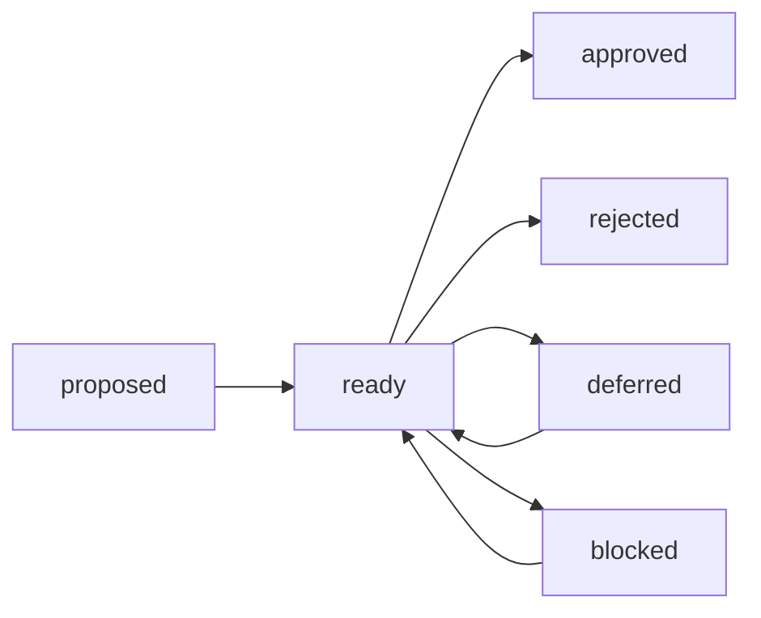

# ROLE_BASED_CONTROL_PANEL_V1.md

## Product decision
Primary split is by **Role**, not by Now/Next/Watch.

This document defines a role-centered information architecture and interaction model.

---

## 1) Navigation model

Top-level tabs:
1. Security
2. Finance
3. Operations
4. Product (optional)
5. Research (optional)

Within each role tab:
- **Decision Queue** (default)
- Evidence
- Audit Trail
- Policies/Constraints

Now/Next/Watch can remain as optional filters/views, but not as the main architecture.

---

## 2) Role page layout (decision cockpit)

### A) Header
- Role name
- Open decisions count
- Critical decisions count
- Decision SLA health (overdue / due soon)

### B) Primary panel: Decision Queue
Table/cards with:
- Decision ID
- Question
- Recommended option
- Risk
- Urgency
- Evidence freshness
- Status
- Deadline

### C) Right panel: Decision Detail
- Full question
- Options + impact/risk/cost summary
- Evidence checklist with freshness and confidence
- Required approvers
- Action buttons: Approve / Reject / Defer / Request more evidence

### D) Footer: Activity stream
- last 20 role-scoped actions
- who decided what and why

---

## 3) Decision states and flow



Rules:
- `ready` requires required evidence freshness + confidence thresholds.
- `approved/rejected` require policy-valid approval path.
- `deferred` requires next review date.

---

## 4) API recommendations (role-first)

- `GET /api/roles`
- `GET /api/roles/:role/summary`
- `GET /api/roles/:role/decisions`
- `GET /api/decisions/:id`
- `POST /api/decisions/:id/{approve|reject|defer}`
- `GET /api/roles/:role/audit`

Response envelope:
```json
{
  "data": {},
  "errors": [],
  "meta": {
    "schema_version": "v1",
    "domain": "os",
    "generated_at": "2026-02-25T21:30:00Z",
    "revision": "git:abc123"
  }
}
```

---

## 5) Migration from Now/Next/Watch

### Keep:
- underlying data pipelines
- evidence ingestion
- change feed mechanics

### Change:
- UI entrypoint: Role tabs as primary route
- API entrypoint: role-scoped decision endpoints
- Parser target: canonical Decision schema instead of ad hoc per-view aggregations

### Transitional approach (2-step)
1. Build decision translation layer from existing registries
2. Rewire UI to consume decision endpoints first; keep legacy endpoints temporarily

---

## 6) Suggested MVP backlog (ordered)

1. Define and validate `DecisionV1` contract (schema + fixtures)
2. Build translator service from current workspace files -> DecisionV1
3. Implement `GET /api/roles/:role/decisions`
4. Implement Role-first UI shell
5. Implement decision detail + approve/reject/defer actions (with audit)
6. Add contract tests against real workspace snapshots

---

## 7) Success metrics

- Time-to-decision by role (median)
- % decisions made with complete evidence
- % overdue decisions
- % decisions reversed within 7 days (quality signal)
- Operator trust score (qualitative monthly review)

---

## 8) Explicit stance

For this product, **role-based split is the main split**.
Now/Next/Watch is optional supporting lens, not the core IA.
