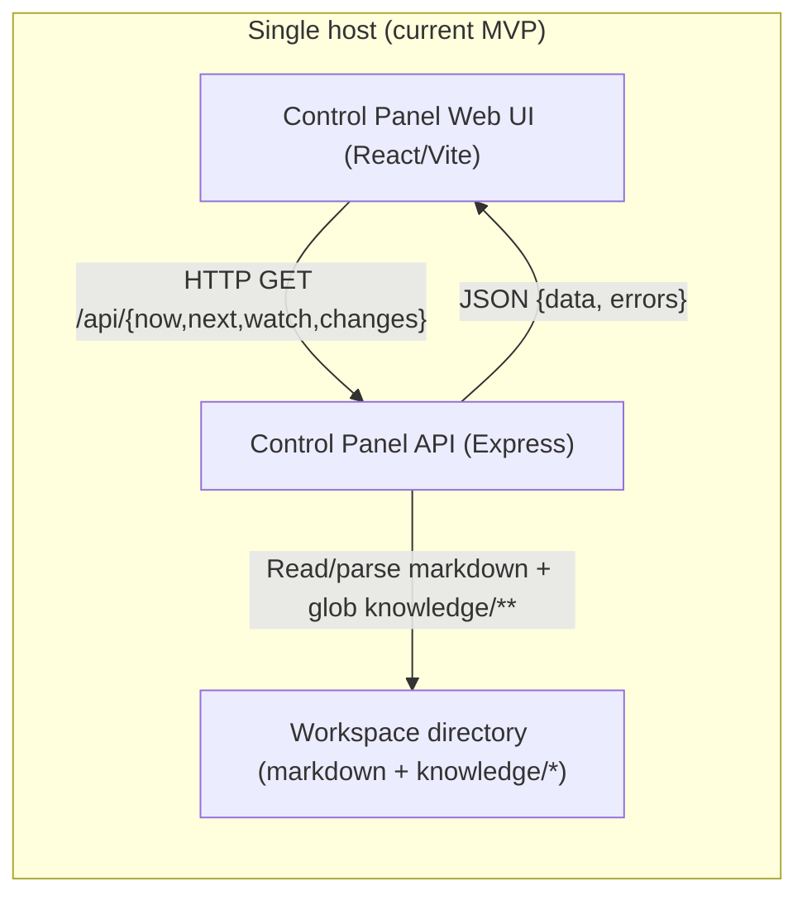
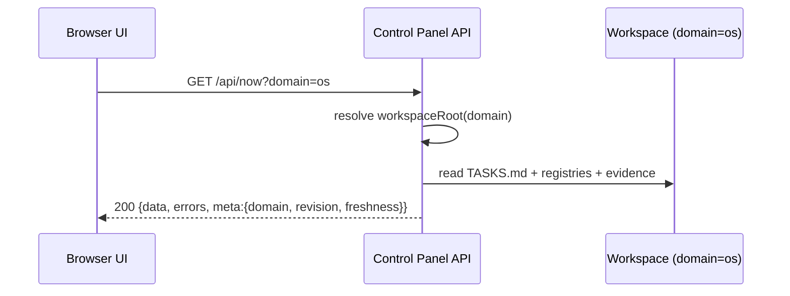
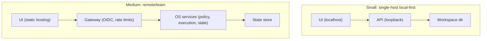

# Architectures for Separating an Operating System Component from a Control Panel: Best Practices and Evaluation of pek007/control-panel and pek007/lyra-operating-system

## Executive summary

Separating an “operating system” (OS) component from a control panel (management UI) is best treated as a **control-plane / data-plane split**: the OS owns durable state, policy, and privileged execution; the control panel is a *management plane client* that visualizes state and requests changes through a **narrow, versioned, audited interface**. This mirrors how well-run distributed systems externalize management via a control plane that exposes a stable API and persists authoritative state elsewhere (with strict boundaries and least privilege). citeturn2search0turn0search2turn1search0

Across the two codebases analyzed, the dominant architectural issue is not the UI or the API mechanics—it is **contract drift** between the OS workspace schemas/formats and what the control panel parses/validates. Concretely:

- **pek007/control-panel** is a local-first, read-only dashboard with an Express HTTP API over a filesystem “workspace root” and a React/Vite UI with four views (Now/Next/Watch/Changes). It explicitly states MVP constraints: no auth, polling, no websockets, read-only. fileciteturn12file0 The API reads Markdown/YAML-frontmatter registries and validates them with Zod schemas; the UI fetches `/api/*` through a Vite proxy. fileciteturn18file1turn17file2  
- **pek007/lyra-operating-system** is primarily a **workspace-as-system-of-record** repository: markdown registries, process/runbook documents, and a small set of automation scripts (e.g., evidence ingestion, Trello sync). It defines richer “machine-readable schema contracts” for the control panel MVP registries and introduces governance concepts like domain isolation (`domain=os|px`). fileciteturn20file15turn20file21  
- The OS repo’s schemas and real data formats **do not match** the control-panel repo’s Zod schemas and parsing assumptions. Examples: agent contract shape differs (OS: `mode/mission/allowedTools/...`; control-panel: `type/status/capabilities/...`); tasks have different ID conventions (`OPS-YYYY-NNN | ...` vs `T-001: ...`); evidence statuses differ (`pass/warn/fail` vs `complete/warning/...`); risk/process registries use different columns. fileciteturn20file15turn22file6turn20file4turn22file0turn20file10turn20file12

For an OpenClaw-like product, the recommended “north star” is:

- Treat the OS↔panel boundary as an **explicit, versioned API + contract layer**, even if the first deployment is local-first. Use OpenAPI for HTTP surfaces and/or Protobuf for RPC surfaces; align versions using semantic versioning (SemVer) and compatibility policies. citeturn2search8turn3search0  
- Make filesystem-based registries a **backing store**, not the integration contract. If files remain first-class: standardize schema, ID formats, status enums, and frontmatter encoding (YAML vs JSON-in-YAML) and enforce via contract tests in CI. fileciteturn20file15turn22file29  
- Enforce security boundaries using **least privilege and complete mediation**, progressively: loopback-only + tight CORS for local; OIDC/mTLS + capability-granted operations for remote/multi-user. citeturn0search2turn1search0turn2search3  
- Instrument from day one: structured logs, metrics, and traces via OpenTelemetry (OTLP export), with correlation IDs across OS actions and control panel views. citeturn0search8turn0search0

### Steps followed (repository + literature analysis)

Enabled connectors used: **GitHub**.

1. Enumerated available connector tooling and confirmed GitHub access.
2. Located the two specified repositories and restricted analysis exclusively to them.
3. Per repo: identified entrypoints, public interfaces, module structure, and configuration/build/test setup via static inspection of source and docs.
4. Mapped OS↔control-panel contracts implied by the workspace layout and the control panel parsers/validators.
5. Evaluated gaps against canonical best practices for modularization, IPC, security boundaries, schema/versioning, state synchronization, observability, and upgrade/testing strategy, grounding claims in primary sources where possible.
6. Synthesized prioritized findings and a phased remediation roadmap with actionable implementation guidance and example interface definitions.

## Methodology and evidence base

Repository analysis was performed via static inspection of the two specified GitHub repositories through the GitHub connector. Code was not executed; conclusions about runtime behavior are drawn from source-level semantics (e.g., what endpoints do, what files are read, what formats are parsed) and should be validated with a minimal end-to-end run in an environment matching target deployment.

External best-practice guidance was sourced preferentially from primary standards/specifications and canonical papers: Saltzer/Schoeder’s secure design principles and end-to-end placement arguments, OpenAPI and AsyncAPI specs for interface contracts, gRPC docs for RPC semantics, OpenTelemetry specs for observability, and foundational distributed-systems discussions around consistency trade-offs. citeturn0search2turn0search3turn2search8turn2search7turn1search2turn0search8turn4search2

## Architectural best practices for OS vs control panel separation

### Boundary definition and modularization

A robust OS/control-panel split starts with an explicit answer to: **who owns authority, and where is the “truth” stored?** In control-plane/data-plane systems, the control plane exposes an API and persists desired/observed state; workloads execute separately and report status back. Kubernetes is a widely deployed exemplar: the control plane (API server + backing store + controllers + scheduler) manages cluster state; nodes run workloads. citeturn2search0turn2search3

For an OpenClaw-like product, the boundary is typically:

- **OS component (“kernel + services”)**: policy engine (routing/governance), agent execution orchestrator, tool capability enforcement, durable state store(s), audit/event logs, scheduling, and privileged integrations (credentials, external systems).
- **Control panel**: read paths everywhere; write/control paths only through audited, capability-checked commands; never direct access to secret material; ideally no direct filesystem access beyond its own cache.

This aligns with two classic principles:

- **End-to-end argument**: place correctness-sensitive functions at the endpoints; low-level optimizations may exist, but cannot replace end-to-end checks. This matters for “management UIs” that must not rely solely on internal components for correctness/security. citeturn0search3turn0search9  
- **Least privilege + complete mediation**: every access to protected objects must be checked; each component gets only the permissions it needs. This is core to preventing a control panel from becoming a privileged backdoor. citeturn0search2turn1search0turn1search1

### IPC and interface patterns

The OS↔control-panel boundary is an IPC problem. For an OpenClaw-like system, IPC is rarely “just transport”; it shapes coupling, evolvability, and security posture.

#### IPC options and trade-offs

| Pattern | Latency | Throughput | Coupling | Security surface | Operational complexity | Tooling / ecosystem | Best fit |
|---|---:|---:|---|---|---|---|---|
| REST/HTTP + JSON (OpenAPI) | Medium | Medium | Medium (resource-oriented) | Moderate; well-understood auth stacks | Low–Medium | Excellent (OpenAPI, gateways) citeturn2search8 | Default for mgmt APIs, multi-client compatibility |
| gRPC + Protobuf | Low | High | Tighter (IDL-first) | Strong mTLS story, streaming; but binary debugging overhead | Medium | Excellent codegen; polyglot citeturn1search2turn1search5 | High-frequency control calls; internal service mesh |
| Message bus (pub/sub) + AsyncAPI | Medium | High | Lower at call site; higher at contract & ordering | Depends on broker + ACLs; replay risks | Medium–High | Strong for events; weaker for ad-hoc queries citeturn2search7 | Event streams, change feed, async workflows |
| Filesystem as “API” (shared workspace) | Low (local) | Variable | Very high semantic coupling | Hard to police without OS-level MAC (mandatory access control) | Low (single node) | Minimal; hard to version formally | Local-first single-user prototypes |
| Unix domain sockets / named pipes | Low | Medium | Medium | Good local boundary; can use filesystem permissions | Medium | Moderate | Single-host deployments with strong local isolation |

**Recommended choices by scale for OpenClaw-like products**

| Scale | Recommended OS↔Panel pattern | Rationale |
|---|---|---|
| Small (single-user, single-host) | REST over loopback (127.0.0.1) + optional unix socket; filesystem backing store | Keeps UI simple, enables future remote migration, avoids direct file coupling |
| Medium (team, remote access) | REST/OpenAPI for external mgmt, plus event stream for “changes”; OS owns DB/state | Clear gateway/auth integration; eventing avoids polling |
| Large (multi-tenant) | gRPC internal control fabric + REST gateway; event bus for audit/change feeds | Efficiency + strong contracts internally; stable external API at edge |

### Security boundaries, privilege separation, and capability-based security

Saltzer and Schroeder’s design principles—economy of mechanism, fail-safe defaults, complete mediation, least privilege, separation of privilege, least common mechanism—are directly applicable when splitting OS and management UI. citeturn0search2turn0search4

Key best practices:

- **Privilege separation**: run the control panel in an unprivileged context; the OS runs privileged only where required (e.g., secrets, tool execution, scheduling).  
- **Capability-based authorization**: prefer “this request presents capability X for resource Y” over broad roles. Capabilities can encode *what* is allowed (and bounds like max cost, max latency) and can be short-lived and auditable. Saltzer/Schroeder explicitly discuss capability systems vs access control lists as protection mechanisms. citeturn0search2  
- **Auditability and accountability**: management actions and privileged function usage should be logged, which aligns with modern governance controls. citeturn1search0turn1search4

**Recommended capability model for OpenClaw-like “tool execution”**

- OS issues a signed capability token (or mTLS-authenticated session) with claims like:
  - `domain=os`
  - `allowed_actions=["read_registry", "submit_command", "approve_high_risk_tool"]`
  - constraints: `max_cost_tier`, `max_latency_ms`, `write_scopes=[...]`
- Control panel presents the capability when issuing control commands; OS enforces at the policy engine.

Pseudo-code sketch (policy check):

```pseudo
assert verify_signature(capability_token)
assert token.domain == request.domain
assert request.action in token.allowed_actions
assert request.resource in token.resource_scopes
assert request.cost_tier <= token.max_cost_tier
assert request.requires_approval => token.approval_grants.contains(request.approval_type)
```

### Data models, state synchronization, and eventual consistency

A split architecture needs a **shared state model** even if the backing stores differ. Where many teams fail is letting the UI and OS drift into “shape mismatch”, causing silent partial views and operational blind spots.

Distributed systems routinely trade consistency for availability; eventual consistency is a deliberate design choice, not an accident. citeturn4search2turn4search10 In practice, you want:

- **Explicit freshness**: every response includes timestamps and/or revision IDs.
- **Monotonic views when possible**: avoid “view goes backwards” by using sequence numbers, ETags, or change-stream offsets.
- **Clear read semantics**: “read your writes” for the operator is often required in management UIs; stronger models cost availability in partitions. citeturn4search0turn4search2

**Recommended synchronization patterns**

| Pattern | Pros | Cons | When to use |
|---|---|---|---|
| Polling (current control-panel approach) | Simple; works everywhere | Latency, load, stale data | MVP/local-only (short-lived) |
| Server-sent events (SSE) | Simple streaming for updates | One-way stream; proxies vary | Change feed, status updates |
| WebSockets | Bidirectional; low latency | Harder ops; stateful connections | Live operations dashboards |
| Event stream (pub/sub) | Scalable; replayable | Requires broker; ordering semantics | Audit logs, change feed citeturn2search7 |
| Filesystem watchers | Great locally | Not portable; race conditions | Local-first indexing |

### Observability and operations

If OS and control panel are separated, observability must become a first-class cross-cutting concern. OpenTelemetry defines interoperable telemetry models and OTLP transport over gRPC/HTTP, enabling consistent correlation of logs, traces, and metrics across components. citeturn0search0turn0search8

For OpenClaw-like products, recommended signals:

- **Traces**: request spans from control-panel UI → API gateway → OS policy engine → execution engine/tool runner.
- **Metrics**: request latency by endpoint, queue depths, job success/failure rates, capability-deny counts, registry parse errors, “staleness” gauges.
- **Logs**: append-only audit trail for privileged actions; structured logs with correlation IDs.

### Upgrade/rollback and versioning

A split system requires **independent deployability** plus **contract compatibility**. Adopt SemVer for public contracts and publish explicit deprecation timelines. citeturn3search0 Use OpenAPI/AsyncAPI schemas as machine-verifiable compatibility gates. citeturn2search8turn2search7

Operationally, treat upgrades like any control-plane upgrade:

- roll forward/rollback without state corruption
- schema migrations with feature flags
- “dual-read” or “dual-write” transitions for data format changes

## Static analysis of pek007/control-panel

### High-level architecture, interfaces, and data flows

The repository is a pnpm monorepo with two apps: an Express API and a Vite/React web UI. fileciteturn12file0turn12file1

- API server: sets `workspaceRoot` based on `WORKSPACE_ROOT` or defaults to `./sample-data`, resolves relative paths from monorepo root, enables permissive CORS, and registers `/api/{health,now,next,watch,changes}` routes. fileciteturn18file1  
- UI: React Router layout with four pages; uses `fetch("/api/...")` (proxied to localhost:4010 in dev) and shows per-view tables/cards. fileciteturn17file1turn17file2turn56file0  
- Data plane: a filesystem “workspace” containing Markdown files and `knowledge/*` directories. The API parses these files (gray-matter + Markdown table/list parsing) and validates with Zod schemas, returning `{ data, errors }`. fileciteturn22file16turn22file6turn22file12turn12file0

Mermaid component interaction (current):



### Public interfaces

The API exposes (as documented):

- `GET /api/health`, `/api/now`, `/api/next`, `/api/watch`, `/api/changes?limit=50` with consistent `{ data, errors }` envelopes. fileciteturn12file0turn16file3turn16file2turn16file6turn16file4turn16file7

Routes are implemented as parallel loads of task/evidence/registry/risk/git services and error aggregation. fileciteturn16file2turn16file6turn16file4turn16file7

### IPC mechanisms

Inter-component IPC is plain HTTP within a single host:

- UI uses a base `/api` path and a Vite dev proxy to `http://localhost:4010`. fileciteturn17file2turn56file0  
- No websockets; polling-based fetch per page load is explicitly noted as MVP. fileciteturn12file0

### Auth/authz and security posture

- The repository explicitly states **“No auth — designed for local use only”**. fileciteturn12file0  
- The API enables `cors()` with default permissive settings. fileciteturn18file1  
- There is no authentication middleware, no authorization checks, and the API provides workspace path information via `/api/health`. fileciteturn16file3turn18file1

This is coherent for localhost-only MVP, but becomes a critical risk if deployed beyond loopback (see “Prioritized findings”).

### Configuration management

- `WORKSPACE_ROOT` controls the workspace location; relative paths resolve from monorepo root. fileciteturn18file1  
- `dotenv` loads from `../../.env` and `../../.env.example`. fileciteturn18file1turn18file3

### Packaging, build system, and tests

- Root scripts use pnpm filters and `concurrently` to run API and web. fileciteturn12file1  
- API package uses `tsx watch` for dev, `tsc` for build, `vitest` for tests. fileciteturn16file8  
- Unit tests exist for schemas and parsing/services (e.g., fsLoader, tasks service). fileciteturn22file29turn22file30turn22file32

No explicit coverage gating or contract tests against the lyra-operating-system workspace were detected in the inspected files.

### Module summary (control-panel)

| Module | Purpose | Primary risks |
|---|---|---|
| `apps/api/src/server.ts` | config, workspaceRoot resolution, CORS, route mounting fileciteturn18file1 | permissive CORS; no auth; single-workspace assumption |
| `apps/api/src/routes/*` | HTTP handlers returning `{data, errors}` fileciteturn16file2turn16file6turn16file4turn16file7 | error handling is “string array”; no typed error codes |
| `apps/api/src/services/*` | filesystem parsing, globbing, git log execution fileciteturn22file16turn22file10turn22file14 | performance (full scan per request), drift vs OS schema, `execSync` |
| `apps/api/src/schemas/*` | Zod contracts for parsed rows fileciteturn22file6 | incompatible with OS schemas; narrow enums |
| `apps/web/*` | UI pages, API client, components fileciteturn17file1turn56file0turn17file11 | runtime fragility if security summary shape changes; no live refresh |

## Static analysis of pek007/lyra-operating-system

### High-level architecture and “public interface”

This repository acts as an OS-like “system of record” driven by Markdown registries and governance documents. Its “public interface” is primarily:

- **Workspace file layout** and core registry documents (e.g., `TASKS.md`, `RISK_REGISTER.md`, `PROCESS_REGISTRY.md`, `knowledge/registries/*`). fileciteturn20file4turn20file10turn20file12turn20file9  
- **Schema contract documentation** intended to be machine-readable for a control panel MVP (agent/routing/evidence/change schemas). fileciteturn20file15  
- **Automation scripts** that create/update evidence and sync tasks with Trello. fileciteturn20file5turn21file0  
- **Domain isolation guidance**: shared modules, separate instances/data roots with explicit `domain=os|px`. fileciteturn20file21

### Data flows and integration points

Two scripts are especially relevant for OS↔control-panel integration:

- `tools/evidence_ingest.py` runs `openclaw security audit --json` and `openclaw doctor`, writes evidence records under `knowledge/evidence/YYYY-MM/`, and writes `knowledge/evidence/latest-security-audit.json`. fileciteturn20file5  
- `tools/trello_sync.py` parses `TASKS.md` headings/lists and syncs cards/lists/labels to Trello using `TRELLO_KEY/TRELLO_TOKEN/TRELLO_BOARD_ID`. fileciteturn21file0

The OS repo also defines a control panel purpose and view expectations (Now/Next/Watch/Change Feed) and enumerates data sources (tasks, evidence, risks, subscriptions, process registry, git summaries). fileciteturn21file23turn20file9

### Module summary (lyra-operating-system)

| Module | Purpose | Primary risks |
|---|---|---|
| `REGISTRY_SCHEMAS_V1.md` | intended machine-readable contracts for control panel registries fileciteturn20file15 | diverges from control-panel repo’s actual parsers/schemas |
| `SERVICE_BOUNDARY_ARCHITECTURE.md` | multi-domain isolation standard (`os` vs `px`) fileciteturn20file21 | not implemented end-to-end yet in control-panel |
| `TASKS.md` | OS kanban with headings + list items fileciteturn20file4 | task ID/title format differs from control-panel expectations |
| `RISK_REGISTER.md` / `PROCESS_REGISTRY.md` | registries with table columns tailored to OS needs fileciteturn20file10turn20file12 | schema mismatch with control-panel validators |
| `tools/evidence_ingest.py` | generates evidence and summary artifacts fileciteturn20file5 | hard-coded workspace path; status enums drift |
| `tools/trello_sync.py` | sync tasks→Trello fileciteturn21file0 | ID convention differs from control-panel; secrets are env-based but no rotation story here |

## Gap analysis and prioritized findings

### Cross-codebase contract incompatibility is the critical blocker

The control panel parses and validates a specific simplified schema. The OS repo defines and uses a different schema. This creates a “green UI” against sample data while failing silently (empty views) against the real OS workspace.

Representative incompatibilities (non-exhaustive), with evidence:

- **Agent contracts**: OS uses `mode/mission/allowedTools/readScope/writeScope/...` fileciteturn20file0turn20file15, but control-panel’s Zod expects `type/status/capabilities`. fileciteturn22file19  
- **Tasks**: OS tasks are formatted like `OPS-2026-011 | ...` under headings. fileciteturn20file4 Control-panel parser expects IDs like `ABC-123:` and requires `id` in the validated schema. fileciteturn22file6turn22file16  
- **Risk register**: OS uses columns `Risk/Impact/Likelihood/.../Status` with status values like “Monitoring/Open”. fileciteturn20file10 Control-panel expects `id/title/severity/status` with constrained enums. fileciteturn22file26  
- **Evidence**: OS evidence ingestion uses `status=pass|warn|fail` and writes JSON-in-frontmatter with fields like `timestamp` and `severitySummary`. fileciteturn20file5turn20file15 Control-panel expects `title/date/type/status=complete|warning|...`. fileciteturn43file0  

### Prioritized findings table

| Finding | Severity | Effort | Why it matters | Evidence |
|---|---|---|---|---|
| OS↔control-panel schema/format mismatch across tasks, agents, risks, evidence, processes | Critical | Medium | Produces empty or misleading dashboards; destroys “single pane of glass” trust | fileciteturn20file15turn22file6turn20file4turn20file10turn20file12turn43file0 |
| No auth + permissive CORS in API | High | Medium | Unsafe if network-exposed; violates least privilege and increases attack surface | fileciteturn12file0turn18file1 |
| Hard-coded workspace path in OS automation | High | Low–Medium | Breaks domain isolation; prevents portable deployments; complicates CI and packaging | fileciteturn20file5turn20file21 |
| Domain isolation requirement not implemented in control-panel | High | Medium | The OS explicitly requires multi-instance separation; UI/API are single-root | fileciteturn20file21turn18file1 |
| Control panel assumes security summary JSON shape without validation | Medium | Medium | UI may render incorrect “security status”; needs schema validation + versioning | fileciteturn22file28turn66file3 |
| `git log` executed via `execSync` in API | Medium | Low | Potential latency spikes; needs timeouts (present) and isolation/caching | fileciteturn22file14turn16file7 |
| Lack of explicit API/schema version negotiation | Medium | Medium | Upgrades risk breaking the control panel; needs SemVer + compatibility tests | fileciteturn16file3turn12file1turn20file15 citeturn3search0 |
| Limited observability beyond console logs | Medium | Medium | Hard to operate when remote/multi-user; needs consistent telemetry | fileciteturn18file1turn20file5 citeturn0search8turn0search0 |

## Recommendations and phased roadmap

### Phase one: Establish and enforce a canonical OS↔panel contract

**Recommendation**: Promote `REGISTRY_SCHEMAS_V1` into a **single canonical contract**, and make both repos conform to it through generated schemas + contract tests.

- **Rationale**: Contract drift is currently the highest-impact failure mode. A control panel without contract integrity becomes an “optimistic UI for sample data” rather than an operational instrument. fileciteturn20file15turn12file0  
- **Effort**: Medium  
- **Risk**: Low–Medium (mostly refactor + data migration)

Concrete steps:

1. Choose contract encoding:
   - Option A: YAML frontmatter with a JSON-schema-defined shape (human-editable).
   - Option B: JSON frontmatter (still YAML 1.2 compatible), but enforce canonical formatting.
2. In **control-panel**:
   - Replace/extend Zod schemas to match OS contracts for `AgentContract`, `RoutingRule`, `EvidenceRecord`, and tasks/risk/process/subscription registries. fileciteturn22file19turn22file8turn43file0turn22file6  
   - Expand the task parser to support OS IDs and separators (e.g., `OPS-2026-011 | Title`, optional metadata blocks). fileciteturn20file4turn22file16  
   - Add “schema version” fields and surface version mismatches as first-class errors (not just strings).
3. In **lyra-operating-system**:
   - Ensure registries follow the minimum fields required by the canonical contract, or provide transformations. fileciteturn20file10turn20file12

Testing and CI/CD changes:

- Add contract fixtures that point the control panel at a checked-in snapshot of the OS workspace and assert non-empty parsing + zero “contract mismatch” errors.
- Add CI gates: `pnpm lint`, `pnpm test`, and a dedicated `contract:test` job. fileciteturn12file1turn16file8turn22file32

### Phase two: Implement domain isolation end-to-end

**Recommendation**: Make `domain=os|px` a first-class dimension in the API, UI, and OS automation.

- **Rationale**: OS repo explicitly requires separated instances per domain (workspace root, secrets namespace, logs). Control-panel currently assumes a single `WORKSPACE_ROOT`. fileciteturn20file21turn18file1  
- **Effort**: Medium  
- **Risk**: Medium (touches config and APIs)

Concrete design:

- Introduce a domain-aware configuration file:
  - `workspaces.json` mapping `{ domain: workspaceRoot }`
  - or env vars: `WORKSPACE_ROOT_OS`, `WORKSPACE_ROOT_PX`
- Add API parameterization:
  - `GET /api/now?domain=os`
  - `GET /api/health` returns available domains and current default

Mermaid sequence (domain-aware request):



Update OS scripts:

- Replace hard-coded `WS = /Users/lyra/.openclaw/workspace` with `--workspace-root` CLI arg or `WORKSPACE_ROOT` env var and a domain selector (e.g., `--domain os`). fileciteturn20file5turn20file21

### Phase three: Security hardening with progressive enforcement

**Recommendation**: Make “local-first” a deployment profile, not a permanent security stance.

- **Rationale**: Least privilege and complete mediation are foundational; even “read-only” dashboards become sensitive if they reveal operational state and paths. citeturn0search2turn1search0  
- **Effort**: Medium–High  
- **Risk**: Medium (auth changes can break workflows)

Concrete controls by deployment mode:

- **Local-only mode (default)**:
  - Bind API to loopback and/or unix domain socket.
  - Restrict CORS to `http://localhost:4011`.
  - Optional shared secret token stored in OS keychain.
- **Remote/team mode**:
  - OIDC auth at gateway.
  - OS enforces capability-based permissions for any mutating actions.
  - Separate “view” vs “approve” capabilities (separation of privilege). citeturn0search2turn1search1

### Phase four: Observability and operationalization

**Recommendation**: Add OpenTelemetry instrumentation spanning OS automation and control-panel API.

- **Rationale**: Without correlated telemetry, a split architecture is operationally opaque. OpenTelemetry and OTLP provide standard data models and transport. citeturn0search0turn0search8  
- **Effort**: Medium  
- **Risk**: Low

Metrics to add (examples):

- `control_panel_http_requests_total{endpoint,domain,status}`
- `workspace_parse_errors_total{artifact_type,schema_version}`
- `workspace_freshness_seconds{domain,artifact_type}`
- `os_capability_denies_total{action,reason}`

Log schema (example fields):

```json
{
  "ts": "2026-02-25T10:15:00Z",
  "component": "control-panel-api",
  "domain": "os",
  "request_id": "uuid",
  "endpoint": "/api/watch",
  "result": "success|error",
  "errors": ["..."],
  "workspace_revision": "git:49e15210"
}
```

### Phase five: Scalability and performance isolation

When scaling beyond a single user/host, the OS/control-panel split should evolve toward:

- A durable state store owned by the OS and exposed through APIs.
- Event-driven change feeds (AsyncAPI-defined) for “Changes”/audit streams.
- Resource isolation for tool execution (per-domain quotas, process/cgroup isolation).
- Explicit consistency semantics (what is strongly consistent vs eventually consistent), guided by practical trade-offs. citeturn4search2turn4search10turn2search7

### Example: gRPC/Protobuf boundary for “control tower” views

A proto-first interface can lock down schemas and make compatibility testing mechanical. gRPC’s model is explicitly service/method definitions with generated clients and servers. citeturn1search2turn1search5

```proto
syntax = "proto3";

package controltower.v1;

message Domain {
  string name = 1; // "os", "px"
}

message Meta {
  string schema_version = 1;   // "v1"
  string workspace_revision = 2; // e.g., git SHA or monotonic revision
  string generated_at_rfc3339 = 3;
}

message NowRequest { Domain domain = 1; }

message Task { string id = 1; string title = 2; string status = 3; }
message Evidence { string id = 1; string source = 2; string status = 3; string timestamp = 4; }

message NowResponse {
  Meta meta = 1;
  repeated Task active_tasks = 2;
  repeated Task waiting_tasks = 3;
  repeated Evidence recent_evidence = 4;
}

service ControlTowerService {
  rpc GetNow(NowRequest) returns (NowResponse);
  // GetNext, GetWatch, GetChanges ...
}
```

Even if the current MVP stays REST, this proto sketch is a useful “contract discipline” reference.

### Deployment topology options



This aligns with mature control-plane patterns: stable API surface, backing store, and separate execution contexts. citeturn2search3turn2search8