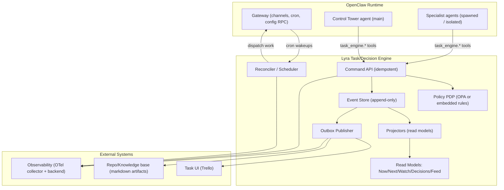
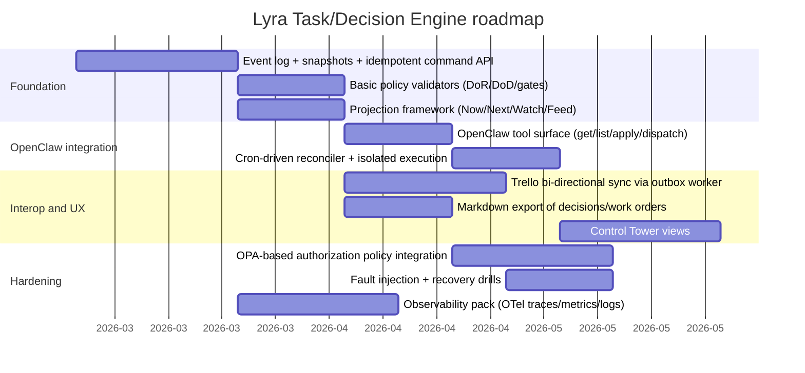

# Best Practices for Task and Decision Management Engines for Lyra OpenClaw

## Executive summary

Lyra’s current “operating system” repository expresses an unusually strong governance posture: tasks, decisions, work orders, change artifacts, registries, and cadence policies are treated as first-class operational primitives (with explicit definitions and conventions), while automation is expected to remain “assistive” until guardrails—especially decision auditability—are in place. This implies a task/decision management engine for Lyra should be designed less like a generic job queue and more like a **durable, auditable control loop** that enforces policy and produces traceable state transitions, while delegating execution to OpenClaw’s agent runtime and tools.  

The best-fit architectural approach is a **hybrid**: centralized governance and state (tasks, decisions, evidence, approvals, invariants) with decentralized execution (OpenClaw agents and skills) and deterministic reconciliation (controller-style loops). This mirrors patterns used by durable workflow systems such as entity["company","Temporal","durable workflow orchestration platform"] (event histories, replay, idempotent activities) and by entity["organization","Kubernetes","container orchestration project"] controllers (non-terminating reconciliation loops that continuously push actual state toward desired state). citeturn8view0turn9view0turn11search3  

Concretely, the recommendation is to build a **Lyra Task/Decision Engine (TDE)** as an event-sourced core with derived read models (“Now/Next/Watch/Decision Queue/Change Feed”), plus strict transition validation (DoR/DoD, gating, approvals) and clean integration points to OpenClaw (cron/heartbeat, tool calls, session routing). OpenClaw already provides a persistent Gateway scheduler (cron), job records with stable IDs, and a config RPC mechanism; the engine should exploit those primitives rather than replicate them. citeturn16search0turn16search3turn16search5turn16search6  

Key design choices:

- **Event-sourced state + projections** gives Lyra’s required auditability and “explain why this happened” capability and supports rebuild/replay characteristics found in established patterns. citeturn12search0turn8view0  
- **Idempotent, retry-safe execution contracts** are non-negotiable when tasks can be retried after worker failures or partial completion; Temporal’s activity design guidance is directly applicable to agent tool invocations. citeturn9view0  
- **Policy-as-code for decision rights and access** is best implemented as a decoupled policy decision point (e.g., entity["organization","Open Policy Agent","policy engine project"]), separating “what is allowed” from “how we enforce.” citeturn15search2turn15search3turn15search8  
- **Telemetry-first implementation** using entity["organization","OpenTelemetry","observability framework"] enables deterministic debugging of multi-agent execution and measurable governance outcomes (lead time, compliance, idempotency failures). citeturn0search2  

## Findings from the Lyra operating system repository

The repo (pek007/lyra-operating-system) is primarily a **governance + operating model spec**, not a conventional codebase. It defines task/decision operating policies, registries, templates, and integration practices, plus a few automation scripts (notably a Trello sync utility and evidence ingestion). The most important engine-relevant implications are:

### The repository encodes “governance invariants” that your engine must enforce

The documents collectively define:

- A **canonical task lifecycle** with explicit statuses/lanes (inbox → triage → active/waiting → done/archived) and standards for linking tasks to work orders, decisions, and change artifacts.  
- A **decision model** with explicit schema expectations (decision record fields, evidence requirements, approvals/owners, review cadence) and decision principles.  
- A **systems-of-record stance**: certain artifacts are treated as authoritative; the engine must avoid ambiguity about where truth lives and how conflicts are resolved.  
- A **multi-agent model**: named agents and responsibilities are formalized, implying the engine must support (a) job/role assignment, (b) permission envelopes, and (c) idempotent interactions that survive agent restarts.

Because these invariants are written down as policy, the engine’s core value is to make them **machine-checkable** (state transition validators + gate checks + audit trails), rather than hoping that agents “remember to comply.”

### Trello is currently treated as a system of engagement, but governance happens in files

The repository includes conventions and automation around Trello synchronization and structured markdown artifacts. In practice, this often means Trello is used for visibility and workflow ergonomics, while artifacts like decisions/work orders are meant to be durable, reviewable records (similar in spirit to event histories or append-only logs). A first engine iteration should therefore support **bi-directional sync** but keep Lyra’s “governance objects” as first-class internal records rather than treating Trello as the database.

### Existing scripts hint at “thin automation, thick semantics”

The code that exists in-repo (e.g., Trello sync, evidence ingestion) is narrow and operational. That’s consistent with a future engine design where automation is decomposed into small idempotent steps, while the engine remains the semantic arbiter. This aligns with durable execution guidance: break large units of work into smaller retriable units to improve failure recovery and idempotency. citeturn9view0  

### Direct references you should treat as the engine’s initial contract surface

Because the repo could not be reliably fetched via the web tool in this session (cache limitations), below are the primary internal specs and templates referenced during connector-based review. Links are provided as raw URLs (permitted in code blocks) so you can verify and pin them in future architecture decision records:

```text
Core governance / engine contract (pin to commit 53de61b…):
https://github.com/pek007/lyra-operating-system/blob/53de61bee82f18d4f8d4ac13805f242d4b2f8060/governance/task-decision-engine-contract.md
https://github.com/pek007/lyra-operating-system/blob/53de61bee82f18d4f8d4ac13805f242d4b2f8060/TASK_SYSTEM_POLICY_V1.md
https://github.com/pek007/lyra-operating-system/blob/53de61bee82f18d4f8d4ac13805f242d4b2f8060/TASK_LINKING_STANDARD.md
https://github.com/pek007/lyra-operating-system/blob/53de61bee82f18d4f8d4ac13805f242d4b2f8060/DECISION_PRINCIPLES.md
https://github.com/pek007/lyra-operating-system/blob/53de61bee82f18d4f8d4ac13805f242d4b2f8060/DECISION_SCHEMA_V1.md
https://github.com/pek007/lyra-operating-system/blob/53de61bee82f18d4f8d4ac13805f242d4b2f8060/WO_TEMPLATE_V1.md
https://github.com/pek007/lyra-operating-system/blob/53de61bee82f18d4f8d4ac13805f242d4b2f8060/CA_TEMPLATE_V1.md
https://github.com/pek007/lyra-operating-system/blob/53de61bee82f18d4f8d4ac13805f242d4b2f8060/MULTI_AGENT_OPERATING_MODEL_V1_1.md
https://github.com/pek007/lyra-operating-system/blob/53de61bee82f18d4f8d4ac13805f242d4b2f8060/AGENT_EXECUTION_SEMANTICS.md
https://github.com/pek007/lyra-operating-system/blob/53de61bee82f18d4f8d4ac13805f242d4b2f8060/AGENT_PERMISSION_ENVELOPES.md
https://github.com/pek007/lyra-operating-system/blob/53de61bee82f18d4f8d4ac13805f242d4b2f8060/CADENCE_GOVERNANCE_POLICY.md
```

## Best practices landscape for task and decision engines

### Architecture patterns: centralized, decentralized, hybrid

A task/decision engine spans two different concerns: **state governance** (tasks/decisions as authoritative records) and **work execution** (agents/tools doing actions). Mature systems separate them:

- Durable orchestration systems maintain a **durable history** and replay it to recover state after failures. Temporal’s event history model explicitly records workflow commands/events and supports replay to reconstruct “pre-failure state.” citeturn8view0turn7view0  
- Controller-based systems implement **non-terminating reconciliation loops**, continuously moving current state toward desired state, rather than relying on one-shot imperative scripts. Kubernetes describes controllers as control loops watching cluster state and making/requesting changes to converge on desired state. citeturn11search3  

This leads to three canonical engine architecture options:

**Centralized engine**
- Single authoritative store and scheduler.  
- Simplest correctness story (strong consistency, single event log).  
- Becomes a throughput bottleneck and a single blast radius if not carefully designed.

**Decentralized engine**
- Each agent/team owns local task/decision state; merge later (eventual consistency).  
- Better autonomy, but correctness and auditability get hard: resolving conflicting decisions is non-trivial, and global invariants are fragile.

**Hybrid engine**
- Central authoritative governance state; decentralized workers execute actions.  
- Concurrency/scale handled via partitioning (domains/queues), not by giving up correctness.  
- This is the default pattern behind durable orchestration + worker fleets, and it best matches Lyra (multi-agent execution with strict governance). citeturn7view2turn8view0  

### Decision models: rule-based, ML-based, and hybrid governance

Lyra’s “decision management” requirement is twofold: (1) decide what to do (recommendation), and (2) decide what is allowed (governance). Those should not be conflated.

A robust approach is **hybrid**:

- **Rule-based governance** for safety and correctness (hard gates): approvals required, WIP limits, link requirements, “cannot transition without DoR/DoD,” permission envelopes. This is deterministic and auditable.  
- **ML-based advisory scoring** for prioritization and triage: suggested priority, risk prediction, estimated effort, likely dependencies, “recommend deferral.” ML outputs should be treated as suggestions unless explicitly authorized for automation.

For the decision modeling layer, standards from entity["organization","Object Management Group","standards consortium"]—BPMN for process, CMMN for case-style work, and DMN for decision modeling—are relevant conceptual anchors, especially DMN’s emphasis on explicit decision artifacts and machine-readable interchange. citeturn10search1turn10search0turn10search4  

### Task representation and lifecycle: state machines plus event trails

The core abstraction should be: **task = state machine + metadata + audit trail**.

Event sourcing is a well-known pattern for capturing state changes as an append-only sequence of events, enabling rebuild and temporal query. entity["people","Martin Fowler","software engineer"] describes event sourcing as storing all changes as a sequence of events and using the log to reconstruct past states. citeturn12search0  

For Lyra, this is not just an architecture choice; it is a direct enabler for:
- explainability (“why did this task move to waiting?”),
- auditability (who/what initiated a decision),
- recovery (rebuild read models after schema changes),
- safe automation (idempotent replay).

### Scheduling and orchestration: “durable control loops” rather than cron-only

Cron is necessary but insufficient for Lyra-grade governance:

- Cron handles **when to wake** and **when to run**, but an engine must handle **what should happen given policy + state**.
- The “best practice” is to treat scheduling as a convergence loop: periodically re-evaluate tasks for readiness, dependency satisfaction, SLA breaches, and decision gates.

OpenClaw already provides a persistent gateway scheduler (“cron”) with jobs stored under `~/.openclaw/cron/`, plus two execution styles (“main session” system events and “isolated” job turns). That’s ideal for the *wake-up* mechanism, while the engine should own *convergence logic*. citeturn16search5turn16search3turn16search2  

This is analogous to Temporal’s structured separation between workflow orchestration and activity execution, where workflows coordinate and activities perform work and must be idempotent/retryable. citeturn7view0turn9view0  

### Concurrency and consistency: design for retries, duplication, and races

Any agent-based system must assume:

- retries after failure,
- duplicate deliveries (especially if the worker completes but fails to report success),
- concurrent updates (multiple agents touching the same task),
- partial completion of side-effecting actions.

Temporal’s documentation highlights exactly the edge case Lyra will see: a worker can crash after completing an activity but before reporting completion, causing the activity to be retried; therefore activities should be idempotent and often benefit from idempotency keys. citeturn9view0  

For storage-level consistency, if Lyra uses relational storage (recommended), transaction isolation and retry behavior must be explicit. PostgreSQL documents that the Serializable isolation level emulates serial execution but requires applications to retry on serialization failures. citeturn13search1turn13search4  

### Fault tolerance and recovery: outbox + replay + deterministic rebuilds

For reliable publication of “state changes” to external systems (Trello, notifications, control panel feeds), the **Transactional Outbox** pattern is a best practice: write the business object and an outbox event in the same DB transaction, then have a worker publish and mark processed, preventing event loss on crashes. entity["company","Microsoft","technology company"] documents this approach and its rationale. citeturn12search5  

Combining outbox with event sourcing gives three recovery layers:
1. rebuild projections from event log,
2. replay/publish missing outbox events,
3. re-run reconciliation loops to converge state.

### Observability/telemetry: trace the governance pipeline, not only system health

Multi-agent task governance fails quietly unless it is observable. OpenTelemetry provides a standard for collecting traces/metrics/logs across services and is the right baseline for cross-agent causality graphs. citeturn0search2  

A Lyra engine should define semantic telemetry around:
- task transitions,
- decision gates,
- agent dispatch,
- tool invocations,
- retries and idempotency misses,
- “policy denied” events.

### Security and access control: policy decision point + least privilege

Given OpenClaw’s ability to execute tools and interact with persistent credentials, Lyra must assume the engine is a high-value control plane component. OpenClaw’s own docs emphasize gateway configuration controls and channel allowlists, and the tools docs emphasize explicit gateway token usage and safety cautions around system execution. citeturn16search0turn16search6  

For authorization inside the engine, Open Policy Agent is a strong fit because it explicitly separates policy evaluation from enforcement, offers a local REST decision API (`POST /v1/data/<path>`), and is designed to be deployed as a sidecar or host daemon for low-latency, high-availability policy checks. citeturn15search2turn15search3turn15search0  

For authentication in remote deployments, standards such as OAuth 2.0 (RFC 6749) and JWT (RFC 7519) provide the baseline primitives for delegating access and carrying signed claims. citeturn14search3turn14search0  

## Architecture options for a Lyra task/decision engine

### Centralized architecture

**Shape**  
A single service owns tasks, decisions, scheduling, and dispatch. Agents call it; it calls OpenClaw tools.

**Pros**
- Strongly consistent state and simpler invariants.
- Single audit trail.
- Straightforward backfill/rebuild.

**Cons**
- A single failure domain unless replicated.
- Can become a “god service” unless modularized.
- Higher coupling to OpenClaw integration details.

Best when: Lyra is primarily single-operator + small agent fleet and wants maximal governance integrity.

### Decentralized architecture

**Shape**  
Each agent manages its own state; a synchronizer merges into global views.

**Pros**
- Autonomy and natural sharding.
- Less central bottleneck.

**Cons**
- Hard to enforce governance invariants globally.
- Conflicting decisions become “merge problems,” which is unacceptable for high-stakes decision records.
- Audit and explainability degrade quickly (multiple partial logs).

Best when: you have independent teams with weak coupling and can tolerate eventual consistency. This is misaligned with Lyra’s explicit governance system.

### Hybrid architecture

**Shape**  
A central governance state machine + event store; decentralized execution via workers/agents; reconciliation loops to maintain invariants.

**Pros**
- Keeps a single source of truth for tasks/decisions while scaling execution.
- Natural fit to OpenClaw’s model: centralized Gateway for channels + distributed tool execution. citeturn16search1turn16search6  
- Aligns with proven patterns:
  - event history/replay for correctness and recovery, citeturn8view0  
  - worker fleets executing idempotent units, citeturn9view0  
  - control-loop convergence, citeturn11search3  

**Cons**
- Requires careful boundaries: governance vs execution.
- Requires clean idempotency and concurrency controls (but those are required anyway).

Best when: you need both strict governance and flexible multi-agent execution. This best matches Lyra.

## Recommended design for Lyra OpenClaw

### Design principles tailored to Lyra

The design must satisfy the repository’s implied operating constraints:

- **Governance-first**: engine is a policy enforcement and audit system, not merely a scheduler.
- **Assistive automation**: default to “recommend + stage” actions; require explicit approvals for high-impact transitions.
- **Deterministic recovery**: any crash should lead to replay/rebuild, not manual forensics.
- **Human legibility**: produce artifacts that are readable (markdown exports, decision briefs), not only database rows.
- **OpenClaw-native integration**: use OpenClaw cron/heartbeat as wakeup primitives and implement tools that respect OpenClaw’s explicit credential handling. citeturn16search5turn16search6  

### Logical architecture



This is intentionally similar to “workflow orchestration + activities” and “controller reconcile loops”:

- Event Store + Projectors ≈ Temporal event history + visibility indices. citeturn8view0turn7view4  
- Reconciler ≈ Kubernetes controller loop. citeturn11search3  
- Dispatch to OpenClaw ≈ workers executing activity-like operations with retries and idempotency. citeturn9view0  

### Integration with OpenClaw

OpenClaw provides three especially valuable primitives:

1. **Config as JSON5** (`~/.openclaw/openclaw.json`) with programmatic patch/apply via gateway RPC. This can be leveraged for controlled rollout of engine endpoints, tokens, and tool exposure. citeturn16search0  
2. **Cron with durable job records** (stable job IDs, persisted schedules, main vs isolated execution). Use cron to wake the “reconciler” and to drive time-based SLAs (stale tasks, overdue reviews). citeturn16search5turn16search3turn16search2  
3. **Tool credential explicitness**: gateway-backed tools require explicit gateway tokens for overrides; this incentivizes designing engine tools with explicit, auditable credentials rather than ambient authority. citeturn16search6  

**Recommended OpenClaw tool surface (minimum viable)**  
Define a small set of deterministic tool calls (names illustrative):

- `task_engine.get(taskId, include=...)`
- `task_engine.list(query, cursor)`
- `task_engine.propose_transition(taskId, toStatus, rationale, evidenceRefs)`
- `task_engine.apply_transition(taskId, toStatus, expectedVersion, idempotencyKey)`
- `task_engine.record_decision(decisionPayload, expectedVersion, idempotencyKey)`
- `task_engine.dispatch(taskId, agentId, mode=main|isolated, delivery=...)`

Critically, `apply_transition` and `record_decision` should be **idempotent commands** and should reject unsafe transitions unless required gates are satisfied.

### Data model and storage

A pragmatic Lyra approach is to store authoritative state in a relational DB (SQLite for local MVP, PostgreSQL for multi-machine/HA), with an append-only event log as the source of truth and read models for fast queries.

#### Core tables

| Table | Purpose | Notes |
|---|---|---|
| `task` | Current task snapshot | Derived from events; used for quick access |
| `task_event` | Append-only event log | Source of truth for task transitions |
| `decision` | Current decision snapshot | Derived from decision events |
| `decision_event` | Append-only decision history | Enables replay and audit |
| `artifact_link` | Links between tasks, work orders, change artifacts, decisions | Implements the repo’s linking standard |
| `policy_snapshot` | Versioned policy bundles | Enables “what policy was in effect?” |
| `outbox` | Pending integration events | Implements transactional outbox citeturn12search5 |
| `read_model_*` | “Now/Next/Watch/Feed” projections | Rebuildable; optimize for control panel |

#### Suggested schema details

**Task snapshot**

| Field | Type | Semantics |
|---|---|---|
| `task_id` | string (stable) | Canonical ID consistent with existing conventions |
| `title` | text | Human semantics |
| `status` | enum | Inbox/Triage/Active/Waiting/Done/Archived |
| `owner_agent` | string | Primary executor / accountable agent |
| `priority` | int | Canonical priority (policy-driven) |
| `wsjf_score` | float | Optional scoring, if the repo uses WSJF |
| `version` | int | Optimistic concurrency control |
| `created_at` / `updated_at` | timestamp | For lead/cycle time |
| `blocked_by` | array<string> | Dependency edges; alternatively separate table |
| `risk_class` | enum | Used for decision gate requirements |
| `external_refs` | json | Trello card ID, URLs, etc. |

**Task event**

| Field | Type | Semantics |
|---|---|---|
| `event_id` | uuid | Unique |
| `task_id` | string | Partition key |
| `seq` | int | Strict ordering per task (or timestamp + UUID) |
| `type` | enum | Created/Transitioned/Annotated/Linked/Blocked/Unblocked/Assigned |
| `actor` | json | agentId/sessionKey/user identity |
| `payload` | json | Event-specific schema |
| `idempotency_key` | string | Ensures exactly-once effects at command layer |
| `ts` | timestamp | Ordering + audit |

### Core algorithms and pseudocode

#### Command handling with optimistic concurrency + outbox

Key requirements:
- reject invalid transitions (policy),
- guarantee idempotency,
- atomically record event + derived snapshot + outbox message.

```pseudo
function apply_transition(task_id, to_status, expected_version, actor, idempotency_key):
  begin transaction (serializable or repeatable read)
    if exists(select 1 from task_event where task_id=... and idempotency_key=...):
        return OK (idempotent replay)

    task = select * from task where task_id = ... for update
    if task.version != expected_version:
        raise Conflict

    validate_transition(task, to_status, actor)   // DoR/DoD, gates, permissions

    new_event = make_event(task_id, "Transitioned", actor, {from: task.status, to: to_status}, idempotency_key)
    insert task_event(new_event)

    update task set status=to_status, version=version+1, updated_at=now() where task_id=...

    insert outbox({kind:"TaskTransitioned", task_id, event_id:new_event.id, delivered:false})

  commit
  return OK
```

Notes:
- If using PostgreSQL serializable isolation, plan for retries on serialization failures. citeturn13search4  
- Idempotency logic is non-optional due to agent retries and worker crashes. citeturn9view0  

#### Reconciliation loop (controller-style)

This loop computes “desired governance state” and enqueues work.

```pseudo
function reconcile_tick(now):
  // run periodically (OpenClaw cron), and also on relevant events
  candidates = query("""
    select task_id from task
    where status in ('Triage','Active','Waiting')
  """)

  for task_id in candidates:
    task = read_snapshot(task_id)

    violations = evaluate_invariants(task)     // WIP limits, stale reviews, missing links
    if violations.non_empty:
        emit_signal(task_id, "ViolationDetected", violations)

    if task_ready_for_execution(task):
        if has_budget_and_permission(task):
            dispatch_to_openclaw(task)
        else:
            create_decision_needed(task)
```

This is conceptually the same as a Kubernetes controller attempting to move current state toward desired state by making or requesting changes. citeturn11search3  

#### Dispatch into OpenClaw cron/heartbeat

Use OpenClaw cron for “wakeups” and stable job IDs; decide between main session and isolated execution based on task risk and desired trace isolation.

- Main session jobs enqueue a system event and run on next heartbeat.  
- Isolated jobs run a dedicated agent turn in `cron:<jobId>` and can deliver output. citeturn16search5turn16search2  

A safe default for Lyra:
- **Isolated mode** for tasks that might involve external tools or high side effects.  
- **Main session mode** for low-risk governance tasks (triage summaries, reminders, backlog scans).

### Observability and “request charts” for the control tower

Instrumentation should include tracing for:
- command intake,
- validation/gate evaluation,
- reconciliation tick,
- dispatch to OpenClaw,
- outbox delivery,
- projection lag.

Use OpenTelemetry to standardize traces/metrics/logs emitted by the engine and optionally collected by a shared collector. citeturn0search2  

Charts to include in the Lyra Control Tower dashboard (these are highly actionable and governance-aligned):

- **Task cycle time** distribution per status transition (Triage→Active, Active→Done).  
- **WIP over time** vs policy limits (by lane/agent).  
- **Decision lead time** (DecisionRequested→DecisionApproved).  
- **Idempotency collisions** (rate of duplicate command keys; indicates retries and instability).  
- **Projection lag** (event seq – projected seq) for each read model.  
- **Dispatch success rate** (OpenClaw job succeeded/failed/retried) by agent and tool class.

## Evaluation metrics and testing plan

### Evaluation metrics

A Lyra task/decision engine should be evaluated on three axes:

**Governance correctness**
- Invalid transition rate (should trend to zero after stabilization).
- Gate compliance (percentage of tasks entering “Active” with required links/evidence).
- Decision audit completeness (percent decisions with required fields/evidence/approvals).

**Execution reliability**
- Dispatch success rate and retry rate.
- Mean time to recovery after crash (rebuild + resume).
- Outbox delivery lag and duplication rate. citeturn12search5turn9view0  

**Operational throughput**
- Reconcile tick duration and task scan throughput.
- Command latency p50/p95/p99.
- Projection rebuild time from scratch (backfill performance).

### Testing strategy

A rigorous plan for an expert audience should include:

**State machine & policy tests**
- Exhaustive transition tests for every status edge.
- “Negative” tests ensuring forbidden transitions are rejected with explicit reasons.

**Property-based testing**
- Generate random sequences of commands/events and assert invariants:
  - version monotonicity,
  - idempotency key replay correctness,
  - no task ends in impossible states (e.g., Done with unmet DoD gates).

**Concurrency tests**
- Simulate parallel agents applying transitions; assert correct conflict detection and retry behavior (especially under serializable isolation). citeturn13search4  

**Failure injection**
- Crash after writing an event but before outbox publish; verify outbox eventually delivers (transactional outbox contract). citeturn12search5  
- Crash after dispatch but before acknowledging; verify idempotency prevents duplicate harmful actions (requires idempotency keys + tool-side support). citeturn9view0  

**Integration tests with OpenClaw**
- Validate cron-based wakeups, isolated turns, and delivery. citeturn16search5turn16search3  
- Validate tool token requirements and explicit credentials behavior. citeturn16search6  

## Migration roadmap with milestones, risks, and prioritized backlog

### Roadmap



### Key risks and mitigations

**Risk: conflating “decision recommendation” with “decision authority.”**  
Mitigation: treat ML outputs as advisory; enforce governance via deterministic rules; require explicit approvals for high-risk transitions. DMN/CMMN concepts can help keep decision artifacts explicit and reviewable. citeturn10search4turn10search0  

**Risk: duplicate side effects from retries.**  
Mitigation: idempotency keys on all commands; tool-side idempotency where possible; smaller “activity-like” units of work, consistent with Temporal guidance. citeturn9view0  

**Risk: integration event loss (Trello sync drift).**  
Mitigation: transactional outbox. citeturn12search5  

**Risk: policy drift and “unknown why allowed.”**  
Mitigation: versioned policy snapshots; record “policy hash” in each decision/transition event; consider OPA bundles if you adopt OPA. citeturn15search1turn15search3  

**Risk: OpenClaw security boundary leakage.**  
Mitigation: strict permission envelopes, minimal tool exposure, explicit gateway token use; align with OpenClaw tool parameter requirements and gateway access controls. citeturn16search0turn16search6  

### Prioritized backlog of features

**Highest priority**
- Event log + idempotent command API (foundation for everything else). citeturn12search0turn9view0  
- Policy-validated state transitions (DoR/DoD + decision gating).  
- Reconciler loop + OpenClaw cron wakeups (durable control loop). citeturn11search3turn16search5  
- Outbox-based integration publisher (Trello + artifact exports). citeturn12search5  
- Telemetry pack with deterministic trace correlation (command → reconcile → dispatch → outcome). citeturn0search2  

**Medium priority**
- OPA-based authorization policy, including per-agent scopes and audit logs. citeturn15search2turn15search3  
- Policy versioning + “policy hash” stamping in every governance event.  
- Decision modeling support inspired by DMN (explicit decision tables where relevant). citeturn10search4  

**Lower priority**
- ML-assisted triage/prioritization (only after governance correctness is stable).  
- Multi-tenant scaling patterns (namespaces, quotas) if Lyra grows beyond a single operator; Temporal’s best-practices framing is a useful reference for how mature platforms structure operational guidance. citeturn6view0  

