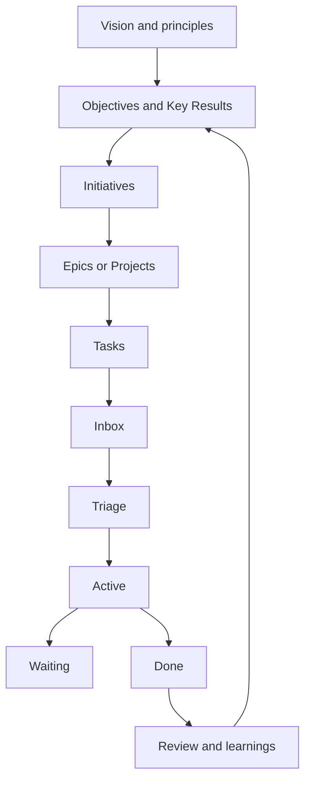
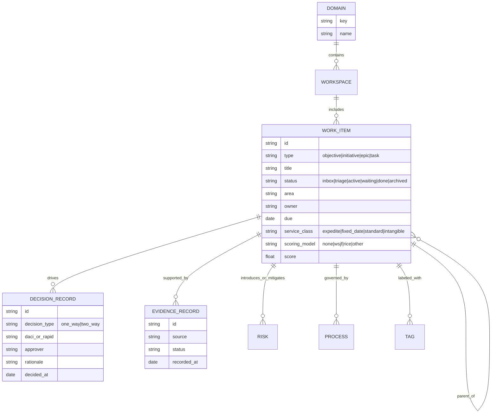
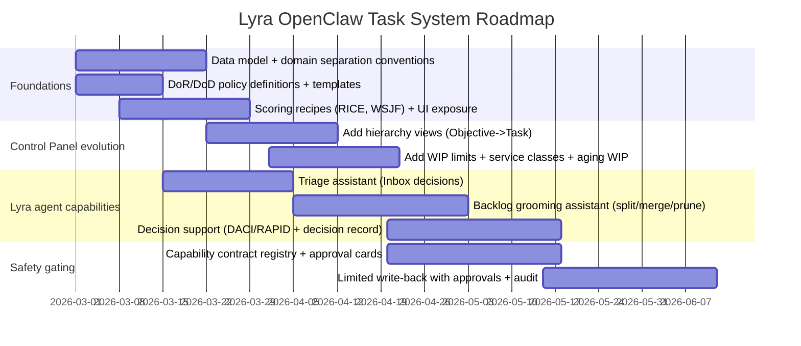

# Best Practices for Task Management, Prioritization, Kanban/Backlog Workflows, Decision Processes, and Hierarchical Task Organization — With a Lyra OpenClaw Blueprint

## Executive summary

Your two repos already encode a coherent operating model: a **local-first “operating system”** (docs as source of truth) paired with a **read-only control panel** that renders operational state from structured Markdown registries and evidence. In effect, you’ve built the skeleton of a “task + governance + evidence” stack: `TASKS.md` is a lightweight workflow board (Inbox → Triage → Active → Waiting → Done → Archived), while registries (agents, routing rules, processes, subscriptions) and evidence streams provide *decision context and auditability*. fileciteturn26file0L1-L200 fileciteturn29file0L1-L170 fileciteturn34file0L1-L120

Across modern best practice, the common failure mode is not “choosing the wrong framework,” but **failing to connect horizons** (vision → goals → initiatives → epics → tasks) and **failing to enforce flow** (explicit policies, WIP limits, and review cadences). The strongest approach is to combine: (a) a **capture/clarify loop** (GTD’s five steps), (b) a **goal hierarchy** (OKR-style objectives and measurable key results), (c) **Kanban flow policies** (explicit definitions, WIP control, service-level expectations), and (d) **repeatable decision rights** (DACI/RAPID + “one-way vs two-way door” decision classification). citeturn7search6turn11search6turn1search2turn11search3turn11search0turn10search36

For Lyra OpenClaw, the clear product opportunity is an **AI-assisted prioritization + triage layer** that remains compatible with your current principles: **high-signal, low-clutter**, **shared modules with domain isolation**, and **safe “approval-card” gating for external actions**. This implies (1) a richer internal data model (hierarchy + areas + scoring fields), (2) deterministic scoring and decision rules alongside LLM suggestions, and (3) UI/UX patterns that keep humans in control while reducing backlog entropy. fileciteturn34file0L1-L120 fileciteturn33file0L1-L80

---

## Findings from the two GitHub repos

The core patterns below are not generic guesses; they are visible in the code and repo docs.

### Control Panel repo as an operational “read-only window”

The control panel implements a **local API + web UI** that reads from a workspace root containing Markdown registries (tasks, risks, processes, subscriptions), plus a knowledge directory with evidence records and agent/routing registries. The build spec in the operating-system repo explicitly calls the panel “lightweight,” “read-only,” and designed to *render transparent operational state from existing docs/evidence*. fileciteturn29file0L1-L120

In the implemented API, the canonical views map closely to an operator workflow:
- **Now**: active tasks, waiting tasks, recent evidence, and agents. fileciteturn26file0L1-L220  
- **Next**: inbox + triage tasks plus processes and routing rules. fileciteturn26file0L1-L220  
- **Watch**: risks, warnings, subscriptions, and a “latest security audit” summary (if present). fileciteturn26file0L1-L220  
- **Changes**: git-log-based change feed, enabling a lightweight “what changed?” operational memory. fileciteturn26file0L1-L220  

The task schema is intentionally minimal and supports six statuses: `inbox`, `triage`, `active`, `waiting`, `done`, `archived`, with optional `priority`, `owner`, `due`, and `description`. fileciteturn26file0L1-L260

Two design choices are particularly important for best-practice alignment:
- **Dual parsing modes for tasks**: Markdown tables *or* checkbox lists, with status inference from section headings (e.g., “## Active”). This is a pragmatic “low friction capture” pattern that reduces ceremony and supports a GTD-like capture/clarify habit while still enabling structure. fileciteturn26file0L1-L340  
- **Environment clarity**: the UI surfaces whether it’s running on sample data; the health endpoint returns workspace path and an `isSampleData` flag. This prevents decision mistakes caused by “looking at the wrong reality.” fileciteturn27file0L1-L90

### Lyra operating-system repo as governance + continuity + safety scaffolding

The operating-system repo encodes three things that mature task systems tend to forget:

1) **Continuity mechanics**: agent operating instructions emphasize “write it down,” persistent memory files, and review rhythms (including heartbeat vs cron guidance). This is, functionally, a governance layer for attention and context. fileciteturn28file0L1-L220

2) **Domain partitioning**: a “shared modules, isolated instances” principle and a concrete service boundary architecture for strict separation between domains (e.g., `os` vs `px`), including separate workspace roots, secrets, evidence logs, and dashboarding. This is exactly the kind of “multi-area, multi-magnitude” separation that task systems often struggle with at scale. fileciteturn34file0L1-L120

3) **Safety gates for “human-like tools”**: a capability contract template plus an explicit rule that no external capability is enabled without an approved, versioned contract (and an approval-card pattern). This sets the pattern for safe automation in backlog grooming and prioritization: **the agent can recommend and prepare; irreversible actions require explicit gates**. fileciteturn33file0L1-L80

Finally, the repo’s own `TASKS.md` demonstrates a practical workflow language:
- tasks are ID’d (OPS-YYYY-NNN),
- status/progression is represented by section headings,
- and tasks can be moved from Active to Done with explicit closure notes (e.g., embeddings task closed after activation). fileciteturn30file0L1-L60 fileciteturn32file0L1-L80

---

## Synthesis of best practices and how to combine frameworks

A robust system typically needs *three layers* that many teams treat separately: **control** (manage commitments), **perspective** (choose what matters), and **flow** (ship work with minimal thrash). Your repos already cover “flow visualization” and “operational evidence”; the main missing layer is “explicit hierarchy + scoring + decision cadence.”

### Framework comparison table

| Framework or practice | Primary job | Best used for | Common failure mode | How to integrate with your current OS/control panel |
|---|---|---|---|---|
| Getting Things Done (GTD) — capture/clarify/organize/reflect/engage | Control of commitments and attention | Individual + small-team operational work; inbox discipline | “Capture without clarify” (inbox becomes a junk drawer) | Keep `TASKS.md` as the “surface area,” but add a strict triage rule: every Inbox item must become (a) next action, (b) project, (c) someday/maybe, or (d) trash/reference. citeturn7search6 |
| GTD Horizons of Focus | Perspective / multi-level priorities | Ensuring day-to-day tasks reflect goals/values | Tasks drift from strategy; shallow busywork dominates | Map “Areas of Focus” and “Projects” explicitly into your data model (see ERD). Use this to drive context-aware prioritization suggestions. citeturn11search6 |
| OKRs (Objectives and Key Results) | Align outcomes and metrics | Team- and org-level goals; quarterly planning | Over-cascading, turning OKRs into a mechanical waterfall; KRs that describe activities, not outcomes | Use OKRs at the “Objective/Initiative” layer; link cards to KRs so the agent can score work by contribution to measurable outcomes. citeturn6search1turn5news33 |
| Kanban Guide (explicit workflow definition, WIP control, explicit policies, SLE) | Flow efficiency and predictability | Knowledge work where priorities shift; continuous delivery | Boards that visualize work but don’t control it (no WIP limits, no policies, no aging controls) | Add explicit WIP limits and “service classes” (Expedite/Standard/Fixed date) plus SLE tracking; surface “aging WIP” in Watch. citeturn1search2 |
| MoSCoW | Time-boxed scope tradeoffs | Fixed time/cost situations | Everything becomes “Must” | Use as an attribute/label on initiatives/epics; enforce a cap on “Must” to preserve contingency. citeturn2search0 |
| Eisenhower (urgent vs important) | Quick triage heuristic | Personal inbox triage | “Urgent” mistakes (reactive work crowds out strategic work) | Use as one triage lens, not a scoring system. Make it a default view for Inbox/Triage rather than an all-up prioritization engine. citeturn4search6 |
| RICE scoring | Quantify “impact per effort” | Product/feature prioritization; option comparison | Fake precision; confidence always inflated | Support it as one scoring recipe for “initiative/feature” objects, with explicit time horizon for Reach. citeturn3search0 |
| WSJF (Cost of Delay / Job Size) | Economic sequencing | Backlog ordering under capacity constraints | Garbage-in math; Cost of Delay hand-waving | Implement WSJF as an *optional* policy for backlogs where time criticality matters; the agent can propose relative estimates and ask for confirmation. citeturn1search5 |
| Backlog refinement / grooming | Keep backlog “ready” | Scrum-like cadences; sprint planning readiness | Refinement becomes a giant meeting; no Definition of Ready | Encode a Definition of Ready and automate pre-checks (missing acceptance criteria, unclear owner, oversized). citeturn12search1turn12search4 |
| Definition of Done | Quality gate for completion | Any workflow; especially delivery work | “Done” becomes subjective; hidden rework | Keep DoD visible per work type; for tasks that touch external systems, integrate with capability-contract and approval-card gates. citeturn12search0turn10search36 fileciteturn33file0L1-L80 |

### Prioritization methods comparison table

| Method | Formula / mechanism | Strength | Bias / failure mode | Best fit |
|---|---|---|---|---|
| WSJF | (Cost of Delay) / (Job Size) | Forces time-criticality into the decision; supports sequencing | Requires calibrated relative estimation; can be gamed by inflating CoD | Large backlogs where “delay is expensive” and you need an order, not just a score. citeturn1search5 |
| RICE | (Reach × Impact × Confidence) / Effort | Good for product bets; confidence explicitly included | False precision; reach windows inconsistent | Feature/initiative prioritization with measurable users/events and time windows. citeturn3search0 |
| MoSCoW | Must/Should/Could/Won’t within timeframe | Simple scope negotiation | Everything becomes Must; loses meaning | Time-boxed delivery, especially when “flex features, fix time.” citeturn2search0 |
| Eisenhower | Important vs urgent quadrants | Fast triage | People confuse urgent with important | Inbox/Triage sorting, not final ranking. citeturn4search6 |
| WIP-limited Kanban pull | Move work only when capacity exists | Reduces context switching, stabilizes throughput | If WIP limits ignored, board becomes theater | Execution layer (Active/Waiting), where flow matters more than debate. citeturn1search2 |

A critical, evidence-backed implication: **context switching is real cost**. Empirical research on task switching shows measurable performance costs when alternating between tasks and task rules. citeturn9search1turn9search2  
This is why “WIP limits + explicit pull” are not cosmetic—they’re cognitive ergonomics. citeturn1search2

---

## Practical workflows that translate vision and roadmaps into actionable cards

This section gives workflows you can implement as policies and UI flows (not just philosophy). It is designed to be compatible with your existing statuses and views.

### End-to-end workflow from vision to execution

This “loop” is the missing connective tissue between strategy systems (vision/OKR) and flow systems (Kanban). It operationalizes what GTD calls “control + perspective” while leveraging Kanban’s explicit flow. citeturn7search6turn11search6turn1search2

### Sample Kanban/backlog board layouts aligned to your repo statuses

You already standardized statuses in the control-panel schema: Inbox, Triage, Active, Waiting, Done, Archived. fileciteturn26file0L1-L260  
Below are recommended layouts that preserve that simplicity but make flow control explicit.

**Personal/solo (high-trust operator) board**
- **Inbox (untriaged capture)** — no WIP limit, but must be emptied on a cadence  
- **Triage (clarify + decide)** — WIP limit 10 (forces decisions)  
- **Active (doing)** — WIP limit 3 (forces finishing)  
- **Waiting (blocked/delegated)** — WIP limit 10 (forces follow-up and pruning)  
- **Done (this week)** — auto-archive after 14–30 days  
- **Archived (history)**

**Team board with swimlanes (service classes)** — fits Kanban Guide’s emphasis on explicit policies and WIP control. citeturn1search2  
- Swimlane: **Expedite** (WIP=1)  
- Swimlane: **Fixed date** (WIP small; explicit due-date policy)  
- Swimlane: **Standard** (WIP-limited flow)  
- Swimlane: **Intangible / enablement** (explicitly capped to avoid starving delivery)

### Explicit policies, Definition of Ready, and Definition of Done

Your control-panel already has a “schema validation” mindset (Zod validation, parse errors surfaced). fileciteturn26file0L1-L180  
Extend that into workflow policy.

**Definition of Ready (DoR) — recommended minimum**
A work item can move from **Triage → Active** only if:
- Owner is set (single accountable owner)  
- Scope fits within the planning horizon (e.g., ≤ 2–3 days for solo; ≤ half a sprint for sprint teams) citeturn12search1  
- Dependencies are declared (or explicitly “none”)  
- Acceptance criteria exist (even lightweight)  
- Priority policy is satisfied (e.g., “has a scoring recipe or is in Expedite”) citeturn12search4turn12search1  

**Definition of Done (DoD) — recommended minimum**
Done means:
- The deliverable meets the quality criteria for its type (e.g., tested, documented, reviewed)  
- If it affects external systems, it meets the agreed “done” checklist for safe execution (ties directly into your approval mindset) citeturn12search0turn10search36  
- The outcome is recorded (evidence link, decision note, or change record), consistent with your evidence-forward operating model. fileciteturn26file0L1-L220

### Backlog management processes and decision rules

**Recommended cadences (lightweight but reliable)**
- **Daily** (5–10 min): “Active WIP + blockers” check; keep WIP limits honest. citeturn1search2  
- **Weekly** (30–60 min): backlog refinement + reprioritization; prune, split oversized items, and ensure the next slice of work meets DoR. citeturn12search1turn12search6  
- **Monthly** (60–90 min): OKR/key-result check-in and re-alignment; Atlassian’s playbook explicitly recommends periodic scoring and owner assignment for KRs. citeturn6search1  
- **Quarterly** (half-day): portfolio/initiative review; retire stale initiatives; reallocate capacity.

Your operating-system repo already hints at weekly review rhythms (e.g., weekly release delta review task). fileciteturn30file0L1-L60

**Triage decision rules (examples you can codify)**  
These are designed to be machine-checkable, which is essential if Lyra will assist reliably.

1) **Inbox rule (GTD control)**  
If an Inbox item has no next action after first review → it must become one of:  
- “Reference” (file/link),  
- “Someday/Maybe” (incubate),  
- “Trash,” or  
- “Project/Epic” (if multi-step), with the immediate next action created. citeturn7search6  

2) **Flow rule (Kanban control)**  
No item moves into Active if Active WIP is at limit—unless it is “Expedite,” in which case it *preempts* and forces something else out. citeturn1search2  

3) **Economic rule (prioritization algorithm selection)**  
- Use **WSJF** for sequencing *within a delivery backlog* when time-criticality is meaningful. citeturn1search5  
- Use **RICE** for comparing “bets” (features/initiatives) that have measurable customer reach/impact. citeturn3search0  
- Use **MoSCoW** for time-box commitments (release scope). citeturn2search0  

4) **Decision-rights rule (speed vs safety)**  
Classify a decision as:
- **Reversible (“two-way door”)** → DACI with a single Approver; time-boxed to 24–72 hours. citeturn10search36turn11search3  
- **Hard-to-reverse (“one-way door”)** → RAPID roles + explicit criteria + recorded rationale + required evidence artifacts. citeturn10search36turn11search0  

---

## Tooling and UX recommendations for Lyra OpenClaw

This is written to match the architecture you’re already moving toward: local-first, evidence-forward, domain-isolated, with explicit gating for external tools. fileciteturn34file0L1-L120 fileciteturn33file0L1-L80

### Core product thesis

Lyra becomes a **“portfolio + triage + flow copilot”** that:
- keeps the backlog clean,
- proposes priorities using transparent scoring recipes,
- identifies missing readiness/doneness fields,
- surfaces aging WIP and risk signals,
- and packages suggested changes into approval-ready actions (approval-cards), instead of silently mutating the system. fileciteturn33file0L1-L80

### Recommended data model

Your current task model is intentionally minimal. fileciteturn26file0L1-L260  
To support multi-magnitude hierarchy and AI assistance, add a thin layer of structured entities while remaining compatible with Markdown as source-of-truth.

This mirrors what you already do informally:
- task IDs and statuses in `TASKS.md` fileciteturn32file0L1-L80  
- evidence records as first-class artifacts fileciteturn26file0L1-L220  
- explicit domain separation (`os` vs `px`) fileciteturn34file0L1-L120  

### Concrete features for Lyra OpenClaw

**Priority and triage assistance (high leverage, low risk)**
- **Scoring recipes**: built-in support for RICE and WSJF with explicit, editable fields and transparent score math. citeturn3search0turn1search5  
- **Triage classifier (Inbox → Triage)**: suggest type (task vs project vs initiative), propose next action, and assign area/tag based on context; never auto-move without approval. citeturn7search6  
- **Readiness linting**: detect missing DoR fields (owner, acceptance criteria, dependencies); generate a “readying checklist.” citeturn12search4turn12search1  
- **Aging WIP detection**: surface items stuck in Active/Waiting, and propose unblock actions; aligns with the Kanban Guide’s emphasis on preventing pile-ups and managing aging. citeturn1search2turn4search0  

**Backlog grooming automation (medium leverage, requires policy tuning)**
- **Split suggestions for oversized items** (based on effort estimate or historical cycle time); Atlassian explicitly recommends splitting items to fit within limited time windows. citeturn12search1  
- **Duplicate/overlap detection**: semantic similarity + shared tags/areas; propose merges or parent/child relationships.  
- **Stale-item pruning**: “no-touch for N days” triggers a review; propose archive or re-scope.

**Decision support (high leverage, governance-heavy)**
- **Decision classification**: “one-way vs two-way” suggestion, then impose different process templates. citeturn10search36  
- **DACI/RAPID templates**: generate the stakeholder map and deadlines; enforce “single approver/decider.” citeturn11search3turn11search0  
- **Decision record auto-drafting**: capture rationale, alternatives considered, expected impact, and evidence links for future auditing.

**Safety and external action enablement (must align with your OS policies)**
- **Capability contract registry**: embed the tool-capability contract template directly into the system; any external tool action requires an approved contract ID, consistent with your “no capability without contract” gate. fileciteturn33file0L1-L80  
- **Approval cards**: every action that changes external state is packaged as an approval card (what, why, risk, rollback, evidence), not silently executed. fileciteturn33file0L1-L80  

### Feature trade-off table (what to build first)

| Feature | User value | Risk | Why it matters for your stack | Recommended stage |
|---|---|---|---|---|
| Read-only priority suggestions + transparent scoring | High | Low | Matches read-only control-panel MVP; adds leverage without rewrite | First |
| DoR/DoD linting + “readying checklists” | High | Low | Converts governance into machine-checkable policy | First |
| Aging WIP / stuck-work surfacing | High | Low–Medium | Reduces hidden WIP; complements Watch view | First |
| Automatic backlog reordering | Medium | Medium | Can cause trust loss if it “moves work behind your back” | Later (only with approvals + audit) |
| Write-back to Markdown registries | Medium | Medium–High | Breaks “docs as truth” if not gated; requires conflict handling | Later |
| Fully autonomous external execution | Potentially high | Very high | Conflicts with your own capability-contract gate unless tightly constrained | Only after contracts + approval flows mature |

---

## Implementation roadmap, metrics, and risks

The roadmap below assumes no constraints on team size/stack, but it stays consistent with what you’ve already built: local-first, modular services, and domain isolation. fileciteturn34file0L1-L120

### Timeline with milestones

### KPIs and operational metrics to track

These metrics are chosen because they map directly to the goals of a task system: clarity, flow, decision quality, and safety.

**Backlog health**
- % of items in Inbox older than N days (should trend down if GTD capture/clarify is working). citeturn7search6  
- % of Triage items meeting DoR (owner, acceptance criteria, size, dependencies). citeturn12search4turn12search1  
- Stale-item rate: items untouched for N days (board entropy).

**Flow**
- WIP in Active vs WIP limit adherence rate (policy compliance). citeturn1search2  
- Cycle time distribution by service class; use to compute/update SLE (service level expectation). citeturn1search2  
- Aging WIP count (items exceeding SLE percentile).

**Decision effectiveness**
- Decision lead time for “two-way door” decisions vs “one-way door” decisions (should be shorter for two-way). citeturn10search36  
- % decisions with a decision record + linked evidence (auditability). fileciteturn26file0L1-L220  
- Reopen rate: number of tasks moved Done → Active (quality and definition-of-done issues). citeturn12search0  

**Safety**
- % external actions executed only via approval cards + capability contracts (target: 100%). fileciteturn33file0L1-L80  

### Key risks and mitigations

**Risk: “Scoring theater” (false precision)**
- *Symptom*: teams spend time arguing about scores rather than outcomes.  
- *Mitigation*: enforce “confidence” fields (RICE) and require evidence links for high-impact claims; allow “qualitative override” with rationale. citeturn3search0  

**Risk: WIP limits ignored**
- *Symptom*: Active becomes a wish list; cycle times balloon.  
- *Mitigation*: make WIP violations visible in Now; block moves into Active unless a preempt rule is invoked (Expedite). citeturn1search2  

**Risk: Cross-domain leakage**
- *Symptom*: OS and PX tasks/notes/data bleed; confidentiality hazards.  
- *Mitigation*: enforce domain key on every object and run separate instances per domain, as your service-boundary architecture already specifies. fileciteturn34file0L1-L120  

**Risk: Unsafe automation**
- *Symptom*: agent actions surprise users or create irreversible external consequences.  
- *Mitigation*: keep agent “advisory by default,” require capability contracts and approval cards before enabling action tools. fileciteturn33file0L1-L80  

**Risk: Context switching overload**
- *Symptom*: many simultaneous Active items; slow progress despite high effort.  
- *Mitigation*: WIP limits + service classes; treat switching as a cost backed by cognitive research on switching overhead. citeturn9search1turn9search2turn1search2