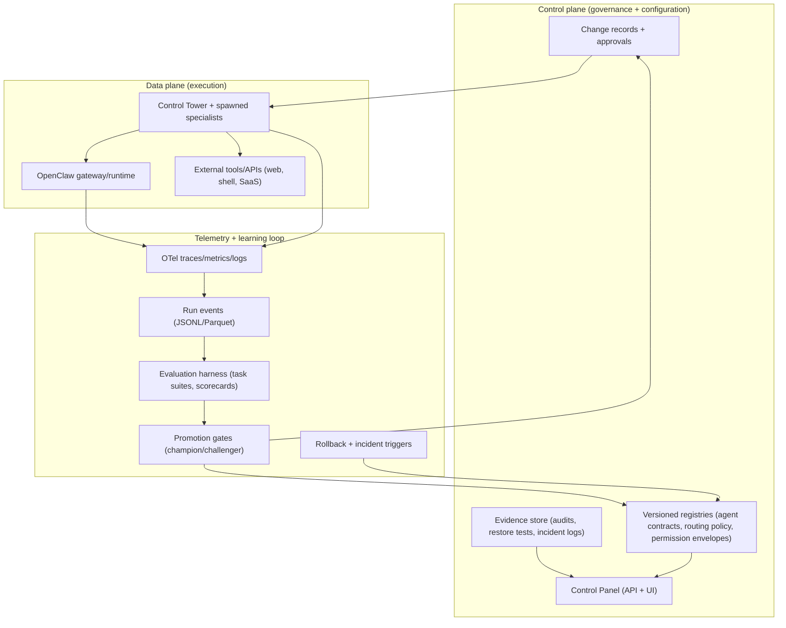

# Continuously Improving Self‑Improving AI Agent Systems for Lyra OpenClaw

## Executive summary

Lyra’s current “self‑improvement” capabilities are strongest in the *control plane*: governance artifacts (registries, runbooks, policies) are versioned; agent execution is standardized (spawn contracts, completion contracts); model routing is treated as policy with a champion‑challenger cycle; and operational evidence is periodically captured (doctor/security audits, restore tests, incident logging). This is exactly the substrate you want for safe, incremental self‑improvement: auditable change, measurable outcomes, and explicit gates. fileciteturn45file17L6-L27 fileciteturn51file13L6-L49 fileciteturn45file18L3-L9

The biggest gap is the *data plane feedback loop*: Lyra/OpenClaw can already generate useful artifacts, but the system lacks a first‑class, structured **run‑telemetry + evaluation harness** that (a) logs every agent run as reproducible events/traces, (b) scores outcomes against stable task suites, and (c) promotes improvements via gated, reversible deploys. Without that loop, “self‑improvement” stays mostly procedural (manual retrospectives and document updates) rather than systematized learning (automatic measurement → hypothesis → experiment → promotion/rollback). fileciteturn45file18L13-L23 fileciteturn46file0L106-L123

A pragmatic interpretation of “self‑improving agents” that fits Lyra’s risk posture is: **improve policies, prompts, retrieval corpora, tool wrappers, and code‑skills via measured loops**—and treat *weight updates* (fine‑tuning / reinforcement learning) as a later, higher‑governance phase. This aligns with empirical results from agent frameworks that “learn” via episodic memory / reflection and skill libraries (rather than online weight updates), because online weight updates are sample‑inefficient and risk catastrophic forgetting or regression. citeturn4view3 citeturn4view2 citeturn1search8

Recommended near‑term plan: formalize (1) **schemas** for run events, evaluations, and approvals (building on your existing registry schemas); (2) **observability** using standardized telemetry models (OpenTelemetry traces/metrics/logs); (3) **champion‑challenger experiments** for model routing, prompts, and tool policies; and (4) **governance gates** for any change that can affect external side‑effects, cost, or security. fileciteturn45file15L3-L92 citeturn7search3 fileciteturn51file13L41-L58

## Findings from the two GitHub repos

The two repos form an emerging *control-plane-first* agent operating system: **pek007/lyra-operating-system** is the governance + process substrate; **pek007/control-panel** is the read-only UI/API surface over the workspace state.

### Repository: pek007/control-panel

The repo is a local-first, read-only operations dashboard that parses markdown/YAML workspace files and renders four operator views (**Now**, **Next**, **Watch**, **Changes**). It is explicitly designed to tolerate missing files (empty states) and to surface schema/validation issues as structured errors. fileciteturn46file0L1-L2 fileciteturn46file0L35-L39 fileciteturn46file0L70-L71

Architecture is a monorepo with:
- an Express API (`apps/api`) that resolves a `WORKSPACE_ROOT` (defaulting to `./sample-data`) and serves JSON; and
- a Vite+React UI (`apps/web`) that fetches those endpoints and presents the four views. fileciteturn46file0L88-L97 fileciteturn46file1L15-L31

Key components and contracts:
- **Workspace file ingestion**: loaders parse markdown files with frontmatter and markdown tables/lists; TASKS supports both table format and section-heading list format (with status inference). fileciteturn46file0L55-L69 fileciteturn82file7L63-L155
- **Schema validation**: Zod schemas validate tasks, risks, evidence, agent contracts, routing rules; errors are accumulated and returned in each endpoint response as `{ data, errors }`. fileciteturn46file0L73-L76 fileciteturn46file3L18-L37
- **Operator views**:
  - **Now**: active/waiting tasks + recent evidence + agent list. fileciteturn46file3L7-L32  
  - **Next**: inbox/triage tasks + process registry + routing rules. fileciteturn46file12L7-L32  
  - **Watch**: risk register (plus warning extraction) + subscriptions + security summary JSON. fileciteturn46file8L7-L31  
  - **Changes**: `git log` over the workspace for commit feed, with graceful fallback if the workspace isn’t a git repo. fileciteturn46file9L7-L28 fileciteturn46file5L8-L41

Hooks for “self-improvement” (in the operational sense) exist indirectly through the *data model*: the UI exposes tasks, evidence, agent contracts, routing rules, risks, and change history—i.e., the ingredients you need to run a measure → review → improve loop. The system already treats schema validation errors as first-class signals (returned to the UI), which is a good starting point for “quality gates” and automated checks. fileciteturn46file0L73-L76 fileciteturn46file3L18-L37

Telemetry/observability in this repo is currently minimal: console logs/warnings in file loaders and server startup, plus the surfaced validation errors. There is no standardized tracing/metrics export, no correlation IDs, and no event stream beyond `git log`. fileciteturn46file1L25-L47 fileciteturn46file5L37-L41

Testing exists and is meaningful for reliability of the control-plane ingestion layer: Vitest covers schema validation and parser behavior (including explicit tests for “real workspace” TASKS formats, not only sample table fixtures). fileciteturn82file5L1-L18 fileciteturn82file7L63-L155

CI/CD signals: the repo defines build/test scripts but no clear evidence (in retrieved files) of GitHub Actions or other automated CI workflows; treat CI as “likely manual/implicit” unless added elsewhere. fileciteturn46file0L116-L123

Explicit MVP limitations include: read-only operation, no live reload, no auth, no websockets/push updates. fileciteturn46file0L116-L123

### Repository: pek007/lyra-operating-system

This repo is a governance-and-operations “OS layer” for Lyra+OpenClaw. It defines the control-plane artifacts that the control panel reads (tasks, registries, evidence, runbooks) and already encodes several best practices for safe incremental improvement.

Core architectural principles present in the repo:
- **Execution semantics** explicitly separate persistent vs spawned agents vs external workbench runs; spawned runs require an explicit spawn contract and completions must return a structured handoff (outcome summary, artifacts changed, risks/assumptions, next actions). fileciteturn45file17L6-L27
- **Anti-drift governance**: specialist agents cannot redefine principles/policies without Control Tower approval. fileciteturn45file17L29-L31
- **Model routing as governed policy** with anti-thrash rules and a champion-challenger loop, plus measurable success metrics (handoff acceptance, rework rate, cost per completed task, incident rate, routing stability). fileciteturn51file13L41-L58 fileciteturn51file13L50-L58
- **Least privilege** via permission envelopes by agent role, explicitly defining read/write scopes, allowed tools, and what requires approval. fileciteturn99file0L3-L19

Concrete hooks for continuous improvement are already encoded as operational processes and artifacts:
- A weekly metrics template explicitly tracks throughput, cycle time, work-in-progress, incidents/MTTR (Mean Time to Recovery), and “automation wins/process improvements implemented.” fileciteturn45file18L13-L23
- A security baseline checklist and security review documents record a measurable control posture and remediation tasks (including file permission hardening and tightening denyCommand coverage). fileciteturn45file16L1-L27
- An incident mini-runbook defines severity levels, containment steps, communication rules, evidence artifacts, and post-incident review expectations. fileciteturn51file10L7-L47
- A backup/restore runbook defines RTO/RPO targets and mandates periodic restore tests with recorded evidence. fileciteturn51file12L7-L36
- A “knowledge base system” defines storage conventions and a distillation workflow (inbox → reports → distilled → decisions → indexes) to avoid repeated work and to reuse prior reasoning. fileciteturn51file8L7-L28

The repo also contains tool scripts that operationalize evidence and task synchronization:
- `tools/evidence_ingest.py` runs `openclaw security audit --json` and `openclaw doctor --non-interactive`, stores audit artifacts, and writes timestamped evidence entries under `knowledge/evidence/YYYY-MM/`. fileciteturn45file5L66-L100  
- `tools/trello_sync.py` parses `TASKS.md` and syncs it into Trello lists/cards (dry-run by default; apply with a flag), creating lists and standard labels if requested. fileciteturn102file0L1-L200  
- `tools/trello_sync_runner.sh` indicates the intended operational mode: load credentials, run inside the OpenClaw workspace, then sync tasks. fileciteturn45file6L1-L4

Limitations and gaps (as relevant to “self‑improving systems”):
- Evidence entries generated by scripts may not strictly match the “YAML frontmatter” registry schema decision (the ingest script writes JSON inside `---` fences). That mismatch is survivable (gray-matter can parse YAML/JSON-ish frontmatter depending on parser settings), but it is a schema drift risk that will matter more once you automate validators and dashboards. fileciteturn45file15L6-L7 fileciteturn45file5L33-L43
- The repo encodes governance concepts (events/evidence/registries, champion-challenger, anti-thrash), but does not yet encode a fully structured, queryable event stream of *agent runs*; improvement signals remain mostly in human-written docs and periodic reports. fileciteturn45file18L13-L23 fileciteturn45file15L77-L85

## Research foundations and literature review

A central design decision for “self-improving agents” is *what “learning” means operationally*. In practice there are multiple learning layers:

- **Weight updates** (continual learning / online learning / reinforcement learning fine-tuning)
- **In-context learning** (reflection, scratchpads, episodic memory buffers)
- **External memory / retrieval** (knowledge bases, RAG, vector indexes)
- **Tool/policy learning** (tool selection strategies, routing policies, constraints, “skills as code” libraries)

The literature shows that the latter three give most of the *practical* benefits for agentic systems with lower operational risk, while weight updates introduce stability, evaluation, and governance burdens (catastrophic forgetting, regression risk, and data contamination).

### Continual learning and online learning

Sequential fine-tuning risks catastrophic forgetting; a canonical mitigation is **Elastic Weight Consolidation (EWC)**, which regularizes updates to protect parameters important to prior tasks and shows improved retention in sequential learning settings. citeturn1search8  
Another line is **Gradient Episodic Memory (GEM)**, which uses an episodic memory buffer and constrained gradients to reduce forgetting while enabling positive transfer; the paper also proposes metrics for continual learning evaluation (including transfer/forgetting measures). citeturn1search7

For agent systems, the systems-level implication is: **if you do weight updates, you must treat model versioning + eval suites + rollback as non-negotiable**, because forgetting is not an edge case—it’s the default failure mode. citeturn1search8 citeturn1search7

Online learning also includes **bandit-style** adaptation (exploration/exploitation) for decisions like “which model/prompt/tool policy should I use.” Bandit frameworks provide regret bounds and enable principled experimentation, but they can fail in high-dimensional or mis-specified scenarios; modern results continue to clarify when approaches such as Thompson sampling work and when they fail catastrophically (useful as a cautionary analogy for automated routing). citeturn8search3

### LLM agents that “improve” without weight updates

A recurring, empirically successful theme for LLM agents is: **avoid weight updates; improve via memory, reflection, and structured tool use**.

- **ReAct** combines reasoning traces with actions in an interleaved manner; it reduces hallucination/error propagation by grounding reasoning in tool interactions, and shows performance gains on interactive benchmarks with limited in-context examples. citeturn4view0
- **Reflexion** introduces a “verbal reinforcement” loop where agents reflect on task feedback and store reflective text in an episodic buffer, improving subsequent trials without updating model parameters. citeturn4view3
- **Voyager** (Minecraft) demonstrates an open-ended agent with an ever-growing **skill library of executable code**, curriculum-driven exploration, and iterative program improvement using environment feedback—again without model parameter updates. It also reports large empirical improvements over prior systems (items discovered distance travelled, faster tech milestones), illustrating the compounding effect of “skills as code.” citeturn4view2 citeturn2search6

These results map cleanly onto Lyra’s existing architecture choices: “skills as code” naturally live in versioned repos (with tests), and “reflection memory” naturally lives in a knowledge/evidence store with governance gates.

### Training-time self-improvement and alignment

If you do want the system to improve by learning from feedback at training time, the canonical modern pattern is **reinforcement learning from human feedback (RLHF)** (demonstrated in InstructGPT): supervised fine-tuning on demonstrations, reward modeling from rankings, then policy optimization to align with preference signals. citeturn7search2  
A closely related, governance-relevant variant is **RL from AI feedback (RLAIF)** and constitutional supervision, where improvements can be driven by explicit principle lists plus model-generated critiques and preferences (reducing labeling load, shifting effort to “principle engineering”). citeturn2search0

Operationally, these methods introduce a demand for: controlled datasets, label/version provenance, evaluation suites, and strict release governance—exactly the same issues as continual learning, but at larger scale. citeturn7search0 citeturn5search0

### Safe exploration and constrained optimization

“Self-improving” implies exploration; deployed agents must explore safely. The safe RL literature distinguishes (a) modifying the objective with risk sensitivity, and (b) modifying exploration via constraints, external knowledge, and risk metrics. citeturn8search2  
Constrained optimization methods such as **Constrained Policy Optimization (CPO)** formalize constraints alongside reward and provide guarantees related to constraint satisfaction across updates—an important conceptual template for agent governance (constraints as first-class, not “soft prompts”). citeturn8search8

For Lyra/OpenClaw, the safe-RL translation is: **encode constraints as machine-checkable policies (permission envelopes, deny-lists, approval gates), not merely as instructions**, and treat any widening of action space as a gated “capability release.” fileciteturn99file0L3-L19 fileciteturn51file13L19-L33

### Theoretical and empirical limits relevant to “self-improvement”

Two especially relevant limits for continuously improving agent systems:

- **Feedback loops create technical debt**: real ML systems accumulate hidden feedback loops, entanglement, and configuration debt; monitoring and clean interfaces become more important than the ML code itself. citeturn7search0  
- **Training on self-generated data can collapse model quality**: recursive training on generated data can cause distributional “tail loss” and irreversible defects (“model collapse”), implying you must preserve high-quality human/ground-truth data, watermark/filter synthetic data, and maintain evaluation anchors. citeturn6search0 citeturn6search4

### Comparative table: self-improvement approaches for Lyra

| Approach | What changes over time | Empirical support | Main failure mode | Governance load | Fit for Lyra now |
|---|---|---|---|---|---|
| Reflection + episodic memory (no weight updates) | “Lessons learned” text; retrieval prompts | Reflexion shows strong gains across tasks without fine-tuning citeturn4view3 | Self-confirming false beliefs; ungrounded self-evals | Medium (need eval + pruning) | High |
| Skill library (“skills as code”) | Versioned tool wrappers / programs | Voyager shows compounding gains with a growing code skill library citeturn4view2 | Code misuse; unsafe side effects | Medium–High (tests + sandboxing) | High |
| Tool-augmented reasoning (grounded actions) | Policy for when/how to use tools | ReAct improves robustness and reduces hallucination by acting/observing citeturn4view0 | Prompt injection; tool selection errors | Medium | High |
| Bandit-style routing (champion/challenger) | Which model/prompt/tool policy is used | Bandit theory motivates exploration/measurement; modern analyses highlight failure cases citeturn8search3 | High-dim instability; reward hacking | Medium–High | High (with anti-thrash gates) fileciteturn51file13L41-L58 |
| SFT/RLHF fine-tuning | Model weights | InstructGPT shows strong preference gains citeturn7search2 | Catastrophic forgetting; regressions | Very high | Medium (later phase) |
| Continual/online fine-tuning | Model weights continuously | EWC/GEM mitigate forgetting but don’t remove risk citeturn1search8turn1search7 | Drift + safety regression | Very high | Low (unless you build full MLOps) |

## Industry best practices and documented failure modes

### Governance and risk management as “part of the system”

NIST’s AI Risk Management Framework (AI RMF 1.0) and the Generative AI profile emphasize that trustworthy AI is operational: map context and harms, measure, manage, and govern continuously across the lifecycle. For agent systems, this implies: maintaining incident processes, monitoring, and change management as first-class components (not paperwork). citeturn5search0turn5search1

Lyra already reflects this direction in concrete artifacts: incident runbooks, security baselines, and routine evidence capture, which is unusually mature for an early-stage agent OS. fileciteturn51file10L7-L47 fileciteturn45file16L1-L27

### Observability: standardize telemetry early

A common failure mode in evolving ML/agent systems is *irreproducible debugging*: you cannot fix what you cannot trace. OpenTelemetry’s specification provides a standardized model for correlated traces/metrics/logs and a collector pipeline that can enrich data consistently. For agent systems, this becomes the backbone of “why did it do that?” and “what changed?” debugging. citeturn7search3turn7search4

Lyra’s current “observability” is primarily document-based (metrics weekly, evidence markdown, git commits). That’s valuable for governance, but insufficient for fine-grained anomaly detection (tool-call spikes, routing oscillations, latency cliffs). fileciteturn45file18L13-L23 fileciteturn46file9L7-L28

### MLOps/LLMOps failure modes to assume by default

The “hidden technical debt” analysis is directly applicable to self-improving agents: once you create feedback loops (routing changes affecting outcomes affecting future routing), you incur system-level debt—entanglement, hidden feedback loops, undeclared consumers, and configuration sprawl—unless you design explicit boundaries and monitoring. citeturn7search0

Additional agent-specific failure modes to plan for:

- **Prompt injection and untrusted content**: tool-augmented agents (ReAct-style) trade hallucination for susceptibility to malicious instructions embedded in retrieved web/docs; defenses must treat external content as adversarial input and enforce tool/data boundaries. citeturn4view0 fileciteturn99file0L3-L19
- **Spec drift**: if registry schemas, evidence formats, and scripts drift (e.g., YAML vs JSON frontmatter), your automated validators and dashboards will silently degrade. fileciteturn45file15L6-L7 fileciteturn45file5L33-L43
- **Self-generated data contamination**: if you later fine-tune models on agent outputs without preserving real/grounded labels, “model collapse” dynamics become relevant even in narrow domains; preserve gold sets and keep synthetic data proportions bounded. citeturn6search0turn6search4
- **Misaligned incentives / reward hacking**: once you attach automated success metrics, agents may optimize proxies (e.g., “short outputs” that miss nuance; “no incidents” by avoiding work). Safe RL stresses explicit constraints and risk-sensitive evaluation to mitigate this. citeturn8search2turn8search8

## Practical design patterns and code-level recommendations for Lyra

This section translates the repos + literature into implementable patterns for Lyra/OpenClaw, emphasizing **incremental adoption** and **reversibility**.

### Target system pattern: registry + event + evidence + evaluation

Your OS already encodes “registries” and “evidence.” The missing piece is a first-class, queryable **event stream** of agent runs and an **evaluation harness** that turns events into measured outcomes.

A concrete architecture that fits your current repos:



This directly aligns with the “Control Panel vision” thesis in your repo (registries + runtime events + evidence) and the champion-challenger/anti-thrash governance already documented. fileciteturn51file17L7-L23 fileciteturn51file13L41-L58

### API/contract recommendations

#### Unify registry schemas and enforce versioning

You already drafted machine-readable registry schemas (agent, routing, evidence, change records) and storage conventions. Treat these schemas as *versioned contracts* and enforce them with CI checks and runtime validation in the control panel API. fileciteturn45file15L3-L92

Key recommendations:
- Add `schemaVersion` to every frontmatter block (`agentContract.v1`, `routingRule.v1`, etc.).
- Add `dataClass` and `decisionType` consistently across tasks/routing/evidence because you already anticipate them in routing schema design. fileciteturn45file15L30-L44
- Resolve the JSON-vs-YAML mismatch by standardizing on **YAML** to match the schema document, or explicitly declare “frontmatter may be YAML or JSON” and test both (otherwise validators will drift). fileciteturn45file15L6-L7 fileciteturn45file5L33-L43

#### Add a first-class “agent run event” schema

Add an append-only event log under `knowledge/events/YYYY-MM/agent_runs.jsonl` (or Parquet later), with one event per root run and nested spans for tool calls.

Proposed `agent_run_event.v1` (starter):

```json
{
  "schema": "agent_run_event.v1",
  "run_id": "uuid",
  "timestamp_start": "RFC3339",
  "timestamp_end": "RFC3339",
  "agent_id": "AGENT-control-tower-lyra",
  "mode": "persistent|spawned|external-workbench",
  "task_ids": ["OPS-2026-011"],
  "risk_level": "low|medium|high",
  "decision_type": "type1|type2",
  "data_class": "public|internal|confidential",
  "model": { "provider": "openai", "name": "…", "lane": "ops|premium|build|research" },
  "tool_calls": [
    { "tool": "web_search", "count": 3, "errors": 0, "latency_ms_p50": 1200 }
  ],
  "usage": { "input_tokens": 0, "output_tokens": 0, "cost_usd": 0.0, "latency_ms": 0 },
  "outcome": { "status": "success|partial|fail", "artifacts_changed": ["path"], "summary": "…" },
  "quality": { "human_rating": null, "auto_scores": { "groundedness": 0.0, "format_ok": true } },
  "safety": { "approval_required": true, "approved": false, "violations": [] },
  "trace": { "otel_trace_id": "…" }
}
```

This is the missing bridge between your execution semantics (spawn/completion contracts) and your governance loop (metrics, evidence, routing policy). fileciteturn45file17L14-L27 fileciteturn51file13L50-L58

### Data pipelines and observability

#### Adopt OpenTelemetry semantics (even if storage is local-first initially)

OpenTelemetry defines a consistent model for traces/metrics/logs and a collector pipeline; even if you start with local JSONL files, aligning field names to OpenTelemetry conventions makes future scaling far easier (and avoids bespoke telemetry “tech debt”). citeturn7search3turn7search5

Implementation pattern for Lyra:
- Every agent run gets a `trace_id`.
- Each tool call = span with attributes (`tool.name`, `tool.latency_ms`, `tool.error`).
- Emit metrics for:
  - `agent.run.success_rate`
  - `agent.run.cost_usd`
  - `agent.tool_call.error_rate`
  - `agent.approval.queue_time_ms`
  - `routing.model.switch_count`
- Store locally first; later add an OpenTelemetry Collector to export to your preferred backend.

### Safety constraints, sandboxing, and approval gates

You already have “approvalRequiredFor” fields and permission envelopes; make them executable. fileciteturn45file0L7-L15 fileciteturn99file0L3-L19

Concrete constraints to encode:
- **Capability-based tool access**: tools require explicit capability grants in the agent contract (e.g., `shell.exec`, `external.send`, `git.write`). Your current contracts start this via `allowedTools` and scope restrictions. fileciteturn45file0L7-L12
- **Two-phase commit for irreversible actions**:
  1) agent proposes an “approval card” with diff/plan/rollback;
  2) human approves;
  3) action executes in a constrained sandbox.
- **Sandbox tiers**:
  - Tier A: pure read-only (web fetch, parse, summarize)
  - Tier B: write-only to workspace docs via patch layer (no direct overwrite)
  - Tier C: shell/dev tooling in a containerized environment (no host secrets)
  - Tier D: external side effects (emails, publishes, payments) — always gated

Safe RL and constrained optimization provide the conceptual justification: constraints must be explicit and preserved during “learning,” not treated as soft preferences. citeturn8search2turn8search8

### Experiment design patterns for incremental self-improvement

Your operating model already specifies champion-challenger and anti-thrash. Implement it as a measurable experiment system. fileciteturn51file13L41-L58

Recommended experiment types (low risk → high risk):
1. **Routing experiments** (bandit-like, bounded):
   - Randomly sample a small fraction of runs to challenger model/prompt.
   - Measure: task success, rework, latency, cost, safety flags.
   - Promote only if statistically and operationally justified.
2. **Prompt/policy experiments**:
   - Version prompts/policies in registries.
   - Use evaluation harness to replay a fixed task suite (regression testing).
3. **Tool wrapper experiments**:
   - Improve tool schemas, validators, and redaction filters.
   - Require sandbox execution and unit/integration tests.
4. **Memory/retrieval experiments**:
   - Evaluate recall/precision tradeoffs; measure “retrieval helps” vs “retrieval distracts.”
5. **Model fine-tuning (later)**:
   - Only after you have stable gold sets, contamination controls, and rollback.

Bandit theory supports controlled exploration; safe-RL theory motivates constraints and risk-sensitive metrics. citeturn8search3turn8search2

## Prioritized roadmap, monitoring metrics, and governance processes

### Timeline roadmap table

Assuming today is 2026-02-26 (Europe/Stockholm), this roadmap targets incremental adoption without requiring major infrastructure upfront.

| Date window | Objective | Deliverables | Promotion criteria | Rollback triggers |
|---|---|---|---|---|
| 2026-03-01 to 2026-03-15 | Instrumentation baseline | `agent_run_event.v1` schema; local run-event logging; Control Panel endpoint to show run stats | ≥90% runs logged with valid schema; no PII/secrets leakage | Logging breaks runs; schema drift; secrets detected |
| 2026-03-16 to 2026-04-05 | Evaluation harness v1 | Fixed “task suite” (from real OPS tasks + synthetic regressions); replay runner; scorecard | Stable pass/fail criteria; reproducible results | Non-deterministic eval; metric gaming |
| 2026-04-06 to 2026-04-30 | Champion-challenger routing | Sampling framework; monthly anti-thrash gate; routing change PR template | Challenger improves quality/cost/time within bounds | Cost spikes; safety incidents; routing oscillation |
| 2026-05-01 to 2026-05-31 | Safe automation (sandboxed) | Approval-card pattern; patch-based doc writes; containerized shell lane | Zero “unapproved external side effects”; low rework rate | Any accidental external send; destructive change without approval |
| 2026-06-01 to 2026-07-15 | Advanced self-improvement | Reflection memory + skill library (“skills as code”); pruning + eval | Measurable reduction in repeated errors; higher first-pass acceptance | Self-confirming drift; brittle skills; increased incident rate |
| 2026-07-16 onward | Training-time learning (optional) | Fine-tuning/RLHF pilots on narrow tasks | Strong eval gains on gold sets; no regression on anchors | Regression; contamination; governance breach |

This roadmap is consistent with your existing champion-challenger + anti-thrash intent and weekly metrics cadence. fileciteturn51file13L41-L58 fileciteturn45file18L13-L23

### Monitoring metrics: what to track continuously

You already track throughput/cycle time/WIP/incidents and “automation wins.” Extend with agentic and routing-specific metrics that directly support the improvement loop. fileciteturn45file18L13-L23 fileciteturn51file13L50-L58

Core metrics (additions):
- **Handoff acceptance rate** (already specified): % of runs usable without major rewrite. fileciteturn51file13L50-L54
- **Rework rate per agent**: edits per delivered artifact, or “iterations until accepted.” fileciteturn51file13L50-L54
- **Cost per completed task** by lane/model. fileciteturn51file13L50-L54
- **Tool error rate**: failures/timeouts per tool type; top recurring errors.
- **Safety gate rate**: approvals requested, approvals granted/denied; median approval latency.
- **Routing stability**: model-switch events/month (already specified). fileciteturn51file13L55-L58
- **Incident linkage**: % incidents attributable to tool misuse, routing change, or policy drift. fileciteturn51file13L54-L56

### Governance process: minimal but rigorous

A governance process that matches NIST-style “continuous governance” without becoming heavy:

- **All changes to routing/policies/permissions go through PR-style review** with:
  - expected impact,
  - evaluation evidence,
  - rollback plan (you already have change-record schema patterns for this). fileciteturn45file15L55-L75
- **Monthly routing review** (anti-thrash) except for emergency overrides with documented reason/rollback. fileciteturn51file13L41-L49
- **Incident-driven tightening**: any incident triggers a post-mortem + updated constraints/tools/tests. fileciteturn51file10L49-L63
- **Evidence-first posture**: automate evidence ingestion, but keep “auto-fix” off by default; escalate high-risk findings. fileciteturn51file9L7-L35

### Actionable next steps and prioritized checklist

**Immediate (next 2 weeks)**
- [ ] Add `agent_run_event.v1` schema + local append-only log (`knowledge/events/…`). (Design + implement.)
- [ ] Extend Control Panel API to parse and display: run-event aggregates, approval queue, and routing change history (not just git commits).
- [ ] Standardize frontmatter format (YAML vs JSON) and add `schemaVersion` fields across registries/evidence. fileciteturn45file15L6-L7
- [ ] Add CI checks: schema validation, parser tests, secret scanning, and “no schema drift” guardrails (prevent silent breakage). fileciteturn46file0L116-L123

**Near-term (March–April 2026)**
- [ ] Build an evaluation harness that replays a deterministic task suite and produces a routing/prompt scorecard (align with champion-challenger). fileciteturn51file13L45-L58
- [ ] Implement a sampling-based challenger framework with anti-thrash gating, tracking quality/time/cost. fileciteturn51file13L41-L58
- [ ] Adopt OpenTelemetry-compatible field naming for traces/metrics/logs (even if stored locally initially). citeturn7search3

**Medium-term (May–June 2026)**
- [ ] Implement the approval-card pattern + sandbox tiers for any write or external side effect.
- [ ] Introduce a “skills as code” library with tests and controlled promotion (Voyager-style compounding, but governed). citeturn4view2
- [ ] Add reflection memory with evaluation + pruning (Reflexion-style) to reduce repeated errors without touching weights. citeturn4view3

**Later (post-July 2026; only if needed)**
- [ ] If pursuing fine-tuning/RLHF: establish gold datasets, contamination controls, and rollback criteria first (avoid collapse/forgetting). citeturn1search8turn6search0turn7search2