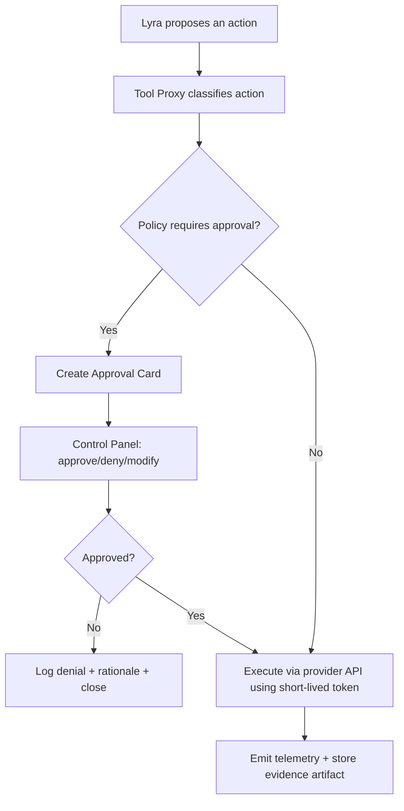
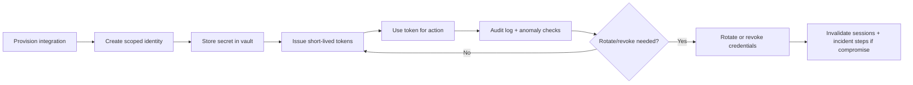
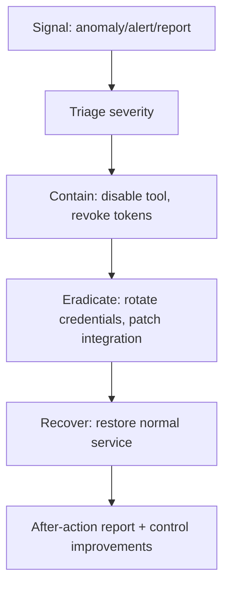

# Designing Safe Human-Like Tooling for Lyra in OpenClaw

## Executive summary

Granting an OpenClaw agent “human-like tools” (email, calendar, SMS/telephony, document storage, web accounts, payment or crypto wallets) is less a feature than a **risk transfer**: you are converting mistakes, prompt injection, compromised creds, and model failures into *real-world actions* with legal, financial, and reputational impact. The design goal is therefore **capability without custody**: Lyra can propose, draft, and execute within tightly scoped, observable, and reversible boundaries—while you retain decisive control over irreversible actions.

A safe architecture for a one-person firm scaling responsibly is built around five non-negotiables:

1. **Policy Enforcement Point (PEP) between Lyra and every human-like tool** (a “Tool Proxy / Tool Vault”). The agent never talks to Gmail/Graph/Stripe/Twilio directly; it calls internally controlled wrappers that enforce scopes, approvals, redaction, limits, and logging. This mirrors well-established governance-first cyber risk management thinking: governance defines risk appetite and oversight, then the system enforces the controls. citeturn0search0  
2. **Least privilege + ephemeral credentials**: use delegated OAuth/service accounts with minimal scopes, short-lived tokens, device binding, and explicit rotation/revocation workflows. OpenClaw’s own gateway protocol supports device identity/pairing, scoped operator access, and token rotation/revocation—use these patterns consistently for tool provisioning and incident response. citeturn5view0turn5view1  
3. **Human-in-the-loop gates for irreversible actions**: sending email/SMS, changing sharing permissions, purchasing, transferring funds, or accessing “Client Confidential” data should require explicit approval until maturity milestones are met. OpenClaw already provides an approvals mechanism for host command execution (exec approvals) and broadcasts approval events that operator clients can resolve—use this interaction model as the UX template for all high-risk tool actions. citeturn5view0turn5view2  
4. **Evidence and auditability as first-class outputs**: every tool grant, scope change, approval, and sensitive execution should create an immutable audit record and evidence artifact (who/what/why/rollback). NIST’s incident response guidance emphasizes integrating response into risk management and feeding continuous improvement back into governance and operations. citeturn0search1  
5. **Continuous cost and anomaly control**: “unbounded consumption” is a recognized GenAI risk; tool access creates similar “unbounded action” risks (message floods, unauthorized payments). Use spend caps, rate limits, and anomaly detection as default guardrails. OpenRouter’s guardrails and usage accounting (if you route model calls through it) directly support this; for external tools, implement equivalent caps in the Tool Proxy. citeturn1search1turn1search21turn0search3  

Recommended rollout stance (high-level): start with **Draft + Approve** for all outward-facing actions; then graduate specific capabilities to limited autonomy only after you have (a) stable policies, (b) telemetry and alerting, (c) incident playbooks, and (d) measured performance.

## Context and explicit assumptions

This report starts from your stated operating model: a Control Tower (Lyra) orchestrating specialist agents, plus a Control Panel layer above the OpenClaw Gateway dashboard that exposes registries, routing policy, evidence, audit trail, metrics, cost, incidents, and runbooks. (Assumed from your prompt and prior design outputs.)

Explicit assumptions (because onboarding/OS details are not fully available here):

- You operate primarily as a one-person firm; Peter is the final approver for Type 1 (“one-way door”) actions such as financial transfers, client-facing commits, credential changes, and tool provisioning. (Assumption based on typical OS design in your prior requests.)  
- Lyra runs within OpenClaw’s personal-assistant trust model (one trusted operator boundary per gateway), and you will avoid mixed-trust shared channels without segmentation. OpenClaw explicitly warns it is not a hostile multi-tenant security boundary and recommends splitting trust boundaries via separate gateways/hosts for mixed-trust use. citeturn5view1  
- Your primary remote control surface is the OpenClaw dashboard; OpenClaw explicitly labels it an admin surface (chat, config, exec approvals) and advises not to expose it publicly. citeturn5view3turn2search19  
- You will use multi-provider model routing via entity["company","OpenRouter","llm api routing platform"] for at least some traffic (given your existing funding and the desire to choose best model per task), and may also use direct provider APIs. OpenRouter supports provider selection policies, ZDR controls, guardrails, and usage accounting. citeturn1search5turn1search9turn1search1turn1search21  

## Threat model and compliance constraints

### Threat model for “human-like tools”

Tooling turns model outputs into real-world effects. Your threat model should explicitly cover at least these categories:

**Agentic manipulation and confused-deputy risks**  
OWASP identifies prompt injection as a core GenAI risk: untrusted inputs can manipulate model behavior and bypass intended constraints. When the agent has tools, prompt injection often becomes “prompt injection → tool misuse.” citeturn0search7turn5view1

**Unbounded consumption and economic harm**  
OWASP also identifies “unbounded consumption” as a class of vulnerability where uncontrolled inference leads to financial depletion, DoS, or service degradation; the same pattern applies to email/SMS floods, calendar spam, or repeated paid API calls. citeturn0search3turn1search1

**Credential theft and account takeover**  
Any long-lived token stored on disk, in environment variables, or in an agent-accessible file becomes a high-value target. OpenClaw’s gateway protocol supports per-device tokens that can be rotated and revoked; the risk posture improves materially if you treat all external-tool credentials similarly (short-lived, revocable, scoped). citeturn5view0turn5view2

**Authorization and overbroad scopes**  
OAuth scopes and service-account impersonation are common footguns. Google warns that if domain-wide delegation cannot be avoided, you must restrict scopes; scopes restrict **types** of user data accessible even if they don’t fully restrict impersonation breadth. citeturn1search19turn7search4turn1search11  
Microsoft distinguishes delegated permissions (acting as a signed-in user) vs application permissions (app acts without a user); the latter is typically higher risk and requires stronger governance. citeturn4search2turn4search6

**Data leakage and privacy policy drift**  
Using LLM providers and third-party tools can create cross-border processing and retention risk. entity["organization","European Commission","eu executive body"] guidance emphasizes storage limitation: retain personal data for the shortest necessary period and establish time limits to erase or review stored data. citeturn1search2turn1search14

**Supply-chain compromise in tool integrations**  
If you install “skills,” plugins, or tool integration packages, you inherit dependency and provenance risk. NIST’s SSDF provides a baseline for adding secure development practices across SDLCs; SBOM and SLSA provide mechanisms to understand what you run and how it was built. citeturn3search0turn3search1turn3search6

### Legal/compliance constraints to treat as design inputs

This is not legal advice; treat it as “design for compliance” guidance to take to counsel when needed.

**GDPR storage limitation and retention**  
Retention must be purpose-bound and time-limited. EU Commission guidance is explicit that organizations should set time limits to erase or review stored data and consider statutory obligations (e.g., tax/anti-fraud laws). citeturn1search2turn1search22

**International transfers and data residency**  
If personal data moves outside the EU/EEA, GDPR transfer rules apply. EU Commission guidance describes adequacy decisions and safeguards; the entity["organization","European Data Protection Board","eu data protection authority group"] SME guidance highlights Standard Contractual Clauses (SCCs) as a common safeguard under GDPR Article 46. citeturn1search14turn1search6

**Provider contractual and ToS limitations**  
For any “human-like tool,” assume the provider’s acceptable use and account-sharing terms matter (e.g., automation, impersonation, scraping/web automation). Your design should prefer API-first delegated access and explicit service accounts to reduce ToS ambiguity and improve auditability.

**LLM provider data controls**  
For model calls used in tool execution, you should enforce a “no training by default” and “minimum retention” posture where possible. entity["company","OpenAI","ai research and product company"] documentation states that, as of March 1, 2023, data sent to the OpenAI API is not used for training unless you opt in. citeturn4search0  
Anthropic’s Claude Code documentation provides explicit retention behaviors varying by account type/preferences; use these distinctions as a reminder to separate “consumer tool use” from “commercial/API tool use” and to set privacy controls intentionally. citeturn4search1turn4search12

## Reference architecture and control set

### Core architecture pattern: Tool Proxy + Token Vault + Approval UX

Design principle: **Lyra never holds raw tool credentials and never gets “direct write” access to high-impact systems**. Instead:

- Lyra calls internal tools (OpenClaw tools/skills) that hit a Tool Proxy.
- The Tool Proxy:
  - retrieves short-lived credentials from a Token Vault,
  - checks policy (data class, action type, rate limits, budgets),
  - requires approvals for gated actions,
  - redacts sensitive content where needed,
  - emits structured telemetry and evidence artifacts.

OpenClaw already supplies foundational primitives you can align to:

- Gateway protocol: operator scopes, device identity and pairing, per-device tokens, token rotation and revocation, and an approvals workflow for exec approvals. citeturn5view0turn5view2  
- Security guidance: one trusted operator boundary per gateway and explicit warning against treating OpenClaw as hostile multi-tenant. citeturn5view1  
- Tool catalog provenance: operators can fetch tool catalogs with provenance metadata, allowing governance to distinguish core tools from plugin tools. citeturn5view0  

### Approval-gated action workflow

This mirrors OpenClaw’s broadcast-and-resolve approvals pattern for exec approvals, but generalizes it to any external tool action. citeturn5view0turn5view2

### Credential lifecycle workflow

Align token and device management to OpenClaw’s device-token rotation/revocation and pairing model wherever possible. citeturn5view0turn5view2

### Incident response workflow for tool compromise

NIST SP 800-61r3 emphasizes integrating incident response into cybersecurity risk management and continuous improvement. citeturn0search1turn0search5

### Observability and monitoring controls

Implement telemetry using OpenTelemetry patterns so you can swap backends without rewriting the system. The OpenTelemetry Collector supports pipelines with receivers, processors, and exporters—use processors to redact or drop sensitive fields before export. citeturn3search3turn3search11

Minimum monitoring signals (per tool class):
- action volume/rate, failure rate, latency
- approval latency and denial rate
- anomaly detection (recipient domain spikes, unusual send hours, new payee, permission escalations)
- cost per tool and per agent, plus budget threshold breaches

For model-side costs specifically, OpenRouter usage accounting returns token counts, cost, and caching status in responses, and guardrails enforce spending and privacy policies. citeturn1search21turn1search1turn1search9

Cost governance should follow FinOps principles: make cost data accessible, timely, accurate, and treat cost as a first-class metric in decisions. citeturn6search1turn6search2

### Secure SDLC controls for tool integrations

Treat every tool integration as production code:

- Apply SSDF practices as a baseline for secure development activities and ongoing maintenance. citeturn3search12turn3search0  
- Generate SBOMs for integrations and maintain them as living artifacts. CISA defines SBOM as a nested inventory (“ingredients”) of software components. citeturn3search1turn3search5  
- Use SLSA levels as a maturity ladder for build provenance and integrity. citeturn3search2turn3search6  

## Capability-by-capability design and integration options

### Integration option matrix

This table frames your core architectural choice for each capability.

| Integration option | Best for | Security posture | UX and reliability | Typical stance |
|---|---|---|---|---|
| API-first delegated access (OAuth, scopes) | email, calendar, docs, messaging | strongest: least privilege, revocable, auditable | high reliability | default choice |
| Service accounts / app permissions | back-office automation, shared mailboxes, system-to-system | high power = high governance needed | reliable; risk if overbroad | use sparingly |
| Web automation (headless browser/RPA) | sites with no APIs | weak: fragile, ToS risk, hard to audit | brittle and changes often | last resort |
| Proxy/broker (Tool Proxy) | all high-risk tools | strongest: central policy + redaction + logging | best overall UX if well-designed | recommended default |

Use OAuth security best practices: avoid deprecated flows, protect auth codes/tokens, and follow modern OAuth guidance (RFC 9700). citeturn4search7turn4search13

### Capability design patterns and control requirements

The following table gives a practical blueprint per capability. It is intentionally conservative for a one-person firm.

| Capability | Objectives | Recommended integration | Default approvals | Key controls | KPIs | Main risks | Mitigations |
|---|---|---|---|---|---|---|---|
| Email | draft + queue; controlled send; traceability | OAuth delegated API via Tool Proxy | send requires approval initially | scopes minimal; recipient allowlists; content redaction; undo/recall where supported | approval latency; send error rate; “oops” rate | phishing, mis-send, data leak | safe mode; new-recipient confirmation; DLP-style checks |
| Calendar | reduce scheduling friction; avoid conflicts | OAuth delegated API | create/modify events under thresholds; invites require approval early | scope-limited; attendee-domain allowlist; conflict checks | event change rate; conflict rate | spam invites; wrong time zones | “preview invite” step; explicit time zone policy |
| Doc storage | store docs safely; share intentionally | API-first scopes + folder-level access | share permission changes require approval | least privilege folder ACLs; classification tags; retention rules | permission changes; access review cadence | accidental overshare | sharing policy engine; default private; share-by-link blocked |
| SMS/telephony | transactional comms; verification | API provider via Tool Proxy | sends require approval early; rate-limited auto allowed later | rate limits; TO/region allowlists; template library | send rate; delivery failure; blocks | cost blowups; harassment; fraud | provider limits + internal quotas + anomaly alerts |
| Web accounts (logins) | limited actions on web-only systems | avoid if possible; prefer APIs | almost always approval | dedicated browser profile; no password access; session isolation | web action success; change frequency | ToS violations; account takeover | restrict tasks; migrate to APIs; separate trust boundaries |
| Payments (fiat) | pay invoices; subscriptions | restricted keys or payment request drafts | transfers always approval + 2-person rule later | amount caps; payee allowlist; segregation of duties | rejected payments; anomaly flags | fraud, chargebacks | restricted keys; manual confirmations; insurance as needed |
| Crypto wallets | edge cases only | avoid custody; external safeguarded processes | always approval | no private key exposure; multi-step human confirmation | zero incidents | irreversible loss, theft | keep out of agent until stage 4; external custody controls |

Representative primary-source anchors for key tool classes:
- Google service-account OAuth and delegation patterns, and domain-wide delegation controls. citeturn1search11turn1search7turn7search4  
- Google Drive scopes guidance (choose least privilege scopes). citeturn7search1turn7search11  
- Microsoft Graph delegated vs application permissions overview. citeturn4search2turn4search6  
- Twilio API best practices (encryption, access control, rate limits, monitoring). citeturn7search0turn7search6  
- Stripe restricted API keys and key best practices (least privilege for financial actions). citeturn7search10turn7search18turn7search14  

### Usability and UX constraints that prevent “unsafe convenience”

A Control Panel that manages human-like tools must make safe behavior the path of least resistance. The key UX primitives:

- **Approval Cards**: show action, recipient/payee, data class, risk rating, cost estimate, and “undo path” (where possible).  
- **Explainability by construction**: require the agent to supply “why this action is necessary,” “what data is included,” and “what could go wrong.”  
- **Safe mode**: one-click freeze that blocks outward sends and payment actions while still allowing drafting, analysis, and read-only operations.  
- **Diff-based approvals**: for permissions and routing policy changes, show diffs and require an ADR for Type 1 changes.

OpenClaw’s own dashboard is an admin surface; do not treat it as a general sharing UI. Keep the Control Panel similarly protected with strict access controls and avoid public exposure. citeturn5view3turn2search19  

## Maturity model, rollout roadmap, and cost signals

### Maturity stages for tool access

This model maps capabilities to staged controls. Effort is relative for a one-person build and assumes you leverage OpenClaw’s approvals/events, OpenRouter guardrails for model spend, and API-first integrations.

| Stage | Capability posture | Controls required | Effort | Cost signals |
|---|---|---|---|---|
| Stage 0 | No tool access; agent drafts only | classification + retention policy; logging baseline | Low | minimal variable cost |
| Stage 1 | Read-only + draft + approval for all sends | approval cards; audit trail; basic redaction | Low–Med | low; predictable |
| Stage 2 | Limited autonomy for low-risk actions | scoped OAuth; allowlists; rate limits; anomaly alerts | Med | moderate; needs budgets |
| Stage 3 | Conditional autonomy + experiment loop | SLOs; OpenTelemetry pipelines; champion/challenger for models/policies | Med–High | requires timely cost telemetry (FinOps) |
| Stage 4 | High assurance & broad automation | provenance (SLSA), SBOM enforcement, continuous audits, external reviews | High | cost optimized by automation; higher governance cost |

Unbounded consumption is explicitly recognized as a GenAI risk; maturity stages should include “spend caps + anomaly response” early and consistently. citeturn0search3turn1search1turn6search2  

### Recommended rollout plan for a one-person firm

**Quick wins (next 7–14 days)**  
- Implement the **Tool Proxy skeleton** with a uniform interface and a default “approval required” mode for all write actions.  
- Stand up **Approval Cards** in the Control Panel, patterned after OpenClaw’s approval mechanism (requested → resolved), so “send” is never a hidden side effect. citeturn5view0turn5view2  
- Implement **credential inventory + rotation checklist**. Use OpenClaw’s device token rotation/revocation as the conceptual standard for all tool tokens. citeturn5view0turn5view2  
- Implement spend caps and model access restrictions where applicable (OpenRouter guardrails) and add basic cost dashboards (usage accounting). citeturn1search1turn1search21  

**Stabilization (weeks 3–6)**  
- Add API-first integrations for email/calendar/docs with minimal scopes and explicit allowlists; restrict domain-wide delegation and scope breadth per Google guidance. citeturn7search4turn1search19turn7search11  
- Add SMS provider integration with hard rate limits and monitoring (Twilio best practices). citeturn7search0turn7search6  
- Add OpenTelemetry instrumentation and a Collector pipeline with redaction processors. citeturn3search3turn3search11  
- Write incident playbooks: tool credential leak, mis-send, payment anomaly, web account compromise, and “prompt injection → tool misuse.” citeturn0search1turn0search7  

**Maturation (months 2–4)**  
- Introduce conditional autonomy for narrow actions (e.g., calendar event creation to known attendees, internal doc filing) using policy-driven gates and anomaly detectors.  
- Introduce champion/challenger testing for model routing and policy changes (your Control Panel can implement policy simulation and staged rollout). Use OpenRouter routing controls (provider selection, ZDR) to enforce privacy posture. citeturn1search5turn1search9turn1search21  
- Add SSDF-based secure SDLC checks and SBOM generation for tool integrations; use SLSA to mature provenance. citeturn3search12turn3search1turn3search6  

**High assurance (months 4+)**  
- Consider limited payment autonomy only for constrained scenarios (subscription renewals under caps, pre-approved vendors) using restricted keys, multi-step approvals, and strong anomaly detection. Stripe restricted API keys enable permissioned access; privilege should be minimal and auditable. citeturn7search10turn7search18  
- Keep crypto wallet custody out of the agent unless you reach Stage 4 and have dedicated governance, external review, and non-repudiation controls.

## Governance, policy, RACI, and templates

### Governance principles for provisioning and use

Treat tool provisioning as a Type 1 decision class by default: it expands the agent’s real-world impact surface and creates durable exposure. This aligns with NIST CSF governance emphasis on establishing, communicating, and monitoring risk management expectations and policy. citeturn0search0turn5view1

Adopt “capability contracts” as the governing mechanism:
- A tool capability is not “enabled”; it is **provisioned** with a contract: scope, data class ceiling, approval threshold, logging/evidence requirements, and incident playbook link.

### Proposed RACI for tool provisioning and tool use

Roles (scalable from solo):
- Peter: accountable risk owner and final approver for Type 1 actions.
- Lyra (Control Tower): responsible for drafting requests, preparing approval cards, and operating within policy.
- Security & Audit agent: consulted for any escalation of privileges, new tool categories, or privacy-sensitive integrations.
- Ops/Control agent: responsible for evidence freshness (audits, logs, restore tests) and monitoring hygiene.

RACI:

| Process | Peter | Lyra | Security & Audit | Ops/Control |
|---|---|---|---|---|
| New tool onboarding (email/SMS/docs/payments) | A | R | C | C |
| Scope changes / permission escalation | A | R | C | I |
| Routine tool use (draft + propose) | I | R | C | I |
| Outbound sends / irreversible actions (Stage 1–2) | A | R | C | I |
| Incident response activation | A | R | R | R |
| Credential rotation / revocation | A | R | R | R |
| Evidence pack maintenance | A | I | C | R |

### Templates/checklists (paste-ready)

**Tool Provisioning Request**
- Capability: email / calendar / docs / SMS / payments / web automation  
- Intended use cases (3 max)  
- Data class ceiling: Internal / Confidential / Client Confidential  
- OAuth scopes / permissions requested (minimal)  
- Approval threshold (always / above value / above risk)  
- Rate limits and budgets  
- Logging and evidence plan  
- Incident playbook link  
- Rollback plan (how to disable, revoke tokens, notify stakeholders)  

**Approval Card**
- Action summary (what will happen)  
- Target (recipient / attendee / folder / payee)  
- Data included (classification + redaction status)  
- Cost estimate (if applicable)  
- Risk flags (new recipient, new payee, external domain, large amount)  
- Undo path (recall/cancel/compensating action)  
- Approve / deny / edit and resubmit  

**Credential Rotation Record**
- Tool/capability  
- Credential type (OAuth client secret, restricted key, device token analogue)  
- Rotation date and next rotation due  
- Revocation test performed (yes/no)  
- Evidence artifact links  

### Key risks and mitigations summary

- **Prompt injection → tool misuse**: enforce tool proxy + approval thresholds + content origin labeling. citeturn0search7turn5view1  
- **Credential leak**: vault + short-lived tokens + rotation + revocation. Use OpenClaw’s device token management as a model. citeturn5view0turn5view2  
- **Data leakage and retention drift**: classification + redaction + retention review; align with EU retention guidance. citeturn1search2turn1search22  
- **Unbounded cost or message storms**: budgets, rate limits, guardrails, and anomaly alerts. citeturn0search3turn1search1turn7search0  
- **Supply-chain compromise**: SSDF + SBOM + SLSA and signed releases for integrations. citeturn3search12turn3search1turn3search2  

