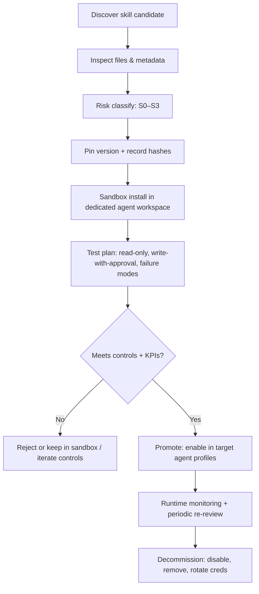
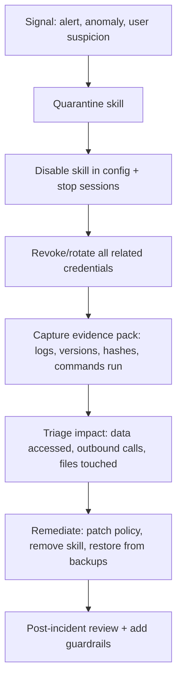

# Evaluation of the Top ClawHub Skills for OpenClaw

## Executive summary

The ClawHub skill ecosystem is simultaneously a force multiplier and a supply‑chain risk amplifier. ClawHub is intentionally “open by default,” with public browsing, versioning, and minimal install telemetry, but it is also a public registry where anyone can publish, and recent reporting shows real-world malicious and “leaky” skills in the wider ecosystem. citeturn2view0turn20search16turn20news31turn8search4turn9search3

For a one‑person firm scaling safely, the best strategy is **capability segregation** (per‑agent skill packs), **a default sandbox posture**, and **a hard skills governance gate** (inspect → pin → test → approve → monitor → retire). OpenClaw’s own documentation is explicit: treat third‑party skills as untrusted code, be cautious with secrets injection, and use sandboxing to reduce blast radius. citeturn1view2turn20search0turn20search3turn20search10

Using the “Most Installed” ranking (current as of Feb 25, 2026) from a public mirror that continuously syncs data from ClawHub, the top 15 skills are:

- gog, summarize, sonoscli, github, weather, notion, mcporter, self‑improving‑agent, nano‑pdf, model‑usage, nano‑banana‑pro, openai‑whisper, obsidian, gemini, skill‑creator citeturn10view0

My recommended adoption path, specifically for “scale safely”:

- **Enable first (with controls):** model‑usage, summarize, github, openai‑whisper, weather  
- **Evaluate in sandbox (then selectively promote):** gog, notion, obsidian, nano‑pdf, self‑improving‑agent  
- **Avoid or restrict to a dedicated “R&D / Build” sandbox:** mcporter, gemini, nano‑banana‑pro, sonoscli, skill‑creator  

The rationale is driven by (a) credential and write-surface exposure, (b) “excessive agency” pathways (e.g., meta-tools that can call other tools), (c) likelihood of prompt-injection-driven misuse (OWASP LLM01), and (d) unbounded consumption/cost pathways (OWASP LLM10). citeturn29search0turn29search1turn20search0turn1view2

## Context, assumptions, and method

This report is designed to plug into your OpenClaw multi‑agent operating model (Lyra + specialist agents) and your Control Panel design (agent registry, policy editor, evidence registry, audit trail, metrics/cost dashboard). Because I do not have direct file retrieval access to your internal documents in this environment, I treat the following as **explicit assumptions** rather than facts:

- You are running a **multi‑agent setup** where you can isolate skills per agent by workspace and prefer not to share high‑risk skills globally. (OpenClaw supports per‑agent vs shared skill locations and precedence.) citeturn1view2  
- You want a governance-first workflow where **installing/enabling skills is an auditable change**, aligned with your “transparent, modular, continuously improving” Control Panel approach. (ClawHub and OpenClaw both support versioning, per-skill enable/disable, and inspection workflows.) citeturn2view0turn20search13turn5view2  
- You are cost‑aware and want consistent controls for model usage (ideally central routing and budget guardrails). (OpenRouter supports guardrails, ZDR enforcement, provider selection, and usage accounting.) citeturn31search0turn31search2turn31search1turn31search3  

Method:

- Identify the **top 15 skills** from the “Most Installed” list (mirror view) and capture per-skill metadata + SKILL.md contents. citeturn10view0turn11view0turn11view1turn11view2turn14view0turn14view1turn15view0turn16view0turn18view0turn18view1turn17view0turn19view0turn19view1turn19view2turn19view3  
- Cross-reference OpenClaw and ClawHub official documentation for **skill loading, secrets injection, sandboxing, config gating, and inspection lifecycle**. citeturn1view2turn20search0turn20search3turn20search13turn2view0turn5view2turn5view1  
- Anchor the risk model in **OWASP GenAI Security** (prompt injection, unbounded consumption) and in documented ecosystem incidents. citeturn29search0turn29search1turn20search16turn20news31turn8search4turn9search3  
- When a skill touches a third-party API, prefer primary vendor docs (e.g., GitHub CLI auth scopes; Notion auth/versioning/request limits; Google OAuth scopes). citeturn21search0turn21search17turn24view0turn21search1turn21search2turn21search5  

## Baseline governance and risk controls for skills

OpenClaw skills are **instructions + optional scripts/resources** that teach the agent how to use tools. They can be loaded from bundled, managed, or workspace locations, with workspace taking precedence—use this as your first line of segregation (e.g., only the “Build agent” workspace sees high-risk skills). citeturn1view2

### Why rigorous controls are non-negotiable

- **Prompt injection is the #1 LLM risk** in OWASP’s 2025 LLM Top 10: untrusted content can alter behavior in unintended ways. A skill that can run commands or send API requests turns prompt injection into real-world actions. citeturn29search0  
- **Unbounded consumption** (OWASP LLM10) maps cleanly onto “agent + skills”: uncontrolled tool calls can burn money (model calls, third-party APIs), create spam bursts (email/SMS), or saturate rate limits. citeturn29search1  
- The ecosystem has already seen **malicious skill campaigns** and risky skill patterns (e.g., instructions that lead users to run obfuscated shell commands, or skills that leak secrets/PII through the model context window). citeturn20news31turn20search16turn8search4turn9search3  

### OpenClaw-native controls you should standardize in your OS

- **Sandboxing via Docker**: OpenClaw can run tools inside containers to reduce blast radius. It’s “not a perfect security boundary,” but it materially limits filesystem/process access when the model does something dumb. citeturn20search0  
- **Secrets injection discipline**: OpenClaw notes that skill config can inject secrets into the host process for an agent turn; keep secrets out of prompts and logs. Also, sandboxed sessions do **not** inherit host `process.env`—you must explicitly provide env to the sandbox or bake it into the image. citeturn1view2turn20search3  
- **Skill gating and allow/deny**: use config to disable specific skills, allowlist bundled skills, and keep high-risk skills out of default agent profiles. citeturn20search13turn20search3  
- **Inspect before install/enable**: the ClawHub CLI supports inspecting metadata/files without installing, and fetching raw file content (with limits). That should be a required step in your governance workflow. citeturn5view2  

### Control Panel “skill posture” recommendations

Implement a Control Panel surface that treats skills as governed assets:

- **Skill registry view**: installed skills + pinned versions + owner + integrity hash + last reviewed timestamp.
- **Policy enforcement config**: per-agent allowlist; “host vs sandbox” execution; explicit outbound network allowlists; and approval thresholds for dangerous exec/tool patterns.
- **Evidence pack per skill**: inspection notes, diff vs previous version, test logs, secrets model, and monitoring hooks.

ClawHub’s own spec supports version history, tags (including `latest`), and badges like “official”/“deprecated” in the underlying model—use these concepts in your Control Panel even if you don’t rely on them blindly. citeturn5view1

## Top 15 skills evaluation

### Summary comparison table

Risk/Benefit is a **practical adoption score** for a one-person firm:

- **Benefit**: leverage for your operating system (research, dev ops, knowledge, cost, comms).
- **Risk**: credential exposure, write-surface, meta-tool reach, and likelihood of injection-driven misuse.

| Skill | What it primarily does | Integration pattern | Credentials/scopes | Data egress | Risk/Benefit | Suggested stance |
|---|---|---|---|---|---|---|
| gog | Google Workspace automation (mail/calendar/drive/etc.) | CLI + OAuth | Google OAuth scopes across multiple services | High | High/High | Sandbox eval → later promote |
| summarize | Summarize URLs/files/YouTube with multiple model providers | CLI + model APIs | API keys for chosen provider; optional Firecrawl/Apify | High | High/Med | Enable with guardrails |
| sonoscli | Control Sonos on LAN; optional Spotify search | CLI + LAN discovery | Optional Spotify client id/secret | Low–Med | Low/Low | Restrict/avoid |
| github | Manage repos/issues/PRs/CI via `gh` CLI | CLI + GitHub API | GitHub token/OAuth; scopes vary | Med | High/Med | Enable with least privilege + approvals |
| weather | Weather via wttr.in + Open‑Meteo | curl/HTTP | None | Low | Low/Low | Enable |
| notion | Read/write Notion pages/databases | HTTP API via curl | Notion integration token + Notion-Version | Med | High/Med | Sandbox eval → promote if core |
| mcporter | Call MCP servers/tools over HTTP or stdio | MCP meta‑CLI | Depends on MCP servers; OAuth possible | High | Med/High | Restrict (dedicated sandbox only) |
| self‑improving‑agent | Logs learnings/errors; promotes to memory/workspace files | Files + scripts + hooks | None (but writes sensitive content) | Low | Med/Med | Sandbox eval (redaction policy) |
| nano‑pdf | Natural language PDF edits at page level | CLI | Unclear from skill text; likely local | Low–Med | Med/Med | Sandbox eval |
| model‑usage | Summarize per-model cost from local CodexBar logs | Local script | None | Low | High/Low | Enable |
| nano‑banana‑pro | Generate/edit images using Gemini image API | Python script + API | Gemini API key | High | Low/Med | Restrict |
| openai‑whisper | Local speech-to-text via Whisper CLI | Local CLI | None | Low | High/Low | Enable |
| obsidian | Automate Obsidian vault operations | CLI + local files | None | Low | Med/Low | Sandbox eval (workspace scoping) |
| gemini | Gemini CLI one-shot prompts + extensions | CLI + Google auth | Likely Google auth or API key; extensions add risk | High | Med/High | Restrict |
| skill‑creator | Tooling + guidance for creating skills | Scripts + docs | None | Low–Med | Med/Med | Restrict to R&D |

Sources: ranking and per-skill summaries from the ClawHub-synced mirror; see individual skill dossiers for details. citeturn10view0turn11view0turn11view1turn14view0turn11view2turn14view1turn15view1turn15view0turn16view0turn18view0turn18view1turn17view0turn19view0turn19view1turn19view2turn19view3

### Skill dossiers with integration, risks, and controls

Below, each skill includes: what it is, use cases, permissions, data flows, risks (security/privacy/legal/ops), recommended controls (policy + PEP config + approvals), monitoring signals, KPIs, and skill‑specific onboarding evidence.

#### gog

**Description and primary use cases:** “gog” is a Google Workspace CLI wrapper skill (mail, calendar events, drive search, contacts, sheets, docs export) intended for automation workflows. It explicitly includes guidance to confirm before “send mail” or “create events.” citeturn11view0  
Because gog maps directly to Google services, it is a foundational “human-like tool” enabler (inbox/calendar/file operations).

**Integration pattern:** Local CLI execution (via OpenClaw exec tool) with OAuth credential bootstrapping and account profiles. citeturn11view0turn20search10  

**Required permissions/scopes:** The skill itself indicates multi‑service authorization; in practice, the upstream gogcli supports Gmail/Calendar/Drive/Sheets/Docs/Contacts/Tasks/People and can request different OAuth scopes (including “readonly” modes and reduced Drive scopes). citeturn11view0turn27view1turn21search2turn21search5  
In Google Workspace admin contexts, domain-wide delegation is powerful and must be tightly scoped; Google’s guidance stresses restricting scopes if delegation cannot be avoided. citeturn26search9  

**Data flows:** Prompts and extracted email/calendar/doc contents can flow from local machine → Google APIs → local outputs (JSON/text). Any content the agent uses for reasoning may also become part of the model context depending on your agent workflow.

**Key security/privacy risks:**  
- Prompt injection risk is high because gog enables “real actions” (sending mail, scheduling). citeturn29search0turn11view0  
- Credential theft risk: OAuth credentials and refresh tokens are high-value. Upstream gogcli emphasizes OS keyring support and configurable credential storage; you should validate your actual storage posture. citeturn27view1  
- “Sensitive scopes” risk: Google scopes may require additional review and can be considered high-risk in enterprise environments. citeturn21search2turn21search8  

**Legal/ToS concerns:** Google API access is governed by Google’s API terms and sensitive-scope policies; ensure your use aligns with client data handling expectations and (if applicable) EU GDPR constraints for client data in inbox/documents.

**Operational risks:** rate limits, quota exhaustion; accidental outbound email bursts; calendar spam.

**Recommended controls (practical):**  
- Default run in **sandbox**, and only allow gog in a dedicated “Comms/Workspace” agent. citeturn20search0turn1view2  
- Implement “approval gates” for: send mail, create/update events, change sharing/permissions, mass operations. (OpenClaw exec + approvals pattern is your enforcement primitive.) citeturn20search10turn20search9  
- Enforce least privilege: configure reduced scopes / readonly wherever possible; prefer per-service scoping; avoid domain-wide delegation unless you truly need it. citeturn27view1turn26search9turn21search2  
- Add recipient/domain allowlists and rate limits in your Tool Proxy policy layer.

**Monitoring/telemetry signals:** number of sends, new recipients, external domains, event creations, API error codes, quota warnings, approval latency, and “attempted but denied” actions.

**KPIs:** “emails drafted per approval,” mis-send rate, approval response time, calendar conflict rate, and “blocked risky action” count.

**Onboarding evidence (skill-specific):** record requested OAuth scopes; store credential location audit; a dry-run test log for read-only queries; a policy test showing “send” is blocked without approval.

#### summarize

**Description and primary use cases:** summarization of URLs, files (PDF/images/audio), and YouTube, with configurable model selection and optional extraction fallbacks (Firecrawl, Apify). It enumerates required provider API keys and supports JSON output. citeturn11view1  

**Integration pattern:** CLI tool that (a) extracts content, then (b) calls model APIs; optional third-party extraction services.

**Required permissions/scopes:** API keys via environment variables for supported providers (and optional Firecrawl/APIFY keys). citeturn11view1turn20search18  

**Data flows:** input URL/file → extraction (local or third-party) → model provider → summary output. This is high “content egress,” so it must be treated as a privacy-critical tool. citeturn11view1turn31search3turn31search9  

**Key security/privacy risks:**  
- Prompt injection through untrusted web pages is the canonical risk: hostile content can instruct the model to do unintended things, or to leak secrets if your system prompt/tool access allows it. citeturn29search0  
- Sensitive information disclosure: summarizing internal PDFs or client docs could exfiltrate confidential content to providers. citeturn11view1turn29search2  
- “Unbounded consumption” risk if used without caps (long PDFs, repeated retries, high-output summaries). citeturn29search1turn11view1  

**Legal/ToS concerns:** scraping and content reuse constraints may apply for certain websites; ensure extractor tooling complies with site terms and your client confidentiality constraints.

**Operational risks:** cost variability by model; blocked sites; extractor flakiness.

**Recommended controls:**  
- Run summarize in a **Research agent** sandbox by default; block access to secrets and local sensitive directories from that agent. citeturn20search0turn1view2  
- Prefer central routing controls where possible: OpenRouter guardrails can enforce spend limits and privacy routing (ZDR, deny provider data collection) for model calls you can route through it. citeturn31search0turn31search2turn31search3  
- Add “data classification prompts”: require the agent to label what it is summarizing (Public vs Confidential) and deny high-classification items unless explicitly approved.

**Monitoring signals:** per-run token/cost estimates, doc size, timeouts, retries, blocked domains, and provider failures.

**KPIs:** cost per brief; summary acceptance rate; turnaround time; number of summaries per research deliverable.

**Onboarding evidence:** verify where API keys are stored (vault vs env); confirm sandbox does not inherit host env secrets unless explicitly intended. citeturn20search3turn1view2  

#### sonoscli

**Description and use cases:** local network control of Sonos speakers, with optional Spotify search requiring Spotify credentials. citeturn14view0  

**Integration pattern:** CLI + LAN discovery (SSDP) + optional Spotify integration.

**Credentials/scopes:** none by default; optional Spotify client id/secret. citeturn14view0  

**Data flows:** mostly LAN traffic; optional outbound to Spotify APIs.

**Risks:** low business benefit for OpenClaw OS work; modest risk of credential mishandling if Spotify enabled; low compliance relevance.

**Controls:** keep out of main operational agents; if used, run in a low-privilege “personal/home” agent, sandboxed, with no shared credentials.

**Monitoring/KPIs:** speaker control actions; failure rate (SSDP issues); “new env var introduced” audit events.

**Onboarding evidence:** confirm it cannot access work files; confirm Spotify keys are not injected into prompts/logs. citeturn1view2  

#### github

**Description and use cases:** uses the GitHub `gh` CLI for issues, PRs, CI runs, and API queries. citeturn11view2  
This is high leverage for change management, release operations, and maintaining agent OS repos.

**Integration pattern:** CLI + GitHub API calls.

**Required permissions/scopes:** GitHub CLI documents default/minimum scopes for token-based auth (`repo`, `read:org`, `gist`), and supports adding/removing scopes; `gh` also respects environment tokens. citeturn21search0turn21search6turn21search12  

**Data flows:** repo metadata, issues, diffs, and (optionally) code content can flow to local logs and into model context depending on how you use it.

**Risks:**  
- Destructive actions: closing issues, merging PRs, pushing changes.  
- Token exposure if stored insecurely (dangerous flags like “insecure storage” exist in the CLI ecosystem). citeturn21search6turn21search0  

**Controls:**  
- Treat GitHub changes as “one-way doors”: require approval for merges, releases, branch deletions, and permission changes.  
- Use least privilege tokens; prefer fine-grained tokens where feasible; keep separate tokens per agent (Build vs Ops). citeturn21search0turn21search12  
- Run in sandbox for untrusted-input operations (e.g., “analyze this issue body and execute”). citeturn20search0  

**Monitoring signals:** high-risk command detection (merge/release), auth status, API failures, rate-limit responses.

**KPIs:** PR cycle time; CI failure resolution time; number of “agent-proposed changes accepted”; rollback frequency.

**Onboarding evidence:** token scope record; red-team test: issue body contains prompt injection, confirm tool policy blocks unsafe actions. citeturn29search0  

#### weather

**Description and use cases:** uses two free sources (wttr.in and Open‑Meteo) with curl commands; no API key required. citeturn14view1  

**Integration pattern:** HTTP GET calls.

**Permissions/scopes:** none.

**Data flows:** location strings (and possibly IP metadata) to public services.

**Risks:** privacy is minor but non-zero (location queries); operational risk minimal.

**Controls:** allow as low-risk utility; still monitor outbound calls volume (unbounded loops).

**Monitoring/KPIs:** request count, failure rates, latency; “weather fetch time to answer” usefulness.

**Onboarding evidence:** ensure no sensitive context is appended to weather queries.

#### notion

**Description and use cases:** direct Notion API usage via curl for pages, blocks, and databases/data sources; stores an API token in a local file; uses a required Notion-Version header and references rate limits. citeturn15view1  

**Integration pattern:** HTTP API calls; can be wrapped behind a Tool Proxy if you build one.

**Permissions/scopes:** Notion uses bearer tokens for authentication; API versioning requires the Notion-Version header; request limits are an average of 3 requests/second per integration and include payload size limits. citeturn21search1turn21search17turn24view0  

**Data flows:** your content to Notion servers; responses back to agent; anything the agent reads can flow into model context if you include it.

**Security/privacy risks:**  
- The skill’s suggested token storage (`~/.config/notion/api_key`) is plaintext unless you add OS protections—high risk for credential theft. citeturn15view1  
- Prompt injection can weaponize “write” access to modify knowledge bases (silent corruption). citeturn29search0  

**Legal/ToS concerns:** Notion data may include client data; ensure retention, export, and access rights align with GDPR obligations and client contracts.

**Operational risks:** rate limit 429s; payload size limits; partial writes.

**Controls:**  
- Replace plaintext token storage with a vault/keyring; inject tokens ephemerally. (Enforce “no secrets in prompt.”) citeturn1view2turn24view0  
- Require approval for schema changes, bulk updates, deletions.  
- Add idempotency and “diff mode” for updates: agent must propose a patch before applying.

**Monitoring signals:** 429s, Retry-After handling, request sizes, write operations count.

**KPIs:** “knowledge capture latency,” “parseable note quality,” rollback rate for incorrect updates, and 429 incidence.

**Onboarding evidence:** token provenance and storage proof; rate-limit backoff test; sample read-only and write-with-approval test logs.

#### mcporter

**Description and use cases:** mcporter is a CLI for listing/configuring/authing and calling MCP servers/tools, including calling arbitrary HTTP endpoints or launching stdio servers (e.g., `bun run ./server.ts`). citeturn15view0  

**Integration pattern:** MCP meta-tool; client to MCP servers over stdio or Streamable HTTP. MCP’s spec defines these transports and provides security guidance. citeturn22search2turn22search0turn22search9  

**Permissions/scopes:** depends entirely on which MCP servers you connect; could include OAuth tokens, API keys, and local process execution permissions.

**Data flows:** potentially everything: prompts, tool outputs, and any resource contexts from MCP servers.

**Risks (why it’s special):** this is a “tool that installs tools” in effect; it increases your attack surface multiplicatively. It’s also an obvious target for prompt injection: untrusted content can talk you into calling high-privilege MCP tools. citeturn29search0turn22search9  

**Controls:**  
- Restrict to a dedicated “Integration Engineering” agent in a sandbox with strict outbound allowlists. citeturn20search0  
- Require approvals for: adding MCP servers, auth flows, stdio execution, and any tool call that touches credentials/finance/comms.  
- Maintain a curated MCP allowlist and pin server versions; store server configs as code with review (ADR-style).

**Monitoring:** server add/remove events, auth events, stdio launches, outbound URLs, tool call volume.

**KPIs:** failed tool calls per server, mean time to detect misconfig, number of MCP servers in prod (keep low).

**Onboarding evidence:** MCP server threat assessment, auth method documented, sandbox policy tests, and an incident drill (revoke tokens, remove server).

#### self-improving-agent

**Description and use cases:** logs learnings, errors, and feature requests into `.learnings/` files; promotes validated learnings into persistent agent memory files (e.g., AGENTS.md, TOOLS.md, SOUL.md); includes scripts and OpenClaw hooks support. citeturn16view0turn20search17  

**Integration pattern:** local filesystem + optional hooks automation; interacts deeply with “agent OS memory.”

**Permissions/scopes:** none external, but it writes high-sensitivity meta-data about your workflows and mistakes.

**Data flows:** conversation → `.learnings` and memory files; could later be read into agent prompts (which matters for confidentiality).

**Risks:**  
- Sensitive info disclosure: errors and learnings often include tokens, stack traces, file paths, client data.  
- “System prompt poisoning”: if you promote bad learnings, you can permanently degrade agent behavior.

**Controls:**  
- Build a redaction policy: never log secrets, client identifiers, or credentials; provide a “redact before log” step enforced by tooling. citeturn29search2turn16view0  
- Treat “promotion to SOUL/AGENTS/TOOLS” as an approval gate.  
- Keep the `.learnings/` directory access restricted and backed up with retention limits.

**Monitoring/KPIs:** entries created per week; promotion rate; “repeat error” rate; time-to-resolution for ERR items.

**Onboarding evidence:** sample log entries vetted; test that `.learnings` files are excluded from sharing; confirm backups + retention.

#### nano-pdf

**Description and use cases:** applies natural-language edits to a specific PDF page via `nano-pdf edit`. It warns about off-by-one page numbering and urges sanity checks. citeturn18view0  

**Integration pattern:** CLI (likely local execution; the skill does not mention external APIs explicitly).

**Permissions/scopes:** none stated; depends on the CLI implementation (unknown from SKILL.md).

**Data flows:** PDF content processed locally unless the CLI calls external services (verify in inspection).

**Risks:** silent document corruption; accidental leakage if external calls exist; reputational risk if you ship incorrect PDFs.

**Controls:**  
- Sandbox test and enforce a “no external egress” policy while evaluating; block network in container where possible. citeturn20search0  
- Require human review of resulting PDF, and store “before/after” diffs for evidence.

**Monitoring/KPIs:** success rate, edit retries, post-edit verification failures.

**Onboarding evidence:** confirm whether `nano-pdf` makes outbound calls; capture deterministic test cases; establish a rollback path (keep originals).

#### model-usage

**Description and use cases:** parses local CodexBar cost logs and produces per-model cost summaries; supports current model inference and JSON output; it explicitly states it reads local cost JSON. citeturn18view1  

**Integration pattern:** local script execution; no third-party calls implied.

**Permissions/scopes:** none.

**Data flows:** local cost logs → report.

**Risks:** low. The only meaningful risk is leaking usage info if reports are shared externally.

**Controls:** allow in Ops agent; integrate outputs into Control Panel cost dashboard.

**Monitoring/KPIs:** daily cost delta, cost by model, anomalies (sudden spike), reporting freshness.

**Onboarding evidence:** confirm CodexBar CLI location and permissions; ensure reports exclude sensitive prompt content (cost logs typically should, but verify).

#### nano-banana-pro

**Description and use cases:** image generation/editing with a Python script calling Gemini image APIs; requires `uv` and `GEMINI_API_KEY` or inline key; supports text-to-image and image-to-image editing. citeturn17view0  

**Integration pattern:** local script + external API calls; writes image outputs to disk.

**Permissions/scopes:** Gemini API key; image prompts and input images are transmitted to the provider.

**Data flows:** prompt + potentially sensitive images → external model API → generated images → local disk.

**Risks:** privacy and IP leakage (images, brand assets); cost volatility; key exposure.

**Controls:** restrict to a “Creative” agent sandbox with (a) isolated storage, (b) spend caps and model restrictions where possible (OpenRouter guardrails if routed through it; if not, enforce internal caps), and (c) explicit approval for using client material. citeturn31search0turn29search1turn20search0  

**Monitoring/KPIs:** API failures/quota, cost per asset, “client-asset used” approvals, output audit.

**Onboarding evidence:** establish a “no client images without consent” rule; verify key storage and rotation.

#### openai-whisper

**Description and use cases:** local speech-to-text via Whisper CLI; models download and cache on first run; supports transcription and translation tasks. citeturn19view0turn21search19  

**Integration pattern:** local CLI.

**Permissions/scopes:** none (local).

**Data flows:** audio files → local inference → transcripts.

**Risks:** storing transcripts (often sensitive), and local cache management. The model itself is open-source and widely used, but your transcript handling is the real risk. citeturn21search19  

**Controls:** enable for a “Meetings/Notes” agent; enforce retention and classification on transcripts; avoid sending transcripts to external models unless explicitly approved.

**Monitoring/KPIs:** transcription accuracy feedback rate, processing time, % of meetings captured, redaction compliance.

**Onboarding evidence:** confirm cache location and disk usage; confirm transcript storage retention policy.

#### obsidian

**Description and use cases:** automates Obsidian vault operations via obsidian-cli; it explicitly points to Obsidian vault config discovery and warns not to guess vault paths. citeturn19view1  

**Integration pattern:** local file operations + CLI/URI handler.

**Permissions/scopes:** none external; local filesystem access is the key privilege.

**Data flows:** notes in vault → read/write operations.

**Risks:** accidental modification of knowledge base; leakage if vault contains confidential client notes and the agent later uses them in prompts.

**Controls:**  
- Restrict to a workspace-scoped directory and enforce path allowlists. citeturn1view2  
- Use a “proposal then apply” pattern for bulk moves/renames.  
- Add automated backups + change tracking for vault diffs.

**Monitoring/KPIs:** note creation rate, refactor operations, rollback events.

**Onboarding evidence:** confirm active vault path; confirm agent cannot access other vaults or home directories.

#### gemini

**Description and use cases:** one-shot Gemini CLI usage with support for extensions; the skill explicitly warns to avoid `--yolo`. citeturn19view2  

**Integration pattern:** CLI + authentication; may support extensions and tool execution modes depending on the Gemini CLI version.

**Permissions/scopes:** Gemini CLI is tied to Gemini Code Assist / Google Cloud environments and can use a Gemini API key in pay‑as‑you‑go contexts; configuration and extension systems expand its capability surface. citeturn28search2turn28search11turn28search3  
Gemini CLI supports approval modes including “yolo,” and the `--yolo` flag is deprecated in favor of `--approval-mode=yolo`; this is precisely the kind of sharp edge you want to keep away from production agents. citeturn28search4  

**Data flows:** prompts and possibly tool outputs to/from Gemini services; extensions can add additional integrations and therefore additional data flows. citeturn28search3turn28search1  

**Risks:** broad tool-agent behavior; extension supply chain risk; known history of security concerns in agent CLIs (general ecosystem risk). citeturn28news39turn29search0  

**Controls:** restrict to R&D sandbox; disable or tightly allowlist extensions; require explicit approvals for tool execution; treat as “developer tool,” not a production skill.

**Monitoring/KPIs:** auth events, extension installs, tool execution approvals, cost/use.

**Onboarding evidence:** record configured approval mode; list and pin installed extensions; confirm sandboxing.

#### skill-creator

**Description and use cases:** provides guidance and scripts for creating, validating, and packaging skills; explicitly emphasizes token economy and proper skill anatomy (frontmatter, bundled resources). citeturn19view3  

**Integration pattern:** scripts + documentation; “meta skill” that changes your ability to create and publish skill code.

**Permissions/scopes:** none external, but it influences your supply chain posture.

**Risks:** it can accelerate creation of new skills without adequate review; if used carelessly, it increases “skill sprawl,” which increases attack surface (a practical manifestation of OWASP supply chain risk themes). citeturn29search2turn20search16  

**Controls:** restrict to Build/R&D agent; require PR review + version pinning for any skill created/modified using it; integrate SSDF-style secure development checks for new skills (linting, secret scanning, minimal permissions). citeturn30search2turn20search16  

**Monitoring/KPIs:** number of new skills created; % with completed evidence pack; time from idea → approved skill.

**Onboarding evidence:** ensure generated skills include frontmatter, declared requirements, and a security section; confirm version pinning and review.

## Prioritized adoption recommendation

### Enable first

These provide high operational leverage with manageable risk when combined with sandboxing + secrets discipline + approvals:

1. **model-usage** (low-risk local cost observability) citeturn18view1  
2. **summarize** (high leverage research; must be governed for data egress and cost) citeturn11view1turn29search1  
3. **github** (core dev/change ops; enforce least privilege scopes and approvals) citeturn11view2turn21search0  
4. **openai-whisper** (local meeting transcription; data handling is the main risk) citeturn19view0turn21search19  
5. **weather** (low-risk utility; good “baseline outbound HTTP” test case for your observability stack) citeturn14view1  

### Evaluate in sandbox

High value but higher write-surface or data sensitivity. Install only into a dedicated agent workspace, run in sandbox, and promote only after controls + monitoring are proven.

- **gog** (extremely high power: inbox/calendar/drive; must be approval-gated and least-privileged) citeturn11view0turn27view1turn26search9  
- **notion** (token + write access; rate limits and payload limits require robust ops discipline) citeturn15view1turn24view0  
- **obsidian** (local vault changes; needs strict path scoping + rollback) citeturn19view1  
- **nano-pdf** (document integrity risk; must validate whether it is purely local) citeturn18view0  
- **self-improving-agent** (useful for continuous improvement, but must implement redaction + promotion governance) citeturn16view0  

### Avoid or restrict

Either low benefit for your use case, or disproportionately high risk due to meta-tooling and extension ecosystems.

- **mcporter** (meta-tool; can bridge into arbitrary MCP servers and stdio processes—restrict hard) citeturn15view0turn22search2turn22search9  
- **gemini** (agentic CLI with extensions and “yolo” approval mode; treat as R&D tool) citeturn19view2turn28search4turn28search3  
- **nano-banana-pro** (image API egress; restrict unless you have a clear creative pipeline and consent model) citeturn17view0  
- **sonoscli** (low relevance; avoid in work agent contexts) citeturn14view0  
- **skill-creator** (valuable, but restrict to build sandbox to prevent uncontrolled skill sprawl) citeturn19view3turn30search2  

## Skills lifecycle playbook, governance policy template, and evidence checklists

### End-to-end lifecycle playbook

**Discovery → Vetting → Onboarding → Runtime governance → Incident response → Decommissioning** should be a single auditable workflow.

OpenClaw + ClawHub features you should rely on:

- Use ClawHub inspection flows to review skill files without installing. citeturn5view2  
- Pin versions and record diffs; ClawHub is versioned (semver, tags, rollback). citeturn5view1  
- Use OpenClaw sandboxing for evaluation and for any public-facing or mixed-trust agent. citeturn20search0turn20search5  
- Treat skill folders as trusted code and restrict who can modify them (skills watcher can refresh mid-session). citeturn20search2  

#### Skill onboarding workflow diagram

### Governance policy template (paste-ready)

**Policy: Skills Governance for OpenClaw**

**Purpose:** Ensure skills add capability without unacceptable risk.

**Scope:** All installed skills (bundled, managed, workspace) and any scripts/resources they introduce.

**Skill risk classes:**
- S0: Documentation-only (no scripts, no creds, no network)
- S1: Local tooling (no creds; bounded filesystem)
- S2: Credentialed API access (read/write)
- S3: Meta-tools or agentic toolchains (can call other tools, spawn processes, install extensions)

**Mandatory controls by class:**
- S0: Inspect; pin; log install.
- S1: Sandbox preferred; enforce workspace path allowlist; monitor exec usage.
- S2: Sandbox required; least privilege scopes; ephemerally injected secrets; approvals for write actions; audit trails.
- S3: Dedicated sandbox agent only; strict allowlists; approvals for all external calls; explicit owner sign-off.

**Versioning rule:** No auto-updates in production agents. Updates require inspect + diff + re-test.

**Secrets rule:** Never store credentials in plaintext files unless OS keyring/vault integration is impossible and compensating controls exist. Do not include secrets in prompts/logs. citeturn1view2

**Monitoring rule:** Every skill must emit usage metrics and error telemetry; track cost and anomaly events for any external API usage. citeturn29search1turn31search1

**Incident rule:** Any suspicion of malicious behavior triggers immediate quarantine, credential rotation, and evidence capture (below). citeturn30search1turn20search16

### Evidence checklist (generic, then per-skill deltas)

**Generic evidence pack (required for every skill):**
- Skill slug, owner, version pinned, date reviewed
- Full file list reviewed (including scripts)
- Declared runtime requirements (bins/env) confirmed
- Sandbox policy: host vs sandbox decision + justification citeturn20search0turn20search3turn20search10  
- Secrets model: where keys live; rotation plan; proof secrets are not logged or injected into prompts citeturn1view2  
- Test log: read-only path, write path with approval, failure handling
- Monitoring plan: metrics + alerts + “kill switch” procedure

**Skill-specific evidence deltas (what to add):**
- gog: record OAuth scopes; confirm keyring storage; approval rules for send/create/update; recipient/domain allowlists citeturn27view1turn21search2  
- summarize: record which provider key is used; confirm ZDR/data policies if routed; set spend limits citeturn11view1turn31search0turn31search2turn31search3  
- github: record token scopes; approval rules for merges/releases; audit high-risk commands citeturn21search0turn11view2  
- notion: confirm bearer token handling + Notion-Version header; implement rate-limit backoff and payload limits citeturn21search1turn21search17turn24view0  
- mcporter: MCP server allowlist; transport security; authentication model per server citeturn22search2turn22search9turn15view0  
- gemini: confirm approval mode is not “yolo”; enumerate extensions and pin them citeturn28search4turn28search3  

### Incident workflow diagram for a suspected malicious or compromised skill

NIST emphasizes integrating incident response into cybersecurity risk management and continuous improvement; treat each incident as an input to your OS improvement backlog. citeturn30search1turn30search0

### Practical quick wins for your OS (next two weeks)

- Implement a **“Skill Enablement Gate”** in the Control Panel: no skill is enabled for production agents unless an evidence pack record exists.
- Default all new skills to **sandbox-only** execution; require explicit justification to run on host. citeturn20search0turn20search10  
- Add **budget + privacy guardrails** for model-calling tools (where routing supports it): spend caps, ZDR enforcement, provider selection policy. citeturn31search0turn31search2turn31search3  
- Add a **per-agent skill allowlist** so only the specialist agent that needs a capability can see it (especially for credentialed skills). citeturn1view2  
- Create a weekly “skills review” ritual: check for updates, re-run sandbox tests, and review anomalies; this is your lightweight SSDF-inspired maintenance loop for skill supply chain hygiene. citeturn30search2turn5view1