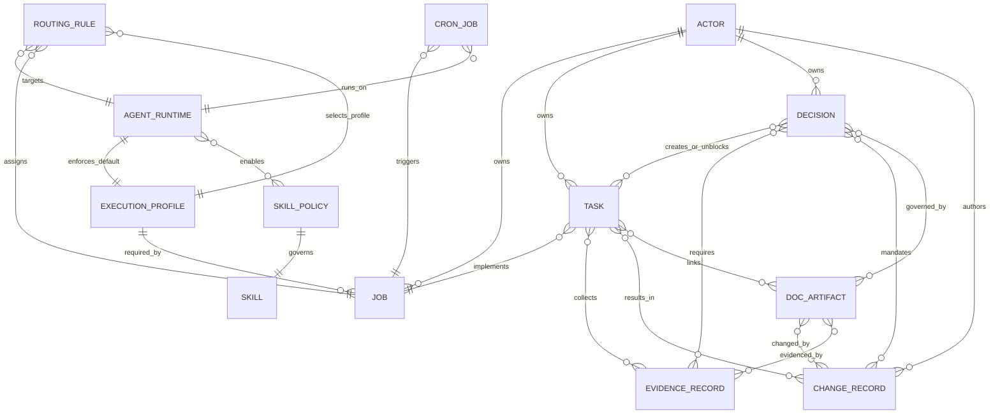

# First-Version Information Model for the Lyra OpenClaw System

## Executive summary

The repository `pek007/lyra-operating-system` is already functioning as a “docs-as-system” operating layer: registries are stored as Markdown tables; “machine-readable” structures are emerging via YAML frontmatter in Markdown; and automation scripts write evidence records into a predictable filesystem layout. In particular, `REGISTRY_SCHEMAS_V1.md` defines four registry contract schemas (Agent, Routing Rule, Evidence Record, Change Record) and a storage convention for where these records live. fileciteturn9file10L1-L200

However, there is schema drift between these “target” contracts and real instances already present in the repo (notably the agent registry entry and routing entry used by the architecture fitness gate). As a result, a first-version information model must explicitly reconcile (a) **OpenClaw’s runtime primitives** (agents as scoped runtimes, skills, cron jobs, bindings/routing, tool policy) with (b) **Lyra’s governance primitives** (jobs, decisions, work orders, change artifacts, policies/guardrails, evidence, risk, system-of-record boundaries). fileciteturn26file0L1-L80 fileciteturn26file3L1-L80 fileciteturn33file1L1-L200 citeturn0search0 citeturn2search1 citeturn3search0

A minimal, interoperability-first v1 model should be built around a small set of canonical entities and a strict reference discipline: **Decision** (as the primary control-panel unit), **Task**, **EvidenceRecord**, **ChangeRecord**, **AgentRuntime**, **Job**, **RoutingRule**, **CronJob**, **Skill**, and a generalized **DocArtifact** (policies/SOPs/standards/runbooks/templates/ADRs). This aligns with the repo’s explicit choice to make “Decision” the unit of management and its defined transitional mapping from existing artifacts into a canonical Decision contract. fileciteturn9file20L1-L260 fileciteturn9file7L1-L220

Implementation should proceed as a translation-and-validation pipeline (not a big-bang rewrite): keep the current Markdown tables and frontmatter records as sources, build a “translator” that materializes canonical JSON objects (per domain), and enforce contracts using JSON Schema (Draft 2020-12) plus lints and CI gates. This approach directly addresses known schema-alignment issues that OpenClaw itself highlights in cron tooling (“Cron Add Hardening & Schema Alignment”) and matches the repo’s own “translator service” transition recommendation. fileciteturn9file20L200-L260 citeturn2search5 citeturn0search1

## Repository and OpenClaw information-object inventory

### What the repo currently contains

The repo is primarily a governance and operations knowledge base with some automation scripts. The following inventory separates **OpenClaw defaults** (runtime primitives defined by OpenClaw) from **Lyra-specific objects** (governance and operating-model constructs defined in-repo). fileciteturn9file6L1-L80 fileciteturn9file24L1-L140

### Inventory of objects, attributes, and example instances

The table below is deliberately pragmatic: it lists what exists today, how it is represented, and the “shape” implied by code/docs.

| Object type | Scope | Current representation in repo | Key attributes found | Example instance(s) |
|---|---|---|---|---|
| Agent contract / registry record | Mixed (Lyra registry for OpenClaw runtimes) | YAML frontmatter in `knowledge/registries/agents/*.md` + schema draft in `REGISTRY_SCHEMAS_V1.md` | Instance uses `id,name,type,status,capabilities,owner`; draft schema suggests `id,name,mode,mission,owner,allowedTools,readScope,writeScope,approvalRequiredFor,defaultModelLane,review.*` | `knowledge/registries/agents/agent-chief-architect.md` fileciteturn26file0L1-L80; agent contract schema draft fileciteturn9file10L1-L80 |
| Routing rule / registry record | Mixed (Lyra registry for routing) | YAML frontmatter in `knowledge/registries/routing/*.md` + schema draft in `REGISTRY_SCHEMAS_V1.md` | Instance uses `id,name,trigger,target,priority,conditions[]`; draft schema suggests `enabled,priority,match{taskType,riskLevel,decisionType,dataClass},route{championModel,challengerModel,fallbackModels,...},governance{...},review.*` | `knowledge/registries/routing/route-architecture.md` fileciteturn26file3L1-L120; routing schema draft fileciteturn9file10L60-L140 |
| Evidence record | Lyra-specific (produced from OpenClaw ops) | Markdown files under `knowledge/evidence/YYYY-MM/*.md` with **JSON** frontmatter | `id,source,timestamp,status,severitySummary{critical,warn,info},artifacts[{path}],linkedTasks[],owner` | Example evidence file `knowledge/evidence/2026-02/20260225-083719__security_audit.md` fileciteturn19file31L1-L80; producer script `tools/evidence_ingest.py` fileciteturn19file6L1-L140 |
| Change record | Lyra-specific (declared schema; instances not found) | Defined in `REGISTRY_SCHEMAS_V1.md`; intended storage `knowledge/changes/YYYY-MM/*.md` | `id,timestamp,type,summary,reason,decisionType,owner,rollbackPlan,linkedArtifacts[],linkedTasks[]` | Change record schema draft fileciteturn9file10L120-L200 |
| Task | Lyra-specific (work system with Trello sync) | Markdown kanban in `TASKS.md` + Trello sync script `tools/trello_sync.py` | Task ID patterns like `OPS-YYYY-NNN` + status by section (`Inbox/Triage/Active/Waiting/Done`) + checkbox; script extracts `list_name,title,checked,key` and maps to Trello lists | `TASKS.md` fileciteturn9file9L1-L200; parser/sync logic fileciteturn59file2L1-L220; linking standard fileciteturn81file0L1-L120 |
| Task system policy | Lyra-specific | `TASK_SYSTEM_POLICY_V1.md` | Canonical statuses (`inbox,triage,active,waiting,done,archived`), WIP limits, DoR/DoD, role-based decision queue fields | Policy content fileciteturn9file12L1-L260 |
| Decision | Lyra-specific (but also intended for UI API contracts) | Canonical schema and JSON Schema minimum in `DECISION_SCHEMA_V1.md` | `decision_id,title,question,role,domain,status,urgency,risk_level,decision_type,options[],required_evidence[],approvals{},constraints{},telemetry{},audit{}` | `DECISION_SCHEMA_V1.md` fileciteturn9file20L1-L260; role-first UI model fileciteturn9file7L1-L180 |
| Job (internal job market) | Lyra-specific | `JOB_MARKET_MODEL_V1.md` | Job record schema: `Job ID,Domain,Mission/outcomes,Decision rights,Execution profile (quality/tools/memory/trust/latency/cost),Preferred runtime,Escalation triggers,KPIs,Assignee,Review cadence` | Job catalog + schema fileciteturn33file1L1-L200 |
| Agent lifecycle governance | Lyra-specific | `AGENT_LIFECYCLE_SOP_V1.md` | Jobs → execution profiles → runtime placement; stages; decision criteria; approval rules; monthly review; retirement process | SOP fileciteturn32file3L1-L200 |
| Permission envelope | Lyra-specific (maps to OpenClaw tool/sandbox policy) | `AGENT_PERMISSION_ENVELOPES.md` | `Agent Role,Read Scope,Write Scope,Tool Scope,Requires Approval` | Table fileciteturn85file16L1-L120 |
| Skill governance policy | Mixed (Lyra governance over OpenClaw skills) | `skills-governance.md` + machine-readable `skills-policy.yaml` + evidence pack template | Risk classes S0–S3; default rules; action gates; per-skill overrides (class/state/budget); evidence pack checklist | Governance policy fileciteturn19file21L1-L200; YAML policy fileciteturn19file14L1-L120; evidence pack template fileciteturn85file12L1-L120 |
| Cron job spec | OpenClaw default (scheduler) + Lyra-specific job definitions | `CRON_SPEC_DAILY_HYGIENE.md`, `CRON_SPEC_AUTONOMOUS_GOVERNANCE_SWEEPS.md` | CLI parameters: `name,cron/at,tz,session(main|isolated),announce/channel/to,message,thinking`; Lyra adds guardrails, backlog behavior, escalation rules | Daily hygiene cron spec fileciteturn19file44L1-L120; autonomous sweeps fileciteturn19file22L1-L220; OpenClaw cron docs citeturn2search1 |
| System registry entry | Lyra-specific | Markdown table `SYSTEM_REGISTRY.md` | `System/Service,Purpose,Criticality,Owner,Cost Posture,Fallback,Status` | Table fileciteturn10file0L1-L60 |
| Process/policy/runbook registry entry | Lyra-specific | Markdown table `PROCESS_REGISTRY.md` | `Process/Doc,Type,Owner,Status,Last Reviewed,Next Review` | Table fileciteturn9file24L1-L140 |
| Risk register entry | Lyra-specific | Markdown table `RISK_REGISTER.md` | `Risk,Impact,Likelihood,Owner,Mitigation,Status` | Table fileciteturn16file0L1-L60 |
| Subscription record | Lyra-specific | Markdown table `SUBSCRIPTION_REGISTER.md` | Service + cost posture + review cadence + termination readiness | Fields + examples fileciteturn19file16L1-L120 |
| Product record | Lyra-specific | `PRODUCT_PORTFOLIO_REGISTRY.md` | Product boundary schema + dependency rules + interfaces | Product record schema + example Control Panel fileciteturn9file15L1-L160 |
| Work Order (WO) / Change Artifact (CA) | Lyra-specific | Templates `WO_TEMPLATE_V1.md`, `CA_TEMPLATE_V1.md`, plus handoff prompt `prompts/handoff/CA_change.md` | WO: objective/non-goals/acceptance/verification/dependencies; CA: change summary/files/tests/guardrail compliance/rollback | WO fileciteturn57file2L1-L120; CA fileciteturn85file0L1-L160; CA handoff prompt fileciteturn85file2L1-L80 |

### OpenClaw defaults that must be modeled explicitly

The repo references OpenClaw operations throughout, but the canonical “defaults” belong to OpenClaw’s own conceptual model:

* **AgentRuntime**: OpenClaw defines an agent as a fully-scoped runtime with its own workspace, state directory (`agentDir`), session store, and auth profile; bindings deterministically route inbound messages to an agent. citeturn0search0turn0search4  
* **CronJob**: OpenClaw cron persists jobs on the gateway host and supports main-session vs isolated execution styles with delivery/announce settings; the CLI and tool calls share canonical job shapes. citeturn2search1turn2search2turn2search0  
* **Skill**: OpenClaw skills are directory-based “AgentSkills-compatible” units built around `SKILL.md` with YAML frontmatter; skills are loaded from bundled, managed (`~/.openclaw/skills`), and per-workspace locations with precedence rules. citeturn3search0turn4search0  
* **Tool policy & sandbox configuration**: OpenClaw enforces tool allow/deny lists (globally and per-agent) and sandbox configuration, which is foundational to Lyra’s “permission envelopes” being enforceable rather than prose-only. citeturn5search0turn5search3turn5search6  
* **Gateway security posture**: OpenClaw distinguishes DM allowlists, group allowlists/trigger restrictions, and reverse-proxy trusted-proxy configuration (e.g., `gateway.trustedProxies`), which the repo explicitly flags as risk items and tasks. fileciteturn9file9L1-L80 citeturn6search0  

## Canonical entity definitions and relationships

### Design stance for v1

A first-version model should be **storage-agnostic** (works in files, SQLite, Postgres, or an API), **interoperable** (JSON Schema + RFC-defined time formats), and **minimal** (small number of core entities; everything else is either a DocArtifact subtype or an extension field). JSON Schema Draft 2020-12 provides a stable basis for validation and referenceable `$id` URIs. citeturn0search1turn7search5  
For timestamps, standardize on RFC 3339 / ISO 8601 profile. citeturn4search2turn4search5  

### Recommended canonical entities

The definitions below are intentionally “entity-first,” not “file-first”:

**Actor**  
A stable identifier for who/what can own, approve, or execute: human, role, system component, or agent runtime. Needed to make approvals/audit trails queryable across tasks/decisions/changes.

**AgentRuntime**  
A representation of OpenClaw’s scoped runtime: `agentId`, workspace identity, tool/sandbox policy pointers, default model lane, and routing/binding targets. This aligns with OpenClaw’s definition of “one agent” (workspace + agentDir + sessions + per-agent auth). citeturn0search0  

**Job**  
A durable responsibility with a required execution profile; jobs are not 1:1 with agents. This matches the repo’s “jobs vs agents” doctrine and job record schema. fileciteturn33file1L1-L200  

**ExecutionProfile**  
A reusable profile describing quality/latency/cost targets, allowed tool side effects, memory scope, and trust boundary. This is the spine that connects jobs to agent runtimes and tool policies (and is consistent with the agent lifecycle SOP). fileciteturn32file3L1-L120  

**RoutingRule**  
A normalized rule that assigns an inbound event (message/task/decision/risk) to an AgentRuntime, Job, or model lane. In v1, RoutingRule should support (at least) two kinds:
1) **Inbound routing** (OpenClaw bindings for messages by channel/account/peer/thread/etc.). citeturn0search4  
2) **Work routing** (Lyra routing by taskType/risk/decisionType/dataClass or by “trigger/conditions” as in the architecture route). fileciteturn26file3L1-L120  

**Task**  
An operational work unit with lifecycle state, ownership, priority, blocker metadata, and external references (Trello card IDs). This aligns with TASKS.md, the Trello sync parser, and the blocker contract requirements in orchestration policy. fileciteturn9file9L1-L120 fileciteturn59file2L1-L120 fileciteturn9file21L1-L120  

**Decision**  
The canonical “unit of management” for the control panel; ties together options, required evidence, approvals, constraints, telemetry, and audit data. This is already explicitly specified in-repo (and should be treated as authoritative for v1). fileciteturn9file20L1-L260  

**EvidenceRecord**  
A time-stamped status assertion with structured severity summary and artifact pointers. Evidence must be *generated* by automation (producer) and *validated* by consumers, per orchestration policy. fileciteturn19file6L1-L140 fileciteturn9file21L180-L260  

**ChangeRecord**  
An auditable record of a change to policy/config/runbooks/routing/etc., with rollback plan and links to tasks and artifacts. Even if git history exists, an explicit ChangeRecord becomes the semantic audit log for “why” and “what decision type.” fileciteturn9file10L120-L200  

**CronJob**  
A normalized representation of OpenClaw cron jobs (schedule + execution style + payload + delivery + retry policy + run history pointers). OpenClaw’s docs specify persistence and execution styles, and OpenClaw itself calls out the importance of schema alignment for cron add/update. citeturn2search1turn2search5  

**Skill** and **SkillPolicy**  
A Skill is an AgentSkills-compatible directory unit (`SKILL.md` + supporting files). A SkillPolicy is Lyra’s governance overlay: risk class, install state, approvals, and evidence pack references (mirroring `skills-policy.yaml`). citeturn3search0turn4search0 fileciteturn19file14L1-L120  

**DocArtifact**  
A generalized entity for versioned governance artifacts (Policy, SOP, Standard, Runbook, Template, ADR, Spec). The process registry shows this is already a crucial operational index; modeling it enables uniform review cadences and references. fileciteturn9file24L1-L140  

### ER diagram as mermaid



This diagram is rendered with Mermaid’s ER syntax. citeturn8search0  

## Suggested v1 schemas for core entities

### Schema principles for interoperability

* Use JSON Schema Draft 2020-12 (`$schema: https://json-schema.org/draft/2020-12/schema`) and stable `$id` values. citeturn0search1turn7search5  
* Encode timestamps as RFC 3339 strings. citeturn4search2turn4search5  
* Version entity schemas with semantic versioning (SemVer). citeturn1search1  
* Provide safe extensibility via an `extensions` object (or `x_*` names) while keeping `additionalProperties: false` on the core surface to prevent silent drift. citeturn2search5  

Below are compact v1 candidate schemas (JSON Schema) and concise YAML example instances. (In practice, store these as `schemas/v1/<entity>.schema.json` and validate YAML instances via a JSON-schema validator that supports YAML input, e.g., Ajv-based tooling. citeturn8search1turn7search1)

### Actor

**JSON Schema**

```json
{
  "$schema": "https://json-schema.org/draft/2020-12/schema",
  "$id": "https://lyra.local/schemas/v1/actor.schema.json",
  "title": "Actor",
  "type": "object",
  "required": ["id", "kind", "display_name"],
  "properties": {
    "id": { "type": "string", "minLength": 3 },
    "kind": { "type": "string", "enum": ["human", "role", "agent_runtime", "system"] },
    "display_name": { "type": "string", "minLength": 1 },
    "email": { "type": ["string", "null"], "format": "email" },
    "external_refs": {
      "type": "array",
      "items": { "type": "object", "required": ["system", "id"], "properties": {
        "system": { "type": "string" },
        "id": { "type": "string" }
      }, "additionalProperties": false },
      "default": []
    },
    "extensions": { "type": "object", "default": {}, "additionalProperties": true }
  },
  "additionalProperties": false
}
```

**YAML example**

```yaml
id: actor:human:peter
kind: human
display_name: Peter
email: null
external_refs:
  - system: telegram
    id: "8283124284"
extensions: {}
```

### AgentRuntime

**JSON Schema**

```json
{
  "$schema": "https://json-schema.org/draft/2020-12/schema",
  "$id": "https://lyra.local/schemas/v1/agent_runtime.schema.json",
  "title": "AgentRuntime",
  "type": "object",
  "required": ["agent_id", "name", "domain", "status", "execution_profile_ref"],
  "properties": {
    "agent_id": { "type": "string", "minLength": 2 },
    "name": { "type": "string", "minLength": 1 },
    "domain": { "type": "string", "enum": ["os", "px", "shared"] },
    "status": { "type": "string", "enum": ["active", "inactive", "deprecated"] },

    "openclaw": {
      "type": "object",
      "required": ["workspace"],
      "properties": {
        "workspace": { "type": "string", "minLength": 1 },
        "agent_dir": { "type": ["string", "null"] },
        "session_store": { "type": ["string", "null"] },
        "bindings_ref": { "type": ["string", "null"], "description": "Pointer to binding/routing config source" }
      },
      "additionalProperties": true
    },

    "execution_profile_ref": { "type": "string", "minLength": 3 },
    "owners": { "type": "array", "items": { "type": "string" }, "default": [] },

    "review": {
      "type": "object",
      "properties": {
        "last_reviewed": { "type": ["string", "null"], "format": "date" },
        "next_review": { "type": ["string", "null"], "format": "date" }
      },
      "additionalProperties": false,
      "default": {}
    },

    "extensions": { "type": "object", "default": {}, "additionalProperties": true }
  },
  "additionalProperties": false
}
```

**YAML example**

```yaml
agent_id: main
name: Control Tower
domain: os
status: active
execution_profile_ref: profile:control_tower:v1
openclaw:
  workspace: "~/.openclaw/workspace"
  agent_dir: "~/.openclaw/agents/main/agent"
  session_store: "~/.openclaw/agents/main/sessions"
owners: ["actor:human:peter"]
review:
  last_reviewed: "2026-02-28"
  next_review: "2026-03-28"
extensions: {}
```

This captures OpenClaw’s “agent as scoped runtime” concept while keeping storage backend unspecified. citeturn0search0  

### ExecutionProfile

**JSON Schema**

```json
{
  "$schema": "https://json-schema.org/draft/2020-12/schema",
  "$id": "https://lyra.local/schemas/v1/execution_profile.schema.json",
  "title": "ExecutionProfile",
  "type": "object",
  "required": ["id", "quality_tier", "trust_boundary", "tool_policy", "memory_scope"],
  "properties": {
    "id": { "type": "string", "minLength": 3 },
    "quality_tier": { "type": "string", "enum": ["low", "standard", "high", "premium"] },
    "latency_target_ms": { "type": ["integer", "null"], "minimum": 0 },
    "cost_tier": { "type": "string", "enum": ["low", "medium", "high"] },

    "trust_boundary": { "type": "string", "enum": ["single_operator", "multi_user_shared", "public_surface", "isolated_gateway"] },

    "tool_policy": {
      "type": "object",
      "required": ["allow", "deny"],
      "properties": {
        "allow": { "type": "array", "items": { "type": "string" }, "default": [] },
        "deny": { "type": "array", "items": { "type": "string" }, "default": [] },
        "notes": { "type": ["string", "null"] }
      },
      "additionalProperties": false
    },

    "sandbox": {
      "type": "object",
      "properties": {
        "mode": { "type": "string", "enum": ["off", "non-main", "all"] },
        "scope": { "type": ["string", "null"], "enum": ["agent", "session", "shared", null] }
      },
      "additionalProperties": true,
      "default": {}
    },

    "memory_scope": {
      "type": "object",
      "properties": {
        "read_paths": { "type": "array", "items": { "type": "string" }, "default": [] },
        "write_paths": { "type": "array", "items": { "type": "string" }, "default": [] }
      },
      "additionalProperties": false,
      "default": {}
    },

    "approval_required_for": { "type": "array", "items": { "type": "string" }, "default": [] },
    "extensions": { "type": "object", "default": {}, "additionalProperties": true }
  },
  "additionalProperties": false
}
```

**YAML example**

```yaml
id: profile:security_audit:v1
quality_tier: high
latency_target_ms: 120000
cost_tier: medium
trust_boundary: single_operator
tool_policy:
  allow: ["cron", "gateway", "read", "web_fetch"]
  deny: ["message.send", "write", "exec"]
  notes: "No outbound messaging by default."
sandbox:
  mode: all
  scope: session
memory_scope:
  read_paths: ["SEC_*.md", "IR_*.md", "governance/**", "knowledge/evidence/**"]
  write_paths: ["SEC_*.md", "IR_*.md", "RISK_REGISTER.md", "knowledge/evidence/**"]
approval_required_for: ["credential_rotation", "policy_override"]
extensions: {}
```

OpenClaw’s tool allow/deny and multi-agent sandbox configuration are first-class levers; this profile exposes them explicitly. citeturn5search0turn5search3turn5search6  

### Job

**JSON Schema**

```json
{
  "$schema": "https://json-schema.org/draft/2020-12/schema",
  "$id": "https://lyra.local/schemas/v1/job.schema.json",
  "title": "Job",
  "type": "object",
  "required": ["job_id", "name", "domain", "mission", "execution_profile_ref", "status"],
  "properties": {
    "job_id": { "type": "string", "pattern": "^JOB-[A-Z]{2,4}-[0-9]{3}$" },
    "name": { "type": "string", "minLength": 3 },
    "domain": { "type": "string", "enum": ["os", "px", "shared"] },
    "mission": { "type": "string", "minLength": 5 },
    "outcomes": { "type": "array", "items": { "type": "string" }, "default": [] },

    "decision_rights": { "type": "array", "items": { "type": "string" }, "default": [] },

    "execution_profile_ref": { "type": "string", "minLength": 3 },
    "preferred_runtime_refs": { "type": "array", "items": { "type": "string" }, "default": [] },

    "current_assignee_ref": { "type": ["string", "null"] },
    "review_cadence": { "type": ["string", "null"] },

    "kpi_signals": { "type": "array", "items": { "type": "string" }, "default": [] },
    "status": { "type": "string", "enum": ["active", "paused", "retired"] },

    "extensions": { "type": "object", "default": {}, "additionalProperties": true }
  },
  "additionalProperties": false
}
```

**YAML example**

```yaml
job_id: JOB-ARC-001
name: Chief Architect
domain: shared
mission: "Architecture constraints, boundary governance, ADR quality, sign-off recommendations."
outcomes:
  - "Sprint architecture briefs produced"
  - "Architecture review reports with evidence requirements"
decision_rights: ["approve_architecture_constraints", "recommend_signoff"]
execution_profile_ref: profile:architect_review:v1
preferred_runtime_refs: ["agent:main", "agent:workbench:codex"]
current_assignee_ref: "actor:role:control_tower"
review_cadence: "monthly"
kpi_signals: ["handoff_acceptance_rate", "rework_rate"]
status: active
extensions: {}
```

This is directly grounded in the repo’s job-record schema and initial catalog. fileciteturn33file1L1-L200  

### RoutingRule

**JSON Schema**

```json
{
  "$schema": "https://json-schema.org/draft/2020-12/schema",
  "$id": "https://lyra.local/schemas/v1/routing_rule.schema.json",
  "title": "RoutingRule",
  "type": "object",
  "required": ["id", "kind", "enabled", "priority", "match", "target"],
  "properties": {
    "id": { "type": "string", "minLength": 3 },
    "kind": { "type": "string", "enum": ["inbound_message", "task_decision", "model_lane"] },
    "enabled": { "type": "boolean" },
    "priority": { "type": "integer", "minimum": 0 },

    "match": {
      "type": "object",
      "properties": {
        "trigger": { "type": ["string", "null"] },
        "conditions": { "type": "array", "items": { "type": "string" }, "default": [] },

        "task_type": { "type": "array", "items": { "type": "string" }, "default": [] },
        "risk_level": { "type": "array", "items": { "type": "string" }, "default": [] },
        "decision_type": { "type": "array", "items": { "type": "string" }, "default": [] },
        "data_class": { "type": "array", "items": { "type": "string" }, "default": [] },

        "channel": { "type": ["string", "null"] },
        "account_id": { "type": ["string", "null"] },
        "peer_id": { "type": ["string", "null"] }
      },
      "additionalProperties": false
    },

    "target": {
      "type": "object",
      "required": ["kind", "ref"],
      "properties": {
        "kind": { "type": "string", "enum": ["agent_runtime", "job", "execution_profile"] },
        "ref": { "type": "string", "minLength": 3 }
      },
      "additionalProperties": false
    },

    "governance": {
      "type": "object",
      "properties": {
        "change_gate": { "type": ["string", "null"] },
        "anti_thrash_days": { "type": ["integer", "null"], "minimum": 0 }
      },
      "additionalProperties": false,
      "default": {}
    },

    "review": {
      "type": "object",
      "properties": {
        "last_reviewed": { "type": ["string", "null"], "format": "date" },
        "next_review": { "type": ["string", "null"], "format": "date" }
      },
      "additionalProperties": false,
      "default": {}
    },

    "extensions": { "type": "object", "default": {}, "additionalProperties": true }
  },
  "additionalProperties": false
}
```

**YAML example**

```yaml
id: route:architecture:v1
kind: task_decision
enabled: true
priority: 100
match:
  trigger: architecture
  conditions:
    - "api contract change"
    - "db schema migration"
    - "auth/security boundary change"
target:
  kind: job
  ref: JOB-ARC-001
governance:
  change_gate: type1-required
  anti_thrash_days: 30
review:
  last_reviewed: "2026-02-28"
  next_review: "2026-03-28"
extensions: {}
```

This schema unifies the repo’s two currently divergent routing shapes (condition-based vs match/route-based) without forcing premature loss of information. fileciteturn26file3L1-L120 fileciteturn9file10L60-L140  

### Task

**JSON Schema**

```json
{
  "$schema": "https://json-schema.org/draft/2020-12/schema",
  "$id": "https://lyra.local/schemas/v1/task.schema.json",
  "title": "Task",
  "type": "object",
  "required": ["task_id", "title", "domain", "status", "owner_ref", "created_at"],
  "properties": {
    "task_id": { "type": "string", "minLength": 3 },
    "title": { "type": "string", "minLength": 3 },
    "domain": { "type": "string", "enum": ["os", "px", "shared"] },
    "status": { "type": "string", "enum": ["inbox", "triage", "active", "waiting", "done", "archived"] },

    "priority": { "type": ["string", "null"], "enum": ["P1", "P2", "P3", "P4", null] },
    "door_type": { "type": ["string", "null"], "enum": ["type1", "type2", null] },

    "owner_ref": { "type": "string" },
    "job_ref": { "type": ["string", "null"] },

    "blocked": {
      "type": "object",
      "properties": {
        "blocked_on": { "type": ["string", "null"], "enum": ["human_approval", "external_reply", "credential", "upstream_task", "runtime_error", "other", null] },
        "unblock_action": { "type": ["string", "null"] },
        "next_check_at": { "type": ["string", "null"], "format": "date-time" },
        "escalate_at": { "type": ["string", "null"], "format": "date-time" },
        "blocking_ref": { "type": ["string", "null"] }
      },
      "additionalProperties": false,
      "default": {}
    },

    "links": {
      "type": "object",
      "properties": {
        "docs": { "type": "array", "items": { "type": "string" }, "default": [] },
        "evidence": { "type": "array", "items": { "type": "string" }, "default": [] },
        "decisions": { "type": "array", "items": { "type": "string" }, "default": [] }
      },
      "additionalProperties": false,
      "default": {}
    },

    "external_refs": {
      "type": "array",
      "items": { "type": "object", "required": ["system", "id"], "properties": {
        "system": { "type": "string", "enum": ["trello", "github", "openclaw", "telegram"] },
        "id": { "type": "string" }
      }, "additionalProperties": false },
      "default": []
    },

    "created_at": { "type": "string", "format": "date-time" },
    "updated_at": { "type": ["string", "null"], "format": "date-time" },

    "extensions": { "type": "object", "default": {}, "additionalProperties": true }
  },
  "additionalProperties": false
}
```

**YAML example**

```yaml
task_id: OPS-2026-022
title: "Architecture QA gate (JOB-ARC-001)"
domain: os
status: active
priority: P2
door_type: type1
owner_ref: actor:role:control_tower
job_ref: JOB-ARC-001
blocked: {}
links:
  docs: ["tools/architecture_fitness_gate.py", "CHIEF_ARCHITECT_AGENT_SPEC.md"]
  evidence: []
  decisions: []
external_refs:
  - system: trello
    id: "card:abc123"
created_at: "2026-02-28T10:00:00+01:00"
updated_at: null
extensions: {}
```

This schema incorporates the repo’s blocker contract requirements and Trello sync discipline. fileciteturn9file21L1-L120 fileciteturn59file2L1-L120  

### Decision

The repo already provides a detailed Decision schema plus a JSON Schema “minimum.” The v1 recommendation is to **adopt that design as canonical**, but tighten interoperability details (explicit RFC3339 `date-time` formats, consistent enums, and a stable `$id`). fileciteturn9file20L1-L260 citeturn4search5turn7search5

**JSON Schema (condensed but usable)**

```json
{
  "$schema": "https://json-schema.org/draft/2020-12/schema",
  "$id": "https://lyra.local/schemas/v1/decision.schema.json",
  "title": "Decision",
  "type": "object",
  "required": ["decision_id", "title", "question", "role", "domain", "status", "urgency", "risk_level", "decision_type", "options", "required_evidence", "approvals", "constraints", "telemetry", "audit"],
  "properties": {
    "decision_id": { "type": "string", "pattern": "^DEC-[0-9]{4}-[0-9]{4,}$" },
    "title": { "type": "string", "minLength": 3 },
    "question": { "type": "string", "minLength": 5 },
    "role": { "type": "string", "enum": ["Security", "Finance", "Operations", "Product", "Research", "Custom"] },
    "domain": { "type": "string", "enum": ["os", "px", "shared"] },
    "status": { "type": "string", "enum": ["proposed", "ready", "blocked", "approved", "rejected", "deferred", "expired"] },
    "urgency": { "type": "string", "enum": ["low", "medium", "high", "critical"] },
    "risk_level": { "type": "string", "enum": ["low", "medium", "high", "critical"] },
    "decision_type": { "type": "string", "enum": ["approve", "reject", "choose", "escalate", "review"] },

    "options": {
      "type": "array",
      "minItems": 1,
      "items": {
        "type": "object",
        "required": ["option_id", "label", "impact_summary"],
        "properties": {
          "option_id": { "type": "string" },
          "label": { "type": "string" },
          "impact_summary": { "type": "string" },
          "estimated_cost": { "type": ["number", "null"] },
          "estimated_risk": { "type": ["string", "null"], "enum": ["low", "medium", "high", "critical", null] }
        },
        "additionalProperties": false
      }
    },

    "required_evidence": { "type": "array", "items": { "type": "object" }, "default": [] },
    "approvals": { "type": "object" },
    "constraints": { "type": "object" },

    "telemetry": {
      "type": "object",
      "required": ["created_at", "updated_at", "freshness_ok"],
      "properties": {
        "created_at": { "type": "string", "format": "date-time" },
        "updated_at": { "type": "string", "format": "date-time" },
        "last_evidence_refresh_at": { "type": ["string", "null"], "format": "date-time" },
        "freshness_ok": { "type": "boolean" },
        "confidence_score": { "type": ["number", "null"], "minimum": 0, "maximum": 1 }
      },
      "additionalProperties": true
    },

    "audit": {
      "type": "object",
      "required": ["created_by"],
      "properties": {
        "created_by": { "type": "string" },
        "last_decision_by": { "type": ["string", "null"] },
        "last_decision_at": { "type": ["string", "null"], "format": "date-time" },
        "change_ref": { "type": ["string", "null"] }
      },
      "additionalProperties": true
    },

    "extensions": { "type": "object", "default": {}, "additionalProperties": true }
  },
  "additionalProperties": false
}
```

**YAML example**

```yaml
decision_id: DEC-2026-0012
title: "Harden Telegram command senders"
question: "Should we restrict Telegram command senders via allowlists to reduce command-invocation exposure?"
role: Security
domain: os
status: proposed
urgency: high
risk_level: high
decision_type: approve
options:
  - option_id: opt-allowlist
    label: "Implement groupAllowFrom + per-group allowFrom"
    impact_summary: "Reduces unauthorized invocation risk; may block legitimate users until configured."
    estimated_cost: null
    estimated_risk: medium
recommended_option_id: opt-allowlist
recommendation_rationale: "Matches OpenClaw security guidance; highest risk reduction with minimal functional loss."
required_evidence: []
approvals: { required: true, required_by_role: ["Security"], minimum_count: 1, granted_by: [] }
constraints: { max_cost_tier: "low", allowed_write_scopes: ["~/.openclaw/openclaw.json"], deadline: null }
links: { policy_ref: "governance/policy-register.md", runbook_ref: "OPENCLAW_CONFIG_CHANGE_SOP_V1.md", incident_ref: null }
telemetry: { created_at: "2026-03-01T09:00:00+01:00", updated_at: "2026-03-01T09:00:00+01:00", last_evidence_refresh_at: null, freshness_ok: true, confidence_score: 0.7 }
audit: { created_by: "actor:human:peter", last_decision_by: null, last_decision_at: null, change_ref: null }
extensions: {}
```

This aligns with role-first control panel navigation and the decision-centered contract already in the repo. fileciteturn9file7L1-L180 fileciteturn9file20L1-L260  

### EvidenceRecord

**JSON Schema**

```json
{
  "$schema": "https://json-schema.org/draft/2020-12/schema",
  "$id": "https://lyra.local/schemas/v1/evidence_record.schema.json",
  "title": "EvidenceRecord",
  "type": "object",
  "required": ["id", "source", "timestamp", "status", "severity_summary", "artifacts", "owner_ref"],
  "properties": {
    "id": { "type": "string", "minLength": 6 },
    "source": { "type": "string", "minLength": 2 },
    "timestamp": { "type": "string", "format": "date-time" },
    "status": { "type": "string", "enum": ["pass", "warn", "fail"] },
    "severity_summary": {
      "type": "object",
      "required": ["critical", "warn", "info"],
      "properties": {
        "critical": { "type": "integer", "minimum": 0 },
        "warn": { "type": "integer", "minimum": 0 },
        "info": { "type": "integer", "minimum": 0 }
      },
      "additionalProperties": false
    },
    "artifacts": {
      "type": "array",
      "items": { "type": "object", "required": ["path"], "properties": {
        "path": { "type": "string" },
        "sha256": { "type": ["string", "null"] }
      }, "additionalProperties": false }
    },
    "linked_tasks": { "type": "array", "items": { "type": "string" }, "default": [] },
    "linked_decisions": { "type": "array", "items": { "type": "string" }, "default": [] },
    "owner_ref": { "type": "string" },
    "extensions": { "type": "object", "default": {}, "additionalProperties": true }
  },
  "additionalProperties": false
}
```

**YAML example**

```yaml
id: EVID-20260225-083719-security_audit
source: security_audit
timestamp: "2026-02-25T08:37:19.697255+01:00"
status: warn
severity_summary: { critical: 0, warn: 1, info: 1 }
artifacts:
  - path: "/Users/lyra/.openclaw/workspace/knowledge/evidence/latest-security-audit.json"
linked_tasks: []
linked_decisions: []
owner_ref: actor:role:control_tower
extensions: {}
```

This mirrors both the schema draft and the evidence producer output that already exists in the repo. fileciteturn9file10L80-L140 fileciteturn19file31L1-L80 fileciteturn19file6L1-L140  

### ChangeRecord

**JSON Schema**

```json
{
  "$schema": "https://json-schema.org/draft/2020-12/schema",
  "$id": "https://lyra.local/schemas/v1/change_record.schema.json",
  "title": "ChangeRecord",
  "type": "object",
  "required": ["id", "timestamp", "type", "summary", "reason", "owner_ref"],
  "properties": {
    "id": { "type": "string", "minLength": 6 },
    "timestamp": { "type": "string", "format": "date-time" },
    "type": { "type": "string", "enum": ["policy", "config", "runbook", "routing", "code", "schema"] },
    "summary": { "type": "string", "minLength": 3 },
    "reason": { "type": "string", "minLength": 3 },
    "decision_type": { "type": ["string", "null"], "enum": ["type1", "type2", null] },
    "owner_ref": { "type": "string" },
    "rollback_plan": { "type": ["string", "null"] },
    "linked_artifacts": { "type": "array", "items": { "type": "string" }, "default": [] },
    "linked_tasks": { "type": "array", "items": { "type": "string" }, "default": [] },
    "linked_evidence": { "type": "array", "items": { "type": "string" }, "default": [] },
    "extensions": { "type": "object", "default": {}, "additionalProperties": true }
  },
  "additionalProperties": false
}
```

**YAML example**

```yaml
id: CHG-20260301-090000-schema
timestamp: "2026-03-01T09:00:00+01:00"
type: schema
summary: "Normalize agent and routing registry schemas to v1 canonical shapes."
reason: "Eliminate drift between REGISTRY_SCHEMAS_V1 and existing registry instances."
decision_type: type2
owner_ref: actor:human:peter
rollback_plan: "Revert schema commit; keep translator tolerant to both shapes."
linked_artifacts: ["REGISTRY_SCHEMAS_V1.md", "knowledge/registries/agents/agent-chief-architect.md"]
linked_tasks: ["OPS-2026-022"]
linked_evidence: []
extensions: {}
```

This is based on the draft schema intent in `REGISTRY_SCHEMAS_V1.md`. fileciteturn9file10L120-L200  

### CronJob

**JSON Schema (v1, aligned to OpenClaw concepts)**

```json
{
  "$schema": "https://json-schema.org/draft/2020-12/schema",
  "$id": "https://lyra.local/schemas/v1/cron_job.schema.json",
  "title": "CronJob",
  "type": "object",
  "required": ["job_id", "name", "schedule", "timezone", "session_style", "payload", "delivery", "enabled"],
  "properties": {
    "job_id": { "type": "string", "minLength": 3 },
    "name": { "type": "string", "minLength": 1 },
    "enabled": { "type": "boolean" },

    "schedule": {
      "type": "object",
      "required": ["kind", "value"],
      "properties": {
        "kind": { "type": "string", "enum": ["cron", "at"] },
        "value": { "type": "string", "minLength": 1 }
      },
      "additionalProperties": false
    },

    "timezone": { "type": "string", "minLength": 3 },
    "session_style": { "type": "string", "enum": ["main", "isolated"] },

    "payload": {
      "type": "object",
      "required": ["kind"],
      "properties": {
        "kind": { "type": "string", "enum": ["system_event", "message_prompt"] },
        "system_event": { "type": ["string", "null"] },
        "message": { "type": ["string", "null"] }
      },
      "additionalProperties": false
    },

    "delivery": {
      "type": "object",
      "required": ["mode"],
      "properties": {
        "mode": { "type": "string", "enum": ["announce", "webhook", "none"] },
        "channel": { "type": ["string", "null"] },
        "to": { "type": ["string", "null"] }
      },
      "additionalProperties": false
    },

    "retry_policy": {
      "type": "object",
      "properties": {
        "mode": { "type": "string", "enum": ["exponential_backoff", "none"] },
        "notes": { "type": ["string", "null"] }
      },
      "additionalProperties": false,
      "default": { "mode": "exponential_backoff", "notes": null }
    },

    "run_history_refs": { "type": "array", "items": { "type": "string" }, "default": [] },
    "extensions": { "type": "object", "default": {}, "additionalProperties": true }
  },
  "additionalProperties": false
}
```

**YAML example**

```yaml
job_id: cron:daily_hygiene:v1
name: "Daily OpenClaw hygiene check"
enabled: true
schedule: { kind: cron, value: "30 8 * * *" }
timezone: "Europe/Stockholm"
session_style: isolated
payload:
  kind: message_prompt
  system_event: null
  message: "Run daily hygiene checks for OpenClaw health and security..."
delivery:
  mode: announce
  channel: telegram
  to: "8283124284"
retry_policy: { mode: exponential_backoff, notes: null }
run_history_refs: []
extensions: {}
```

This enables a contract layer that can be validated independently from OpenClaw’s own persisted job files, while still aligning with OpenClaw’s cron execution styles and delivery semantics. fileciteturn19file44L1-L120 citeturn2search1turn2search0turn2search2  

### Skill and SkillPolicy

**Skill JSON Schema (minimal, aligned to AgentSkills/OpenClaw)**

```json
{
  "$schema": "https://json-schema.org/draft/2020-12/schema",
  "$id": "https://lyra.local/schemas/v1/skill.schema.json",
  "title": "Skill",
  "type": "object",
  "required": ["name", "description", "location_kind"],
  "properties": {
    "name": { "type": "string", "minLength": 1, "maxLength": 64 },
    "description": { "type": "string", "minLength": 1 },
    "location_kind": { "type": "string", "enum": ["bundled", "managed", "workspace", "plugin"] },
    "path": { "type": ["string", "null"] },
    "version_pinned": { "type": ["string", "null"] },
    "metadata": { "type": "object", "additionalProperties": true, "default": {} },
    "extensions": { "type": "object", "default": {}, "additionalProperties": true }
  },
  "additionalProperties": false
}
```

**Skill YAML example**

```yaml
name: github
description: "Use when interacting with GitHub repositories, issues, and pull requests."
location_kind: managed
path: "~/.openclaw/skills/github"
version_pinned: "1.2.3"
metadata: {}
extensions: {}
```

AgentSkills requires a `SKILL.md` file with YAML frontmatter `name` and `description` at minimum. citeturn4search0  

**SkillPolicy JSON Schema (Lyra governance overlay)**

```json
{
  "$schema": "https://json-schema.org/draft/2020-12/schema",
  "$id": "https://lyra.local/schemas/v1/skill_policy.schema.json",
  "title": "SkillPolicy",
  "type": "object",
  "required": ["skill_name", "risk_class", "install_state", "approval_required", "require_evidence_pack"],
  "properties": {
    "skill_name": { "type": "string", "minLength": 1 },
    "risk_class": { "type": "string", "enum": ["S0", "S1", "S2", "S3"] },
    "install_state": { "type": "string", "enum": ["disabled", "enabled", "restricted", "sandbox-evaluate"] },
    "approval_required": { "type": "boolean" },
    "approvers": { "type": "array", "items": { "type": "string" }, "default": [] },
    "require_evidence_pack": { "type": "boolean" },
    "require_version_pin": { "type": "boolean", "default": true },
    "allow_auto_update_in_prod": { "type": "boolean", "default": false },
    "max_monthly_budget_usd": { "type": ["number", "null"], "minimum": 0 },
    "action_gates": { "type": "array", "items": { "type": "string" }, "default": [] },
    "extensions": { "type": "object", "default": {}, "additionalProperties": true }
  },
  "additionalProperties": false
}
```

**SkillPolicy YAML example**

```yaml
skill_name: summarize
risk_class: S2
install_state: enabled
approval_required: true
approvers: ["actor:human:peter"]
require_evidence_pack: true
require_version_pin: true
allow_auto_update_in_prod: false
max_monthly_budget_usd: 100
action_gates: ["send_email", "github_merge_pr", "bulk_write_operation"]
extensions: {}
```

This directly reflects the repo’s `skills-policy.yaml` structure and the governance policy rules. fileciteturn19file14L1-L120 fileciteturn19file21L1-L120  

### DocArtifact

**JSON Schema**

```json
{
  "$schema": "https://json-schema.org/draft/2020-12/schema",
  "$id": "https://lyra.local/schemas/v1/doc_artifact.schema.json",
  "title": "DocArtifact",
  "type": "object",
  "required": ["id", "kind", "title", "path", "status", "owner_ref"],
  "properties": {
    "id": { "type": "string", "minLength": 3 },
    "kind": { "type": "string", "enum": ["policy", "sop", "standard", "runbook", "template", "registry", "adr", "spec", "report", "guide"] },
    "title": { "type": "string", "minLength": 3 },
    "path": { "type": "string", "minLength": 1 },
    "status": { "type": "string", "enum": ["active", "draft", "superseded", "retired"] },
    "owner_ref": { "type": "string" },
    "last_reviewed": { "type": ["string", "null"], "format": "date" },
    "next_review": { "type": ["string", "null"], "format": "date" },
    "links": { "type": "array", "items": { "type": "string" }, "default": [] },
    "extensions": { "type": "object", "default": {}, "additionalProperties": true }
  },
  "additionalProperties": false
}
```

**YAML example**

```yaml
id: doc:policy:openclaw_config_change:v1
kind: sop
title: "OpenClaw Config Change Control & Rollback v1"
path: "OPENCLAW_CONFIG_CHANGE_SOP_V1.md"
status: active
owner_ref: actor:role:control_tower
last_reviewed: "2026-02-28"
next_review: "2026-03-28"
links: ["OPENCLAW_CONFIG_CHANGE_CHECKLIST_V1.md"]
extensions: {}
```

This allows `PROCESS_REGISTRY.md` to become a structured index rather than a free-form table, while still supporting file-based storage. fileciteturn9file24L1-L140 fileciteturn19file1L1-L120  

## Overlaps, ambiguities, and normalization recommendations

### Agent: “contract record” vs “runtime boundary”

OpenClaw’s definition of an agent is a scoped runtime (workspace + agentDir + sessions + per-agent auth). citeturn0search0  
In the repo, “agent” is simultaneously:
* a **registry record** (human/governance contract about capabilities/ownership), and
* an **OpenClaw runtime** (enforceable boundary via config: tool policy, sandbox, auth, bindings). fileciteturn32file3L1-L120 citeturn5search3  

**Normalization recommendation:** model `AgentRuntime` separately from (or as a superset of) `AgentContract`, with explicit `openclaw.*` runtime metadata plus governance fields. This prevents “persona docs” from being mistaken for enforceable security boundaries—an explicit warning theme in the repo and OpenClaw docs. fileciteturn32file3L120-L200 citeturn5search6  

### Routing: OpenClaw bindings vs Lyra work routing vs model routing

The repo currently has two incompatible routing representations:
* `knowledge/registries/routing/route-architecture.md` uses `trigger/target/conditions`. fileciteturn26file3L1-L120  
* `REGISTRY_SCHEMAS_V1.md` anticipates match-based routing to champion/challenger/fallback models, with governance controls. fileciteturn9file10L60-L140  

Meanwhile OpenClaw’s routing/bindings operate at the channel/account/peer level. citeturn0search4  

**Normalization recommendation:** introduce `RoutingRule.kind` and explicitly support:
1) `inbound_message` rules (bindings),  
2) `task_decision` rules (governance routing to jobs/agents), and  
3) `model_lane` rules (champion/challenger selection and cost/latency policies).  

This aligns with the repo’s own “model routing as policy (not fixed assignment)” stance and avoids conflating “who receives a message” with “which model lane executes a task.” fileciteturn19file25L1-L120 citeturn0search4  

### Evidence: YAML frontmatter decision vs JSON frontmatter reality

The schema doc chooses “YAML frontmatter in Markdown files” as the contract format. fileciteturn9file10L1-L20  
But `tools/evidence_ingest.py` writes JSON inside frontmatter fences (`---` then JSON). fileciteturn19file6L40-L120  

**Normalization recommendation:**  
*Accept both in v1 parsers; standardize to YAML frontmatter in v1.1 producers.*  
Rationale: YAML frontmatter is more human-editable and already assumed by planned UI tooling (`gray-matter` is recommended in the build spec). fileciteturn9file0L1-L120  
Practically, the translator should parse either YAML or JSON frontmatter and emit canonical JSON objects that satisfy `EvidenceRecord` schema.

### Tasks: Markdown board vs canonical task fields

`TASKS.md` provides a workable kanban, but required fields (owner, priority, door type, blocker metadata) are not uniformly structured in the Markdown itself. The repo explicitly argues for blocker metadata contracts and approval cards in orchestration policy. fileciteturn9file21L1-L160  

**Normalization recommendation:** treat `TASKS.md` as a *view layer* during migration (and eventually a human-friendly projection), while canonical `Task` objects are stored as structured records (YAML frontmatter or JSON) and synced to Trello. The existing Trello sync already establishes stable key extraction (`OPS-YYYY-NNN` or full title). fileciteturn59file2L1-L120 fileciteturn81file0L1-L120  

### Decisions: align Task and Decision rather than letting both drift

The repo makes a strong decision-centric stance: role-first navigation and Decision as unit of management. fileciteturn9file7L1-L220 fileciteturn9file20L1-L120  
It also provides an explicit mapping from existing artifacts (`TASKS.md`, `RISK_REGISTER.md`, `PROCESS_REGISTRY.md`, evidence files, and skill policy) into decisions via a translator layer. fileciteturn9file20L200-L260  

**Normalization recommendation:** enforce a strict rule: a “decision-worthy” task must either (a) reference a Decision ID, or (b) be automatically promoted into a Decision object by the translator when it meets heuristics (e.g., Type 1 / high risk / approval required).

### Policies, guardrails, and ADRs: unify under DocArtifact, but keep ADR semantics

The repo uses ADRs for systems-of-record decisions and explicitly discourages direct coupling without ADR approval. fileciteturn19file26L1-L140 fileciteturn9file15L1-L80  
Architectural decision records have well-established practices and definitions (ADR as decision log). citeturn6search2  
**Michael Nygard** entity["people","Michael Nygard","software architect"] is commonly referenced for ADR format adoption; ADR communities emphasize keeping ADRs lightweight, durable, and linkable. citeturn6search8turn6search6  

**Normalization recommendation:** store ADRs as `DocArtifact(kind="adr")` with an explicit `status` and a stable `id`, and enforce:
* immutability of accepted ADR content except via superseding ADR (common ADR practice), and
* explicit links from `Decision` and `ChangeRecord` to the ADR(s) they rely on. citeturn6search2 fileciteturn9file20L1-L260  

## Implementation mapping, migration plan, and governance controls

### Mapping to repo artifacts

This section answers “where does this live today?” and “what should it become?”

**Key mapping highlights**

* **Registries as records:** `REGISTRY_SCHEMAS_V1.md` already defines storage conventions for agent/routing/evidence/change records under `knowledge/registries/*`, `knowledge/evidence/*`, and `knowledge/changes/*`. fileciteturn9file10L140-L200  
* **Evidence pipeline exists:** `tools/evidence_ingest.py` is a functioning producer that should be brought under schema validation (write-time) and CI regression tests. fileciteturn19file6L1-L200  
* **Fitness gate precedent:** `tools/architecture_fitness_gate.py` demonstrates “contract enforcement as code” by asserting required files and validating frontmatter keys/values for the chief architect routing. fileciteturn26file1L1-L200  
* **Task sync precedent:** `tools/trello_sync.py` already implements a deterministic mapping from `TASKS.md` headings to Trello list states and extracts stable keys from task titles. fileciteturn59file2L1-L220  

### Migration plan for existing data

The migration should be staged to avoid breaking current operations:

**Phase zero: schema pack + fixtures (no behavior change)**  
1. Add `schemas/v1/` with the JSON Schemas above (one file per entity).  
2. Add a `fixtures/` directory with small YAML examples that validate against the schemas.  
3. Add a “schema registry index” document (a `DocArtifact` list) describing schema versions and intended storage paths, aligning with `$id` and SemVer. citeturn1search1turn7search5  

**Phase one: translator that materializes canonical objects**  
Create `tools/translate_workspace_state.py` (or equivalent service module) that reads:
* `TASKS.md` and Trello state (if available) → `Task[]` objects. fileciteturn59file2L1-L220  
* `knowledge/evidence/**` → `EvidenceRecord[]`. fileciteturn19file31L1-L80  
* `RISK_REGISTER.md` → `Risk` objects (either its own entity or `DocArtifact`-embedded structured rows). fileciteturn16file0L1-L60  
* `PROCESS_REGISTRY.md` → `DocArtifact[]` index records. fileciteturn9file24L1-L140  

Then emit canonical JSON snapshots, e.g.:
* `dist/state/os/tasks.json`
* `dist/state/os/decisions.json`
* `dist/state/os/evidence.json`

This matches the repo’s explicit recommendation: “Create a translator service in transition period; do not parse legacy registries directly in UI.” fileciteturn9file20L200-L260  

**Phase two: Decision materialization and role-first API**  
Implement the “DecisionV1 translation layer” formally:
* Identify candidate decisions from policies and tasks (Type 1, approval-required actions, high-risk config changes, etc.). fileciteturn9file20L200-L260  
* Materialize `Decision[]` as canonical JSON from those signals.  
* Expose read-only endpoints that return role-scoped decision queues and evidence freshness status, matching the role-based control panel architecture. fileciteturn9file7L1-L220  

This yields a usable Control Panel MVP without forcing immediate rewriting of all Markdown tables.

**Phase three: producer-side validation and write-path governance**  
Bring producers under contract:
* Update `tools/evidence_ingest.py` to validate generated EvidenceRecord against schema before writing (fail closed when incompatible). fileciteturn19file6L1-L140  
* Apply the same to any future `ChangeRecord` producer and to cron job creation workflows (prevent invalid cron jobs at the tool-call boundary). citeturn2search5turn2search1  

### Governance and versioning best practices

**Schema versioning**  
Use SemVer for schema artifacts, and treat the schemas as a declared “public API” for the Control Panel and tooling ecosystem. SemVer requires declaring a public API and incrementing major/minor/patch based on compatibility. citeturn1search1  

**Change control**  
Adopt “schema changes are policy changes”: changing schemas should create a `ChangeRecord(type="schema")`, and any non-backwards compatible change should require an explicit decision (often Type 1). This mirrors the repo’s OpenClaw config change-control SOP emphasis on explicit diff, approval, validation, and rollback. fileciteturn19file1L1-L140  

**Extensibility discipline**  
* Prefer `extensions` objects to avoid uncontrolled top-level drift.  
* Use namespaced extension keys (`extensions.lyra.*`, `extensions.openclaw.*`) to avoid collisions across tools and future domains (`os` vs `px`). The repo’s service boundary architecture explicitly requires domain separation for data/config/secrets/logs. fileciteturn9file19L1-L120  

## Validation, testing, CI checks, and prioritized roadmap

### Validation and CI checks

A v1 “information model” is only real if enforced. Recommended checks map to both repo precedents and OpenClaw’s own lessons about schema drift.

**Schema validation (CI)**
* Validate all canonical YAML/JSON records against JSON Schema Draft 2020-12. citeturn0search1turn8search1  
* Use an Ajv-based GitHub Action to validate JSON and YAML against schemas on pull requests. citeturn7search1turn7search0  

**Repository-specific lints**
* Validate that `PROCESS_REGISTRY.md` rows refer to existing files and that review dates are present and parseable. fileciteturn9file24L1-L140  
* Validate task IDs follow the linking standard (`OPS-YYYY-NNN`) where required; validate that docs changed by a task include backlink lines when practical. fileciteturn81file0L1-L120  
* Validate evidence records: timestamps are RFC3339, severity summary keys exist, status enum is correct. Evidence schema alignment is a stated non-negotiable in orchestration policy. fileciteturn9file21L180-L260 citeturn4search5  

**Fitness gates (evolve existing pattern)**
Extend the existing approach in `tools/architecture_fitness_gate.py` into a general “registry fitness gate”:
* Required files exist for each configured job/agent/routing rule.
* Registry frontmatter matches canonical schema.
* Cross-references resolve (e.g., routing rule `target.ref` exists). fileciteturn26file1L1-L200  

**OpenClaw alignment checks**
Because OpenClaw explicitly notes drift between cron provider enums/CLI/docs/UI types and tool payload shapes, add tests that ensure your canonical CronJob representation round-trips to OpenClaw cron tool payloads correctly. citeturn2search5turn2search1  

### Prioritized roadmap and deliverables

**Immediate deliverables**
* v1 schema pack (`schemas/v1/*.schema.json`) + fixtures + CI schema validation action. citeturn7search1turn0search1  
* Translator tool that materializes canonical `Decision`, `Task`, `EvidenceRecord`, and `DocArtifact` from current sources (Markdown tables + frontmatter). This is explicitly recommended in `DECISION_SCHEMA_V1.md`. fileciteturn9file20L200-L260  

**Near-term deliverables**
* Read-only Control Panel API that exposes role-based decision queues (Security/Finance/Operations) using the canonical Decision contract. fileciteturn9file7L1-L220  
* Producer-side validation: update `tools/evidence_ingest.py` to validate before write, and add regression tests with snapshot fixtures. fileciteturn19file6L1-L200  

**Medium-term deliverables**
* ChangeRecord production and consumption: implement explicit change logging for policy/config/routing/schema changes with rollback plans, linked tasks, and evidence. fileciteturn9file10L120-L200  
* “Decision write actions” (approve/reject/defer) with audit logging, strictly approval-gated per policy register and skill action gates. fileciteturn19file40L1-L120 fileciteturn19file14L1-L90  

**Longer-term deliverables**
* Dedicated task/decision engine service (or database-backed store) replacing Markdown-as-source-of-truth while preserving the repo’s hybrid systems-of-record stance: task system for work state, git repo for knowledge, linked via IDs. fileciteturn19file26L1-L140  

### Selected primary sources (URLs)

```text
Repo (pek007/lyra-operating-system):
  https://github.com/pek007/lyra-operating-system

OpenClaw official documentation:
  https://docs.openclaw.ai/multi-agent
  https://docs.openclaw.ai/automation/cron-jobs
  https://docs.openclaw.ai/cli/cron
  https://docs.openclaw.ai/tools/skills
  https://docs.openclaw.ai/tools
  https://docs.openclaw.ai/gateway/security
  https://docs.openclaw.ai/tools/multi-agent-sandbox-tools

AgentSkills specification:
  https://agentskills.io/specification

JSON Schema Draft 2020-12:
  https://json-schema.org/draft/2020-12/json-schema-core.html

IETF RFC 3339 (timestamps):
  https://www.rfc-editor.org/info/rfc3339

Semantic Versioning 2.0.0:
  https://semver.org/

OpenAPI Specification v3.1.1:
  https://spec.openapis.org/oas/v3.1.1.html

Mermaid ER diagram syntax:
  https://mermaid.js.org/syntax/entityRelationshipDiagram.html

ADR references:
  https://adr.github.io/
```