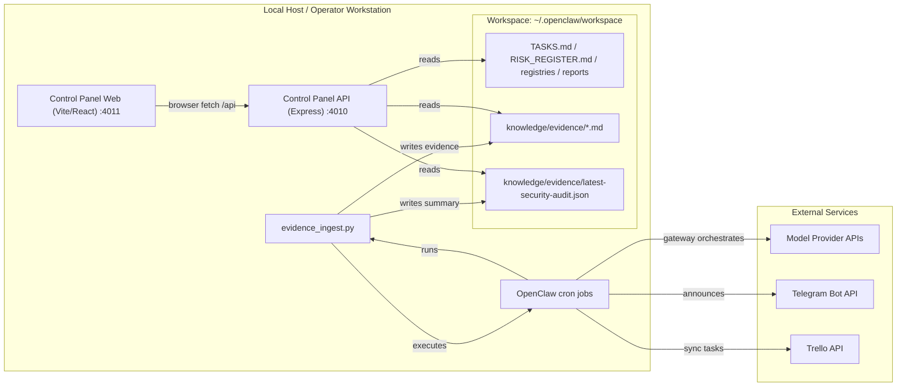
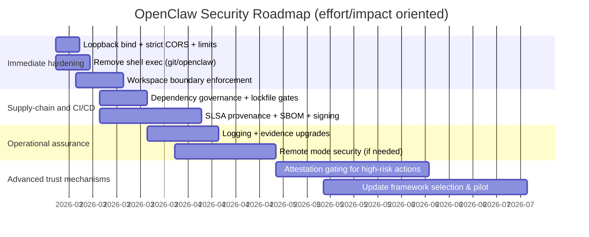

# Pragmatic, Expert-Level Cybersecurity Recommendations for the OpenClaw Solution

## Executive Summary

OpenClaw, as evidenced by the two analyzed repositories, is best modeled as a **local-first agent “operating system”** with a **core gateway/runtime**, a **messaging interface (Telegram)**, a **primary model execution path (OpenAI API)**, scheduled automation (cron-like jobs), and a **file-based systems-of-record workspace** (markdown/YAML frontmatter + JSON evidence artifacts) that feeds a **read-only Control Panel** (Express API + Vite/React UI). fileciteturn64file2L1-L40 fileciteturn17file0L1-L220 fileciteturn66file0L1-L80 fileciteturn69file0L1-L120 fileciteturn71file0L1-L120

The most security-relevant architectural properties (and therefore the highest-return control points) are:

- **High-value, local secrets and state** under `~/.openclaw` (including `.secrets` patterns) and a “workspace” directory used as an operational truth source. Mis-permissions and symlink/path tricks can become data exfiltration pivots. fileciteturn66file0L1-L80 fileciteturn76file0L1-L120 fileciteturn32file0L1-L260
- **A local web API** (Express) that currently uses permissive CORS defaults and (by default Node semantics) may bind broadly unless explicitly constrained; combined with “no auth” (explicitly stated), this becomes a serious disclosure risk if the service is ever reachable beyond loopback or if a browser-origin attack can reach it. fileciteturn17file0L1-L220 fileciteturn17file1L1-L120 citeturn4search2
- **Command execution surfaces**: `git log` executed from the Control Panel API and `openclaw …` executed from the evidence ingestion script. These are currently low-risk in intent (constant commands, bounded parameters), but they remain prime targets for PATH hijacking, config abuse, hostile repos, and supply-chain compromise. fileciteturn39file0L1-L120 fileciteturn76file0L1-L140
- **Multi-agent governance and “permission envelopes”** are already present at the documentation level, which is unusually strong for a small system; the key gap is **enforcement** (technical guardrails, policy-as-code, attestable actions). fileciteturn83file0L1-L80 fileciteturn95file0L1-L80 fileciteturn67file0L1-L120

Prioritized recommendations (high impact / pragmatic):

1. **Hard-enforce loopback-only + origin constraints** for the Control Panel API/UI; add a minimal authentication mode if remote access is ever allowed (mTLS or a reverse-proxy OIDC front door). fileciteturn17file1L1-L120 fileciteturn22file0L1-L40 citeturn4search2
2. **Lock down local state, workspace, and secrets storage**: strict permissions, symlink/hardlink defenses, canonical path checks, and a clear “trusted workspace” boundary (treat external docs as hostile). fileciteturn66file0L1-L80 fileciteturn32file0L1-L260
3. **Replace shell-based process execution with exec-file semantics** + explicit environment pinning for both `git` and `openclaw`; treat hostile `.git/config` and PATH poisoning as realistic on developer machines. fileciteturn39file0L1-L120 fileciteturn76file0L1-L140
4. **Supply-chain hardening**: SBOM + provenance + signed releases for the Control Panel artifacts; adopt SLSA Build track targets and consider Sigstore-based signing if you want operationally cheap verification. citeturn2search1turn2search4turn0search5
5. **Incident response + evidence**: align the existing runbooks with modern NIST guidance and make “evidence of intrusion” measurable (as emphasized in CISA’s Secure by Design work). fileciteturn71file0L1-L120 fileciteturn68file0L1-L120 citeturn5search1turn5search0

A final meta-observation: your current design philosophy (local-first, read-only dashboard, explicit human approval for high-risk actions) is directionally aligned with “secure-by-default” thinking. fileciteturn17file0L1-L220 fileciteturn83file0L1-L80 citeturn5search1  What’s missing is **mechanism**: turning policy intent into enforceable, testable, and attestable controls.

## Architecture and Asset Inventory

### Component inventory derived from the repositories

**Control-plane and operational OS artifacts (pek007/lyra-operating-system)**

- **OpenClaw Gateway**: described as “core orchestration/runtime” and treated as high criticality. fileciteturn64file2L1-L40
- **Telegram Bot Channel**: primary messaging interface (high criticality). fileciteturn64file2L1-L40
- **Primary model execution**: “OpenAI API path” identified as primary model execution (high criticality). fileciteturn64file2L1-L40
- **Scheduled hygiene**: explicit cron spec running `openclaw doctor` and `openclaw security audit --json`, delivering summaries via Telegram. fileciteturn75file0L1-L120
- **Evidence ingestion automation**: `tools/evidence_ingest.py` runs OpenClaw commands and writes structured evidence into `knowledge/evidence/`, also generating `latest-security-audit.json` and `latest-doctor.txt`. fileciteturn64file3L1-L220
- **Task sync integration**: `tools/trello_sync_runner.sh` sources secrets from a `.secrets` env file and runs a Trello sync script (spec’d; actual `trello_sync.py` not present in this repo snapshot). fileciteturn64file4L1-L20 fileciteturn79file0L1-L120
- **Governance, IR, backup**: incident mini-runbook and backup/restore runbook exist and are referenced as active processes. fileciteturn71file0L1-L120 fileciteturn72file0L1-L120 fileciteturn86file0L1-L60
- **Multi-agent governance**: explicit execution semantics and permission envelopes. fileciteturn95file0L1-L80 fileciteturn83file0L1-L80 fileciteturn67file0L1-L120

**Control Panel (pek007/control-panel)**

- **apps/api**: Express API parsing workspace files and serving JSON endpoints (`/api/health`, `/api/now`, `/api/next`, `/api/watch`, `/api/changes`). fileciteturn17file0L1-L220 fileciteturn17file1L1-L120
- **apps/web**: Vite + React UI proxying `/api` to the local API server. fileciteturn21file2L1-L40 fileciteturn21file1L1-L40
- **Workspace-driven data model**: it reads `TASKS.md`, `RISK_REGISTER.md`, `PROCESS_REGISTRY.md`, `SUBSCRIPTION_REGISTER.md`, plus `knowledge/evidence/**/*.md` and registry directories; security summary reads `knowledge/evidence/latest-security-audit.json`. fileciteturn17file0L1-L220 fileciteturn35file0L1-L120 fileciteturn32file0L1-L260
- **Git-based change feed**: it executes `git log` in the workspace root and returns parsed commit metadata. fileciteturn17file0L1-L220 fileciteturn39file0L1-L120
- **Stated MVP limitations**: read-only, no auth, local use only. fileciteturn17file0L1-L220

### Primary assets and trust boundaries

**High-value assets**
- **Provider/API credentials**: OpenAI, Telegram bot token/owner access, Trello key/token/board ID, plus any additional model/search providers. fileciteturn64file2L1-L40 fileciteturn79file0L1-L60 fileciteturn94file0L1-L80
- **Local OpenClaw state directory** (`~/.openclaw` and subpaths): mentioned explicitly in security review and scripts and implied as a durable runtime state. fileciteturn66file0L1-L80 fileciteturn76file0L1-L40
- **Workspace knowledge corpus**: `knowledge/*` (evidence, reports, distilled insights, decisions), registries, and operational docs; this will reliably contain sensitive business context and potentially client data, per governance baseline. fileciteturn65file0L1-L120 fileciteturn92file0L1-L120
- **Integrity of operational truth sources**: `TASKS.md`, `RISK_REGISTER.md`, etc.—tampering here changes what the “system believes,” which can cause incorrect actions, messaging, or governance drift. fileciteturn17file0L1-L220 fileciteturn86file0L1-L60

**Trust boundaries**
- **Local host boundary**: user account, filesystem permissions, process isolation.
- **Workspace boundary**: “trusted workspace” vs “external/untrusted content” (web-ingested docs, third-party markdown, cloned repos, etc.).
- **Network boundary**: outbound calls to model providers and messaging services; inbound access to local API ports (even if unintended).
- **Supply-chain boundary**: npm/pnpm dependencies, Python runtime deps (if used), and the OpenClaw CLI binary.

### Interfaces and data flows



This diagram is grounded in the explicit Control Panel file inputs and endpoints, the cron spec, and the ingestion script behavior. fileciteturn17file0L1-L220 fileciteturn75file0L1-L120 fileciteturn64file3L1-L220 fileciteturn64file2L1-L40

## Attack Surface and Threat Model

### Threat model framing

Because the repos do not include the OpenClaw gateway/runtime source itself, the most defensible approach is to threat-model the **observable system boundary**: local state + workspace truth sources + control panel interfaces + automation scripts + external service integrations, and then to define security requirements that the gateway must satisfy to safely interact with these. fileciteturn64file2L1-L40 fileciteturn17file0L1-L220

The system’s operating assumptions (local-first, read-only UI, explicit approval for external sends) reduce some classes of risk, but also create a sharp **concentration of value in local state and credentials**, which makes local compromise disproportionately catastrophic. fileciteturn17file0L1-L220 fileciteturn83file0L1-L80

### STRIDE analysis by major surface

**Spoofing**
- Spoofed “operator intent” in messaging workflows (Telegram) if bot tokens or session credentials leak. fileciteturn64file2L1-L40 fileciteturn71file0L1-L120
- Spoofed service-to-service calls if you ever expose the Control Panel API beyond loopback without strong auth (mTLS / verified identity). fileciteturn17file0L1-L220 citeturn0search0
- Spoofed “build provenance” and malicious artifact swaps without signed provenance and verified dependency pinning (common supply-chain outcomes). citeturn2search1turn0search1turn2search4

**Tampering**
- Workspace tampering: modifying `TASKS.md`, registries, and evidence records changes what Control Panel (and possibly the gateway) believes is true. fileciteturn17file0L1-L220 fileciteturn35file0L1-L120
- Evidence tampering: forged `latest-security-audit.json` drives the “security summary” display and can mask regressions. fileciteturn35file0L1-L120 fileciteturn61file0L1-L160
- Cron/job tampering: modifying job specs or the local OpenClaw binary changes operational behavior while leaving high-level docs unchanged. fileciteturn75file0L1-L120
- Trello sync tampering: hostile payloads or API abuse if Trello credentials are exposed or the sync script is compromised. fileciteturn79file0L1-L120 fileciteturn64file4L1-L20

**Repudiation**
- Without tamper-evident logs and authenticated action records, the system cannot reliably prove which agent/automation performed a high-risk action (e.g., credential rotation, external messaging, or governance edits). The OS docs push toward logging and incident records but do not yet enforce cryptographic non-repudiation. fileciteturn71file0L1-L120 fileciteturn92file0L1-L120 citeturn4search0

**Information disclosure**
- Control Panel “no auth” plus permissive CORS plus possible broad bind address is a classic accidental data exposure trap. fileciteturn17file0L1-L220 fileciteturn17file1L1-L120 citeturn4search2
- Local state-dir permissions were previously flagged as too open (`755`) and treated as a concrete security finding. fileciteturn66file0L1-L80
- Secrets-in-env patterns: `.secrets/trello.env` is sourced by a runner script; careless permissions, backups, or accidental commit could leak tokens. fileciteturn64file4L1-L20 fileciteturn92file0L1-L120
- Prompt-injection and “tool misuse” risk from ingesting untrusted external content is explicitly recognized in the baseline checklist; this is a major risk when the gateway has tools that can send messages or execute commands. fileciteturn82file0L1-L80

**Denial of service**
- Parser/resource exhaustion: markdown parsing (`parseMarkdownList`, table parsing) and globbing can be abused by huge files or pathological inputs; the Control Panel API is synchronous for many file reads and has no rate limiting. fileciteturn32file0L1-L260 fileciteturn17file1L1-L120
- External dependency outages: the OS explicitly plans for fallback model routing, but the operational reality still includes single-provider dependencies (OpenAI path as primary). fileciteturn69file0L1-L160 fileciteturn64file2L1-L40

**Elevation of privilege**
- Process execution surfaces (`execSync` in git service; `subprocess.run(..., shell=True)` in evidence ingestion) create footholds for local privilege escalation via PATH, environment poisoning, or hostile binaries. fileciteturn39file0L1-L120 fileciteturn64file3L1-L220
- Supply-chain compromise (npm dependencies, Python scripts, or the OpenClaw binary) is a direct route to code execution with access to secrets and business context; NIST explicitly treats supply-chain compromise as a core risk domain requiring end-to-end governance. citeturn0search1

### Hardware, firmware, physical, insider, and side-channel considerations

Even though the current repos represent a workstation-centric deployment, your requested control set (secure boot, TPM, OTA/rollback) maps cleanly to a “productionized OpenClaw host/appliance” trajectory:

- **Firmware/boot compromise**: attackers increasingly target platform firmware because it enables stealthy, persistent compromise. NIST SP 800-193 frames firmware resiliency around **protect / detect / recover** mechanisms. citeturn1search2
- **Hardware root of trust and attestation**: TPM 2.0 provides standardized secure key storage and measurement/attestation primitives (PCRs, quotes, policy), and is maintained by the entity["organization","Trusted Computing Group","tpm standards body"]. citeturn1search0
- **Remote attestation**: if you ever need to gate high-risk actions (e.g., “external send,” credential rotation, privileged shell) on a verified device/software state, the entity["organization","IETF","internet standards body"] RATS architecture provides a clean abstract model (Attester/Verifier/Relying Party; Evidence/Appraisal/Attestation Results). citeturn3search0turn3search1
- **Secure updates + rollback protection**: for any “appliance” path, secure update frameworks (TUF/Uptane/SUIT) are the canonical starting points; SUIT is explicitly designed for constrained device firmware updates (architecture + manifest protection), while Uptane is a hardened specialization for high-consequence environments with explicit recovery modeling. citeturn3search2turn6search3turn0search5
- **Insider threats**: your governance already anticipates contractors and role separation; the practical insider risk is “authorized misuse” (secrets handling, external sends) and “least privilege drift” unless enforced by technical controls. fileciteturn83file0L1-L80
- **Side-channels**: on shared hosts, co-resident processes can leak via OS-level telemetry, clipboard, browser extensions, speculative execution classes, or LLM prompt/response retention; pragmatically, treat the OpenClaw host as a **high-trust enclave** and avoid running untrusted workloads on it when possible.

## Prioritized Security Requirements and Control Set

This section provides a pragmatic “requirement → control → implementation hook” set, prioritized for OpenClaw as currently implemented (workstation-centric) while remaining compatible with a future dedicated host/appliance.

### High-priority baseline requirements

**Security boundary requirement: “Local-first means loopback-first”**
- **Requirement**: All local services that lack authentication MUST bind to loopback and MUST NOT expose sensitive content cross-origin. fileciteturn17file0L1-L220 citeturn4search2
- **Controls**: explicit bind address; explicit CORS allowlist or disabled CORS; optional local auth token even on loopback; rate limiting and size limits for untrusted callers.
- **Why it matters here**: Control Panel is explicitly “no auth” and “local use.” fileciteturn17file0L1-L220  The fastest way to break that assumption is accidental exposure (Wi‑Fi, reverse proxy, container port publish, etc.).

**Secrets and identity**
- **Requirement**: Provider credentials MUST be non-exportable where feasible, or at minimum stored in locked-down OS facilities; env-file secrets MUST be considered “tier‑2” and tightly permissioned. fileciteturn64file4L1-L20 fileciteturn92file0L1-L120
- **Controls**: OS keychain/KMS; file perms + umask; automated rotation runbook; “treat secrets pasted into chat as exposed” rule is already in governance. fileciteturn92file0L1-L120

**Host hardening**
- **Requirement**: The OpenClaw host must be treated as a privileged security boundary with disk encryption, strong local auth, and reduced multi-user exposure. fileciteturn82file0L1-L80
- **Controls**: full-disk encryption, screen lock, timely patching, minimal local accounts; ensure state directory permissions are strict (explicitly a prior finding). fileciteturn66file0L1-L80

**Tool/action governance**
- **Requirement**: High-risk actions (external messaging, destructive commands, credential operations, policy changes) MUST pass an approval gate, be logged, and be attributable to an identity (human or agent role). fileciteturn83file0L1-L80 fileciteturn71file0L1-L120
- **Controls**: structured “approval cards” with signed acknowledgements; enforce tool allowlists per agent; durability via append-only logs.

### Secure boot, hardware root of trust, and attestation

Even if you stay workstation-based, these controls matter because OpenClaw is high-value and long-lived.

- **Requirement**: The platform MUST resist boot-chain and firmware tampering, or the system must be able to detect and recover. citeturn1search2
- **Controls**: platform secure boot; measured boot; firmware write-protection; recovery/known-good restore paths as described conceptually by NIST SP 800-193. citeturn1search2
- **TPM/secure element**: Use a TPM or a secure element when you need non-exportable keys, monotonic counters (rollback protection), and attestable measurements. citeturn1search0

**Attestation design target (optional but high leverage for “agent safety”)**
- Map the OpenClaw gateway host to the RATS roles:
  - Attester: OpenClaw host
  - Verifier: local verification service or enterprise verifier
  - Relying Party: “action gate” that authorizes external sends / credential operations  
  This aligns with the RATS architecture model. citeturn3search0turn3search4

### OTA update security and rollback protection

If OpenClaw becomes a packaged tool or appliance, update infrastructure becomes existential.

- **Requirement**: Update clients MUST accept only authenticated metadata and signed artifacts, and MUST withstand repository compromise and rollback attempts. This is a core goal of TUF-like designs and is emphasized in Uptane’s recovery-oriented threat modeling. citeturn0search5turn6search3turn6search6
- **Controls**:
  - **TUF** for general artifact update security (strong, dependency-minimized base). citeturn0search5
  - **Uptane** if you expect “nation-state class” update-server compromise scenarios and need explicit separation of roles and recovery tiers. citeturn6search8turn6search5
  - **SUIT** if you are doing constrained firmware-style updates with manifests. citeturn3search2
- **Rollback protection**: implement monotonic version counters in TPM NVRAM or a secure element; store “minimum accepted version” and refuse downgrade unless explicitly authorized.

### Cryptographic choices and mutual authentication

- **Transport**: default to TLS 1.3 for any network-facing connectivity (internal services, reverse proxies, or remote dashboards), following RFC 8446. citeturn0search0
- **Mutual auth**: if you ever cross the loopback boundary (e.g., remote Control Panel), use mTLS with pinned identities or an identity-aware proxy.
- **Signing**: prefer modern, operationally low-friction signing and verification approaches:
  - SLSA provenance targets for build integrity. citeturn2search1turn2search2
  - Sigstore/Cosign for artifact signing and transparency logging (especially if you later distribute binaries/containers). citeturn2search4turn2search0

### Comparative technology tables

These comparisons are framed for OpenClaw’s likely trajectories: (a) workstation local-first; (b) remote-access-enabled; (c) appliance/managed deployment.

| Decision point | Option | Strengths | Weaknesses | Best fit for OpenClaw |
|---|---|---|---|---|
| Device identity + key protection | TPM 2.0 | Non-exportable keys, measurements, attestation, counters; mature ecosystem citeturn1search0 | Platform availability varies; integration complexity | Appliance trajectory; strong local trust anchor |
|  | OS keychain only | Pragmatic for workstation; minimal friction | Weaker attestation; keys may be exportable depending on stack | Current workstation deployment |
| Update framework | TUF | General-purpose secure update metadata; widely reused citeturn0search5 | Requires role key management discipline | Signing Control Panel artifacts; distributing OpenClaw packages |
|  | Uptane | Designed to degrade gracefully under compromise; high-assurance recovery model citeturn6search3 | More moving parts than TUF | “OpenClaw appliance” with high-consequence updates |
|  | SUIT | Constrained firmware update architecture; manifest protection citeturn3search2 | More IoT/firmware-specific | Any embedded/firmware component path |
| Build integrity | SLSA v1.0 Build L2–L3 | Formalized provenance and isolation requirements citeturn2search1turn2search3 | Requires CI maturity and hardened builders | Control Panel CI/CD hardening |
| Artifact signing | Sigstore Cosign | Keyless signing, transparency log, TUF-distributed trust roots citeturn2search4turn0search5 | Operational understanding needed; policy design needed | Low-friction signing when distributing artifacts |

## Repo-Tailored Implementation Guidance and Build Hardening

### Control Panel hardening (pek007/control-panel)

#### Constrain listener exposure and CORS

Today, the API uses `cors()` with default settings and listens without specifying a bind address. fileciteturn17file1L1-L120  This is the single highest-leverage fix because the system explicitly has *no auth*. fileciteturn17file0L1-L220

**Recommended implementation (TypeScript)**

```ts
// server.ts — tighten bind + CORS + payload limits
import cors from "cors";
import rateLimit from "express-rate-limit";

const WEB_ORIGINS = new Set([
  "http://localhost:4011",
  "http://127.0.0.1:4011",
]);

app.use(cors({
  origin: (origin, cb) => {
    if (!origin) return cb(null, true); // same-origin / curl
    return cb(null, WEB_ORIGINS.has(origin));
  },
  methods: ["GET"],
  credentials: false,
}));

app.use(express.json({ limit: "64kb" }));
app.use(rateLimit({ windowMs: 60_000, max: 120 }));

app.listen(port, "127.0.0.1", () => {
  // ...
});
```

Why: OWASP explicitly recommends being as specific as necessary on CORS and disabling it when cross-domain calls are not expected. citeturn4search2

#### Harden workspace-root trust and file parsing

`WORKSPACE_ROOT` is accepted, resolved, and stored, and then used for file reads and globbing. fileciteturn17file1L1-L120 fileciteturn32file0L1-L80

Key issues:
- **Symlink traversal**: `loadMarkdownFile` reads whatever exists at the resolved path (symlink/hardlink included). fileciteturn32file0L1-L60
- **Glob traversal**: `loadMarkdownDir` expands patterns under the workspace root; if the workspace contains symlinked paths, your loader will happily follow them once resolved. fileciteturn32file0L1-L60

**Recommended controls**
- Canonicalize and enforce: `realpath(workspaceRoot)` and require it to be within a configured allowlist base directory (e.g., `~/.openclaw/workspace`).
- Refuse reading of symlinks for all “system-of-record” filenames (`TASKS.md`, `RISK_REGISTER.md`, etc.).
- Apply deterministic size limits (e.g., refuse to parse markdown files above some threshold) to reduce DoS risk.

**Example hardening pattern**

```ts
import fs from "node:fs";
import path from "node:path";

function assertNoSymlink(filePath: string) {
  const st = fs.lstatSync(filePath);
  if (st.isSymbolicLink()) throw new Error(`Refusing symlink: ${filePath}`);
}

function assertUnderRoot(root: string, candidate: string) {
  const r = fs.realpathSync(root);
  const c = fs.realpathSync(candidate);
  if (!c.startsWith(r + path.sep)) throw new Error(`Path escape: ${candidate}`);
}
```

#### Remove shell-based execution in git change feed

The change feed executes `git log` via `execSync` and interpolates a numeric `limit`. fileciteturn39file0L1-L120  The query parameter is clamped to 1–200, which is good; however, shell invocation still expands your attack surface (PATH hijack, shell metacharacters if future changes introduce user-controlled inputs, and environment contamination). fileciteturn28file0L1-L80 fileciteturn39file0L1-L120

**Recommended replacement**

```ts
import { execFileSync } from "node:child_process";

const out = execFileSync("git", [
  "-c", "safe.directory=*",
  "log",
  `--format=${format}`,
  "-n", String(limit),
], {
  cwd: workspaceRoot,
  encoding: "utf-8",
  timeout: 5000,
  env: {
    ...process.env,
    GIT_PAGER: "cat",
  },
});
```

This removes shell parsing entirely and makes future extension safer.

#### Add authenticated “remote mode” rather than drifting insecurely into exposure

Right now, you have an MVP explicitly designed for local use without auth. fileciteturn17file0L1-L220  That’s fine—until someone runs it behind a reverse proxy or forwards ports. Build in a “remote mode” switch now:

- Local mode: loopback bind + limited CORS + no auth.
- Remote mode: require TLS termination and one of:
  - mTLS with pinned client certs
  - reverse proxy OIDC (shortest path)
  - a hardened local auth token with strict CSRF assumptions

This matches the “secure-by-default” expectation in modern guidance: out-of-the-box should be secure, not “documented insecure.” citeturn5search1

### Evidence ingestion and cron hardening (pek007/lyra-operating-system)

#### Evidence ingestion (`tools/evidence_ingest.py`): remove `shell=True`, pin execution context, and harden writes

The script uses `subprocess.run(..., shell=True)` even though the commands are constant. fileciteturn64file3L1-L220  The pragmatic risk is not classic injection (since arguments are not user-controlled today), but **execution-context reliance**: PATH hijack, aliasing, and environment contamination.

**Recommended changes**
- Use `subprocess.run([...], shell=False, check=False, timeout=...)`.
- Resolve the absolute path of the OpenClaw binary once (or require it via config).
- Force a restrictive `umask` and explicitly `chmod` evidence artifacts.

**Atomic writes for `latest-security-audit.json`**
Your script writes this JSON file and then writes an evidence record referencing it. fileciteturn64file3L1-L220  Make it atomic to avoid partial reads by the Control Panel.

#### Secrets sourcing (`tools/trello_sync_runner.sh`): tighten and avoid long-lived exported secrets

The runner sources `~/.openclaw/.secrets/trello.env` and then runs the sync. fileciteturn64file4L1-L20

Pragmatic minimum:
- File permissions: `chmod 600 ~/.openclaw/.secrets/trello.env`
- Ensure backups exclude `.secrets` or encrypt them distinctly (aligning with retention/access baseline). fileciteturn92file0L1-L120

Better (future):
- Move secrets into OS-managed stores (keychain) and inject them at runtime.
- If you later containerize: use runtime secret injection rather than baked env.

### SDLC, CI/CD, and dependency governance

#### Align with NIST SSDF for an enforceable minimum SDLC

The entity["organization","NIST","us standards institute"] SSDF (SP 800-218) is a strong fit for OpenClaw because it’s explicit, small, and maps well to a two-repo system (code + operating docs). citeturn0search3

Minimum SSDF-derived steps that map directly to these repos:
- “Protect the build” + “verify dependencies” for the Control Panel (pnpm lockfile; dependency audit). fileciteturn12file1L1-L60
- “Design for secure deployment defaults”: local-only safe bind; remote mode with auth. fileciteturn17file0L1-L220 citeturn5search1
- “Respond to vulnerabilities”: formalize a vulnerability intake flow, even if private initially (VDP can be internal-only if not a public product yet). citeturn5search1

#### Supply-chain risk management and provenance targets

NIST’s updated supply-chain risk guidance emphasizes integrating cybersecurity supply chain risk management into organizational risk management, including supplier and component visibility. citeturn0search1

Pragmatic implementable targets for the Control Panel pipeline:
- Generate SBOMs for API + web artifacts.
- Generate SLSA provenance and store it alongside releases. citeturn2search1turn2search2
- Sign artifacts (Cosign) and verify signatures in deployment. citeturn2search4

### Memory safety strategy in an OpenClaw context

Most components here are TypeScript/JavaScript and Python, which avoids many classic memory safety pitfalls; however, the **real memory safety risk** arrives via:
- native npm dependencies (build tools, transitive native modules),
- any future gateway/runtime in memory-unsafe languages,
- embedded/appliance trajectories.

CISA’s Secure by Design campaign treats “reducing entire classes of vulnerability,” including memory safety, as a major goal area; their “Case for Memory Safe Roadmaps” provides a vendor-facing model of how to plan transitions. citeturn6search0turn6search1

Pragmatic recommendation: if you build a new gateway/daemon component, default to a memory safe language (Rust/Go) and publish an internal roadmap documenting language choices for high-risk components.

## Testing and Validation Plan

### Static analysis and code scanning (fast ROI)

For the Control Panel repo:
- TypeScript compiler strictness and “no implicit any” style gates; you already run `tsc --noEmit` for lint at the root script level. fileciteturn12file1L1-L40
- Add code scanning (CodeQL) for the Node/TS code paths.
- Add dependency audits and lockfile enforcement (`pnpm install --frozen-lockfile`).

For the OS repo scripts:
- Python lints + security scanning on `tools/*.py` (Bandit-style checks).
- Shell script linting (shellcheck) for runner scripts.

### Fuzzing and property-based tests (targeted, not theoretical)

The highest-return fuzz targets in the Control Panel are the markdown parsers in `fsLoader.ts` and the schema validation surfaces (`zod` schemas). fileciteturn32file0L1-L260 fileciteturn42file0L1-L40

Pragmatic plan:
- Add property-based fuzzing with a generator that produces mixed markdown tables/lists, nested headings, huge metadata blocks, and adversarial unicode.
- Focus on:
  - catastrophic backtracking risks (regexes),
  - unbounded memory growth (splitting huge files),
  - schema validation failure modes and error handling.

### Dynamic testing and security validation

- Local DAST is limited value while loopback-only, but becomes important if “remote mode” is introduced:
  - run an HTTP security scanner against the API,
  - validate CORS behavior and ensure no sensitive endpoints are exposed cross-origin (OWASP CORS notes apply). citeturn4search2turn4search8

### Hardware-in-the-loop and “appliance readiness” (only if applicable)

If you pursue a dedicated host/appliance path:
- Boot-chain validation and firmware tamper testing consistent with NIST SP 800-193 protect/detect/recover goals. citeturn1search2
- TPM-based key and counter validation if you implement rollback protections. citeturn1search0
- Attestation protocol testing following the RATS architecture roles and message protection requirements. citeturn3search0turn3search4

### Red-team exercises (cheap, high signal)

Quarterly “tabletop + technical” exercises that simulate:
- accidental exposure of Control Panel ports to the LAN,
- malicious workspace injection (symlinks, hostile markdown),
- credential leak scenario (Trello/Telegram/OpenAI),
- compromised dependency release (supply-chain drill),
- prompt-injection leading to a high-risk external send (agent governance failure).

Metrics to track:
- mean time to detect (MTTD) via hygiene checks,
- mean time to rotate credentials,
- coverage of “high-risk actions” with approval + logging.

## Deployment, Monitoring, Incident Response, and Recovery

### Deployment profiles

**Profile A: workstation local-only (current implied default)**
- Loopback bind only for Control Panel API and UI.
- Firewall rules explicitly deny inbound on 4010/4011 except loopback.
- Secrets in OS keychain where possible; `.secrets` as fallback with strict perms.

**Profile B: remote access enabled (future)**
- Terminate TLS with a reverse proxy, enforce OIDC or mTLS.
- Segment network: only the reverse proxy is reachable; API remains private.
- Apply TLS 1.3 defaults and disable risky legacy ciphers per RFC 8446 guidance. citeturn0search0

### Monitoring and evidence of intrusion

You already have the scaffolding for evidence generation (`openclaw security audit --json`, `openclaw doctor`) and evidence storage conventions. fileciteturn75file0L1-L120 fileciteturn64file3L1-L220

To make this production-grade:
- Define a minimal event taxonomy:
  - auth events (provider token use, Telegram send events),
  - config changes (routing policy, denyCommands edits),
  - high-risk tool invocations (shell, external send, credential ops),
  - evidence generation events (doctor/audit outputs + diffs).
- Make logs:
  - structured,
  - time-synchronized,
  - retained with an explicit policy,
  - exportable for incident review (NIST log management guidance is still relevant even if old). citeturn4search0turn4search5
- Match CISA’s Secure by Design “evidence of intrusion” emphasis: customers/operators must be able to gather intrusion evidence without premium “security add-ons.” citeturn5search1

### Incident response and recovery playbook alignment

You already have an incident mini-runbook and backup/restore runbook. fileciteturn71file0L1-L120 fileciteturn72file0L1-L120  Align these with modern NIST incident response guidance (SP 800-61 Rev. 3 supersedes Rev. 2). citeturn5search0turn4search9

Concrete improvements:
- Add an “incident evidence bundle” generator:
  - snapshot relevant logs,
  - snapshot current routing policy and permission envelopes,
  - snapshot installed OpenClaw version + binary hash,
  - snapshot dependency lockfiles (Control Panel) for supply-chain triage.
- Integrate RTO/RPO targets (already stated) into a “restore drill” schedule and enforce the “monthly restore test” gate. fileciteturn72file0L1-L120
- Store incident logs in a tamper-evident manner (append-only or signed entries) to address repudiation.

## Risk Assessment and Roadmap

### Current top risks and tradeoffs (grounded in repo evidence)

**Accidental exposure risk (high impact, medium likelihood)**
- Root cause: “no auth” + permissive defaults + dev tooling that tends to port-forward/publish.
- Observable triggers: remote development, container port mapping, reverse proxy, shared networks.
- Mitigation: loopback bind + explicit CORS + optional remote mode auth. fileciteturn17file0L1-L220 citeturn4search2

**Local data exposure via permissions (high impact, medium likelihood)**
- Explicitly observed as a finding (state dir permissions too open). fileciteturn66file0L1-L80
- Mitigation: hard permissions, secret storage discipline, “trusted workspace boundary” enforcement.

**Supply-chain compromise (high impact, low-to-medium likelihood, rising industry-wide)**
- Control Panel depends on npm ecosystem; OS tooling depends on local binaries and scripts.
- Mitigation: SLSA provenance, signing, lockfile enforcement, dependency monitoring. citeturn0search1turn2search1turn2search4

**Agent/tool misuse (high impact, uncertain likelihood)**
- Recognized in baseline checklist and multi-agent governance docs as requiring explicit approval and boundaries. fileciteturn82file0L1-L80 fileciteturn83file0L1-L80
- Mitigation: enforce envelopes (not just document), log high-risk actions, integrate attestation for “must-not-fail” decisions.

### Prioritized roadmap with effort and impact

| Roadmap item | Effort (engineering) | Impact | Notes |
|---|---:|---:|---|
| Loopback bind + strict CORS + payload/rate limits in Control Panel API | ~0.5–1 day | Very high | Immediate reduction of accidental disclosure risk citeturn4search2 |
| Remove shell exec for `git` and `openclaw` invocations | ~1–2 days | High | Cuts a whole class of execution-context attacks fileciteturn39file0L1-L120 fileciteturn64file3L1-L220 |
| Enforce “trusted workspace boundary” (realpath + symlink rejection + size limits) | ~2–5 days | High | Protects against hostile workspace ingestion |
| Secrets hardening: move tokens to OS keychain where possible; permission audits | ~2–7 days | High | Aligns with stated governance and reduces blast radius fileciteturn92file0L1-L120 |
| CI hardening: SLSA provenance + SBOM + signing for Control Panel builds | ~1–3 weeks | High | Enables verifiable artifacts and supply-chain resilience citeturn2search1turn2search4 |
| Implement “remote mode” with mTLS/OIDC reverse proxy | ~1–3 weeks | Medium–High | Needed only if you cross loopback boundary citeturn0search0 |
| Attestation-gated “high-risk actions” (RATS-aligned) | ~3–8 weeks | Medium–High | Powerful if OpenClaw becomes multi-user or remote-managed citeturn3search0 |
| Secure update framework selection (TUF vs Uptane vs SUIT) and rollout | ~1–3 months | Medium–High | Mostly relevant if you distribute binaries/appliances citeturn0search5turn6search3turn3search2 |

### Roadmap timeline (illustrative)



### Prioritized actionable checklist

**Do now**
- Bind Control Panel API to loopback only; make CORS explicit; add payload size + rate limits. fileciteturn17file1L1-L120 citeturn4search2
- Replace `execSync` in git change feed with `execFileSync` and lock down environment execution context. fileciteturn39file0L1-L120
- Remove `shell=True` from the evidence ingestion script and pin the OpenClaw binary execution path. fileciteturn64file3L1-L220
- Enforce strict permissions on OpenClaw state and secrets directories and re-run the baseline audit; this was already a concrete finding. fileciteturn66file0L1-L80

**Do next**
- Implement a “trusted workspace boundary” (realpath + symlink rejection + size limits) across all Control Panel reads. fileciteturn32file0L1-L260
- Add build provenance + artifact signing and verify at deploy time (SLSA + Sigstore if appropriate). citeturn2search1turn2search4
- Convert agent permission envelopes from docs into enforceable policy checks (tool allowlists + approval cards + structured audit logs). fileciteturn83file0L1-L80 fileciteturn71file0L1-L120

**Do if/when you scale or externalize**
- Add a remote-access mode with mTLS or an identity-aware proxy, using TLS 1.3. citeturn0search0
- Introduce attestation for high-risk actions following RATS architecture roles. citeturn3search0
- If you move toward an appliance or distributed deployment, choose an update framework (TUF/Uptane/SUIT) and design rollback protection using hardware counters (TPM/secure element). citeturn0search5turn6search3turn3search2turn1search0