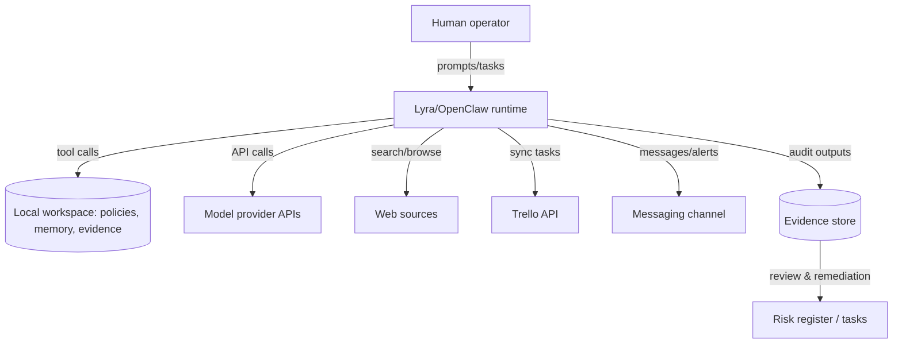
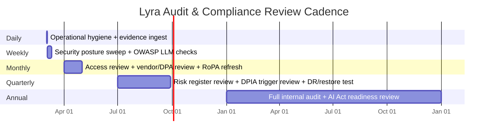

# Enhancing Lyra OpenClaw Audit Jobs and Scheduled Reviews for Swedish and EU Compliance

## Executive summary

The only enabled connector available for this research is **GitHub** (per your instruction), and repository analysis was restricted to **pek007/lyra-operating-system**. fileciteturn9file0L1-L1

The current Lyra OpenClaw operating system repository contains a comparatively strong *internal* governance spine for a one-person (or small) AI-assisted operating environment: explicit decision rights and “ask first / never” policy guardrails, job-based authority modeling, change-control templates (Work Orders and Change Artifacts), a risk register, incident logging, access/retention baseline, and a cadence policy. fileciteturn9file0L1-L1

Critically for auditability, the repo also implements **scheduled governance sweeps** (cron specifications) and **evidence ingestion** patterns that generate structured evidence records (Markdown + frontmatter) for at least security auditing outputs. fileciteturn12file0L1-L1 fileciteturn48file2L1-L1 fileciteturn9file5L1-L1

However, the audit job and scheduled reviews are presently optimized for internal policy/guardrail conformance and security posture—**not** for demonstrating compliance with **EU/Swedish legal regimes** (notably the **General Data Protection Regulation (GDPR)** and the **EU AI Act**), nor for producing the “audit-ready” compliance artifacts these regimes expect (records of processing, transfer assessments, DPIA, AI Act classification, technical documentation, post‑market monitoring, etc.). This gap is material because Lyra/OpenClaw is explicitly designed to orchestrate actions and integrate with external services, which is precisely where EU regulators focus: accountability, transparency, risk management, logging, and lifecycle governance. citeturn25view1 citeturn10search1

There are also repository-level audit hygiene gaps that will undermine formal assurance efforts if not addressed: multiple files are *referenced as required artifacts* by governance/process documents but appear missing (e.g., a canonical decision log), and at least one “done” task references a tool that was not retrievable from the main branch through the connector. fileciteturn62file0L1-L1 fileciteturn62file2L1-L1

Assumptions and unknowns (explicitly unknown per your request): deployment environment (local-only vs multi-user vs hosted), categories of personal data processed, whether client data is handled, whether the system is marketed/provided to others (which affects “provider” status under the EU AI Act), and which third‑party model providers are used operationally beyond what is implied in internal docs. These unknowns drive the legal classification and must be resolved early in the enhanced audit program. citeturn25view1 citeturn10search0

## Current state in the pek007/lyra-operating-system repository

### What exists today

Repository artifacts relevant to audit and governance include:

- **Governance layer** (system charter and policy register), plus job-based authority governance and lifecycle controls. fileciteturn9file0L1-L1
- **Operational processes**: intake/triage SOP, definition-of-done standard, work order and change artifact templates, and process registry. fileciteturn9file0L1-L1
- **Security-resilience baseline**: baseline checklist, retention & access baseline, access review log, incident log and incident mini-runbook, backup/restore checklists and DR plan. fileciteturn9file0L1-L1
- **Model/prompt governance**: a model routing policy and scorecard, prompt changelog, prompt drift review SOP. fileciteturn9file0L1-L1 fileciteturn12file0L1-L1
- **Automation hooks**: cron specifications for daily hygiene and autonomous governance sweeps; evidence ingestion; an architecture “fitness gate” that asserts the presence/shape of architecture governance artifacts. fileciteturn12file0L1-L1 fileciteturn75file1L1-L1
- **Evidence library** (structured monthly evidence files, at least for security audit outputs). fileciteturn48file2L1-L1

### The current audit job and scheduled review design

From the repository-level documentation and evidence structure, the current “audit job” appears to be implemented as a scheduled OpenClaw security/health workflow plus an evidence ingestion mechanism, governed by cron specs and “continuous improvement sweeps.” fileciteturn12file0L1-L1 fileciteturn48file2L1-L1

At a system level, this establishes a good foundation for *operational* assurance:

- recurrent task execution (“audit runs”),
- consistent output capture (evidence records),
- linkage to remediation tasks (via TASKS.md and/or your work tool integrations). fileciteturn48file2L1-L1 fileciteturn9file0L1-L1

But it is not yet structured as a **compliance audit program** in the EU sense: it lacks (a) a data-processing inventory, (b) legal basis mapping, (c) processor/subprocessor control evidence, (d) AI Act role+risk classification evidence, and (e) objective control testing tied to legal obligations.

### Inventory table: repo artifacts vs required audit elements (and gaps)

The table below compares what is currently present in **pek007/lyra-operating-system** with the minimum audit elements typically required for (i) robust internal assurance and (ii) EU/Swedish compliance readiness.

| Required audit element (minimum) | Repo artifacts that support it (examples) | Evidence readiness | Gap / risk if audited today |
|---|---|---|---|
| System purpose, scope, decision rights | Governance policy register & charter; job market model | Medium | Not mapped to legal roles (controller/provider/deployer) and lacks external transparency artifacts. fileciteturn9file0L1-L1 |
| Documented processes & change management | SOP intake/triage; DoD; WO/CA templates; process registry | Medium-High | Missing compliance-specific change gates (e.g., DPIA trigger; AI Act “substantial modification” trigger). fileciteturn9file0L1-L1 |
| Risk management register and mitigation tracking | Risk register; weekly metrics template | Medium | Risk register not explicitly tied to legal risk drivers (GDPR rights risk; AI Act fundamental-rights risk). fileciteturn9file0L1-L1 |
| Incident response and evidence | Incident log + incident mini-runbook | Medium | No explicit GDPR breach workflow (72-hour notification decision tree; evidence requirements). citeturn30search0 |
| Access control / access review | Retention & access baseline; access review log | Medium | No explicit mapping to GDPR Article 32 control objectives / evidence testing cadence. citeturn30search0 |
| Retention and deletion rules | GOV baseline exists as an internal policy | Low-Medium | Not expressed as GDPR-compliant retention schedule per processing activity; no DSAR/erasure workflow evidence. citeturn30search7 |
| Operational logging and tamper-evident evidence trail | Evidence ingestion script + evidence files; security review artifact | Medium | Evidence is not yet presented as immutable/tamper-evident; no chain-of-custody / integrity mechanism. citeturn26view2 |
| Scheduled internal audits and continuous improvement | Cron specs for governance sweeps; daily hygiene | Medium | Coverage is operational/security-biased; does not test GDPR or AI Act compliance obligations as controls. fileciteturn12file0L1-L1 |
| Vendor/processor management | Trello connector doc implies third-party processing; internal security tasks reference trust boundaries | Low | Missing processor DPAs, subprocessor list, transfer assessment, and vendor assurance evidence expected under GDPR. citeturn10search1 citeturn8search1 |
| GDPR accountability package | (Not observed as a coherent package in-repo) | Low | Missing RoPA, DPIA register, lawful basis mapping, privacy notice, DSAR workflow, transfer impact assessments. citeturn6search0turn8search1turn10search0 |
| EU AI Act compliance package | (Not observed as a coherent package in-repo) | Low | Missing AI Act role classification, risk-tiering, documentation (QMS, logs, technical documentation), post-market monitoring plan. citeturn25view1turn26view2turn27view0 |
| LLM/agent security threat model | Some implicit coverage via security push and “excessive agency” tasks | Low-Medium | Not benchmarked against modern GenAI threats (prompt injection, tool/plugin abuse, data leakage, overreliance). citeturn32search3turn31search6 |

**Repository-level hygiene gaps affecting audits**
- At least one governance document references a canonical decision log file that appears absent via connector retrieval, creating a traceability gap for Type‑1 decisions (high-stakes). fileciteturn62file2L1-L1
- A completed task references a lightweight link-check script, but it was not retrievable from the main branch through the connector, which undermines “auditability of automation” unless reconciled. fileciteturn62file0L1-L1

## Swedish and EU legal and regulatory requirements mapping

### GDPR and Swedish supplementary law: what must be auditable

**GDPR (Regulation (EU) 2016/679)** is enforced in Sweden with supplementary national provisions, primarily **Dataskyddslagen (2018:218)**. citeturn6search4turn10search0

For Lyra/OpenClaw, the most audit-relevant GDPR requirements are:

- **Accountability and demonstrability**: controllers must be able to demonstrate compliance with GDPR principles (“accountability”). citeturn30search7turn6search4
- **Security of processing**: implement appropriate technical and organizational measures; include confidentiality/integrity/availability/resilience, restorability, and regular testing. citeturn30search0turn30search12
- **Processor governance**: when using external services to process personal data, controllers must have processor agreements meeting GDPR requirements; Swedish supervisory guidance emphasizes the need for such agreements and documented instructions. citeturn10search1turn8search1
- **Records of processing activities (RoPA)**: maintain records describing purposes, categories, recipients, transfers, retention periods, and security measures. citeturn6search0turn6search8
- **Transfer compliance** (if data flows to third countries): EDPB recommendations define expectations for supplementary measures around transfers. citeturn9search3
- **Risk-based governance**: DPIA obligations and breach handling (including timeliness) become crucial when processing is high-risk, systematic, or involves sensitive categories; Swedish supplementary law frames supervisory authority powers and procedures. citeturn10search0turn9search2

### EU AI Act: applicability and obligations timeline

The **EU AI Act** is Regulation (EU) 2024/1689. It **applies from 2 August 2026**, with earlier partial applicability for certain chapters and governance structures (including earlier applicability of prohibitions and governance provisions). citeturn25view1

Key audit-relevant AI Act requirements (for *high-risk AI systems*, if Lyra falls into that category by use case) include:

- **Accuracy, robustness, and cybersecurity** requirements for high-risk AI systems. citeturn26view1
- **Provider obligations** including quality management system, technical documentation, and logging. citeturn26view2
- Evaluation and review cycles exist at EU level, with Commission evaluation/reporting obligations over time (relevant to anticipating evolving harmonised standards and guidance). citeturn27view0

Because Lyra/OpenClaw is an agentic “AI system” built on foundation models, your obligations under the AI Act depend on whether you are (a) a **provider** placing a system on the market, or (b) a **deployer** using a system under your authority, and whether the system is used in any **Annex III high-risk** context (e.g., employment decision support, credit scoring, critical infrastructure, education admissions). The audit program must therefore begin with classification and scoping. citeturn26view2turn25view1

### Mapping legal obligations to Lyra’s likely functions and data flows

Because deployment and data types are unknown, the mapping below uses a conservative model: Lyra may process (i) your personal and business data, (ii) client data, and (iii) third-party personal data contained in communications and documents.

#### Data flow model (conceptual)

#### Legal-to-function mapping table (GDPR + AI Act)

| Legal requirement | What it means in practice | Lyra function / component affected | Audit evidence you need |
|---|---|---|---|
| RoPA (records of processing) | Inventory all processing activities, recipients, transfers, retention, security measures | All data flows: local evidence store, memory store, third-party APIs | RoPA document + change log; evidence that it is reviewed and updated. citeturn6search0turn6search8 |
| Processor contracts (Art. 28) | DPAs with processors; documented instructions; subprocessor control | Model providers, task tools, messaging integrations, hosting providers | Signed DPAs, subprocessor lists, instruction annexes; vendor audit trail. citeturn10search1turn8search1 |
| Security of processing (Art. 32) | Security controls incl. resilience, restore, and testing | Local storage, credentials, integrations, audit jobs | Security control matrix; restore-test evidence; periodic control tests. citeturn30search0turn30search12 |
| Transfer compliance | If data leaves EEA, implement safeguards and supplementary measures | Any non-EEA API/service | Transfer impact assessments and applied safeguards evidence. citeturn9search3 |
| AI Act applicability | Decide provider vs deployer; assess high-risk classification | Overall system governance | AI Act role classification memo; scope decision; review cadence. citeturn25view1 |
| AI Act high-risk system obligations | QMS, technical documentation, logs, robustness/cybersecurity | Model/tool orchestration, monitoring pipeline | AI Act documentation pack; log retention; robustness/cybersecurity testing evidence. citeturn26view1turn26view2 |

## Best-practice audit benchmarks and how they apply

### AI and security management system standards

- **ISO/IEC 42001 (AI Management System)** provides a management-system approach (Plan‑Do‑Check‑Act) to govern AI risks, transparency, and continuous improvement. For Lyra, it provides a structure to turn “good internal OS discipline” into an auditable AI governance system (policies, objectives, controls, review cadence). citeturn31search2turn31search7
- **ISO/IEC 23894 (AI risk management)** provides guidance for integrating AI‑specific risks into organizational risk management—useful for extending your existing risk register approach into AI Act‑relevant risk domains (bias, robustness, human oversight, lifecycle monitoring). citeturn31search4

### NIST frameworks for AI risk and secure development

- **NIST AI RMF 1.0** offers a lifecycle risk framework for trustworthy AI and is well-suited to building an audit program that covers governance, mapping, measurement, and management across AI system lifecycle stages. citeturn31search0turn31search5
- **NIST AI RMF Generative AI Profile** operationalizes AI RMF specifically for generative AI risks—highly aligned with agentic systems and should be integrated into Lyra’s periodic reviews as a benchmark checklist. citeturn31search6
- **NIST SSDF (SP 800‑218)** defines secure software development practices; **SP 800‑218A** adds genAI/foundation-model secure development practices—directly applicable for hardening Lyra’s tooling, cron jobs, evidence ingestion, and any control panel code. citeturn32search5turn32search8

### GenAI/agent threat benchmark

- **OWASP Top 10 for LLM Applications** identifies key genAI security failure modes (prompt injection, insecure plugin design, excessive agency, sensitive information disclosure, overreliance). This is the most directly actionable “audit lens” for agentic tool-use risk and should be embedded into Lyra’s internal audit job as automated checks plus periodic manual review. citeturn32search3turn32search2

## Recommendations to achieve compliance-ready and robust auditing

The recommendations below assume you want an audit-and-compliance program that scales from “internal high-trust assistant” to “potentially multi-user or client-facing system” without re-architecture. Effort is estimated for a small team (S: 1–3 days, M: 1–3 weeks, L: 1–3 months). “Complexity” reflects coupling and requirement ambiguity.

### Prioritized recommendations table

| Priority | Recommendation | Effort | Complexity | What it enables (audit outcome) | Suggested control metric |
|---|---|---:|---:|---|---|
| P0 | Establish a **Legal & Data Processing Baseline Pack**: RoPA, vendor register, DPA inventory, data flow map, retention schedule by processing activity | M | Medium | GDPR accountability and regulator-facing readiness | % of processing activities captured; vendor coverage rate; review currency. citeturn6search0turn10search1 |
| P0 | Add an **AI Act Classification & Role Memo**: provider vs deployer, high-risk use cases, “substantial modification” triggers, timeline plan | S | Medium | AI Act readiness and avoids mis-scoping controls | Annual reclassification completed; triggers tested. citeturn25view1 |
| P0 | Extend cron-based audit job into **Compliance Sweeps** (GDPR + AI Act): automated checks for overdue RoPA/DPIA, vendor DPA presence, retention purge confirmation, log integrity | M | Medium | Turns compliance into recurring evidence-producing controls | % checks passing; SLA breaches; remediation cycle time. citeturn25view1turn30search0 |
| P0 | Implement a **PII/secret scanning control** across repo + workspace; treat findings as incidents with evidence and remediation tickets | M | Medium | Prevents personal data leakage and credential exposure | Mean time to detect; secrets found per month; time to rotate. citeturn30search0 |
| P1 | Introduce **tamper-evident evidence chain** (hash-chained evidence index and immutable archiving policy) | M | High | Stronger assurance and defensibility in audits | Evidence integrity verification success rate; missing-evidence exceptions. citeturn26view2 |
| P1 | Align security baseline and DR testing with GDPR Art. 32 expectations by formalizing “restore-test” cadence and evidence fields | S–M | Low | Converts operational hygiene into GDPR-grade control evidence | Restore test pass rate; RTO/RPO tracked; quarterly test completion. citeturn30search12 |
| P1 | Build an **AI governance layer** mapped to ISO/IEC 42001 + NIST AI RMF: policy-to-control mapping, internal audit plan, management review | L | Medium | Provides a complete, auditable management system for AI | Audit findings trend; control coverage; management review completion. citeturn31search2turn31search0 |
| P2 | Add OWASP LLM Top-10-based testing for “agentic risk”: prompt injection drills, tool authorization testing, overreliance checks | M | Medium | Makes agent safety auditable | Prompt injection test pass rate; unauthorized tool access attempts blocked. citeturn32search3 |

### Concrete technical and procedural changes to Lyra’s audit job

#### Compliance sweep design (augment existing cron pattern)

Conceptually, add two new scheduled jobs:

- **compliance:gdpr-sweep**
- **compliance:ai-act-sweep**

Each should:
1) run automated checks,  
2) emit a machine-readable result,  
3) generate an evidence Markdown record in the same schema family as current evidence files, and  
4) create remediation tasks when thresholds fail. citeturn6search0turn25view1

#### Recommended automated checks (examples)

- **RoPA freshness**: fail if RoPA not reviewed in 30 days; warn if new vendor/tool detected without RoPA update. citeturn6search0
- **DPA presence**: warn/fail if any vendor in vendor register lacks an associated DPA reference. citeturn10search1
- **Retention enforcement**: confirm retention purge job executed; confirm evidence for deletion/archiving actions. citeturn30search7
- **AI Act timeline awareness**: warn if AI Act classification memo older than 90 days, or if system scope changed without classification review. citeturn25view1
- **AI Act documentation completeness** (if high-risk): assert presence of QMS/tech documentation/logging policy artifacts aligned with Articles 16–17 expectations. citeturn26view2

## Proposed audit checklist and recurring review schedule

### Checklist structure

The checklist is designed to be (a) evidence-driven, (b) automation-friendly, and (c) mappable to both internal governance and external legal requirements.

**Evidence types**
- Configuration snapshots (tool policies, routing, permission envelopes)
- Logs and tool traces (with retention policy and integrity checks)
- Evidence records (single-source-of-truth per audit run)
- Control test outputs (restore tests, access reviews, security scans)
- Legal documents and approvals (DPAs, RoPA, classification memos, DPIAs)
- Change approvals (WO/CA packages) citeturn26view2turn10search1

### Recurring audit schedule (proposal)

### Checklist (condensed, audit-ready)

**Governance and scope**
- Confirm system charter/policy register reviewed and current; confirm decision rights and escalation rules. Evidence: signed review note + git history. citeturn31search2

**GDPR accountability pack**
- RoPA exists for all processing activities and updated within SLA; vendor register complete; DPAs present for all processors/subprocessors. Evidence: RoPA + vendor register + DPA links. citeturn6search0turn10search1turn8search1

**Security and resilience**
- Security controls meet GDPR Art. 32 expectations; restore tests executed; regular control testing evidenced. Evidence: restore test logs; security sweep results. citeturn30search12

**AI risk and safety**
- AI RMF/GenAI profile risks assessed; mitigations tracked; OWASP LLM Top-10 risks tested (prompt injection, excessive agency, sensitive data leakage, overreliance). Evidence: test runs + findings + mitigations. citeturn31search6turn32search3

**EU AI Act readiness**
- AI Act role classification memo current; if high-risk: documentation pack, logging policy, robustness/cybersecurity testing, and QMS evidence aligned with Articles 15–17. citeturn26view1turn26view2turn25view1

## Risk assessment matrix

The matrix focuses on risks that are both (a) realistic in agentic systems and (b) audit-critical under GDPR/AI Act.

| Risk | Likelihood | Impact | Primary mitigations | Evidence/control to audit |
|---|---:|---:|---|---|
| Prompt injection causes unintended tool actions (“excessive agency”) | Medium | High | Tool scoping, allow-lists, workflow approvals, OWASP LLM testing | OWASP Top 10 test evidence; blocked action logs. citeturn32search3 |
| Sensitive personal data leakage to external processors | Medium | High | Data minimization, redaction, DPA coverage, secret scanning | DPA inventory; scan logs; incident records. citeturn10search1turn30search0 |
| Missing/weak lawful basis and transparency for processed personal data | Low–Medium | High | RoPA + privacy notice + DSAR workflow | RoPA completeness; DSAR drills. citeturn6search0turn30search7 |
| Cross-border transfer noncompliance (where applicable) | Medium (unknown) | High | Transfer impact assessment + supplementary measures | Transfer assessment evidence. citeturn9search3 |
| Breach response not GDPR-timely or not evidenced | Low–Medium | High | Formal breach runbook + evidence templates | Incident timeline evidence, decision logs. citeturn30search0turn10search0 |
| AI Act misclassification (high-risk use case overlooked) | Medium (unknown) | Very High | Classification memo + triggers + periodic review | Classification review evidence; change triggers test. citeturn25view1 |
| Lack of AI Act high-risk documentation/logging/QMS (if applicable) | Medium (unknown) | Very High | Implement doc pack and QMS controls | Article 16–17 evidence pack; log retention policy. citeturn26view2 |
| Evidence integrity challenges (tampering or missing chain-of-custody) | Medium | Medium–High | Hash chaining, immutable archive, independent review | Integrity verification report; missing-evidence alerts. citeturn26view2 |

---

**Bottom line:** Lyra/OpenClaw already contains many of the “right shapes” for auditability (explicit governance, scheduled sweeps, structured evidence). The compliance upgrade is primarily about **(1) adding a legal/data processing layer, (2) mapping audit jobs to statutory control objectives, and (3) producing regulator-grade evidence packs on a cadence aligned to EU AI Act and GDPR expectations.** citeturn25view1turn6search0turn10search1