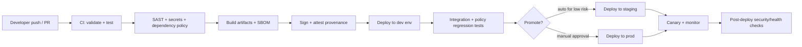
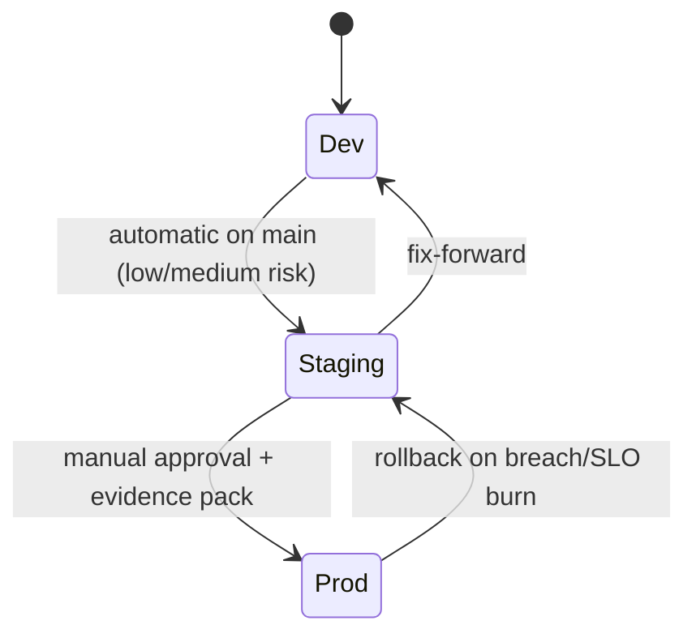
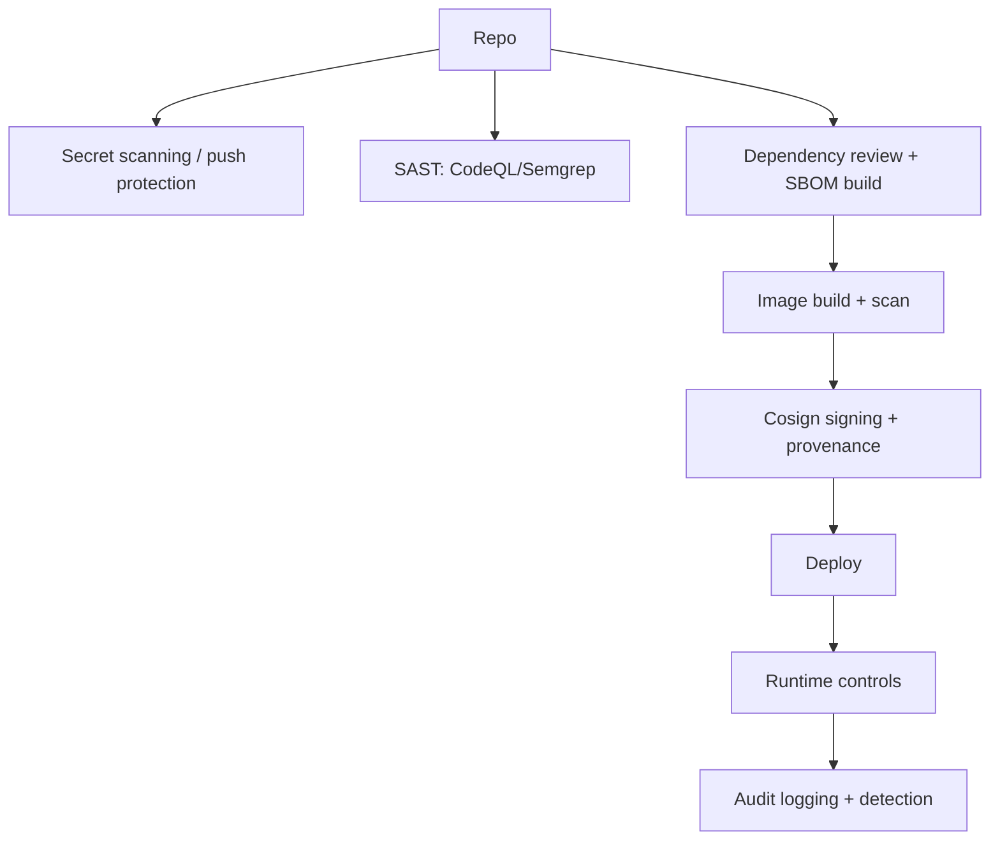

# DevSecOps Maturity Assessment and Improvement Roadmap for the Lyra OpenClaw Agent System

## Executive Summary

The entity["company","GitHub","code hosting platform"] repository `pek007/lyra-operating-system` is best understood as a **governance-and-operations “OS” workspace** (policies, SOPs, registries, runbooks, and a small set of automation scripts), rather than a conventional deployable application repository. The repo contains meaningful security and operational intent: explicit **change-control SOPs**, **skill governance policy-as-code**, **backup/restore and disaster recovery artifacts**, and recurring **cron job specifications** for health checks and governance sweeps. These are strong signals of *governance maturity and operational awareness* for an agentic system. fileciteturn79file2L1-L1 fileciteturn60file0L1-L1

However, the repo’s current DevSecOps maturity is constrained by missing “pipeline mechanics” that turn governance into enforceable controls: **no visible CI pipeline configuration**, no environment promotion workflow, no infrastructure-as-code (IaC) baseline, and limited automated testing beyond a small “thin-slice” script. The system appears to run primarily on a **local-first OpenClaw workspace** with cron-driven automation, with “sandboxing” expressed as a runtime concept and skill policy state, not through distinct *dev/test/stage/prod* infrastructure. fileciteturn60file0L1-L1 fileciteturn79file8L1-L1

For a small-to-medium team, the highest-leverage improvements are to (a) formalize a **secure SDLC control set** (mapped to entity["organization","NIST","us standards institute"] SSDF and entity["organization","OWASP Foundation","appsec nonprofit"] SAMM), (b) implement a **CI security gate** stack (secret scanning, SAST, dependency and license policy, SBOM generation), (c) introduce **environment segmentation and promotion** (even if still local-first to start), and (d) adopt **software supply chain integrity** patterns (SLSA-style provenance and artifact signing). citeturn12search48turn12search3turn0search3turn6search1turn6search0

## Repository Audit Findings

### Observed repo shape and “what’s actually here”

The repo includes a process registry enumerating many operational artifacts (policies, templates, runbooks, standards), plus a small `tools/` area used to automate evidence collection and operational syncing. fileciteturn36file5L1-L1

Key operational/security artifacts visible via repo search results include restore/backup runbooks and logs, skills governance and skill policy (YAML), cron specs for daily hygiene and autonomous governance sweeps, and multiple security baseline artifacts. fileciteturn60file0L1-L1 fileciteturn60file3L1-L1 fileciteturn79file8L1-L1 fileciteturn79file17L1-L1

There is evidence of **automation scripts** and a small **test-like thin-slice** (`tools/tde_kernel_slice_tests.py`). fileciteturn36file12L1-L1

### Findings table: artifacts, purpose, gaps

The table below is oriented around the user’s requested audit dimensions: code locations, branching model, CI/CD, IaC, environments, secrets, tests, and security tooling.

| File / path (examples) | Primary purpose | DevSecOps signal | Primary gaps / risks | Recommended improvement |
|---|---|---|---|---|
| `PROCESS_REGISTRY.md` fileciteturn36file5L1-L1 | Inventory of processes / policies and review cycles | Strong governance discipline; “process-as-code” direction | Registry isn’t automatically validated/enforced in CI; “review due” can drift | Add CI validators that fail PRs when required metadata is missing or review SLAs are breached (policy-as-code enforcement) |
| `AI_NATIVE_OPERATING_POLICY_V1.md` (listed in registry) fileciteturn36file5L1-L1 | Defines gates “before Active” and “before merge” | Clear intent for release gating | Gates appear procedural; lack of CI status checks that implement them | Encode gates as required PR checks (lint/tests/security scans/evidence linkage checks) mapped to risk class |
| `CRON_SPEC_DAILY_HYGIENE.md` fileciteturn79file8L1-L1 | Daily `openclaw doctor` + `openclaw security audit` job spec | Mature operational vigilance | Cron spec ≠ reproducible pipeline; weak promotion semantics; depends on local host | Convert cron specs into versioned, testable “ops pipelines” (GitHub Actions scheduled workflows + environment-specific runners), or keep local cron but manage its config via IaC/config mgmt |
| `CRON_SPEC_AUTONOMOUS_GOVERNANCE_SWEEPS.md` fileciteturn79file17L1-L1 | Nightly security sweep + daily improvement sweep with guardrails | Explicit “auto-fix allowed vs forbidden” is excellent for agent safety | “Auto-fix” is not governed by code-review gates if it writes to workspace; risk of silent drift | Require PR-based changes for anything beyond trivial formatting; pipeline enforces review for “policy boundary” files |
| `restore.md` fileciteturn60file0L1-L1 | Restore workflow incl. security audit, secrets restoration | Good resilience thinking | Unclear RPO/RTO enforcement; unclear offsite strategy; incomplete DR transparency due to inaccessible `DR-PLAN.md` from tool safety | Put DR plan into a controlled “redacted + appendix” pattern; verify backups via automated integrity checks; periodically execute restore drills with evidence |
| `backup-checklist.md` fileciteturn60file2L1-L1 and `OPS-001_BACKUP_RESTORE_RUNBOOK.md` fileciteturn72file3L1-L1 | Backup frequency, restore testing, RPO/RTO targets | Concrete operational targets (daily/weekly/monthly) | Not tied to monitored KPIs; no automated “backup freshness” alerting in CI/ops | Add automated checks that emit evidence and alert on backup staleness and restore test overdue |
| `RESTORE_TEST_LOG.md` fileciteturn72file9L1-L1 | Evidence of restore drill execution | Evidence-first culture emerging | Evidence format not standardized across all evidence types | Standardize evidence schema (YAML frontmatter + structured fields) and validate in CI |
| `skills-governance.md` fileciteturn60file3L1-L1 | Defines skill risk classes (S0–S3), default “sandbox+disabled”, approval gates | Strong agentic security posture; aligns with OWASP LLM risks (“Excessive Agency”, etc.) citeturn2view1 | Enforcement mechanism unclear (is policy mechanically enforced at runtime?) | Ensure policy is enforced by runtime policy engine; gate “skill enablement” via PR + required evidence pack |
| `skills-policy.yaml` (referenced in restore) fileciteturn60file0L1-L1 | Policy-as-code for skills: defaults, approvals, controls | Correct direction: machine-readable control plane | No CI validation, schema checking, or signing of policy bundles | Add schema validation, semantic checks, and signed “policy bundle” releases |
| Trello integration (`TRELLO_CONNECTOR_V1.md`, `tools/trello_sync.py`, `tools/trello_sync_runner.sh`) fileciteturn36file0L1-L1 fileciteturn36file1L1-L1 fileciteturn36file2L1-L1 | Task state sync to Trello | Shows real automation; secrets kept out of repo (sourced from local env file) | Local-only execution; hard-coded paths; no unit/integration tests; limited secret hygiene automation | Containerize jobs, replace absolute paths with config/env, add tests + dry-run/approval gates for writes |
| `.gitignore` (fetched directly) | Avoid committing runtime state/semi-sensitive artifacts | Correct to ignore `.openclaw/` and latest scan outputs | Still needs secret-scanning guardrails (push protection / gitleaks) | Enable platform secret scanning and add CI secret scanning |
| Branching model | Only `main` branch found in connector branch listing | Simple, trunk-like | Without PR checks/branch protection, main becomes a single point of failure | Adopt trunk-based development plus branch protection + required status checks citeturn4search5 |
| CI/CD configurations | No workflows observed in audit searches | Low maturity pipeline layer | No consistent security gating; no reproducible builds; no release artifacts | Implement GitHub Actions CI and environment deployments with protection rules citeturn4search6turn4search7turn5search3 |
| IaC / environment provisioning | No Terraform/CloudFormation/K8s manifests observed | Not yet infrastructure-managed | Infra drift, manual setup, hard-to-reproduce environments | Introduce minimal IaC: separate environments, remote state, secret manager integration citeturn8search3 |

### Current maturity snapshot across DevSecOps pillars

This is a pragmatic assessment anchored in OWASP SAMM-style thinking (measurable maturity model) and NIST SSDF control families. citeturn12search4turn12search48

| Pillar | Current (observed) | Maturity | Notes |
|---|---|---:|---|
| Governance & change control | Strong docs, explicit gates, evidence mindset | Medium | Good “paper controls,” missing “automated controls” |
| CI automation | Not evident | Low | Biggest gap; blocks scaling and safety enforcement |
| Testing | A few scripts, no harness ecosystem | Low | Needs unit + regression + policy tests |
| Secrets management | Good intent (avoid plaintext; externalize secrets), but local-first | Low–Medium | Should be standardized (vault/KMS/Secret Manager + OIDC) |
| Supply chain security | Not evident | Low | Introduce SBOM + provenance + signing |
| Environment segregation | Sandbox concept exists; infra envs not formalized | Low | Should define dev/stage/prod with promotion |
| Runtime security & monitoring | Cron health checks; security audit usage | Medium intent, low platform | Needs centralized logs, RBAC, runtime guardrails |

## Current Deployment and Environment Segregation

### What’s evidenced vs what’s missing

**Evidenced patterns (repo-derived):**
- The system appears to be operated as a **local-first OpenClaw workspace** (restore and backup runbooks reference restoring `~/.openclaw/workspace/` and validating OpenClaw health/security). fileciteturn60file0L1-L1
- Operational jobs are described as **cron specs** that run OpenClaw health checks and security audits on a schedule, and announce results to messaging channels. fileciteturn79file8L1-L1 fileciteturn79file17L1-L1
- “Sandbox” is defined as a *runtime safety mode* (skills default to sandbox/disabled per policy docs), not as a distinct infrastructure environment. fileciteturn60file3L1-L1
- Secrets are referenced as being managed outside the repo (restore phase includes “restore secrets safely”; task sync script sources a local env file). fileciteturn60file0L1-L1 fileciteturn36file2L1-L1

**Not specified (must be treated as unknown):**
- Cloud provider and hosting target (local VM? Kubernetes? serverless?).
- Whether OpenClaw gateway is exposed beyond localhost.
- Whether there is an artifact registry, deployment orchestrator, or release tagging discipline.
- Compliance target (SOC 2, ISO 27001, GDPR, EU AI Act alignment, etc.).

### Practical interpretation of “environments” in the current state

Right now, environment separation looks more like:
- **Sandbox**: restricted tool execution, new skills disabled by default, evaluation flows. fileciteturn60file3L1-L1
- **Production**: the “main runtime” (local OpenClaw configuration, cron jobs enabled, higher-trust tools enabled).

This is a reasonable early-stage pattern for a single-operator or very small team, but it does not provide:
- deterministic promotion (dev → staging → prod),
- blast-radius containment,
- reproducible infrastructure,
- or reliable audit boundaries (who changed what, where, and what was deployed).

## Best-Practice Baseline for DevSecOps in AI Agent Systems

This section prioritizes practices that are high-leverage for small-to-medium teams, with explicit relevance to agentic AI risk surfaces.

### Secure SDLC controls as the backbone

Use entity["organization","NIST","us standards institute"] SSDF (SP 800-218) as the baseline “secure SDLC” control set: it is designed to integrate into any SDLC and standardizes practices across “Prepare the Organization,” “Protect the Software,” “Produce Well-Secured Software,” and “Respond to Vulnerabilities.” citeturn12search48turn0search3turn12search0  
Given the 2025 Rev.1 draft (SSDF v1.2), it’s also worth tracking updates and mapping your controls once v1.2 finalizes. citeturn0search5turn1view1

For maturity measurement and roadmap structure, entity["organization","OWASP Foundation","appsec nonprofit"] SAMM v2 provides a practical maturity model (levels 1–3) and a toolbox mindset for improvements. citeturn12search3turn12search4turn12search9

### AI-agent-specific security: treat agency as the unique “hazard class”

Agent systems expand the attack surface beyond classic web-app risks (they execute tools, call external systems, and transform untrusted inputs into actions). The entity["organization","OWASP Foundation","appsec nonprofit"] GenAI project’s **LLM Top 10 for 2025** explicitly calls out risks like **Prompt Injection (LLM01)**, **Supply Chain (LLM03)**, **Excessive Agency (LLM06)**, and **Unbounded Consumption (LLM10)**—all directly relevant to OpenClaw-style tool execution and automation. citeturn2view1turn1view0

Complement that with entity["organization","NIST","us standards institute"] AI RMF 1.0 (Govern/Map/Measure/Manage) and the GenAI Profile, which are designed to be operationalized by organizations of different sizes and to structure risk management across the AI lifecycle. citeturn7search1turn7search3turn7search7

If you need a management-system umbrella for external trust/audit readiness, ISO/IEC 42001 establishes requirements for an AI management system (AIMS): policies/objectives/processes for responsible AI development, provision, and use. citeturn11search2

### Branching and release strategy for small-to-medium teams

**Trunk-based development** is a strong fit for your repo’s apparent “single mainline” posture, but it only works safely with (a) short-lived branches, (b) mandatory CI, and (c) feature-flag or policy-flag rollouts for risky behavior changes. citeturn4search5

### Environment segregation (dev/test/stage/prod) as a security control

A practical environment model for agent systems:
- **Dev**: fast iteration; all outbound tool actions blocked by default; synthetic credentials.
- **Test**: deterministic regression harness; policy tests; tool mocking.
- **Staging**: production-like infrastructure with limited data; controlled access; canary rollouts.
- **Prod**: locked down; manual approvals for high-risk policy changes; full audit logging.

On entity["company","GitHub","code hosting platform"], GitHub Actions **Environments** and protection rules can model this, including approvals and environment-scoped secrets. citeturn4search6turn4search7

### Supply chain integrity: SBOM + provenance + signing

For teams shipping agent runtimes (containers, binaries, policy bundles), the modern baseline is:
- **SBOM (Software Bill of Materials)** generation in CycloneDX or SPDX formats,
- **vulnerability scanning** of dependencies and container images,
- and **provenance** (SLSA-style attestations) plus artifact signing.

CycloneDX is now an Ecma standard (ECMA-424) and explicitly supports broader BOM use cases including AI/ML bill of materials. citeturn7search2turn7search0turn7search5  
SPDX is an ISO/IEC standard for SBOM representation. citeturn7search6  
SLSA provenance provides a structured predicate for describing how artifacts were built (and what’s trusted). citeturn0search2turn6search1turn6search2  
For signing and verification, Sigstore Cosign enables keyless OIDC-based signing and verification patterns for container artifacts. citeturn6search3turn6search0

### Runtime security and policy enforcement

If you adopt container orchestration (Kubernetes), baseline hardening can use:
- Kubernetes Pod Security Standards (Privileged/Baseline/Restricted) and enforcement via admission. citeturn8search0turn8search5turn8search1
- Runtime detection via Falco (CNCF graduated runtime security tool). citeturn8search2turn8search4turn8search7

## Gap Analysis and Prioritized Remediation Roadmap

This roadmap is organized by “highest risk reduction per unit effort,” assuming no constraints on cloud/provider and a small-to-medium team.

### Roadmap overview

| Priority | Initiative | Why it’s first | Effort | Complexity |
|---|---|---|---:|---:|
| P0 | Establish CI security gates + branch protection | Converts governance intent into enforceable controls | Low–Med | Low |
| P0 | Secrets prevention: push protection + secret scanning + gitleaks | High impact, prevents catastrophic credential leaks | Low | Low |
| P1 | Policy-as-code validation + regression harness | Prevents drift in agent permissions and governance files | Med | Med |
| P1 | Dependency and license policy + SBOM | Supply chain risk is high for agent stacks | Med | Med |
| P2 | Environment segregation + promotion (dev/stage/prod) | Enables controlled rollout and blast-radius isolation | Med–High | Med–High |
| P2 | IaC baseline + secret manager integration | Reproducible infra; auditable deployments | High | High |
| P3 | Artifact signing + provenance (SLSA) | Hardens build integrity and reduces CI compromise risk | Med | Med–High |
| P3 | Runtime security + centralized observability | Detect policy violations/abuse in production | High | High |

### Detailed remediation steps with concrete actions and tool options

#### P0: “Make main safe” (controls that unblock everything else)

Implement these immediately:
- **Branch protection / repository rules**: require PR reviews, require status checks, prohibit direct pushes to `main`. (Repository settings; not in code.)
- Add GitHub Actions CI with **required checks**:
  - Secrets scanning (platform + CI),
  - basic lint (Markdown + YAML),
  - “policy bundle validation” checks (schemas, required metadata),
  - unit tests for scripts (where applicable).

Tooling options:
- Platform-native: GitHub CodeQL/secret scanning/Dependabot. citeturn5search3turn5search1turn5search5
- OSS: Gitleaks Action for secret scanning in CI. citeturn9search1

#### P0: Secret prevention (treat as existential)

- Enable **push protection** and secret scanning; it blocks pushes with detected secrets and creates an alert when bypassed. citeturn5search2turn5search1
- Add CI secret scanning (e.g., gitleaks) for defense-in-depth. citeturn9search1

#### P1: Policy-as-code validation and agent safety regression tests

Given your repo’s emphasis on agent permission envelopes and skill policies, treat these as first-class “control plane code.” fileciteturn60file9L1-L1 fileciteturn60file3L1-L1

Concrete steps:
- Define schemas for key YAML/Markdown frontmatter docs.
- Implement validators that fail CI on:
  - missing required fields,
  - expired “next review” dates for critical policies,
  - unsafe changes (e.g., enabling high-risk skills without evidence pack reference),
  - “runtime boundary” file modifications without approval labels.

Agentic safety regression tests should explicitly cover OWASP LLM Top 10 agent risks:
- prompt injection defense tests around tool invocation (LLM01),
- excessive agency controls around outbound actions (LLM06),
- unbounded consumption spend guardrails (LLM10). citeturn2view1

#### P1: Dependency control, SBOM, and vulnerability management

Even if today’s repo has few code dependencies, your *system* (OpenClaw + skills + future services) will. Make SBOM and scanning standard now:
- SBOM format: CycloneDX or SPDX. citeturn7search2turn7search6
- Dependency change gating: GitHub dependency review action blocks vulnerable or invalid-license dependency changes. citeturn10search1
- Vulnerability scanning options:
  - Trivy (images, repos, IaC scans; also SBOM generation). citeturn9search4turn10youtube48
  - Grype (image/filesystem/SBOM scanning). citeturn9search2turn9search6

#### P2: Formalize environments and promotion

Use GitHub Actions Environments to model `dev`, `staging`, `prod` with:
- environment-scoped secrets,
- manual approvals for `prod`,
- optional custom deployment protection rules. citeturn4search6turn4search7

For local-first reality, you can still adopt environment segregation by running:
- separate service instances (different workspace roots),
- separate secret namespaces,
- separate scheduled jobs,
- and separate policy bundles per environment.

This aligns naturally to your documented “domain isolation” principle (separate instances, separate secrets namespace). fileciteturn60file10L1-L1

#### P2: Infrastructure as Code baseline

Introduce IaC once you have at least one deployable service (e.g., control panel, policy server, task service). For a small team:
- Start with a minimal baseline (network + compute + secret manager + logs).
- Separate environments by:
  - separate accounts/projects and/or
  - separate Terraform workspaces/states.

HashiCorp recommends splitting workspaces to reduce blast radius and state leakage; remote state sharing should be explicit. citeturn8search3

#### P3: Build integrity (artifact signing and provenance)

Adopt supply chain integrity patterns as soon as you ship artifacts:
- SLSA provenance for builds (attest how/where built). citeturn6search1turn0search2
- Sign artifacts (containers, policy bundles) with Sigstore Cosign; verify in deploy steps. citeturn6search3turn6search0

Also add CI runner hardening to reduce “CI compromise” risks:
- Harden-Runner provides runner egress/process/file monitoring for GitHub Actions. citeturn10search0

## Target-State Architecture and Workflows

### Proposed CI/CD pipeline with security gates



Security intent: gates should align to SSDF practices (secure build pipeline, verify artifacts, respond to vulnerabilities). citeturn12search48turn0search3

### Environment promotion model



Use GitHub “Environments” to implement manual approvals and environment protection rules for `prod`. citeturn4search6turn4search7

### Security controls placement in the delivery lifecycle



Relevant primary references:
- GitHub secret scanning & push protection citeturn5search2turn5search1  
- CodeQL analysis workflows citeturn5search3turn11search0  
- Dependency review action citeturn10search1  
- SLSA provenance citeturn6search1turn0search2  
- Cosign signing/verification citeturn6search3turn6search0  
- Runtime detection via Falco (if Kubernetes) citeturn8search4turn8search2  

## Reference Implementations

### Sample GitHub Actions pipeline snippet

This is a minimal-but-realistic starting point for *this repo* (docs + scripts + policy files). It shows where to plug in additional scans later.

```yaml
name: ci

on:
  pull_request:
  push:
    branches: [main]

permissions:
  contents: read
  security-events: write

jobs:
  validate:
    runs-on: ubuntu-latest
    steps:
      - uses: actions/checkout@v4

      # Secret scanning (defense-in-depth; also enable GitHub push protection separately)
      - name: Run gitleaks
        uses: gitleaks/gitleaks-action@v2
        env:
          GITHUB_TOKEN: ${{ secrets.GITHUB_TOKEN }}

      # Dependency policy (only meaningful once manifest/lockfiles exist)
      - name: Dependency review
        uses: actions/dependency-review-action@v4

      # Optional: CodeQL for supported languages
      # Configure in advanced setup as needed.
      # - uses: github/codeql-action/init@v4
      # - uses: github/codeql-action/analyze@v4

      - name: Validate policy files
        run: |
          # Example placeholders: implement these scripts in tools/
          python3 tools/validate_process_metadata.py
          # python3 tools/validate_skills_policy.py
          # python3 tools/validate_cron_specs.py

      - name: Run thin-slice tests
        run: |
          # Example: existing test-like scripts (adjust to your repo reality)
          python3 tools/tde_kernel_slice_tests.py
```

Why these controls:
- Gitleaks provides CI-based secret detection. citeturn9search1  
- GitHub dependency review blocks vulnerable dependency introductions. citeturn10search1  
- CodeQL is GitHub’s standard SAST workflow integration. citeturn11search0turn5search3  

### Sample environment provisioning patterns (Terraform)

Because cloud/provider is unspecified, the most useful IaC example is a **pattern**, not a full AWS/GCP/Azure deployment. This illustrates:
- separate env state,
- secret-manager references,
- consistent tagging.

Concepts are consistent with Terraform workspace best practices (limit sensitive leakage, partition scope). citeturn8search3

```hcl
# terraform/README.md (conceptual)
# - One repo, multiple environments
# - Separate state per environment (remote backend strongly recommended)
# - Keep secrets out of state where possible; reference secret-manager IDs/ARNs only.

locals {
  env = var.environment # dev | staging | prod
  tags = {
    system = "lyra-openclaw"
    env    = local.env
  }
}

module "runtime" {
  source = "./modules/runtime"
  environment = local.env
  tags        = local.tags

  # Reference a secret by ID; DO NOT inline secret values here.
  # The runtime should fetch secrets at runtime via its identity.
  secret_ref_model_api_key = var.secret_ref_model_api_key
}
```

### Secrets integration options (choose based on hosting target)

If you deploy into Kubernetes, HashiCorp recommends file-based secret injection (agent/sidecar or CSI) instead of relying on plaintext Kubernetes secrets. citeturn12search2turn12search6

If you stay local-first, adopt a consistent approach:
- OS keychain, 1Password CLI, or Vault in “local dev” mode,
- mapping “dev/stage/prod” to *distinct secret namespaces*,
- and never “dot-env in repo” unless encrypted.

### Supply chain integrity snippets (sign + verify)

Cosign supports keyless signing with OIDC identities and verification through issuer/identity constraints. citeturn6search3turn6search0

Example (conceptual steps, to be embedded in CI deploy jobs):
- Build artifact
- Generate SBOM
- Sign + attest
- Verify before deploy

## Metrics, KPIs, and Security Controls to Track Maturity

### Deployment and DevOps performance metrics

Use DORA metrics as the delivery health baseline (not for individual performance measurement). DORA has evolved; as of 2024 it describes five metrics grouped into throughput and instability, and it documents definitional changes through 2026. citeturn3search0

Recommended KPIs:
- Change lead time (commit → prod)
- Deployment frequency
- Failed deployment recovery time
- Change fail rate
- Deployment rework rate citeturn3search0

### DevSecOps security KPIs

Track these continuously:
- Mean time to remediate vulnerabilities (critical/high)
- % repos with push protection enabled
- Secret leak incidents (count; severity; time-to-rotate)
- Dependency policy violations blocked in PR
- SAST findings introduced vs resolved per release
- SBOM coverage (% of releases with SBOM attached)
- Provenance coverage (% of releases with attestations)

### Agent-system-specific safety and governance KPIs

Map these to OWASP LLM Top 10 2025 categories and AI RMF “Measure”:
- Unauthorized tool invocation attempts blocked (LLM06 Excessive Agency) citeturn2view1
- Prompt injection escalations detected and mitigated (LLM01) citeturn2view1
- Spend anomalies / cost guardrail triggers (LLM10 Unbounded Consumption) citeturn2view1
- Policy compliance: % of high-risk changes with required evidence pack and approval record
- Drift: number of “policy boundary” files changed outside PR workflow

### Prioritized security controls and pipeline integration

Controls are ordered roughly by risk-reduction leverage for agentic systems:

- **Secret scanning + push protection**: prevent credential leaks at source control boundaries. citeturn5search2turn5search1  
- **SAST**: CodeQL for supported languages; Semgrep optional for broader rulesets; enforce on PR. citeturn11search0turn5search3  
- **Dependency scanning + license policy**: dependency-review action + SBOM generation. citeturn10search1turn7search2turn7search6  
- **Container/image scanning** (when you containerize): Trivy/Grype at build time; fail build on critical vulns. citeturn9search4turn9search2  
- **Supply chain protections**: provenance (SLSA) + signing (Cosign) + verify on deploy. citeturn6search1turn6search3turn6search0  
- **Environment protection & approvals**: GitHub Environments + custom deployment protection rules for prod. citeturn4search6turn4search7  
- **Runner hardening**: monitor CI runner behavior/egress; reduce pipeline compromise blast radius. citeturn10search0  
- **Runtime protection** (if Kubernetes): Pod Security Admission + Falco runtime detection. citeturn8search5turn8search4turn8search2  
- **RBAC + audit logging**: least privilege for deploy identities; immutable audit logs aligned to AI RMF and ISO 42001 management-system expectations. citeturn7search1turn11search2  

### Prioritized checklist

High-signal checklist, ordered by dependency and leverage:

- Enable GitHub secret scanning + push protection; add CI gitleaks.
- Add branch protection: PR required, status checks required, no direct pushes to `main`.
- Implement CI: validate policy files, run “thin-slice” tests, add SAST and dependency review.
- Define environment model (`dev/staging/prod`) using GitHub Environments + approvals.
- Add SBOM generation and vulnerability scanning; enforce “no new criticals” gate.
- Introduce IaC baseline (minimal deploy target + secret manager), with separate env state.
- Add artifact signing + provenance; verify on deploy.
- Implement runtime monitoring and incident response loop (logs, alerts, kill-switch).
- Map controls to SSDF + OWASP LLM Top 10 + AI RMF (and ISO 42001 if audit-ready posture is desired). citeturn12search48turn2view1turn7search1turn11search2