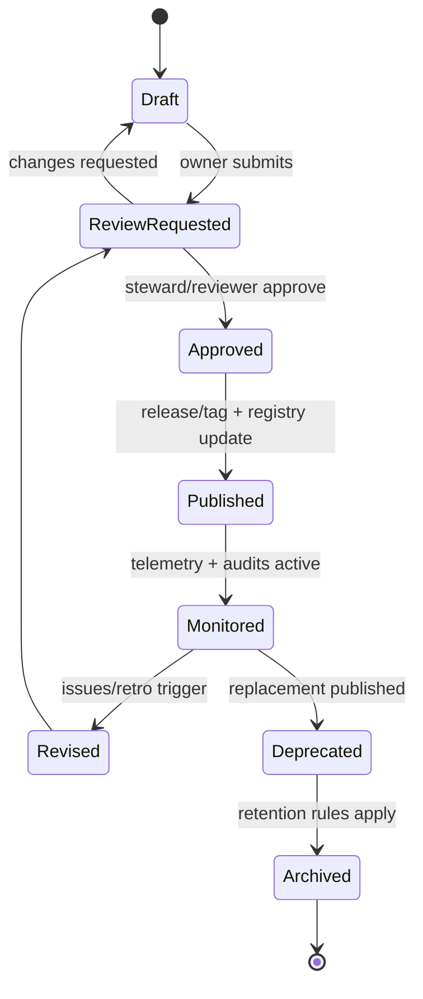
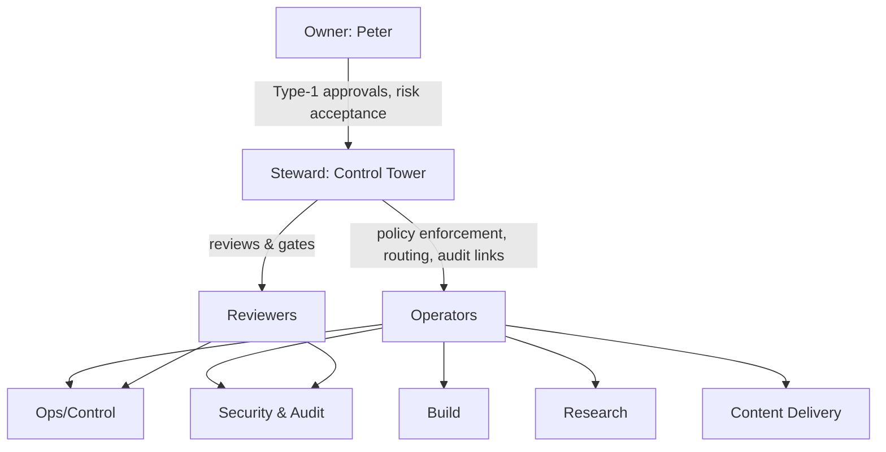

# Deep research on Lyra OpenClaw agent-system processes

## Executive summary

Lyra’s current “operating system” repo (pek007/lyra-operating-system) already contains a surprisingly coherent governance spine: a **Control Panel index**, **registries**, **SOPs/standards**, and an explicit shift toward **machine-readable process artifacts** (YAML frontmatter / registry schemas) and **audit evidence** (doctor/security evidence records). fileciteturn32file0 fileciteturn34file0 The repo also moves beyond documentation into code: a Trello API sync script, an evidence-ingestion script, and an early “TDE kernel thin-slice” scaffold with tests and evidence. fileciteturn33file0 fileciteturn34file0 fileciteturn17file0

At the same time, Lyra’s process system is at an inflection point: it has *many* governance artifacts, but they are not yet fully consolidated into a single “process-as-code” framework with consistent metadata, versioning semantics, automated validation, CI gates, and runtime rollout controls. The repository shows **multiple parallel conventions** (pure Markdown, Markdown+YAML, and evidence records embedding JSON inside frontmatter fences), which will cause drift unless normalized. fileciteturn34file0

The most leverage-rich next step is to formalize **Process-as-Code** around: (1) a single canonical process schema (metadata + lifecycle state + owners + control objectives + test requirements), (2) validation and link-check CI, (3) controlled rollout patterns (feature flags / staged activation) for agent behaviors, and (4) measurable service levels for agent reliability and governance compliance. This aligns naturally with established governance and risk practices (e.g., NIST AI RMF “govern/map/measure/manage,” ISO/IEC 42001 management-system thinking, OWASP LLM Top 10 risks, and SRE-style SLO/error-budget mechanisms). citeturn10search3turn10search5turn10search13turn10search0turn10search7turn10search9

## Current state of Lyra in the repo

This section inventories what exists *as evidenced in the repo history and files retrieved*. Where I could not deterministically enumerate the entire repo tree (connector limitations), I rely on commit-level artifacts that include full file contents for the relevant docs/scripts.

### What exists today

Lyra’s repo is structured around a “control tower” concept:

- **Control Panel** as the single-pane index for core OS artifacts and cadence. fileciteturn32file0  
- **Registries** to enforce inventory thinking: principles, systems, processes, risks, situational awareness. fileciteturn32file0  
- **Core workflow SOP and standard** defining the operational state machine and “definition of done.” fileciteturn25file0  
- **Decision and design doctrines** that explicitly distinguish reversible vs irreversible changes and prioritize modularity, auditability, and continuous improvement. fileciteturn29file0  
- **Security/resilience baseline**: incident log template, incident runbook, backup/restore runbook, retention/access baseline, security checklist and security review notes. fileciteturn30file0turn36file0  
- **Multi-agent operating model** (v1 + refinement v1.1) and supporting governance docs (execution semantics, permission envelopes, routing scorecard). fileciteturn31file0turn35file0turn36file0  
- **AI-native software delivery policy** and “work order / change artifact” templates that introduce explicit gates before Active work and before merge. fileciteturn24file0turn23file0  
- **Task system plumbing**: a “TASKS.md temporary Kanban” and a Trello sync script/spec that enforces state mapping and stable IDs. fileciteturn26file0turn33file0  
- **Evidence & schema pipeline**: a data contract for registries (agent contracts, routing rules, evidence records, change records), a Control Tower views spec, and an evidence-ingestion script producing timestamped evidence records from OpenClaw doctor/security commands. fileciteturn34file0  
- **OpenClaw config change-control SOP** with explicit risk classification, approval requirements, validation steps, and rollback triggers. fileciteturn37file0  
- **Delivery and learning meta-processes**: a generic “3PP” (third-party provider) delivery flow plus a two-loop learning framework separating OS improvements from project-local improvements. fileciteturn38file0  

Finally, the repo has a more “software-like” kernel emerging:

- A “TDE kernel thin-slice” scaffold with models, SOPs, tests, and evidence entries, suggesting a move from doc-governed operations into testable, executable governance logic. fileciteturn17file0  

### What this implies about Lyra’s maturity level

In governance terms, Lyra is already operating as a lightweight management system:

- **Inventory-first governance** (registries, documentation as source of truth). fileciteturn32file0turn30file0  
- **Explicit gating** (AI-native delivery gates; config change-control). fileciteturn24file0turn37file0  
- **Traceability as a design goal** (work order → change artifact → tests/evidence). fileciteturn24file0turn23file0  
- **Risk/evidence loop** (risk register + security evidence ingestion + reviews). fileciteturn30file0turn34file0turn36file0  

That is materially aligned with the *intent* of management-system standards such as entity["organization","ISO","standards body"] ISO/IEC 42001 (establish/implement/maintain/continually improve an AI management system). citeturn10search13turn10search1

### Gaps and technical debt visible in the repo

These gaps are the highest-impact ones suggested by the artifacts:

- **Schema inconsistency / “process metadata drift.”** The repo states a format decision (“YAML frontmatter in Markdown files”) but evidence records embed JSON between `---` fences, which is easy to mis-parse and hard to validate uniformly. fileciteturn34file0  
- **No unified process lifecycle state machine.** Individual docs have statuses (“Active/Planned”), review dates, and approval/ownership patterns, but there is no single standard for Draft → Review → Approved → Published → Deprecated with required transitions and controls. fileciteturn32file0turn30file0turn37file0  
- **Incomplete automation for governance compliance.** You already have link-checking on the task list and “smoke tests for tools parsers” as a named improvement item, but there is not yet a repo-wide automated validation gate for: schema correctness, review due dates, required metadata fields, and audit-trail completeness. fileciteturn23file0turn17file0  
- **Runtime rollout controls are mostly procedural, not technical.** The agent permission envelopes and execution semantics define boundaries, but there is not yet a robust “policy enforcement layer” that gates tool permissions or outbound actions as code (beyond human process). fileciteturn36file0turn34file0  
- **Observability is specified but not implemented.** “Control Tower MVP views” defines “Now/Next/Watch/Change Feed” and includes data sources like evidence entries and git summaries, but there is no verified implementation in the retrieved artifacts showing the UI/service. fileciteturn34file0  
- **Path portability issues.** The evidence-ingest script hard-codes an absolute workspace path (`/Users/lyra/.openclaw/workspace`), which is brittle for multi-machine or containerized execution. fileciteturn34file0  
- **The repo is mid-migration from “docs-only governance” to “kernelized governance.”** The TDE kernel slice is a good direction, but it introduces a second governance substrate; without strong alignment, you risk duplicating policies in docs and code. fileciteturn17file0turn24file0  

## Best-practice blueprint for AI-agent process design and governance

A high-performing AI-agent operating system typically needs both **management-system governance** (policies, ownership, auditability) and **software delivery mechanics** (versioning, CI/CD, testability, observability). Your repo already contains early forms of both. fileciteturn24file0turn34file0

### Governance backbone: align to a standard model

A concrete, implementable reference model is to map your process governance to the functions in entity["organization","NIST","us standards institute"] AI RMF 1.0: **Govern → Map → Measure → Manage**, with “Govern” as the cross-cutting layer. citeturn10search3turn10search5

In practice for agent systems:

- **Govern:** process ownership, approval rights, tool permission policy, exception handling, audit log requirements, and risk acceptance rules.  
- **Map:** classify agent use-cases (ops/research/build/content), data classes, external action surfaces, and dependency graphs (which tools/models/3PPs are touched).  
- **Measure:** define metrics for reliability (tool success rates), safety (policy violations), and governance compliance (review currency, linkage completeness).  
- **Manage:** implement controls (feature flags, allowlists, approval gates), and continuous improvement loops with explicit corrective actions.

Your repo already encodes multiple pieces of this (permission envelopes, change-control, evidence ingestion, learning loops). fileciteturn36file0turn37file0turn34file0turn38file0

### Security and “excessive agency” controls

Agentic systems are uniquely exposed to the risk class that entity["organization","OWASP Foundation","appsec nonprofit"] calls “Excessive Agency” (granting unchecked autonomy) plus prompt injection, sensitive information disclosure, insecure plugin/tool design, and unbounded consumption. citeturn10search0

Your repo already mitigates this directionally via:

- Approval requirements for outbound actions in agent contracts and permission envelopes. fileciteturn34file0turn36file0  
- Explicit rules for external sends in security baseline (“External-send actions require explicit intent/approval”). fileciteturn30file0turn36file0  
- Config change-control with rollback and validation steps. fileciteturn37file0  

Best practice is to back these procedural controls with technical enforcement:

- **Capability-based tool access** (least privilege) enforced by runtime policy (not only doc).  
- **Outbound action guardrails**: allowlist recipients + content classification + human approval workflow.  
- **Prompt-injection handling**: strict separation of untrusted content, tool output sanitization, and structured tool-call schemas.

## Process lifecycle and roles

### Lifecycle model

Below is a recommended lifecycle that is compatible with your existing “registry + review dates” approach, while making transitions explicit and enforceable.



This lifecycle is meant to be “process-as-code”: transitions should have validations (required metadata, review quorum for high-risk changes, etc.). It also naturally implements the “90-day trial” and “review dates” style already present in your operating policy and registries. fileciteturn24file0turn32file0turn30file0

### Roles and responsibilities

Lyra’s repo already implies a role model: Peter as accountable owner, Lyra as responsible control tower, plus specialist agents. fileciteturn24file0turn31file0turn36file0

To make this operational at expert level, define roles as “jobs” with explicit decision rights:



Recommended role definitions (tight, RACI-compatible):

- **Owner (Accountable):** approves Type 1 changes; accepts residual risk; sets priorities; owns budget and external commitments. fileciteturn24file0turn29file0  
- **Steward (Responsible for governance integrity):** maintains process registry truth, enforces gates, ensures traceability, runs governance reviews. This maps to your “Control Tower” concept. fileciteturn24file0turn31file0turn34file0  
- **Reviewer (Assurance):** performs independent review for high-risk areas (security, outbound actions, data handling). fileciteturn30file0turn36file0turn37file0  
- **Operator (Executor):** runs the process steps (cron jobs, evidence ingests, scripts), raises incidents, and writes evidence. fileciteturn30file0turn34file0  

A key “expert move” is to require that **every process has exactly one Owner and one Steward**, and that “review due” is treated as an operational alert, not a soft reminder.

## Tooling and automation recommendations

Lyra already has the correct primitives: registries, schemas, scripts, and governance docs. The goal is to turn them into a cohesive **process platform**.

### Repo structure recommendation

Your repo currently mixes root-level OS docs with `knowledge/registries` and evidence records, and is starting to add an `os/` code substrate (TDE kernel). fileciteturn32file0turn34file0turn17file0

A structure that scales to “process-as-code” while staying close to your existing conventions:

- `processes/`  
  - `sops/` (human-executable SOPs)  
  - `policies/` (governance constraints + decision rights)  
  - `standards/` (definitions, formats, quality bars)  
  - `templates/` (WO/CA/process templates)  
- `registries/` (machine-readable inventories; generated views live here)  
- `evidence/` (append-only, timestamped; immutable by convention)  
- `controls/` (security controls, audit checklists, risk treatments)  
- `runtime/` (policy bundles consumed by OpenClaw / TDE / agents)  
- `tools/` (validators, ingesters, sync scripts, release tooling)  
- `kernel/` (the “TDE” or other governance execution engine, with tests)

The key idea is separation of concerns: **policy ≠ process ≠ runtime enforcement ≠ evidence** (a principle your design doctrine already endorses). fileciteturn29file0turn34file0

### CI/CD and deployment patterns

For an agent OS, “deployment” is not only code shipping—it’s also policy + process changes that affect autonomy. Your AI-native delivery policy already introduces gates A/B. fileciteturn24file0turn23file0

Borrow two proven patterns from entity["company","Google","sre publisher"] SRE:

- **SLOs and Error Budgets**: define service-level objectives for the agent system; treat the remaining “error budget” as your capacity to ship changes safely. citeturn10search7turn10search9turn10search11  
- **Change freeze on budget exhaustion**: if reliability/safety drifts, pause non-critical changes until the system recovers (your AI-native “Red rule” is already similar in intent). fileciteturn24file0 citeturn10search11  

Recommended CI pipeline stages (minimal but high leverage):

- Validate process schema + required fields (frontmatter).  
- Validate link integrity (you already track link checking as an automation item). fileciteturn23file0turn17file0  
- Validate review dates and ownership (no “Owner: TBD”; no overdue “nextReview”).  
- Run unit tests for `tools/` and kernel components (you already have tests for the TDE slice). fileciteturn17file0turn33file0  
- Generate “registry build artifacts” (compiled views) and publish as a release artifact (or commit back via bot).

### Options comparison tables

Tooling and storage options:

| Option | What it is | Pros | Cons | Best when |
|---|---|---|---|---|
| Markdown + YAML frontmatter (recommended) | Human-readable processes with machine-validated metadata (similar to your registry schema direction) fileciteturn34file0 | Diff-friendly, code-reviewable, works with CI, supports “process-as-code” | Requires schema discipline; needs validators | Small team seeking strong governance without heavy platforms |
| YAML/JSON-only | Pure config (process definitions as data) | Strong validation; easy consumption by runtimes | Harder for humans; documentation drift risk unless generated | You are implementing a kernel-first governance engine |
| Database/wiki (e.g., Notion style) | Processes stored in a doc product | Fast UX, quick edits | Weaker audit trail/traceability vs git; “structure drift” risk | Early prototyping, low compliance needs |

Deployment/rollout patterns for agent changes:

| Pattern | Mechanism | Strengths | Risks | Fit for Lyra |
|---|---|---|---|---|
| Feature flags for autonomy | Toggle outbound actions, tool access, or model routes | Safe staged rollout; fast rollback | Requires instrumentation + config discipline | Strong fit; complements config change SOP fileciteturn37file0 |
| Shadow mode / canary | Run challenger model/agent alongside champion | Evidence-based promotion; reduces regressions | Requires sampling and evaluation harness | Already suggested via routing scorecard fileciteturn36file0 |
| Approval-gated release | Human sign-off required for high-risk changes | Strong safety; clear accountability | Slower iteration if overused | Use for Type 1 door decisions fileciteturn29file0 |

Governance model options:

| Model | Decision structure | Pros | Cons |
|---|---|---|---|
| Single-owner governance | Owner approves all | Simple | Bottleneck risk; lower separation of duties |
| Owner + Steward + Reviewer (recommended) | Steward enforces; reviewer assures high-risk areas | Separation of duties; scalable | Requires clear RACI and escalation rules |
| Formal AI management system | Org-wide AIMS aligned to ISO/IEC 42001 concepts | Strong audit/compliance posture | Can become heavy if not tailored citeturn10search13turn10search1 |

## Metrics, risk management, auditability, and training

### Metrics and KPIs

You already define starter metrics in the AI-native operating policy (WIP, cycle time, first-pass acceptance, verification debt, retro completion) and extend metrics in the multi-agent refinement (handoff acceptance, rework rate, cost per task, routing stability). fileciteturn24file0turn35file0

To make these “expert-grade” and SRE-compatible, define three layers:

- **Governance compliance**
  - % of changes with WO-ID + CA attached (policy compliance). fileciteturn24file0turn23file0  
  - % of processes within review SLA (no overdue review dates). fileciteturn32file0turn30file0  
  - “Exception rate” (how often you bypass gates) + mean time to close exceptions.

- **Agent reliability & safety**
  - Tool-call success rate; external-send attempts blocked vs allowed. (Maps to OWASP “Excessive Agency,” “Insecure Output Handling,” and “Unbounded Consumption.”) citeturn10search0  
  - Incident rate and severity distribution + time to recovery (you already have incident logging and runbook). fileciteturn30file0  
  - Policy violation count by class (data leakage, unauthorized tool use, scope drift).

- **Outcome effectiveness**
  - First-pass acceptance rate of deliverables (client-ready without major rewrite). fileciteturn24file0turn35file0  
  - Cycle time by lane (ops/research/build/content). fileciteturn24file0turn36file0  
  - “Automation leverage”: hours saved per week attributable to scripts/agents vs baseline.

### Risk management and auditability

Your repo is already risk-aware: risk register, evidence capture, config rollback SOP, and explicit traceability chain (WO → prompt/version → agent run → commit → tests/evidence). fileciteturn30file0turn37file0turn24file0

To push this to “audit-ready” (even for a one-person firm), adopt two enforceable rules:

- **Append-only evidence**: evidence records are immutable; corrections are new records referencing the old record. This keeps the chain trustworthy.  
- **Deterministic change records**: for any policy/routing/config change, create a machine-readable “change record” (your schema already outlines this) that includes rollback plan and linked artifacts. fileciteturn34file0turn37file0  

This aligns with the management-system idea of demonstrating responsible governance and maintaining traceability, as described in ISO’s high-level guidance. citeturn10search13turn10search1

### Change management and training

Your repo already has a learning loop framework separating OS-level learnings from project-local learnings. fileciteturn38file0 That should become the core of your training/change system:

- Every retro produces:
  - 1 OS-loop action that updates process templates/standards, and  
  - 1 project-loop action that updates project backlog. fileciteturn38file0  

For training (especially as you add contractors or additional agents), establish:

- “Golden path” walkthroughs for:
  - creating a work order (WO),  
  - producing a change artifact (CA),  
  - running required validations/tests,  
  - producing evidence entries,  
  - publishing/reviewing a process.

This directly reinforces the gates in your AI-native delivery policy. fileciteturn24file0

## Implementation roadmap and concrete templates

### Roadmap with milestones and effort estimates

Assumptions: team size and budget are unspecified, so estimates are in relative effort (Low/Med/High) and phrased as milestones rather than calendar time.

| Milestone | What “done” means | Effort | Priority rationale |
|---|---|---:|---|
| Process schema normalization | One canonical schema for process metadata; evidence uses YAML (not JSON-in-fences); validators exist for required fields fileciteturn34file0 | Med | Eliminates drift; unlocks CI and tooling |
| Governance lifecycle enforcement | Formal lifecycle states + required approvals; registry shows state transitions; deprecation path exists fileciteturn32file0turn30file0 | Med | Prevents “shelfware” and zombie policies |
| CI validation gates | Automated checks for links, schemas, overdue reviews, and required WO/CA references (per risk class) fileciteturn24file0turn23file0 | Med | Converts governance from intention to enforcement |
| Runtime rollout controls | Feature flags / allowlists for outbound actions, tool permissions, routing changes; emergency rollback path integrated with config SOP fileciteturn37file0turn36file0 | High | Directly reduces “excessive agency” and incident risk citeturn10search0 |
| Observability implementation | Implement Control Tower “Now/Next/Watch/Change” views at least as a generated dashboard artifact fileciteturn34file0 | Med–High | Enables continuous control without manual digging |
| Kernel alignment | Define how TDE kernel relates to process docs; ensure single source of truth; tests cover critical governance invariants fileciteturn17file0 | High | Prevents dual-system drift; enables high-confidence autonomy |

### Sample process template (Markdown + YAML frontmatter)

The goal is to create a template that is both human-usable and machine-validated—consistent with your “registry schemas” direction. fileciteturn34file0

```markdown
---
id: SOP-agent-outbound-actions
type: sop
title: Agent Outbound Actions Control
status: draft
version: 0.1.0
owner: control-tower
reviewers: [security-audit]
created: 2026-03-02
lastReviewed: null
nextReview: 2026-04-02
riskClass: high
dependencies:
  tools: [telegram_send, email_send]
  configs: [openclaw.json]
controls:
  - owasp_llm: LLM06_excessive_agency
  - nist_ai_rmf: GOVERN
---

# Purpose
Prevent unauthorized or unsafe outbound actions by agents.

# Scope
Any action that sends data externally (messaging, email, posting, API writes).

# Preconditions
- Agent contract exists and is up to date.
- Outbound destination is allowlisted.

# Procedure
1. Classify content (public/internal/confidential).
2. If confidential: require human approval token.
3. Attach evidence: approval record + message diff.
4. Execute send via approved tool wrapper.
5. Write evidence entry and link to WO/CA.

# Verification
- Unit test: policy blocks non-allowlisted recipients.
- Audit check: 100% outbound sends link to WO+evidence.

# Rollback
Disable outbound feature flag; rotate credentials if leak suspected.

# Change log
- 0.1.0: initial draft.
```

### Sample YAML for a routing rule (policy-as-code)

This is compatible with your routing-rule schema outline, but strengthened with explicit rollout controls. fileciteturn34file0turn36file0

```yaml
id: ROUTE-ops-default
enabled: true
priority: 100
match:
  lane: ops
  riskLevel: [low, medium]
  decisionType: [type2]
route:
  championModel: openai-default
  fallbackModels: [openrouter-fallback]
rollout:
  strategy: canary
  canaryPercent: 10
  abortOn:
    - metric: tool_success_rate
      below: 0.97
    - metric: policy_violation_count
      above: 0
governance:
  changeGate: normal
  antiThrashWindowDays: 30
review:
  lastReviewed: 2026-03-02
  nextReview: 2026-04-02
```

### Concrete “next steps” that fit Lyra’s repo reality

These are the fastest moves that build directly on what you already have:

1. Unify process metadata across **PROCESS_REGISTRY**, agent contracts, routing rules, and evidence records—eliminate JSON-in-fences and enforce YAML frontmatter consistently. fileciteturn34file0  
2. Add a validator tool that:
   - checks required metadata fields,  
   - flags overdue review dates,  
   - validates links (building on your existing link-check intent), and  
   - verifies WO/CA linkage rules for high-risk changes. fileciteturn24file0turn23file0  
3. Implement rollout controls for autonomy (especially outbound actions) aligned to OWASP’s “Excessive Agency” risk and your own permission envelope doctrine. fileciteturn36file0 citeturn10search0  
4. Make “Control Tower MVP views” real as generated artifacts (even if not a web UI yet): a daily compiled markdown/JSON summary built from registries + evidence + git log. fileciteturn34file0  
5. Align the TDE kernel slice with the doc-governed gates: decide which invariants live in code vs docs, and assert them with tests. fileciteturn17file0turn24file0