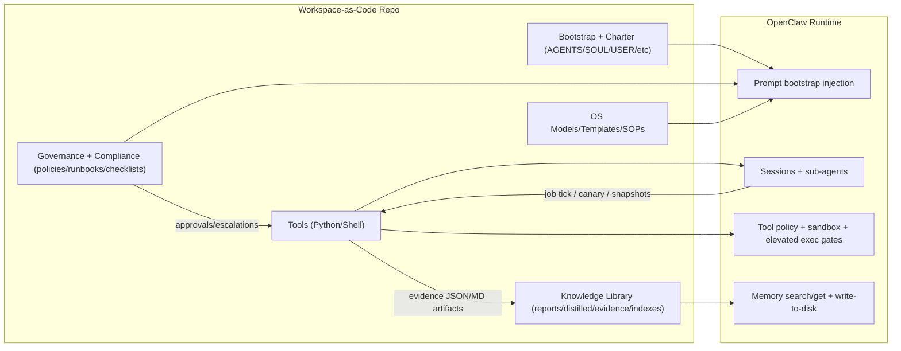
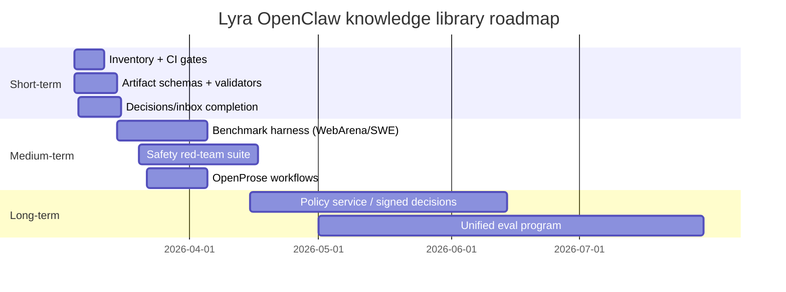

# Lyra OpenClaw Agent System Knowledge Library Audit

## Executive Summary

This repository is best understood as a **“workspace-as-code” operating system** for a personal, multi-job AI “Control Tower” built to run on top of an entity["organization","OpenClaw","agent runtime + docs site"] deployment model. It combines (a) *bootstrapped workspace files* that shape agent behavior, (b) governance/policy artifacts for safety, change control, and compliance, (c) a structured *knowledge library* (reports, distilled knowledge, evidence artifacts), and (d) a small but meaningful set of **deterministic, test-oriented Python tools** that implement and validate an early “Task/Decision Engine (TDE)” governance kernel and associated run-logging/canary checks. fileciteturn67file0L1-L1 fileciteturn68file0L1-L1 fileciteturn69file0L1-L1 fileciteturn71file0L1-L1

The repo structure and intents align strongly with OpenClaw’s documented behavior: OpenClaw treats workspace Markdown as “memory” and injects selected bootstrap files into the system prompt every turn (with truncation/caps), while daily memory files are typically retrieved on demand via memory tools. citeturn4search1turn4search3turn4search0 This means the repository’s operational quality depends not only on what’s written, but also on whether those files remain **lean** enough to avoid token pressure and compaction side effects. citeturn4search0turn4search3turn4search5

### High-confidence strengths (what’s unusually solid)

The system emphasizes **hard boundaries** and **fail-closed semantics**, not just prose: the TDE “thin-slice” code implements idempotency, approval gating for high-risk actions, version conflict detection, and an audit trail; the job-tick runtime adds a binding-integrity check meant to detect or prevent “identity/binding drift” and require re-authorization when binding changes are detected. fileciteturn45file20L1-L1 fileciteturn44file9L1-L1 fileciteturn37file0L1-L1

There is also a clear separation of concerns around “jobs vs agents,” consistent with OpenClaw’s own guidance that multi-agent “CEO + workers” patterns are possible but often token-heavy and less efficient than sessions/sub-agents. fileciteturn70file0L1-L1 citeturn6search0turn3search4

### Material gaps (white-spots) that matter for expert scrutiny

The largest gaps are not “missing documents,” but missing *enforcement and measurement*:

* **Perception / environment sense-making is weakly implemented**: ingestion is mostly “tasks listed in Markdown” plus limited integration scripts; there is no robust observation/event stream model, no explicit tool I/O schema normalization layer, and no verified provenance pipeline for external data. fileciteturn44file0L1-L1 fileciteturn45file15L1-L1
* **Evaluation is local and bespoke**: it shows strong intent (canary cycles, evidence artifacts, deterministic envelopes), but does not benchmark against widely used agent suites (web agents, SWE agents, safety misuse). This is a serious blind spot if the goal is “rigorous” claims about capability and safety. citeturn9search5turn10search0turn7search1
* **Memory and knowledge governance is well-specified but only partially realized**: the repository defines tiers/namespaces and an eval-suite concept; however, key canonical directories referenced by the design (e.g., decisions/inbox) are not clearly present as first-class, maintained systems-of-record. fileciteturn68file0L1-L1 fileciteturn69file0L1-L1

### What to do next (prioritized)

The fastest way to raise system confidence is to make the “governance-by-artifact” approach **machine-checkable**:

1. Add a **repo-inventory + metadata generator** (paths, sizes, owners, last-touch) and run it in CI.
2. Formalize **schemas** for artifacts the tools already emit (job tick artifact, canary status, owner gate packet, release envelope) and validate them automatically.
3. Build a small, reproducible **evaluation harness** bridging internal tests (TDE slices) to external benchmarks: WebArena for web tasks, SWE-bench for code issue resolution, and SafeArena-style harmful-task evaluation for agent safety. citeturn9search5turn10search0turn7search1

## System overview and component mapping

OpenClaw’s architecture makes “agent = workspace + state dir + sessions + auth profile” a *real isolation boundary*, not merely a prompt variant. citeturn3search0turn3search2turn5search2 In that context, this repo functions as an intentionally curated workspace and operational playbook, plus tool scripts that embody “policy as code” in a narrow but meaningful slice.

### Conceptual flow

The repo implements (or specifies) the following loop:

* **Perception/ingestion**: interpret operational inputs (tasks list, canary signals, external reports).
* **Planning/decisioning**: pick next actions and decide whether actions require approvals/escalation.
* **Execution**: run deterministic “job ticks” and other automation scripts; emit artifacts.
* **Safety/evaluation**: enforce gates and capture evidence; refuse/reauth when bindings drift.
* **Memory/knowledge**: write durable summaries and curated knowledge to Markdown.



The interaction between “long-lived bootstrap files” and token pressure is not theoretical: OpenClaw explicitly injects bootstrap files each turn and truncates/caps them; large files can drive higher token usage and earlier compaction. citeturn4search0turn4search3turn4search5 This makes “knowledge library discipline” inseparable from agent reliability.

## Asset inventory and component mapping

### Repository inventory approach and metadata limits

The audit used the entity["company","GitHub","code hosting platform"] connector against `pek007/lyra-operating-system` and enumerated assets via path- and filename-qualified code search over the repository plus commit metadata inspection. fileciteturn27file0L1-L1 fileciteturn37file0L1-L1

Two important metadata constraints affect the “per-file” completeness of this report:

* The connector search returns **permalink URLs** (including a commit SHA) for each file, but does not reliably expose per-file size/line counts and last-touch author without additional per-file history calls.
* Therefore, **size/lines and per-file last-touch authors are marked “unspecified”** unless derivable from the observed commit(s). Where a commit timestamp is used, it should be read as *“observed in repo history and/or permalink metadata,”* not a definitive last-touch per file. fileciteturn37file0L1-L1 fileciteturn11file0L1-L1

### Inventory table

The table below prioritizes assets that define runtime behavior, safety boundaries, deterministic execution semantics, and knowledge/memory systems. High-volume knowledge artifacts (reports/evidence/distilled collections) are summarized afterward as “collections” because they are best treated as datasets with their own indexing and governance rules. fileciteturn69file0L1-L1 fileciteturn31file0L1-L1 fileciteturn30file0L1-L1

| Asset | Path | Type | Size/Lines | Last modified | Owner/Author | Mapped component |
|---|---|---:|---:|---|---|---|
| Workspace instructions | `AGENTS.md` | Markdown | unspecified | observed commit 2026‑03‑04 | Lyra (commit author; doc owner varies) | Safety, Execution, Memory |
| Memory architecture spec | `MEMORY_KERNEL_V1.md` | Markdown | unspecified | observed commit 2026‑03‑04 | Peter/Lyra (in doc) | Memory, Knowledge base, Evaluation |
| Knowledge library spec | `KNOWLEDGE_BASE_SYSTEM.md` | Markdown | unspecified | observed commit 2026‑03‑04 | unspecified | Knowledge base, Memory |
| Multi-agent model | `MULTI_AGENT_OPERATING_MODEL_V1.md` | Markdown | unspecified | observed commit 2026‑03‑04 | Peter + Lyra (in doc) | Planning, Execution, Safety |
| System charter | `governance/system-charter.md` | Markdown | unspecified | observed commit 2026‑03‑04 | Peter/Lyra (in doc) | Safety, Planning |
| Task/Decision contract | `governance/task-decision-engine-contract.md` | Markdown | unspecified | observed commit 2026‑02‑28 (in doc) | Peter/Lyra (in doc) | Planning, Memory |
| Deterministic kernel tests + scaffold | `tools/tde_kernel_slice_tests.py` | Python | unspecified | observed commit 2026‑03‑04 | Lyra (commit author) | Reasoning, Execution, Safety, Evaluation |
| Deterministic job tick runner | `tools/tde_job_tick_runner.py` | Python | unspecified | observed commit 2026‑03‑04 | Lyra (commit author) | Execution, Safety, Evaluation |
| Binding registry baseline | `os/runtime/tde_active_bindings.json` | JSON | unspecified | observed commit 2026‑03‑04 | Lyra (commit author) | Safety, Execution |
| Runtime job tick contract | `os/sops/TDE_JOB_TICK_CONTRACT_V1.md` | Markdown | unspecified | observed commit 2026‑03‑04 | unspecified | Execution, Safety |
| Canary runtime cycle | `tools/tde_canary_runtime_cycle.py` | Python | unspecified | observed commit 2026‑03‑04 | Lyra (commit author) | Evaluation, Safety |
| Canary schedules/hooks | `tools/tde_canary_cron_hook.sh` / `tools/tde_canary_heartbeat_hook.sh` | Shell | unspecified | observed commit 2026‑03‑04 | unspecified | Execution, Evaluation |
| Milestone snapshot builder | `tools/tde_milestone_snapshot.py` | Python | unspecified | observed commit 2026‑03‑04 | Lyra (commit author) | Evaluation, Planning |
| Owner gate packet | `tools/tde_owner_gate_packet.py` | Python | unspecified | observed commit 2026‑03‑04 | Lyra (commit author) | Safety, Evaluation |
| Release envelope + activation guard | `tools/tde_release_envelope.py` | Python | unspecified | observed commit 2026‑03‑04 | Lyra (commit author) | Safety, Planning, Evaluation |
| Architecture fitness gate | `tools/architecture_fitness_gate.py` | Python | unspecified | observed commit 2026‑03‑04 | Lyra (commit author) | Safety, Evaluation |
| Compliance pack validator | `tools/validate_compliance_pack.py` | Python | unspecified | observed commit 2026‑03‑04 | Lyra (commit author) | Safety, Evaluation |
| Trello integration | `tools/trello_sync.py` | Python | unspecified | observed commit 2026‑03‑04 | unspecified | Perception, Execution |
| OpenClaw deployment research | `docs/architecture/openclaw-agent-deployment-report-2026-02-28.md` | Markdown | unspecified | observed commit 2026‑02‑28 (in doc) | unspecified | Planning, Safety, Execution |
| Security baseline checklist | `SEC-001_BASELINE_CHECKLIST.md` | Markdown | unspecified | observed commit 2026‑02‑24 (in doc) | Lyra (in doc) | Safety, Evaluation |
| Incident mini-runbook | `IR-001_INCIDENT_MINI_RUNBOOK.md` | Markdown | unspecified | unspecified | unspecified | Safety, Execution |
| Backup/restore runbook | `OPS-001_BACKUP_RESTORE_RUNBOOK.md` | Markdown | unspecified | unspecified | unspecified | Safety, Execution |
| OpenClaw config change SOP | `OPENCLAW_CONFIG_CHANGE_SOP_V1.md` | Markdown | unspecified | unspecified | unspecified | Safety, Execution |
| OpenClaw release delta SOP | `OPENCLAW_RELEASE_DELTA_SOP.md` | Markdown | unspecified | unspecified | unspecified | Safety, Execution |

File existence and tool asset paths are evidenced via connector code search and commit-level diffs (notably the S15 binding-integrity slice). fileciteturn44file9L1-L1 fileciteturn45file14L1-L1 fileciteturn39file1L1-L1 fileciteturn37file0L1-L1

### Knowledge assets as collections

The repo includes a structured `knowledge/` hierarchy with at least the following collections (enumerated via path-qualified search): distilled knowledge, evidence artifacts (JSON/MD), reports, indexes, registries, and an archive. fileciteturn30file0L1-L1 fileciteturn31file0L1-L1 fileciteturn32file0L1-L1 fileciteturn34file8L1-L1

Critically, the knowledge system spec explicitly calls for `knowledge/inbox/` and `knowledge/decisions/` to exist as first-class workflow targets. fileciteturn69file0L1-L1 In this audit, those targets were not clearly discoverable as populated directories (a notable governance gap), and should be treated as an implementation debt relative to the documented architecture.

## Coverage analysis by agent capability

The table below assesses each OpenClaw-like agent component (per your taxonomy) against evidence in the repository, and assigns a confidence level reflecting how directly the repo artifacts support the assessment.

| Capability/component | Depth | Evidence in repo | Confidence |
|---|---|---|---|
| Perception / ingestion | Partial | Task ingestion from Markdown (`TASKS.md` parsing in canary/job tick), plus a Trello sync script suggests external task-board integration. fileciteturn44file0L1-L1 fileciteturn45file15L1-L1 | Medium |
| Planning | Partial | “Jobs vs agents” model; task/decision engine contract; milestone snapshot + release envelope imply phased readiness gating and handoff. fileciteturn70file0L1-L1 fileciteturn71file0L1-L1 fileciteturn44file11L1-L1 | Medium |
| Memory | Partial → strong at design level | A detailed tiered memory architecture spec exists (tiers, namespaces, indexing priorities, eval suite intent), aligning with OpenClaw’s markdown-as-memory model. fileciteturn68file0L1-L1 citeturn4search1turn4search3 | High (spec), Low–Medium (enforcement) |
| Knowledge base | Partial | Knowledge base structure + naming recommendations exist; multiple `knowledge/*` collections exist. However, “decisions/inbox” appear as spec requirements without demonstrated enforcement. fileciteturn69file0L1-L1 fileciteturn31file0L1-L1 | Medium |
| Reasoning | Partial | Reasoning is expressed mostly as governance protocols and deterministic decision rules inside the TDE kernel scaffold. There is no explicit algorithmic planner or belief-state model. fileciteturn45file20L1-L1 citeturn9search2turn7search0 | Medium |
| Execution | Partial | Deterministic job ticks, writeback semantics, evidence file emission, plus cron/heartbeat hooks exist; but there is no full “production” runtime service boundary (it is still workspace-script driven). fileciteturn44file9L1-L1 fileciteturn45file11L1-L1 | Medium |
| Safety | Strong at policy + thin-slice code | Security baseline + compliance validators + approval gating and fail-closed semantics exist; OpenClaw tool policy/sandbox design is well supported by upstream docs, but repo-side enforcement depends on runtime config outside this repo. fileciteturn45file12L1-L1 fileciteturn53file0L1-L1 citeturn3search2turn5search2 | Medium–High |
| Evaluation | Partial | Kernel slice tests, canary cycles, milestone snapshots, and “envelope” artifacts exist; but evaluation is not tied to external benchmarks or adversarial safety suites. fileciteturn45file20L1-L1 fileciteturn45file9L1-L1 citeturn9search5turn10search0turn7search1 | Medium |

### Key inference: the repo is “stronger on governance kernels than on environment integration”

The most mature “engineered” assets are those that can be made deterministic and auditable in-repo (idempotency, approval gating, artifact generation), while the least mature are those that require real-world integration and continuous adversarial evaluation (browser agents, unsafe prompt-injection surfaces, long-horizon ops drift). This mirrors the broader literature: agent reliability improves when reasoning and acting are interleaved with explicit state/action traces (ReAct) and when learning loops write back structured reflections (Reflexion), but those gains require strong evaluation harnesses and environment realism. citeturn9search2turn7search0turn9search5

## White-spots, risks, and recommended mitigations

The table below lists the most important gaps observed, with impact, difficulty, and concrete mitigation methods. “Impact” is assessed relative to an expert-grade bar for multi-agent systems operating with tools and external-facing channels.

| Gap / white-spot | Category | Impact | Difficulty | Suggested methods to fill |
|---|---|---|---|---|
| No automated, authoritative repo inventory (sizes/owners/last-touch) and no CI gate that ensures “artifact completeness” | Evaluation / ops | High | Easy–Medium | Add an inventory generator + CI job; enforce required directories and required frontmatter; treat missing metadata as failing builds (similar to existing fitness gates). fileciteturn45file12L1-L1 |
| Knowledge architecture specifies `knowledge/inbox` and `knowledge/decisions`, but they are not clearly present as operational systems-of-record | Knowledge base | High | Easy | Create the directories, add index files, add “decision memo template,” and add validator script that fails if decision-linking rules are violated. fileciteturn69file0L1-L1 |
| “Perception” is mostly file parsing; lacks a standard observation/event schema and provenance chain for external inputs (web, email, chats, Trello) | Perception | High | Medium | Define an `Observation` schema (source, timestamp, hash, trust level, redactions); implement an ingest pipeline that produces signed/hashed artifacts; add provenance checks. |
| Tool outputs/evidence are emitted, but there is no structured schema validation and no regression baseline tooling | Evaluation / safety | High | Medium | Convert evidence JSON to versioned JSON Schema; add schema validation to CI; add golden snapshots for deterministic outputs. fileciteturn44file11L1-L1 fileciteturn45file9L1-L1 |
| Safety posture relies on policy and thin-slice enforcement; lacks explicit threat model and red-team harness against prompt injection and tool misuse | Safety | High | Medium–Hard | Add threat model doc + attack trees; implement adversarial test suite using realistic web-agent misuse tasks (e.g., SafeArena-style) and injection corpora; enforce sandbox + restricted tool policy in runtime config. citeturn3search2turn7search1turn5search2 |
| Evaluation is not benchmark-aligned (no WebArena / SWE-bench / comparable suites) | Evaluation | High | Medium | Stand up harnesses for WebArena (web agents), SWE-bench (SWE agents), and a safety evaluation suite; treat these as release-blocking for “agent system” claims. citeturn9search5turn10search0turn7search1 |
| No explicit scalability/deployment SLOs and no operational observability plan (latency, token budget, failure budgets) | Ops / deployment | Medium–High | Medium | Define SLOs for “job ticks” and critical automations; add structured logging; add token/cost budget policies informed by OpenClaw’s context tooling and bootstrap caps. citeturn4search0turn4search5 |
| Binding-integrity enforcement exists, but system-wide identity, authorization, and approval flows remain incomplete without an external policy service | Safety / execution | Medium–High | Hard | Promote policy decisions from “inline kernel” to a policy service or signed decision artifacts; introduce multi-party approvals and re-auth workflows; formalize identity attestations and session keys. fileciteturn37file0L1-L1 citeturn3search0turn5search2 |
| Memory eval suite is specified but not obviously implemented and continuously run | Memory / evaluation | Medium | Medium | Implement “memory-critical prompts” test set; run it before changes to memory policies and knowledge indexing; track leakage and grounding metrics. fileciteturn68file0L1-L1 citeturn4search1 |
| Multi-agent orchestration is described but not formalized as executable workflows | Planning / orchestration | Medium | Medium | Adopt OpenProse programs for repeatable multi-step workflows (research → critique → approval → publish); integrate sub-agent spawning and explicit control flow for the “OS lane.” citeturn5search0turn3search4turn6search0 |

## Prioritized roadmap and experiments

This roadmap is structured to increase *confidence per unit effort*, consistent with the repo’s bias toward deterministic, evidence-first control. It includes deliverables, success criteria, effort, and dependencies.

### Short-term priorities

**Automated inventory + epistemic discipline**
* Deliverable: `tools/repo_inventory.py` generating `inventory.json` + `inventory.md` (paths, types, sizes, line counts, frontmatter metadata where present, and a component map).
* Success criteria: CI fails if required collections are missing; CI fails if “required” assets (contracts, baseline checklists, compliance pack) are absent; inventory is regenerated deterministically.
* Effort: 1–2 engineer-days.
* Dependency: none beyond standard Python.

**Schema and validator layer for evidence artifacts**
* Deliverable: JSON Schemas for key artifacts (job tick artifacts, canary status, milestone snapshot, owner gate packet, release envelope), plus `tools/validate_artifacts.py`.
* Success criteria: all committed evidence artifacts validate; schema changes are versioned and backward compatible (or explicit migrations exist).
* Effort: 2–4 engineer-days.
* Dependency: agreement on artifact versioning strategy.

**Knowledge base “decisions/inbox” completion**
* Deliverable: create `knowledge/inbox/` and `knowledge/decisions/`, add templates, add a validator that ensures decision artifacts have IDs and are linked from an index (and that “distilled” content references sources).
* Success criteria: every “decision-impacting” report has a tracked decision memo or an explicit “no decision” label; indexes are updated automatically.
* Effort: 1–3 engineer-days.
* Dependency: none.

### Medium-term priorities

**Benchmark harness integration**
* Deliverable: runbooks and harness scripts that can execute representative slices from WebArena and SWE-bench in a reproducible environment (containerized), plus a dashboard summary artifact committed per milestone.
* Success criteria: baseline scores established and tracked; regressions are release-blocking.
* Effort: 1–3 weeks.
* Dependencies: container setup, credentials, environment availability. citeturn9search5turn10search0

**Safety evaluation and red-team suite**
* Deliverable: injection test corpus + misuse tasks; add “unsafe-task refusal” and “tool misuse” tests; integrate into release gating.
* Success criteria: measured harmful-task compliance rate trends down; reductions are not offset by loss of benign capability.
* Effort: 2–4 weeks.
* Dependencies: benchmark selection; sandbox and tool policy hardening. citeturn7search1turn3search2turn5search2

**OpenProse orchestration for repeatable workflows**
* Deliverable: `.prose` programs for: deep research pipeline, release readiness review, incident triage, and weekly governance sweeps.
* Success criteria: workflows are reproducible, auditable, and bounded; sub-agent spawning is explicit and cost-aware.
* Effort: 1–2 weeks.
* Dependencies: OpenProse plugin enabled in OpenClaw runtime. citeturn5search0turn3search4

### Long-term priorities

**Promote “policy as code” to a policy service**
* Deliverable: external policy decision service or signed decision artifacts that can be verified by runtime tools.
* Success criteria: approvals and reauth flows are cryptographically auditable; tool execution cannot bypass gates.
* Effort: 1–3 months.
* Dependencies: identity model, key management, deployment posture.

**Unified agent evaluation program**
* Deliverable: one integrated evaluation suite combining (a) deterministic kernel tests, (b) benchmark tasks in realistic environments, and (c) safety misuse tasks.
* Success criteria: capability claims tie directly to data; safety claims tie directly to measured refusal/containment performance.
* Effort: ongoing.
* Dependencies: stable harness and artifact schemas.

### Roadmap timeline



### Recommended experiments and tests

| Experiment/test | Goal | Success criteria | Effort | Dependencies |
|---|---|---|---:|---|
| Deterministic artifact schema validation | Prevent silent drift in evidence formats | 100% of artifacts validate; schema evolution is explicit | Medium | JSON Schemas |
| “Binding drift” adversarial replay tests | Ensure reauth-required semantics cannot be bypassed | Any mismatch produces fail-closed or reauth-required; no side effects | Medium | Binding registry + job tick runner fileciteturn37file0L1-L1 |
| Prompt-injection harness on tool surface | Measure susceptibility under realistic injection patterns | Tool misuse rate decreases without large benign regression | Medium–Hard | Sandbox + tool policy controls citeturn5search2turn3search2 |
| WebArena task baseline | Establish web-agent capability in realistic sites | Stable baseline + tracked improvements | Medium | WebArena environment citeturn9search5 |
| SafeArena-style harmful task refusal baseline | Quantify “misuse compliance” | Harmful completion rates go down over time | Hard | Safety benchmark infra citeturn7search1 |
| SWE-bench baseline | Measure coding agent reliability on real issues | Baseline established; regressions blocked | Medium | Dockerized harness citeturn10search0 |
| Memory-critical prompt regression suite | Ensure memory writeback/retrieval works and doesn’t leak | Zero cross-namespace leakage; stable grounding rates | Medium | Memory tooling + test set citeturn4search1 |
| Token pressure + bootstrap size monitoring | Prevent context blowups due to growing bootstrap files | Token budget alerts; bootstrap caps respected | Easy | OpenClaw `/context` tooling familiarity citeturn4search0turn4search5 |
| Canary cycle “stalled threshold” simulation | Validate monitoring logic and guardrails | Alerts fire deterministically; no approval bypass paths | Easy–Medium | Canary runtime cycle fileciteturn45file4L1-L1 |

### Test template examples

A minimal pytest-style schema validation test (illustrative; adapt to your CI runner):

```python
# tests/test_artifact_schema.py
import json
from pathlib import Path
import jsonschema

SCHEMA = json.loads(Path("schemas/tde-canary-status.schema.json").read_text())
ARTIFACT = json.loads(Path("knowledge/evidence/2026-03/tde-canary-status-latest.json").read_text())

def test_canary_status_schema():
    jsonschema.validate(ARTIFACT, SCHEMA)
```

A deterministic “no approval bypass” property test for the kernel:

```python
# tests/test_no_approval_bypass.py
from tools.tde_kernel_slice_tests import TDEKernel, ActionRequest

def test_high_risk_requires_approval():
    k = TDEKernel()
    req = ActionRequest(
        request_id="high1",
        idempotency_key="k-high1",
        intent_hash="h",
        actor="lyra",
        job="JOB-ENG-001",
        action="external.send",
        target_id="MSG-1",
        expected_version=0,
        risk="high",
        requires_approval=True,
    )
    result = k.execute(req)
    assert result["status"] == "blocked_pending_approval"
```

## References and recommended reading

### OpenClaw primary documentation

OpenClaw’s official docs are directly relevant because the repo is designed as a workspace that is injected and governed by OpenClaw runtime rules (multi-agent routing, sandbox/tool policy, system prompt injection, memory behavior, token usage). citeturn3search0turn5search2turn4search3turn4search1turn4search5turn6search0turn5search0turn3search4

### Agent architecture and learning-loop literature

ReAct and Reflexion are canonical references for (a) interleaving reasoning and acting with explicit traces and (b) adding memory-based learning loops through reflection—both patterns are directly compatible with this repo’s “evidence-first” and “durable Markdown memory” posture. citeturn9search2turn9search48turn7search0

### Benchmarks and evaluation toolchains

For evaluation realism and software-engineering reliability, prioritize web-agent and SWE-agent benchmarks. The WebArena paper highlights how difficult realistic web tasks are for agents even with strong models, and the SWE-bench project provides a widely used harness for evaluating patch-generation agents on real GitHub issues (with Dockerized evaluation). citeturn9search5turn10search0

For safety evaluation of autonomous web agents, SafeArena is a relevant emerging benchmark category (harmful-task compliance and risk stratification). citeturn7search1

Finally, for ecosystem-level best practices around tool isolation and privilege boundaries, align repo practices with OpenClaw’s “sandbox vs tool policy vs elevated exec” model and keep high-risk tool surfaces restricted to trusted agents/routes. citeturn5search2turn3search2