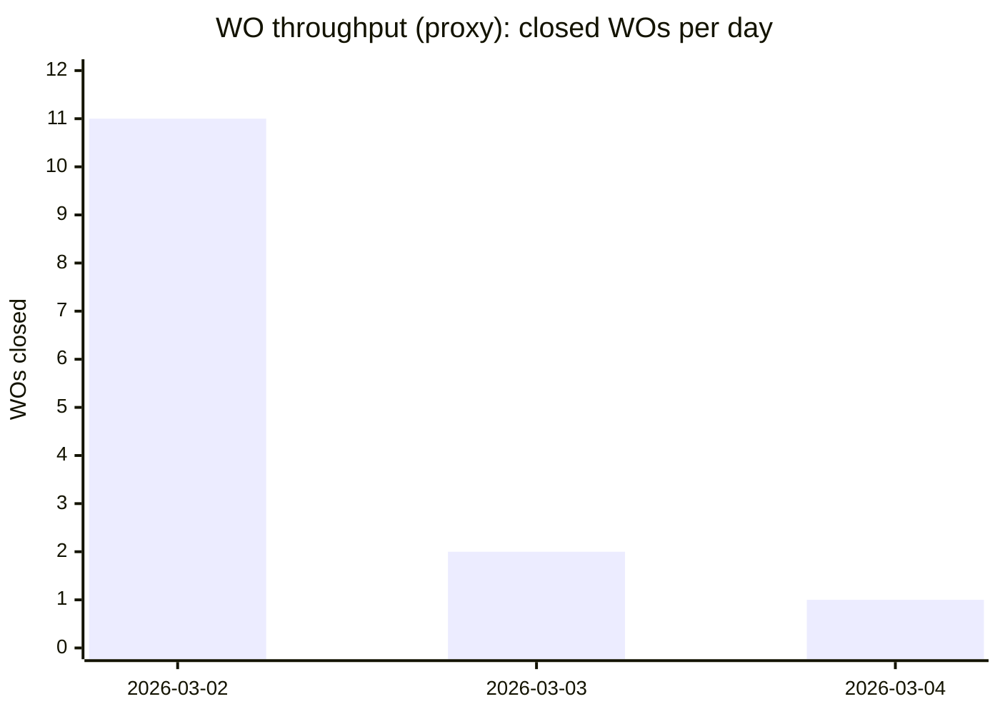

# Sprint 16 Renewal Analysis of the Lyra OpenClaw TDE Development Project

## Executive summary

Sprint 16 (WO-2026-TDE-KERNEL-S16) has been opened on 2026-03-04 and is explicitly targeted at closing a strategically important gap: **objective-to-work traceability** (“objective_id”, “objective_checkpoint”, “rationale_trace”) so runtime execution state can be tied back to high-level outcomes rather than only to local governance correctness. This is the right next bottleneck to attack given the recent hardening work in Sprint 15 around **runtime binding integrity** and **fail-closed reauthorization** semantics.

From direct inspection of the repository snapshot at commit `5383d488cf7415a3331eeda9c8d3218058a457e4` (“Open S16 and activate TDE-2026-027”), the project has achieved an unusually coherent “safety spine” for an AI-native system: deterministic thin-slice kernel tests, explicit fail-closed guardrails, evidence-first verification artifacts, and an emerging “process-as-code” posture enforced via GitHub Actions. The main limiting factor is not correctness of the existing governance kernel; it is **semantic completeness** (objectives → tasks → decisions → actions) and **operational scalability** (artifact discoverability/indexing, persistence boundaries, concurrency/race safety, and metrics instrumentation).

Because sprint length, team size, and tool-of-record for work tracking are unspecified, several requested process metrics (lead time, cycle-time distribution, burndown) can only be computed as **proxies** from the repo’s Work Orders (WO) and TASKS.md, rather than from a traditional issue tracker + sprint board. The repo appears to use WOs + TASKS.md + evidence artifacts as the primary operational substrate; GitHub Issues and Pull Requests appear unused or disabled (none were returned via connector search during this assessment).

Key external benchmarks and definitions used in this report:
- **DORA delivery metrics (now evolved into a five-metric model)** provide a standard vocabulary for throughput and instability, and are appropriate targets once “deployment” is meaningfully defined for this project. citeturn1search0turn1search48 
- **Sprint timeboxing** (if Scrum semantics are intended) is “one month or less,” but the repo’s “micro-sprint / WO slice” pattern is closer to flow-based micro-batching than classic iteration planning. citeturn0search48turn0search10 
- **WIP–throughput–cycle time coupling** (Little’s Law) explains why the current strong WIP discipline is not cosmetic; it is structurally tied to predictability and flow. citeturn4search1turn3search33 

## Repository artifact inventory and Sprint 16 delta

### Current artifact surface area (as observed)

The repo is best understood as an “operating system for delivery”: it contains governance documents, process and policy standards, executable tools, and evidence artifacts. The Sprint 16-relevant artifact set is concentrated in a few clusters:

**Execution contracts and governance**
- TDE project definition and success metrics: `TDE_PROJECT_START_PACKET_V1.md`
- TDE interface boundary: `governance/task-decision-engine-contract.md`
- Work policies and gates (WO/CA discipline): `AI_NATIVE_OPERATING_POLICY_V1.md`
- Work system policy (states, WIP, DoR/DoD): `TASK_SYSTEM_POLICY_V1.md`
- Definition of Done: `STD-001_DEFINITION_OF_DONE.md`
- Change Artifact template: `CA_TEMPLATE_V1.md`
- Process registry with review-date enforcement: `PROCESS_REGISTRY.md`

**Sprint execution slices (Work Orders)**
- WOs `WO-2026-TDE-KERNEL-S1.md` through `WO-2026-TDE-KERNEL-S16.md`, with Sprint 16 and 15 as the focus here.

**Operational work tracking**
- `TASKS.md` (temporary kanban): currently shows `TDE-2026-027` active (Sprint 16 slice) and `TDE-2026-026` done (Sprint 15 slice).

**Runtime and verification tooling**
- Kernel + thin-slice acceptance tests: `tools/tde_kernel_slice_tests.py`
- Canary runtime cycle & trigger semantics: `tools/tde_canary_runtime_cycle.py`; contract: `os/sops/TDE_CANARY_SCHEDULING_CONTRACT_V1.md`
- Job tick runner & mutation/writeback semantics: `tools/tde_job_tick_runner.py`; contract: `os/sops/TDE_JOB_TICK_CONTRACT_V1.md`
- Sprint 15 test harness: `tools/test_s15_binding_integrity.py`
- Process-as-code checks: `tools/validate_process_metadata.py`, `tools/validate_review_dates.py`

**CI/CD**
- GitHub Actions: `.github/workflows/devsecops-baseline.yml` (process metadata validation + review-date validation + optional thin-slice tests).

**Evidence artifacts**
- Sprint-scoped verification notes under `knowledge/evidence/2026-03/…`.
- Sprint 15 explicitly includes pass + fail-closed + reauth-required JSON evidence outputs.

### Sprint 16 vs Sprint 15 vs baseline comparison

The table below uses Sprint 15 as the immediate baseline and aggregates S1–S14 where it improves signal. Where hard metrics are not derivable from the repo (e.g., CI failure rate from workflow runs), values are marked **Unspecified**.

| Dimension | Sprint 16 (S16) | Sprint 15 (S15) | Baseline (S1–S14 aggregate) |
|---|---|---|---|
| Status | Open (2026-03-04), closure pending | Closed 2026-03-04 | Mostly closed; some WOs show “acceptance pending” patterns |
| Scope intent | Add objective-to-work linkage contract + validation + artifact wiring | Enforce runtime binding integrity + reauth-on-binding-change fail-closed semantics | Build governance kernel, anti-stall loop, canary scheduling, milestone packets, job-tick runtime loop, mutation envelope enforcement, real workload ingestion |
| Primary work item | `TDE-2026-027` (Active in TASKS.md) | `TDE-2026-026` (Done in TASKS.md) | Multiple WOs per day early; S12–S14 pivot to real ingestion + guarded execution |
| Acceptance criteria | 4 acceptance criteria, all pending | 5 acceptance criteria, all verified PASS | Generally “PASS via evidence artifacts” for kernel/guardrails; acceptance sign-offs vary by WO |
| Planned change artifacts | Contract doc update or new SOP; runner updates; tests; Sprint 16 verification note | Runner updates, contract update, binding registry JSON, test harness, verification + evidence JSONs | Tooling expanded across canary, milestone packets, job-tick, evidence artifacts |
| Velocity (proxy) | 0 “done WOs” for S16 at time of snapshot | 1 WO closed on 2026-03-04 | 11 WOs closed on 2026-03-02; 2 WOs closed on 2026-03-03; very front-loaded throughput |
| Open/closed “issues” | GitHub Issues/PRs: none observed via connector queries; TASKS.md: 1 active + 8 in inbox | Same (no GitHub Issues/PRs observed); TASKS.md shows S15 done | Work tracked primarily as WOs + TASKS.md rather than GitHub Issues |
| Code churn | Low and mostly doc-level in the S16 opening commit (WO created + TASKS move) | Medium-high by file-surface: runner, contract, tests, binding registry, evidence JSONs (line-level churn unspecified) | High early churn in tool+evidence creation; later churn shifts to “operational wiring” |
| Test pass rate (proxy) | Unspecified (no S16 verification artifact yet) | PASS (explicit test script + evidence) | Thin-slice tests exist and are runnable; per-sprint verification is the dominant QA mechanism |
| CI failures | Unspecified (workflow exists, run history not derived from repo snapshot) | Unspecified | CI scope is governance checks + optional thin-slice test runner, not full quality gates |

## Sprint 16 process metrics audit

### What can be measured from the repo today

Given the repo’s current tracking approach (WOs + TASKS.md + evidence artifacts), the most defensible metrics for Sprint 16 are:

**Velocity (throughput proxy)**
- Treat “WO closed” as the unit of delivery. 
- Observed closure cadence is highly bursty: S1–S11 are all closed on 2026-03-02; S12 and S14 on 2026-03-03; S15 on 2026-03-04; S16 opened on 2026-03-04 and not yet closed. 
- This indicates the system is operating in a micro-batching regime; it does not yet have a stable “weekly throughput” signal.

**Cycle time (proxy)**
- Using `Date opened` → `Date closed` in WOs: cycle time is frequently same-day. This is consistent with extremely small batch sizes, but it is too coarse (date-only) to compute a meaningful distribution or detect regressions.

**Lead time**
- Lead time typically requires “commit to production” or “request to production” boundaries. DORA and the updated DORA model define change lead time as time from commit to successful production deployment. citeturn1search0turn1search48 
- Here, “production” is not formally defined inside the repo for TDE changes (is it merging to main? deploying OpenClaw config? enabling scheduled hooks?). Therefore lead time for changes is **currently undefined**.

**WIP**
- TASK_SYSTEM_POLICY_V1 defines WIP limits (Active max 3, etc.). The current TASKS.md shows 1 active item (`TDE-2026-027`), which is compliant. 
- AI-native operating policy further tightens WIP for build lane/high-risk work; current state is also compliant.

**Blocker count**
- No explicit blockers are recorded in TASKS.md for Sprint 16 at snapshot time.

**QA feedback loop**
- The repo uses an “evidence-first” loop: WOs require verification artifacts; Sprint 15 includes explicit commands, results, and artifact references in the verification note (PASS). Sprint 16 has not yet produced the verification file (planned). 
- Architectural sign-off appears to lag execution sign-off in some WOs (execution baseline accepted; formal sign-off pending). That is a measurable loop delay, but without timestamps it cannot be quantified.

**Deployment frequency**
- DORA metrics treat deployment frequency as how often changes are deployed. citeturn1search0turn1search48 
- In this repo’s present state, the only consistent “deployment-like” event is “merge/commit to main,” and the only consistent “runtime” events are evidence artifacts produced by scheduled hooks. Without an agreed deployment definition, this remains a proxy at best.

### Deviations and likely root causes

**Deviation: Metrics are defined in policy but not instrumented at the execution layer.** 
The repo contains clear policies that call for cycle time, WIP, verification debt, and weekly metrics, but the observable artifacts do not currently show a regularly updated metrics log beyond an initial baseline. Root cause: instrumentation work is competing with core TDE kernel delivery, and the system is still in “bootstrap mode” where correctness and governance are prioritized over observability completeness. This is rational early, but Sprint 16’s objective-linkage goal actually increases the need for instrumentation because it introduces a higher-dimensional “why” layer that must remain consistent over time.

**Deviation: Formal acceptance is inconsistent across WOs.** 
Several WOs show either “accepted by execution baseline; sign-off pending” or acceptance noted elsewhere. Root cause: acceptance is treated as asynchronous governance (JOB-ARC-001) rather than a strict merge gate. This is acceptable for day-0 prototyping but becomes a debt once changes have side effects (TASKS writeback, binding enforcement).

**Deviation: Work tracking primitives are split across TASKS.md, WOs, and evidence, but without a canonical index.** 
Root cause: the repo is intentionally “documentation-first,” but discovery cost rises fast as artifacts grow. This is explicitly acknowledged by the backlog item to publish a canonical TDE entrypoint index.

### Velocity and burndown visuals (proxy-based)

#### Micro-sprint velocity: WOs closed per day (proxy)



Interpretation: The system shows an initial burst of closure volume (likely bootstrapping artifacts) followed by a taper into fewer, heavier slices. This is not inherently bad, but it means “velocity” is not yet stable enough to use as a planning predictor.

#### Sprint 16 burndown: acceptance criteria remaining (proxy)

Sprint 16 has 4 acceptance criteria and no evidence of completion yet (closure pending). A minimal burndown proxy is therefore flat at 4.

```mermaid
xychart-beta
 title "Sprint 16 burndown (proxy): acceptance criteria remaining"
 x-axis ["2026-03-04"]
 y-axis "criteria remaining" 0 --> 4
 line [4]
```

## Technical evaluation of Sprint 16 readiness

### Architectural backbone observed

At a system level, the TDE implementation is converging around three concrete operational loops:

1. **Governance kernel (deterministic semantics)** 
 Implemented as a thin-slice kernel with explicit behaviors: policy decision packet, approval gating, idempotency behavior, version conflicts, and audit logging. This is packaged as `tools/tde_kernel_slice_tests.py`, which simultaneously defines the kernel and verifies it with acceptance tests.

2. **Canary runtime loop (anti-stall progress classification)** 
 A trigger-driven cycle (`heartbeat` or `cron`) that produces an operational status artifact with guardrail alerting. It can load tasks from TASKS.md but currently normalizes timestamps with deterministic defaults when richer metadata is not present, which limits “real-world” fidelity.

3. **Job tick runner (bounded claim + mutation + writeback)** 
 A cron-oriented loop that pulls tasks from a canonical source, applies governance checks, and performs a low-risk writeback (moving Active → Waiting) using idempotency keys and envelope validation. Sprint 15 added binding integrity enforcement based on an active binding registry.

This architecture meaningfully supports the project’s high-level goal of autonomous, policy-governed operation toward high-level objectives, but Sprint 16 is where that objective layer becomes concrete.

### Sprint 16 target: objective linkage contract

Sprint 16 is explicitly about **adding objective context fields** into “task/dependency artifacts” and ensuring deterministic validation with fail-closed behavior for guarded paths.

The highest technical risk in Sprint 16 is not “can we add three fields,” but:

- **Where do these fields live** in the current canonical artifacts without breaking parsers, tests, and runtime loops?
- **What is the validation boundary** (which paths require objective linkage, and which paths emit warnings vs fail closed)?
- **How does objective linkage propagate** into evidence outputs so it becomes operationally useful, not merely decorative metadata?

A useful design principle from delivery research is that throughput and stability metrics must reflect real delivery boundaries, not wishful proxies. DORA’s evolution toward throughput/instability factors signals that definitions matter and get revised as systems mature. citeturn1search0turn1search48 
Sprint 16 is essentially the semantic equivalent for TDE: define the “objective linkage system boundary” now, before it hardens into incompatible ad hoc conventions.

### Code quality and modularity assessment

**Strengths**
- Deterministic, explicit semantics for idempotency, approval gating, and fail-closed behavior are captured in executable tests, not only prose.
- The job tick runner implements practical “guarded side-effect” semantics, including binding mismatch reauth requirements and auditability (Sprint 15 evidence shows PASS conditions via a standalone harness).
- CI enforces process hygiene (process metadata and review-date checks) and can run thin-slice tests on push/PR.

**Constraints and technical debt**
- **Test vs production boundary is blurred**: `tools/tde_kernel_slice_tests.py` is used as both a test suite and a shared library imported by runtime scripts. This increases coupling and makes refactoring riskier than it needs to be.
- **TASKS.md format is a hard dependency**: runtime parses tasks via regex expecting `- [ ] ID | Title`. Sprint 16’s objective metadata threatens to break this unless the contract explicitly preserves backwards compatibility or the parser is upgraded.
- **Idempotency is not durable across process restarts** at the kernel layer (in-memory replay index). The system relies on canonical state writeback to provide practical idempotency over time. This is acceptable for low-risk writeback but will be insufficient for higher-risk external actions.
- **Concurrency is not controlled** for TASKS.md writeback (no locking/atomicity contract). This becomes a material risk once multiple scheduled runs or multiple jobs act concurrently.

**Security posture implications**
- The system is trending toward a more formal secure SDLC posture, but CI is not yet running security-oriented checks beyond process linting. The NIST Secure Software Development Framework (SSDF) is a useful reference model for building secure practices into the lifecycle (protect code, verify, respond). citeturn1search1 
- The presence of explicit backlog items around Telegram command sender restriction and multi-user trust boundaries indicates known security risks remain open; these are likely higher-impact than many internal TDE refactors if the system can execute commands in group contexts.

### Architecture diagram (current inferred)

```mermaid
flowchart TD
 Trigger[OpenClaw trigger<br/>cron or heartbeat] --> Canary[tde_canary_runtime_cycle.py<br/>classify + guardrail]
 Trigger --> JobTick[tde_job_tick_runner.py<br/>claim + validate + mutate]
 Canary --> Evidence1[Evidence JSON<br/>tde-canary-status-latest.json]
 JobTick --> Kernel[TDEKernel<br/>decision packet + approval gate<br/>idempotency + audit]
 Kernel --> Mutations[Mutation envelopes<br/>policy_decision_id + idempotency_key]
 Mutations --> Writeback[TASKS.md writeback<br/>Active -> Waiting]
 Mutations --> Evidence2[Evidence JSON<br/>job-tick artifacts]
 BindingRegistry[os/runtime/tde_active_bindings.json<br/>active binding context] --> JobTick

 subgraph Governance
 WO[Work Order (WO)<br/>scope + acceptance criteria]
 SOP[SOPs / Contracts<br/>job tick + canary scheduling]
 end

 WO --> JobTick
 SOP --> Canary
 SOP --> JobTick
```

Sprint 16’s “objective linkage contract” should be represented as a first-class contract artifact in the Governance subgraph, and as fields embedded in Evidence2 (at minimum), ideally also affecting gating behavior in JobTick.

## Risk matrix and prioritized remediation actions

### Risk matrix

Probability and impact are assessed relative to the current project maturity and the fact that automation is starting to touch canonical work state.

| Risk | Description | Probability | Impact | Notes / detection signal |
|---|---|---:|---:|---|
| Parser-contract break in S16 | Adding objective fields breaks TASKS parsing / artifact schema, causing silent skips or false “no work” | High | Medium–High | CI should gain parser smoke tests; current backlog already acknowledges this need |
| Concurrency/race on TASKS writeback | Multiple ticks can mutate TASKS.md without locking, producing lost updates or inconsistent state | Medium | High | Becomes urgent once multiple scheduled jobs or parallel runs exist |
| “Objective fields” become decorative | Fields exist but are not required, not validated, and not used in decision packets; traceability remains weak | Medium | High | Sprint 16 must define enforcement boundaries explicitly |
| Governance drift on acceptance | WOs close without consistent sign-off chain; auditability degrades | High | Medium | Violates the “intent→change→tests→decision” chain principle |
| CI scope too narrow | Process checks run, but regressions in critical scripts can pass; no lint/type/security gates | Medium | Medium–High | Add minimal static checks and broaden test execution |
| Canary fidelity gap | Canary uses synthetic timestamps/metadata; stall detection accuracy is limited | High | Medium | Objective linkage won’t help if underlying time/event model is fake |
| Binding registry fallback path | If registry missing/invalid, runner falls back to CLI binding id; could permit unsafe execution | Low | High | Treat fallback as “dev-only”; enforce “no fallback in prod” gate |
| Open trust-boundary security items | Multi-user/group runtime trust model not resolved; command invocation exposure possible | Medium–High | High | Align with SSDF “protect software” and “produce well-secured software” practices citeturn1search1 |

### Risk heatmap (qualitative)

Impact → / Probability ↓ 
- **High impact**: security trust boundary, concurrency writeback, objective-linkage becoming decorative 
- **Medium impact**: CI narrowness, acceptance drift, parser break (can be caught) 
- **Lower impact**: formatting/doc issues

A WIP-limited micro-sprint system can keep risk low only if it keeps batch sizes small *and* the quality gates are real, not symbolic. The relationship between WIP, throughput, and cycle time is a structural constraint (Little’s Law), not an aesthetic preference. citeturn4search1turn3search33 

### Prioritized remediation actions

1. **Sprint 16 contract design: choose a schema strategy that will not break existing runtime parsers.** 
 Action: Define objective linkage as either:
 - a backward-compatible extension of the TASKS line format (requires parser updates + tests), or 
 - a sidecar mapping artifact (task_id → objective linkage) referenced by runtime and emitted in evidence outputs. 
 Priority rationale: This is Sprint 16’s core risk; schema drift here will compound.

2. **Add parser + schema smoke tests into CI (fast, high-leverage).** 
 Action: Implement minimal tests that fail if TASKS parsing changes silently or if linkage fields are missing when required (this directly supports the Sprint 16 acceptance criteria). 
 Priority rationale: prevents regressions that “look like no work” and silently degrade autonomy.

3. **Introduce atomic writeback semantics for TASKS.md.** 
 Action: enforce single-writer locking or atomic rename + checksum strategy; document it as a contract. 
 Priority rationale: writeback is already real; race safety is the next scaling cliff.

4. **Separate kernel library from tests.** 
 Action: Move kernel into a module (e.g., `os/tde/kernel.py`) and keep tests as tests. 
 Priority rationale: reduces coupling and makes future refactors safer.

5. **Define “deployment boundary” for DORA-aligned metrics.** 
 Action: decide whether deployment = merge-to-main, OpenClaw config apply, or scheduled job activation; then instrument deployment frequency and change lead time accordingly. citeturn1search0 

## Recommendations for next sprints with owners, timelines, KPIs, and backlog

### Process and content adjustments

**Adopt a “single-trunk, always-green” discipline for the critical path artifacts.** 
Given that the repo appears to commit directly to main (no PRs observed), the closest analogue to trunk-based delivery is ensuring the main branch is continuously verified. Trunk-based development emphasizes a single shared branch and frequent integration. citeturn2search1turn2search0 
Actionable interpretation here: treat `.github/workflows/devsecops-baseline.yml` as the minimal “always-green” mechanism and expand it slightly so that core execution scripts cannot regress silently.

**Treat objective linkage as a gating requirement for autonomous execution, not merely documentation.** 
Sprint 16 should explicitly specify: which actions require objective linkage, and what “fail closed” means. Example: allow reading and classification without objective linkage, but block side-effect transitions unless linkage is present (or route to approval/triage).

**Instrument flow metrics directly from the repo artifacts.** 
Because WOs are already structured, create one script that:
- parses WO open/close dates,
- counts WOs closed per day/week,
- computes WIP from TASKS.md,
- emits a daily/weekly metrics artifact under `knowledge/evidence/metrics/`. 
This gives a measurable basis for “cycle time stability,” verification debt, and throughput.

### Prioritized backlog (next-sprint executable)

| Priority | Backlog item | Owner | Target window (Stockholm time) | KPI |
|---|---|---|---|---|
| P0 | Complete Sprint 16 objective-linkage contract + validation + evidence | JOB-PROD-001 (with JOB-ARC-001 review) | 2026-03-04 to 2026-03-05 | 100% of in-scope job tick artifacts emit objective fields; missing linkage deterministically blocks guarded paths; verification includes pass + fail case |
| P0 | Parser smoke tests in CI for TASKS + linkage schema | JOB-ENG-001 | 2026-03-05 | CI fails on schema drift; test runtime < 60s |
| P1 | Canonical TDE entrypoint index (`os/tde/INDEX.md`) | JOB-ARC-001 | 2026-03-05 to 2026-03-06 | Single landing doc links to all active SOPs + tools + “real vs simulated” status; reduces discovery time |
| P1 | TASKS writeback atomicity/locking contract + implementation | JOB-ENG-001 | 2026-03-06 to 2026-03-08 | Zero lost updates in simulated concurrent runs; documented contract |
| P1 | Split kernel implementation from tests | JOB-ARC-001 + JOB-ENG-001 | 2026-03-08 to 2026-03-10 | Runtime scripts import kernel module; tests remain runnable and CI-passed |
| P2 | Define deployment boundary + start DORA-aligned tracking | JOB-PROD-001 | 2026-03-10 to 2026-03-12 | One explicit definition; baseline measurement for deployment frequency + change lead time citeturn1search0 |
| P2 | Integrate lightweight security checks aligned to SSDF | JOB-SEC-001 (or assigned security owner) | 2026-03-12 to 2026-03-20 | Minimal SSDF-aligned checks present (e.g., dependency scan if applicable, policy gates, secure release integrity notes) citeturn1search1 |

## Templates and checklists for reviews, testing, and release gating

### Sprint slice review checklist (WO gating)

Use this before moving a WO into Active and again before closing it:

- **Intent clarity**
 - Objective stated as a testable capability outcome (not only implementation steps)
 - Explicit non-goals present
 - Scope bounded (≤ 1–2 core behaviors)

- **Contract and schema**
 - Any schema change lists backward-compatibility strategy
 - Validation boundary is explicit (warn vs block vs fail closed)

- **Verification**
 - Commands/tests listed (not only “produce evidence”)
 - PASS criteria mapped 1:1 to WO acceptance criteria
 - Evidence artifact paths specified

- **Governance**
 - Risk class stated and consistent with planned side effects
 - Owner sign-off route defined (execution acceptance vs architecture sign-off)

### Code review checklist (even if you don’t use PRs yet)

- **Correctness**
 - Deterministic behavior under repeated runs (idempotency keys / replay behavior)
 - Explicit error paths (no silent skips)
 - Versioning expectations documented for artifacts

- **Safety**
 - Guarded side effects fail closed on missing authority context
 - Concurrency assumptions stated (single writer? locked?)

- **Maintainability**
 - Shared logic not embedded in test-only files
 - Parsers tolerant to expected evolutions (or tests fail loudly)

- **Observability**
 - Evidence output is stable schema + includes enough fields to audit decisions
 - Any new fields are included in evidence outputs, not only in docs

### Testing and verification checklist (evidence-first)

For each WO that affects runtime behavior:

- Run **unit-level** checks (fast)
- Run **integration-like** checks (runner scripts against fixture TASKS)
- Produce **two evidence artifacts** minimum:
 - PASS case (compliant)
 - FAIL case (non-compliant) demonstrating deterministic block/fail-closed behavior
- Record:
 - command lines executed
 - environments/inputs (fixture file paths)
 - summarized results + pointers to artifacts

### Release gating checklist (activation and safety gate)

Define “release” as the activation of the behavior in scheduled execution contexts (cron/heartbeat). Before enabling:

- Canary clean-cycle gate satisfied (or explicit override rationale)
- Approval-required routes remain blocked unless approvals exist
- Rollback path documented (how to disable hook / revert change)
- Evidence artifact schema version recorded (even if only “v1”)

## Key references

### External references
- entity["organization","DORA","devops research"] metrics history (updated Jan 2026) and the evolution from four to five delivery metrics. citeturn1search0 
- entity["book","Accelerate State of DevOps Report 2022","dora report 2022 pdf"] excerpt describing throughput vs stability framing. citeturn1search48 
- entity["book","The Scrum Guide","2020 scrum guide"] sprint timeboxing and cadence concepts (used only as a reference point, since the repo uses micro-sprints). citeturn0search48turn0search10 
- entity["organization","NIST","us standards institute"] Secure Software Development Framework (SSDF) overview (for shaping security gates as automation grows). citeturn1search1 
- entity["organization","INFORMS","operations research society"] / entity["people","John D. C. Little","queueing theory"] origin paper reference for Little’s Law (used to justify WIP discipline). citeturn4search1 
- entity["organization","MIT OpenCourseWare","mit ocw"] queueing formula notes including Little’s Law reminders. citeturn3search34 
- Trunk-based development overview and CI framing (single trunk, frequent integration). citeturn2search1turn2search0 
- C4 architecture diagramming model official site (used as a reference for improving architecture discoverability). citeturn0search1 

### Internal / repo artifact references (paths at snapshot commit `5383d488cf7415a3331eeda9c8d3218058a457e4`)
Primary Sprint 16/15 artifacts:
- `WO-2026-TDE-KERNEL-S16.md`
- `WO-2026-TDE-KERNEL-S15.md`
- `knowledge/evidence/2026-03/2026-03-04__verification__wo-2026-tde-kernel-s15.md`
- `TASKS.md`
- `.github/workflows/devsecops-baseline.yml`
- `tools/tde_job_tick_runner.py`
- `tools/tde_kernel_slice_tests.py`
- `tools/test_s15_binding_integrity.py`
- `os/runtime/tde_active_bindings.json`
- `os/sops/TDE_JOB_TICK_CONTRACT_V1.md`

Prior internal review provided by the user (contextual baseline): fileciteturn0file0
