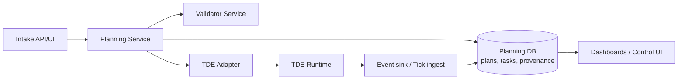
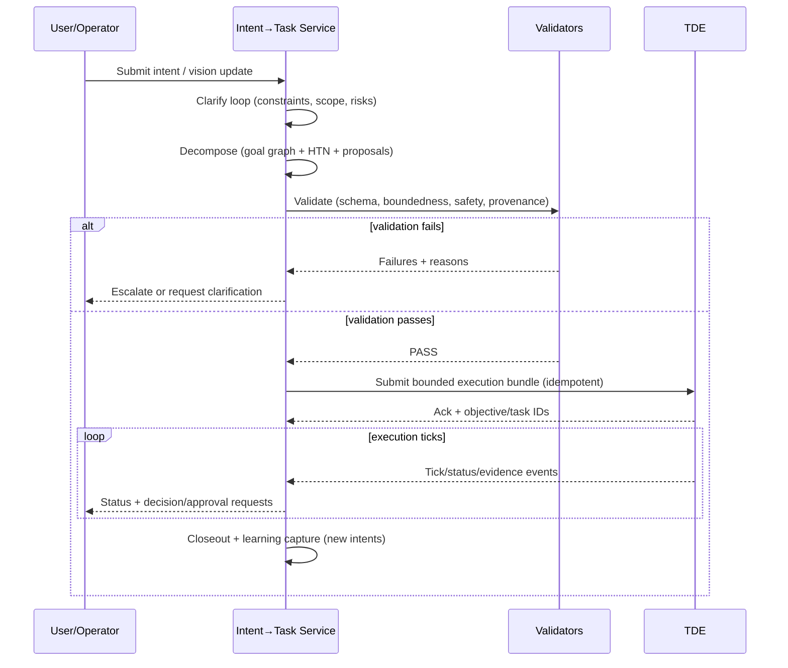

# Best Practices for an Intent-to-Execution Service Feeding Lyra OpenClaw TDE

## Executive summary

This research describes best practices—and a concrete, integration-ready blueprint—for a service that converts **visions/intent/ideas** into **goals, designs, plans, and executable tasks**, using **recursive/iterative loops** while still producing **bounded, auditable, safe execution bundles** for your Lyra OpenClaw TDE.

Enabled connectors (per request): **GitHub** (only). 
Primary internal sources reviewed (per request constraint): `pek007/lyra-operating-system` (public) and `pek007/pxs` (private, accessed via the GitHub connector; citations for private-repo content are not available via web citations in this environment).

Key conclusions from combining the repo-grounded constraints with external best practices:

1. **Separate “design-time recursion” from “runtime bounded execution.”** In the repo, the TDE contracts strongly emphasize deterministic, fail-closed execution and bounded chaining; therefore, the Intent→Task service should allow iterative decomposition internally, but must *compile* to an **explicitly bounded chain family** for TDE execution (e.g., fixed stage count, declared approval boundaries, no runtime fan-out). This matches both classical HTN planning’s hierarchical decomposition foundations (soundness/completeness results) and modern durable workflow engines’ determinism constraints.
2. **Use hybrid decomposition: structured methods + constrained “agentic” generation.** Pure LLM decomposition is prone to drift and unboundedness; combine (a) hierarchical models (HTN / goal graphs), (b) product decomposition patterns (OKRs, user story mapping, design thinking), and (c) agentic reflection/search (ReAct/Reflexion/Tree-of-Thoughts style) *inside guarded loops* with explicit stopping criteria and validation checkpoints.
3. **Make provenance and traceability first-class, machine-checkable, and cryptographically stable where needed.** Adopt a provenance model aligned with W3C PROV-DM (entities, activities, agents, derivations, bundles), plus canonicalization for signing/hashing (RFC 8785) for audit-grade artifacts.
4. **Design the integration surface as “compile + submit + observe.”** Provide a stable API (or file-based exchange) to (a) compile vision/goals/design/plan into TDE-ready task bundles and (b) observe execution state via ticks/receipts/events. This mirrors large-scale workflow engines’ separation of orchestration vs activities and use of retries/catches for reliability.
5. **Measure both planning quality and execution reality.** Use DORA’s updated 5-metric structure for software-delivery-like workstreams, but complement with “plan quality” metrics: boundedness, validation pass rates, rework, traceability completeness, and safety gate violations. DORA’s evolution (four → five metrics) is itself a useful “continuous improvement” signal: expect your measurement model to evolve.
6. **Treat safety and “excessive agency” as a core design requirement.** Apply NIST AI RMF (Govern/Map/Measure/Manage) and OWASP LLM Top 10 (prompt injection, insecure output handling, excessive agency, etc.) as operational controls embedded into the planning and compilation pipeline—not as policy text.

Assumptions (explicit, because not specified): single-tenant initially; English-only artifact defaults; p95 compilation latency target 1–10s for normal requests; human review available for high-risk actions; task volumes up to ~10k active tasks/month; work spans software + non-software (TaskOps); persistence can be Git-first with optional DB later.

## Grounding in the two repos

This section summarizes *design constraints and patterns* inferred from direct repo inspection.

In `pek007/lyra-operating-system`, the TDE layer is built around:
- deterministic “tick” execution semantics (idempotency keys, version checks, approval gates),
- fail-closed behavior for ambiguous authority/binding/objective linkage,
- bounded autonomous chaining based on explicit dependency metadata (no runtime task generation),
- a shift toward DB-canonical state with projections back to human-readable boards,
- machine-checkable governance via schemas and validation tooling.

These constraints align strongly with durable workflow orchestration best practices: determinism in orchestration logic and careful handling of side effects.

In `pek007/pxs`, the product boundary emphasizes:
- a typed execution model (decisions, tasks, evidence, reviews),
- schema validation and test-backed vertical slices (decision → task → evidence),
- a clear architecture boundary: product behavior in PXS; operating model/governance/runtime in the OS repo.

This boundary suggests the Intent→Task service should likely live in (or be owned by) PXS as product logic, while emitting TDE-compatible bundles that the OS runtime executes under its contracts.

## Definitions and scope

A common failure mode in “vision → tasks” systems is category confusion: treating every statement as actionable work. The service should enforce artifact types with clear semantics and compilation rules.

### Core artifact definitions

**Vision** 
A durable statement of “why” and “what good looks like” at a medium-to-long horizon; includes target users/customers, value proposition, non-goals, and qualitative success definition. Visions should not be directly executable; they are *compilation roots*.

**Intent** 
A short-lived expression of desired direction/action, often underspecified (“we should improve onboarding”). Intent is input to discovery loops; it becomes a goal only after disambiguation.

**Goal** 
A measurable success target bound to a time window and scope. OKR-style goals separate the *objective* (what) and *key results* (how measured).

**Design** 
A structured description of solution approach and constraints: requirements, assumptions, interfaces, risks, alternatives, and acceptance tests (or verification strategy). Design is where many uncertainties are resolved before planning.

**Plan** 
A decomposition and sequencing artifact describing *how* to achieve the goal via units of work, dependencies, risk posture, and checkpoints. A plan must be compilable to tasks.

**Task** 
The smallest unit of work the execution engine can schedule, claim, and transition, with explicit inputs/outputs, evidence requirements, and side-effect boundaries. Tasks may be executable by humans, agents, or mixed teams.

### TDE input and output (conceptual)

**TDE input (what your service should feed):**
- Objective identifiers and checkpoints (for traceable authority to mutate state),
- A bounded chain template selection (family + policy caps),
- A set of tasks with explicit metadata: dependencies, activation rules, approval requirements, risk level, evidence requirements,
- Provenance links to upstream vision/goal/design/plan artifacts.

**TDE output (what your service should consume):**
- Tick-level execution artifacts/events: claimed work, mutation results, approvals needed, failures and reasons,
- State projections: task status changes, dependency promotions, evidence attachments,
- Metrics snapshots: throughput, instability/rework, gating/fail-closed counts.

This input/output separation mirrors workflow engines where orchestration state is durable and side effects are controlled via explicit “activities” and error handling.

## Decomposition models and iterative patterns

A robust Intent→Task service is not a single algorithm; it is a **portfolio of decomposition strategies** selected by context (novelty, uncertainty, risk, and the “shape” of the domain).

### Decomposition models you should support

**Hierarchical Task Network planning (HTN)** 
HTN planning decomposes high-level tasks into subtasks via methods until reaching primitive actions. Seminal work formalized HTN procedures and analyzed complexity/expressivity, providing grounding for hierarchical decomposition as a disciplined planning approach. 
Best practice implication: represent your plan as a *hierarchical structure with explicit methods*, not just a flat list. This enables bounded compilation and traceability.

**Goal-oriented requirements and goal graphs** 
Goal-oriented requirements engineering treats goals as first-class objects for structuring, negotiating, and evolving requirements. 
Best practice implication: use goal graphs (AND/OR refinements, obstacles/risks) upstream of tasks; do not skip directly from “goal statement” to tasks.

**OKRs (Objectives and Key Results)** 
OKRs provide a practical bridge between intent and measurable outcomes; objectives describe what to achieve; key results define verifiable measures (often quarterly). 
Best practice implication: key results can map to verification tasks and instrumentation/evidence requirements.

**User story mapping** 
Story mapping keeps decomposition anchored on user journeys; it avoids the “flat backlog tragedy” by organizing work around narrative flows and slices. 
Best practice implication: story map “backbone steps” can become epics/stages; slices compile into bounded chain families.

**Design thinking loops** 
Human-centered design thinking emphasizes iterative discovery with Empathize/Define/Ideate/Prototype/Test modes. 
Best practice implication: treat uncertain intents as needing “prototype/test” loops before committing to execution-grade plans.

**Modern agent planning patterns (guarded)** 
- ReAct interleaves reasoning and action to ground steps in external feedback. 
- Reflexion adds self-critique/feedback memory to improve subsequent trials. 
- Tree-of-Thoughts explores multiple reasoning paths with search/backtracking. 
- AutoGen represents multi-agent conversation frameworks; useful conceptually for decomposing roles and review gates. 

Best practice implication: **agentic planning belongs inside constrained “design-time” loops** with explicit validators and budgets, not as open-ended runtime execution.

### Recursive/iterative loop patterns and stopping criteria

A practical loop model:

- **Loop A (Clarify):** intent → clarified intent + constraints (stop when ambiguity is within tolerances)
- **Loop B (Decompose):** goal/design → candidate plan tree (stop when plan is compilable + bounded)
- **Loop C (Validate):** simulate/check plan + tasks against constraints (stop when validators pass or escalate)
- **Loop D (Execute/Observe):** submit to TDE, observe outputs, open new intents for failures/rework

Stopping criteria should be explicit and measurable, such as:
- max depth of decomposition (e.g., ≤ 5 levels),
- max tasks per goal (e.g., ≤ 50 without splitting),
- confidence thresholds (e.g., “evidence coverage ≥ 0.8”),
- validation pass counts (e.g., “all blocking checks green”),
- budget/time caps (token budget, wall-clock, reviewer capacity),
- boundedness contract satisfied (e.g., fixed chain family, no branching).

Monte Carlo and schedule-risk simulations can be used when durations/risks dominate and uncertainty is high—especially in complex dependency networks.

### Recommended hybrid decomposition algorithm

The best-performing pattern in practice is usually **HTN/goal-graph backbone + agent-assisted proposal + deterministic validation**.

Pseudocode (design-time decomposition + compilation):

```text
function compile_intent_to_tde_bundle(intent):
 ctx = intake_and_contextualize(intent)

 # Loop A: clarify
 while ctx.ambiguity_score > AMBIGUITY_MAX and ctx.loop_budget_ok():
 ctx = ask_clarifying_questions(ctx)
 ctx = update_constraints(ctx)
 if ctx.ambiguity_score > AMBIGUITY_MAX:
 return escalation("needs human clarification")

 goals = derive_goals(ctx) # OKR-style objective + key results
 design = propose_design(ctx, goals) # requirements, constraints, risks, interfaces

 # Loop B: decompose using hybrid HTN + agent proposals
 plan = init_plan_tree(goals, design)
 while not plan.is_compilable() and plan.loop_budget_ok():
 frontier = select_frontier_nodes(plan)
 expansions = []
 for node in frontier:
 expansions += propose_decompositions(node, method="HTN+agent")
 plan = integrate_and_prune(plan, expansions)

 # Stop if growth becomes unsafe/unbounded
 if plan.depth > MAX_DEPTH or plan.node_count > MAX_NODES:
 return escalation("unbounded decomposition risk")

 # Loop C: deterministic validation gates
 validators = [
 schema_validate(plan),
 boundedness_validate(plan),
 side_effect_validate(plan),
 traceability_validate(plan),
 evidence_plan_validate(plan),
 risk_policy_validate(plan),
 ]
 failures = run(validators)
 if failures.blocking:
 return escalation("validation failed", details=failures)

 # Compile into bounded chain family for runtime
 tde_bundle = compile_to_chain_family(plan, family=select_family(plan))
 tde_bundle = attach_provenance(tde_bundle, ctx, goals, design, plan)
 return tde_bundle
```

Why this pattern: it allows “creative” decomposition while forcing the final output through deterministic gates—analogous to how durable engines keep orchestration logic constrained while allowing non-determinism in activities.

## Architecture and TDE integration

This section provides concrete architecture options, plus interfaces and schemas.

### Architecture options (with component diagrams)

#### Option A: GitOps artifact compiler (repo-first, simplest)
Best when you want maximal auditability and minimal infra.

```mermaid
flowchart LR
 A[Intake: Intent/Vision] --> B[Artifact Builder\n(vision/goal/design/plan)]
 B --> C[Decomposition Engine\n(HTN + agent proposals)]
 C --> D[Deterministic Validators\n(schema, boundedness, risk)]
 D -->|TDE Bundle| E[TDE Submission Adapter\n(file/PR/CLI)]
 E --> F[TDE Runtime\n(job ticks, chaining)]
 F --> G[Observer\n(status, evidence, metrics)]
 G -->|feedback| A
```

Pros: strongest provenance (Git history), easy rollback, aligns with schema-as-contract culture; Cons: slower integration for external systems, harder real-time UX.

#### Option B: Service + DB (API-first, scalable)
Best when you need interactive UI, higher throughput, multi-step drafts.



Pros: better UX, incremental drafts, quick queries; Cons: more infra, bigger security surface, more care to maintain immutable audit trails.

#### Option C: Hybrid “local-first + event-sourced” (offline-capable)
Best when you want robust local operation and later sync.

Core idea: local logs + deterministic merges; provenance-first; submit bundles only when validated.

Provenance and canonicalization become critical to avoid drift and to support signing/hashing.

### Comparison table of architecture trade-offs

| Approach | Best for | Strengths | Weaknesses | Operational risk |
|---|---|---|---|---|
| Option A: GitOps compiler | early-stage, governance-first | strongest audit trail; easy rollback; low infra | slower UX; batching bias | low (few moving parts) |
| Option B: Service + DB | interactive product, higher volume | fast queries; drafts; richer scheduling | needs strong infosec + backup; complexity | medium (more components) |
| Option C: hybrid local-first | offline work, distributed users | resilient, sync later; strong provenance | hardest to implement correctly | medium–high (sync complexity) |

### Interface design for TDE integration

Treat the integration as three explicit surfaces:

1. **Compile**: convert artifacts → TDE-ready bundle (bounded chain family + tasks + metadata). 
2. **Submit**: push compiled bundle into TDE’s intake (API/CLI/file drop). 
3. **Observe**: ingest TDE outputs (ticks/receipts/status) back into planning records.

This is consistent with workflow engines that separate definition/orchestration from execution evidence and error handling.

### API/interface specs (endpoints + payload examples)

Below is an API-first spec; in GitOps mode, the same payloads can be files committed to an “inbox” directory.

#### Create intent

`POST /v1/intents`

```json
{
 "intent": {
 "title": "Reduce client onboarding cycle time",
 "statement": "We should cut onboarding cycle time by ~50% without increasing risk.",
 "context": {
 "domain": "client_delivery",
 "time_horizon_days": 90,
 "constraints": [
 "No reduction in compliance checks",
 "Maintain audit traceability"
 ]
 }
 },
 "provenance": {
 "reported_by": "user:Peter",
 "sources": []
 }
}
```

Response:

```json
{ "intent_id": "INTENT_01J..." }
```

#### Compile intent to execution bundle (the key endpoint)

`POST /v1/compile`

```json
{
 "intent_id": "INTENT_01J...",
 "compile_options": {
 "max_depth": 5,
 "max_tasks": 30,
 "preferred_decomposition_models": ["OKR", "HTN", "story_map"],
 "risk_policy": "default",
 "tde_chain_family": "pilot_family_a"
 }
}
```

Response (simplified):

```json
{
 "bundle_id": "BUNDLE_01J...",
 "goals": [
 {
 "goal_id": "GOAL_01J...",
 "objective": "Reduce onboarding cycle time by 50%",
 "key_results": [
 { "kr": "Median onboarding days <= 10", "measure": "median_days" },
 { "kr": "0 increase in compliance defects", "measure": "defect_rate" }
 ]
 }
 ],
 "tde_bundle": {
 "objective_id": "OBJ-ONBOARD-01J...",
 "objective_checkpoint": "SCOPE_V1",
 "chain_family": "pilot_family_a",
 "tasks": [
 {
 "task_id": "T-IMPL-01",
 "title": "Implement onboarding task checklist and automation",
 "metadata": {
 "stage_id": "implementation",
 "depends_on": [],
 "activation_rule": null,
 "requires_approval": false,
 "risk_level": "medium",
 "evidence_requirements": ["doc", "demo"]
 }
 },
 {
 "task_id": "T-VER-02",
 "title": "Verify onboarding cycle time and compliance outcomes",
 "metadata": {
 "stage_id": "verification",
 "depends_on": ["T-IMPL-01"],
 "activation_rule": "all_predecessors_done",
 "requires_approval": false,
 "risk_level": "medium",
 "evidence_requirements": ["metrics_snapshot", "audit_check"]
 }
 },
 {
 "task_id": "T-REV-03",
 "title": "Deployment-readiness review and decision",
 "metadata": {
 "stage_id": "deployment_readiness_review",
 "depends_on": ["T-VER-02"],
 "activation_rule": "all_predecessors_done",
 "requires_approval": true,
 "risk_level": "high",
 "evidence_requirements": ["decision_record"]
 }
 }
 ],
 "provenance": {
 "derived_from": ["INTENT_01J...", "GOAL_01J..."],
 "compiled_at": "2026-03-12T10:00:00Z"
 }
 }
}
```

#### Submit bundle to TDE

`POST /v1/tde/submissions`

```json
{
 "bundle_id": "BUNDLE_01J...",
 "submission_mode": "create_tasks_and_register_objective",
 "idempotency_key": "submit:BUNDLE_01J..."
}
```

Response:

```json
{
 "submission_id": "SUB_01J...",
 "tde_objective_id": "OBJ-ONBOARD-01J...",
 "status": "accepted_for_ingest"
}
```

#### Observe execution

`GET /v1/tde/objectives/{objective_id}` returns status + latest ticks.

This “observe” path should be robust to errors and retries; AWS Step Functions documents Retry/Catch patterns that generalize well to task orchestration.

### Data models and schemas

Use NIST / OWASP-aligned “unsafe by default” thinking: every executable output must be schema-valid and policy-valid before it can trigger side effects.

Recommended schema strategy:
- JSON Schema 2020-12 for artifact validation.
- Separate **core** (IDs, timestamps, provenance) from **domain-specific** extensions.
- Enforce canonical JSON (RFC 8785) for hashing/signing evidence bundles and preventing “semantic drift via serialization.”
- Adopt PROV-DM-inspired provenance fields (entity/activity/agent, derivation, bundle).

A minimal shared envelope:

```json
{
 "artifact_type": "plan|goal|design|task_bundle|tde_submission",
 "schema_version": "1.0.0",
 "id": "ULID/UUID",
 "created_at": "ISO-8601",
 "created_by": "actor_id",
 "links": {
 "vision_id": null,
 "intent_id": null,
 "goal_ids": [],
 "design_id": null,
 "plan_id": null
 },
 "provenance": {
 "derived_from": [],
 "sources": [],
 "hash": "optional"
 },
 "payload": {}
}
```

## Governance, traceability, evaluation, and risk

### Traceability and provenance (what “good” looks like)

Traceability should support at least four questions:
1. **Why does this task exist?** (vision/goal link)
2. **What design/assumptions does it depend on?** (design link)
3. **What evidence proves completion?** (evidence requirements + links)
4. **Who/what produced/approved it?** (agent/person + approvals)

PROV-DM provides a strong conceptual model: entity/activity/agent plus derivation and bundles (“provenance of provenance”).

For audit-grade systems, hashing/signing requires deterministic formatting; RFC 8785 documents a canonical JSON scheme designed for repeatable hashing/signatures.

### Uncertainty handling and validation

Use a **risk-based planning** posture:
- If uncertainty is high, do *not* force fake precision; generate “discovery tasks” (prototype/test) first (design thinking’s Prototype/Test modes support this).
- Apply schedule risk analysis when timelines matter and estimates are uncertain.

Operational validation gates (strongly recommended):
- schema validation (non-negotiable),
- boundedness validation (no branching if using bounded chain families),
- safety policy validation (no unsafe side effects without approval),
- evidence plan validation (every task has defined output/evidence),
- provenance completeness checks (every artifact derives from something).

### Prioritization and scheduling

Best practice is to combine:
- **Economic sequencing** (WSJF: cost of delay / job duration) when value delivery timing is key,
- **Risk-first scheduling** when unsafe actions exist (approval gates and segregated duties),
- **Dependency-aware scheduling** (critical path and predecessor constraints),
- **WIP limits** and bounded claim sizes (to avoid “autonomy storms”).

In software-delivery-like domains, DORA’s evolving metrics are evidence that sequencing and measurement must adapt over time.

### Evaluation metrics and KPIs

You need two metric families: **planning quality** and **execution performance**.

Planning quality (service-level KPIs):
- Compilation success rate (% intents compiled to valid bundles)
- Validation failure rate by validator class (schema, boundedness, safety, provenance)
- Plan boundedness metrics (depth, branching factor, tasks per goal)
- Traceability completeness (% tasks linked to goal/design and with evidence requirements)
- Rework ratio at planning level (how often plans are revised before submission)

Execution performance (TDE + downstream KPIs):
- DORA’s five software delivery performance metrics (when applicable): throughput + instability breakdown.
- Decision latency (time in “blocked_pending_approval”)
- Fail-closed incidence rate (how often runtime blocks for safety/authority reasons)
- “Evidence completeness at done” (% done tasks with required evidence attached)

### Failure modes and mitigations

Common failure modes in Intent→Task systems and concrete mitigations:

- **Unbounded decomposition / task explosion** → enforce max depth, max tasks, and require “split goal” escalation when exceeded.
- **Hallucinated dependencies or fake evidence** → deterministic validators + evidence schema requirements + provenance checks; avoid accepting free text as “evidence.”
- **Excessive agency (unsafe actions without review)** → policy engine + per-task approval requirements; deploy “human-in-the-loop by default” for high-risk classes.
- **Prompt injection / tool misuse** → strict tool allowlists; input/output sanitization; model separation for untrusted content.
- **Stale plans / drift from current reality** → shorter cycles, explicit refresh triggers, execution feedback loops (observe → re-plan), and provenance timestamps.
- **Non-deterministic orchestration causing inconsistent behavior** → keep “compiler/orchestrator” deterministic; push non-determinism into bounded evaluation steps.

### Security, safety, and ethical considerations

Operationalize two anchor frameworks:

- NIST AI RMF 1.0 (Govern/Map/Measure/Manage) for lifecycle risk management; use the Playbook as a control catalog.
- OWASP Top 10 for LLM Apps to structure application-layer threats (prompt injection, insecure output handling, excessive agency, sensitive info disclosure, insecure plugins, etc.).

Practical controls to embed:
- **least privilege** on integrations (task creation vs task execution vs approval),
- **segregation of duties** for high-impact approvals (submitter ≠ approver),
- **idempotency keys** and replay protection for submissions,
- **audit logging** with immutable hashes for critical actions (RFC 8785 + append-only logs).

## Example workflows, templates, and test plan

### End-to-end workflow (mermaid timeline)



### Templates (paste-ready)

#### Vision template (lightweight)

```markdown
# Vision: <name>
## Mission
## Target users/customers
## Value proposition
## Non-goals
## Qualitative success definition
## Constraints (safety, compliance, cost)
## Review cadence + evidence expectations
```

#### Goal/OKR template

```markdown
# Goal: <objective>
Time window:
Owner:
Key Results:
- KR1 (metric, target, baseline, measurement method)
- KR2 ...
Risks/Assumptions:
Dependencies:
```

#### Design template (execution-grade)

```markdown
# Design: <deliverable>
## Problem statement / context
## Requirements (functional + non-functional)
## Assumptions
## Alternatives considered
## Interfaces/APIs
## Risks + mitigations
## Verification plan (tests, evidence)
## Rollback plan (if applicable)
```

#### Plan template (compilable)

```markdown
# Plan: <goal_id>
## Work breakdown (hierarchical)
## Dependencies
## Stage boundaries (if using bounded chain family)
## Risk policy + approval boundaries
## Evidence map (task -> required evidence)
## Scheduling/prioritization rationale (e.g., WSJF inputs)
```

### Mapping example: vision → tasks (concrete)

**Vision fragment:** “Make onboarding twice as fast without lowering compliance quality.”

**Goal (OKR):**
- Objective: Reduce onboarding cycle time by 50% this quarter.
- Key Results: median days ≤ 10; compliance defects not increased.

**Design highlights:**
- Introduce standardized checklist + automation,
- Add instrumentation for cycle time and defect tagging,
- Keep approval gate for risk-heavy steps.

**Plan (bounded chain family A):**
- Stage 1: implementation (deliverable + automation)
- Stage 2: verification (metrics + audit sampling)
- Stage 3: deployment readiness review (explicit approval)

**Tasks (TDE-ready):**
- T-IMPL: implement deliverable
- T-VER: verify with metrics snapshot + audit check
- T-REV: readiness decision (approval required)

This mapping reflects best practice: measurable key results become verification work, and high-risk decisions are explicit gates.

### Suggested tests and benchmarks

You want tests at three layers: **compiler correctness**, **policy/safety**, and **end-to-end execution fitness**.

Compiler correctness:
- Schema validation tests for every artifact type (JSON Schema meta-validation).
- Determinism tests: same inputs → same compiled bundle (canonicalization optional but recommended for hashing).
- Boundedness tests: ensure compiled bundles conform to allowed chain families (no branching, fixed stages).

Policy/safety:
- Prompt injection red-team tests, insecure output handling tests, excessive agency tests per OWASP Top 10.
- NIST AI RMF-aligned control checks: logging, transparency, escalation paths, incident triggers.

End-to-end execution fitness (integration benchmarks):
- “Compile → submit → observe” smoke suites with retries and failure injection.
- Drift benchmarks: re-run compilation after a controlled context change; measure plan churn and rework.
- Schedule uncertainty benchmarks: when tasks have uncertain durations, compare deterministic plan dates vs Monte Carlo confidence percentiles.

Industry integration tests (optional adapters):
- Issue/task creation adapters using vendor APIs including Jira, Asana, GitHub Issues, and Trello.

Benchmarking decomposition quality (agentic planning):
- Evaluate task decomposition stability (variance across runs),
- Evaluate “plan usefulness” via reviewer scoring + execution success,
- Use agentic improvement patterns only behind deterministic gates.
