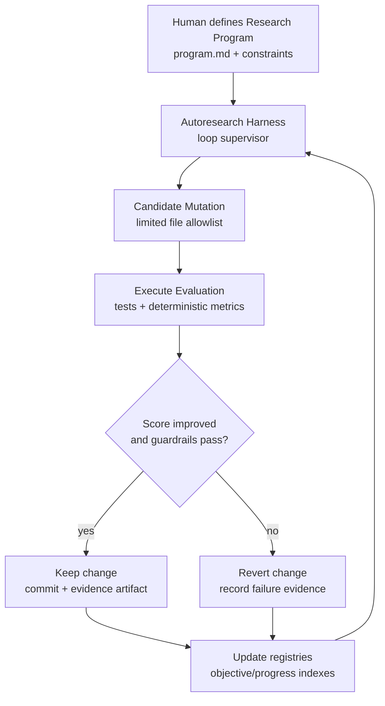

# Applying Autoresearch and Ralph Wiggum Loop Patterns to Lyra OpenClaw in pek007/lyra-operating-system and pek007/pxs

## Executive summary

Two recent “agentic process” patterns are directly relevant to hardening and accelerating Lyra OpenClaw’s improvement cycle:

Autoresearch (as described by Karpathy) formalizes a **continuous, metric-driven experimentation loop**: the human writes a concise research program (Markdown), an agent iterates on the executable system (code), and a strict evaluation gate keeps only improvements—repeating indefinitely on a feature branch.

The “Ralph Wiggum loop” (as coined and documented by Geoffrey Huntley) operationalizes **persistent iteration with reset context and persistent artifacts**: keep rerunning the agent against the same goal until objective completion criteria are met, letting the codebase and logs—not the chat context—carry state across iterations.

In the two target repos, the pieces to implement these patterns are already partially present:

* **pek007/lyra-operating-system** already contains strong “OS-level” primitives for safe autonomous work: deterministic ticking (`tools/tde_job_tick_runner.py`), idempotency/versioning and approval gating (`tools/tde_kernel.py`), durable state/event ledgers (`tools/tde_state_store.py`), schema-governed evidence validation (`tools/validate_repo.py`), and explicit autonomy/risk bounds via taskops work packets (`tools/taskops/validate_work_packets.py`) plus observation integrity tooling (`tools/observe/*`).
* **pek007/pxs** is explicitly scoped as the “product logic + domain model” side, with the repo boundary stating that **agent operating model / governance belongs in the OS repo**, and product behavior belongs in PXS. This is an unusually clean separation that makes an autoresearch-style improvement engine feasible without entangling product code and OS policy.

This report proposes an OS-first “Autoresearch Harness” and a Ralph-style “Loop Supervisor” that integrate with existing Lyra governance artifacts (objective linkage, binding integrity, side-effect contracts, machine-checkable schemas, evidence hashing). The recommended roadmap prioritizes: (1) adding an experiment registry + immutable trust boundaries, (2) wiring deterministic evaluation metrics into the loop, (3) gradually expanding from “process/policy tuning” to “data collection + automated training/evaluation” where appropriate.

## Conceptual foundations

### Autoresearch as a repeatable research machine

Karpathy’s framing describes an autonomous ML experimentation system with three key ideas:

1. **Division of labor**: the human “iterates on the prompt / instructions” while the agent “iterates on the training code,” with a clear objective: fastest research progress indefinitely with minimal human involvement.
2. **Fixed-budget, comparable experiments**: each run is constrained (e.g., fixed wall-clock time), producing a stream of comparable datapoints.
3. **Git as the research ledger**: the agent works on a feature branch, accumulating commits when changes improve the chosen metric.

For Lyra OpenClaw, the direct transfer is not “train an LLM,” but rather: **treat the agent operating system itself as the experiment surface** (policies, prompts, heuristics, evals, triage rules), and treat “agent performance” as the optimization target (throughput, safety, regression resistance, decision coverage, evidence quality).

### The Ralph Wiggum loop as persistence + objective completion

Huntley’s original “from first principles” statement: “Ralph … in its purest form … is a Bash loop,” continuously feeding a stable prompt to an agent until the job is done. He emphasizes that the persistence lives in **artifacts and repeated verification**, not in accumulating conversational context.

The wiggum.dev explanation highlights the canonical structure: run the agent, check “done,” and if not, rerun—often with fresh context each iteration so the model does not degrade under long chat histories.

For Lyra OpenClaw, the key transferable mechanisms are:

* **Stop/exit interception → keep going** until a measurable completion condition is true.
* **Externalized state**: progress markers, git diffs, test logs, and structured evidence are the long-term memory.
* **Optimization target moves from “one-shot cleverness” to “reliable convergence under retries.”**

This is especially compatible with Lyra’s existing TDE semantics (idempotency, approval gates, fail-closed paths), because those semantics are exactly what you want when loops run unattended.

## Repository audit

### pek007/lyra-operating-system

The OS repo already implements several “agentic reliability primitives” that map cleanly to autoresearch and loop-based iteration:

A deterministic job tick is implemented in `tools/tde_job_tick_runner.py`, including:

* structured per-tick artifacts with `artifactType`, `schemaVersion`, timestamps, identity fields, outcomes, and a fail-closed model (e.g., missing identity/binding/objective causes immediate failure with explicit reason);
* objective linkage validation against an objective registry (`os/runtime/tde_objectives.json` in defaults);
* binding integrity validation with explicit “REAUTH_REQUIRED…” paths;
* idempotency keys per (tick, task);
* a low-risk canonical writeback that atomically moves claimed tasks from `Active` to `Waiting` (or DB-backed equivalent), and optional “shadow state” syncing to a SQLite ledger with mismatch thresholds.

This is, conceptually, an “execution loop engine” already—just currently oriented around tasks rather than experiments.

The “kernel” for idempotency, version conflicts, approvals, and replay is in `tools/tde_kernel.py`. It provides:

* idempotency replay with intent-hash conflict detection;
* version checks on targets;
* approval gating for risky actions;
* a compact audit log abstraction.

This is a strong foundation for safe unattended loops.

A durable local ledger exists in `tools/tde_state_store.py`:

* SQLite tables for events/actions/tasks, WAL mode, and deterministic hashing to chain events;
* parity checks between Markdown task sources and DB state;
* “shadow tick” recording that logs compact summaries and hashes.

This is close in spirit to “git as the research ledger,” and can be extended as “experiment ledger” without inventing a new persistence substrate.

Repo-wide governance validation is centralized in `tools/validate_repo.py`, which:

* regenerates deterministic derivatives (inventory, knowledge indexes, report indexes),
* validates schemas, decision frontmatter conventions, evidence artifacts against a schema registry, observation linking integrity, and policy checks,
* enforces drift checks so generated files are up-to-date and committed.

This is the natural place to add autoresearch invariants like “immutable trust boundary files must never change in an experiment loop.”

Safety/guardrails are more explicit than in typical agent repos:

* `tools/taskops/validate_work_packets.py` validates work packets against schema and policy, including side-effect surface/action allowlists and autonomy-level risk bounds.
* `tools/observe/validate_observations.py` validates observation artifacts with schema checks, deterministic record hashing, source-policy constraints, blob existence, and provenance parent integrity.
* CI workflows run governance and regression checks (e.g., `devsecops-baseline.yml`, `governance-machine-check.yml`) to ensure these invariants are maintained.

Net: the OS repo is already “structured for unattended iteration” (fail-closed paths, auditability, deterministic generation, schema validation). What it lacks—relative to autoresearch—is a **first-class experiment abstraction** (program/spec → candidate change → evaluation → keep/revert) and a **standardized metric gate** for what “improvement” means.

### pek007/pxs

PXS is positioned as “the execution system for PX Strategy” (decisions, tasks, operational cadence) with explicit Phase 1 goals around direction/governance, delivery capability, and task/decision management.

The repo defines a clean boundary:

* PXS owns product logic, domain model, API/UI implementation, product workflows.
* The OpenClaw OS repo owns agent operating model, governance, runtime orchestration, and cross-project standards.

This boundary is strategically important: the autoresearch engine (and Ralph supervisor) should live in **lyra-operating-system**, while PXS supplies **domain-level utility signals** (e.g., decision coverage, task lifecycle correctness, “vertical slice” completion evidence).

The PXS CI workflow (`.github/workflows/ci.yml`) enforces presence of baseline docs and validates structured artifacts via scripts (model nodes, schema validation, metadata validation, generated views checks). This gives a ready-made “objective completion” harness for Ralph-style loops: green CI is a crisp completion promise.

## Concept-to-component mapping

The table below maps the two patterns to existing repo components and highlights gaps that matter for implementation.

| Pattern element | What it means in practice | lyra-operating-system components | pxs components | Gap / opportunity | Recommended implementation locus |
|---|---|---|---|---|---|
| Human-authored “program” (autonomous research plan) | A short, stable spec that defines the goal, constraints, allowable edits, evaluation, and stopping rules | Objective linkage already exists (objective_id/checkpoint/rationale in job tick runner), plus policies + schema registry | Domain vision/scope/architecture docs define objectives and boundaries | No standardized “experiment program” format that is validated and versioned | OS repo: add `knowledge/autoresearch/programs/*.md` with schema-validated metadata |
| Immutable trust boundary | Files the agent must not change (data prep, metric definition, validators) | `validate_repo.py` regeneration + drift checks; schema registry; policy checks | CI baseline checks enforce presence of key docs and scripts | Need explicit “protected paths” enforcement for experiment loops | OS repo: “protected path allowlist/denylist” in governance checks |
| Mutable “genome” surface | The small, high-leverage set of files the agent is allowed to modify | Prompts/policies/eval slices/heuristics; taskops packets; selected tools scripts | Product domain model or CLI behavior if optimizing product-level outcomes | Not formally declared; risk of agent changing too much | OS repo: per-experiment “mutation allowlist” (paths + file types) |
| Loop runner / supervisor | Re-run agent cycles until done; optionally reset context; manage iterations | TDE job ticking is already a deterministic loop; idempotency baked in | CI is crisp completion gate | Missing general “loop supervisor” and standardized completion tests | OS repo: `tools/autoresearch_runner.py` + “Ralph mode” wrapper |
| Metric gate (“keep only improvements”) | Decide keep vs revert using an objective score | Outcomes in tick artifacts; shadow ledger; schema validation | Product success criteria + vertical slice objective | No scalar “score function” registry; risk of Goodharting | OS repo scores; PXS provides additional utility signals |
| Evidence + provenance | Every iteration emits structured evidence with hashes and links | Observation schema/hash/provenance validation; evidence schema registry | Could store domain evidence of task completion | Need experiment artifact schemas (run summaries, diffs, metrics) | OS repo: introduce `experiment_run` artifact schema + index |
| Safety guardrails | Bound actions and require approval beyond thresholds | taskops autonomy/risk bound; approval gates in TDE kernel | Product-level writes still must be governed | Need explicit compute budget + stop-loss policy | OS repo governs; PXS stays product-only |

## Integration design and prioritized roadmap

### Architectural proposal

Implement an OS-level “Autoresearch Harness” that treats **Lyra policy + process** as the first optimization target, then later expands toward data collection and model training where appropriate.



This is deliberately aligned with both patterns:

* Autoresearch: stable “program,” constrained mutation surface, metric gate, git/evidence ledger.
* Ralph: persistent retry with explicit completion checks, where state is in artifacts and tests.

### Integration initiatives with concrete requirements

| Initiative | What it adds | Required code changes (repo + paths) | Data needs | Compute needs | Dependencies | Key risks | Effort |
|---|---|---|---|---|---|---|---|
| Experiment program + registry | Standardizes “program.md” equivalent with metadata, allowed mutation surface, stop rules | OS: add `schemas/autoresearch_program.schema.json`; add registry entry; add validator hook in `tools/validate_repo.py`; add `knowledge/autoresearch/programs/` | Program docs + optional policy references | Low | jsonschema/pyyaml already used in CI | Spec becomes too long / underspecified; agents drift scope | Medium |
| Mutation allowlist + protected files | Immutable trust boundary analogous to “prepare.py” | OS: add `knowledge/policies/autoresearch_mutation_policy.v1.yaml`; add enforcement in `tools/validate_repo.py` and/or a dedicated `tools/autoresearch_guard.py` | Path allowlists + denylist | Low | Existing governance checks | Over-restricting blocks progress; under-restricting risks unsafe edits | Medium |
| Autoresearch loop runner | Automates: mutate → eval → keep/revert → evidence | OS: new `tools/autoresearch_runner.py` integrating (a) git feature branches/worktrees, (b) calling eval commands, (c) writing evidence artifacts into `knowledge/evidence/...` | Run logs, diffs, metric values | Low–Medium initially | git CLI, existing test scripts; optional MLflow | Infinite loops; runaway spend; non-determinism; brittle metric parsing | High |
| Metric function registry (utility signals) | Encodes scores beyond “tests pass”: throughput, safety, stability | OS: define `schemas/experiment_metric.schema.json`; implement `tools/score_experiment.py`; extend `tde_job_tick_runner` outcomes into score component | Tick artifacts; CI results; domain metrics from PXS | Low | None required | Goodharting; optimizing proxy metrics harms quality | Medium |
| “Ralph mode” completion supervisor for CI-green | Repeat-run autonomous fixes until CI passes, with stop-loss constraints | OS: wrapper script under `tools/`; PXS: document approved use + add “completion promise” conventions in docs | CI logs, cached run outputs | Medium | CI runner access; local execution of checks | Risk of repeated unsafe changes; can churn commit history | Medium |
| Self-directed data collection via observations | Automatically capture environment signals as validated observation artifacts | OS: extend observation source policy to include “experiment logs”; add standardized blob storage path conventions; ensure `validate_observations.py` continues to pass | Logs, traces, failing cases | Low–Medium | jsonschema; optional OpenTelemetry | Leaking secrets; provenance spoofing; storage bloat | Medium |
| Automated (re)training / evaluation loops (optional, later) | If Lyra adopts local models or fine-tuning, add “training runs” as experiments | Likely OS: new training harness module; PXS: none (boundary) | Curated datasets, evaluation sets | High (GPU) | Training stack (PyTorch/etc.) | Safety (data), cost, reproducibility, governance burden | High |

### Prioritized roadmap with milestones and measurable success criteria

| Horizon | Milestones | Success criteria (measurable) | Notes |
|---|---|---|---|
| Short term | Define a canonical “Autoresearch Program” format + registry; implement protected-path mutation policy; emit a first `experiment_run` evidence artifact schema; add CI checks enforcing all of the above | (1) All programs validate in CI; (2) Mutation policy violations fail fast; (3) Evidence artifacts validate under `tools/validate_repo.py` | This is about *making the loop safe before making it powerful*. |
| Medium term | Build `tools/autoresearch_runner.py` that can run at least one closed-loop objective (e.g., improve TDE tick outcomes or reduce fail-closed incidence); add a score registry; integrate “keep/revert” via git worktrees | (1) Runner can execute N iterations unattended without policy violations; (2) At least one objective shows statistically meaningful improvement over baseline on a fixed eval set; (3) All improvements are traceable to evidence artifacts + commits | Use fixed seeds / deterministic tests wherever possible to avoid “phantom improvements.” |
| Long term | Add Ralph-style “CI-green loops” for PXS and OS repos with stop-loss; expand to self-directed eval generation (new tests/slices from failures); optionally expand to training loops if model work is in scope | (1) Mean time-to-green reduced by X% on representative failing scenarios; (2) Reduction in recurring regressions (new evals catch old failure classes); (3) Formal compute budget enforcement (caps, quotas) prevents runaway | Only expand autonomy after guardrails produce consistently safe behavior. |

## Prototype experiments implementable inside the repos

| Prototype | Objective | Design | Inputs → Outputs | Evaluation metrics | Minimal implementation steps | Effort |
|---|---|---|---|---|---|---|
| TDE tick robustness autotune | Improve reliability of autonomous ticking while preserving fail-closed safety | Treat a small set of parameters / heuristics (e.g., idle thresholds, claim limits, writeback policies) as the “genome.” Iterate changes, run deterministic TDE slice tests + a simulated tick against a fixed TASKS fixture, keep only improvements | Inputs: `tools/tde_*`, fixtures + program spec → Outputs: commits + `experiment_run` evidence JSON | Score = weighted: progressed count ↑, failed_validation ↓, reauth_required ↓, zero policy violations | (1) Add `schemas/experiment_run.schema.json`; (2) Add `tools/score_tde_tick.py`; (3) Add `tools/autoresearch_runner.py` with allowlist; (4) Use existing test scripts as evaluators | High |
| PXS CI-green Ralph loop | Reduce “human iteration tax” on mechanical fixes by looping until CI passes | Implement a loop supervisor that: runs PXS CI-equivalent checks locally, captures failures, prompts agent to fix, re-runs; stops on green or stop-loss | Inputs: PXS repo state + CI commands → Outputs: green run + evidence + limited commits | Time-to-green, iterations, % loops that converge, diff size, number of reverted iterations | (1) Add `docs/` convention for “completion promise” (green checks); (2) Add OS-side wrapper script for loop; (3) Enforce mutation allowlist + guardrails for file changes | Medium |
| Self-directed eval generation from failures | Grow regression resistance by turning failures into new tests/eval slices | When an OS validator/test fails, capture artifact + failure signature, generate a minimal reproducer test or eval slice, add it to CI, then fix root cause | Inputs: failing artifacts/logs → Outputs: new eval/test + fix commit + provenance links | Increase in coverage (number of distinct failure signatures caught), reduction in recurrence rate | (1) Define failure signature schema; (2) Add a generator tool `tools/gen_eval_from_failure.py`; (3) Wire into CI as optional “suggestion mode” first | Medium–High |

A “thin vertical slice” prototype should be prioritized first: it forces you to define (a) what can change, (b) how you score, (c) how you record evidence, and (d) how you stop—before scaling scope.

## Tooling and reading list

### Tooling and infrastructure recommendations

The strongest near-term requirement is not more agent frameworks; it is **experiment traceability** and **objective scoring**.

For experiment tracking, MLflow Tracking provides a canonical model: log parameters, metrics, code versions, and artifacts per run, then compare runs in a UI. Even if you do not adopt MLflow immediately, its vocabulary (“runs,” “artifacts,” “experiments,” “tracking server”) is a good blueprint for Lyra’s experiment artifacts.

For agent-loop behavior, incorporate structured “act + observe” patterns (tool calls + observations) rather than pure chain-of-thought. ReAct-style interleaving of reasoning and acting is a well-known pattern for reducing ungrounded hallucination by forcing actions to consult external state.

For iterative improvement without weight updates, “reflection with memory” is a practical bridge: Reflexion agents keep an episodic memory of feedback and reflections that improves subsequent trials—conceptually similar to converting failures into structured evidence and reusing them next iteration.

### Suggested reading

* Autoresearch primary description and mechanics (Karpathy’s post).
* Ralph Wiggum loop from first principles (Huntley).
* Ralph loop as “fresh context + persistent artifacts” (wiggum.dev explainer).
* ReAct prompting/pattern (reasoning + acting interleaved).
* Reflexion (verbal reinforcement + episodic memory buffer).
* MLflow Tracking concepts and APIs (runs, artifacts, comparisons).

## Code reference links for the two repos

```text
lyra-operating-system (selected)
- tools/tde_job_tick_runner.py
- tools/tde_kernel.py
- tools/tde_state_store.py
- tools/validate_repo.py
- tools/taskops/validate_work_packets.py
- tools/observe/validate_observations.py
- .github/workflows/devsecops-baseline.yml
- .github/workflows/governance-machine-check.yml

pxs (selected)
- README.md
- docs/vision.md
- docs/scope-v1.md
- docs/architecture.md
- .github/workflows/ci.yml
```

```text
GitHub URLs (only the two requested repos)

lyra-operating-system:
https://github.com/pek007/lyra-operating-system

pxs:
https://github.com/pek007/pxs
```

## Storage note
Source: Peter-provided deep research report, stored by Lyra on 2026-03-10 for future reference and synthesis.